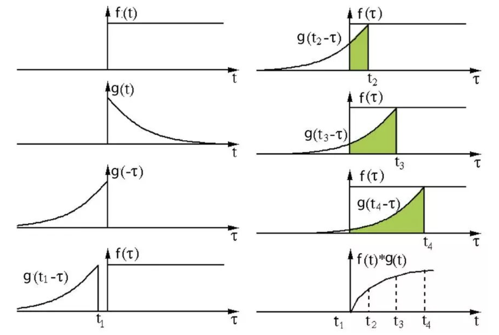
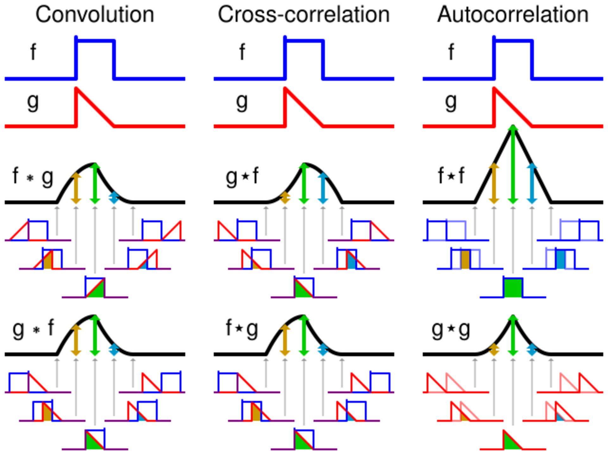
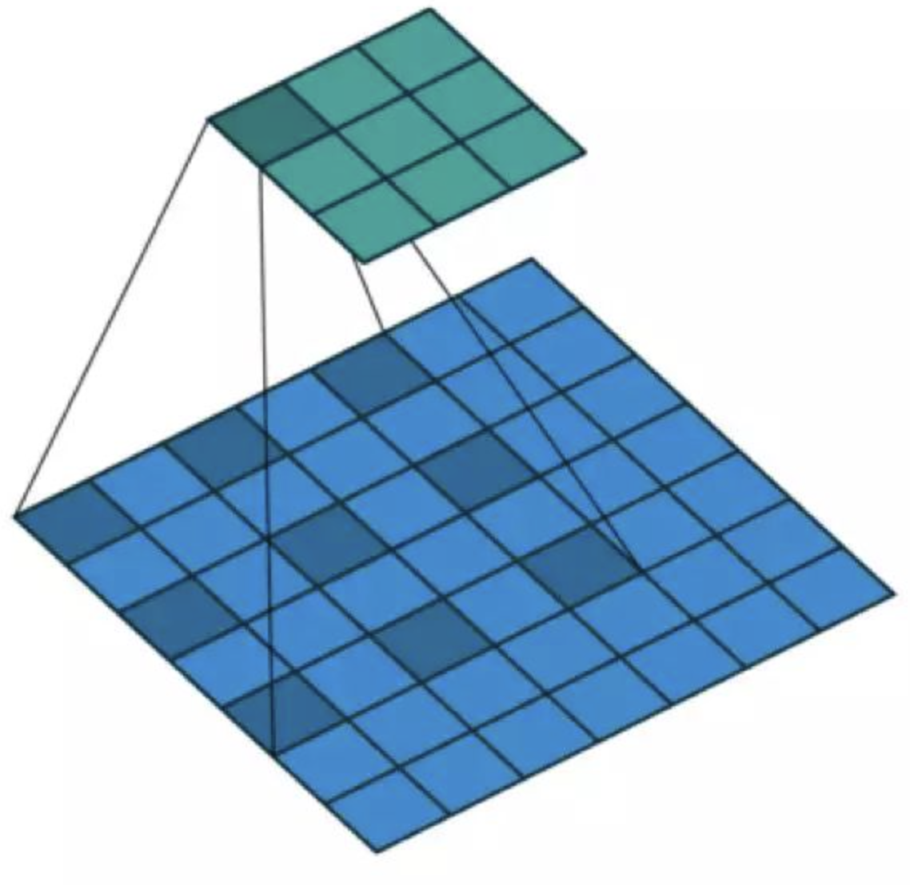
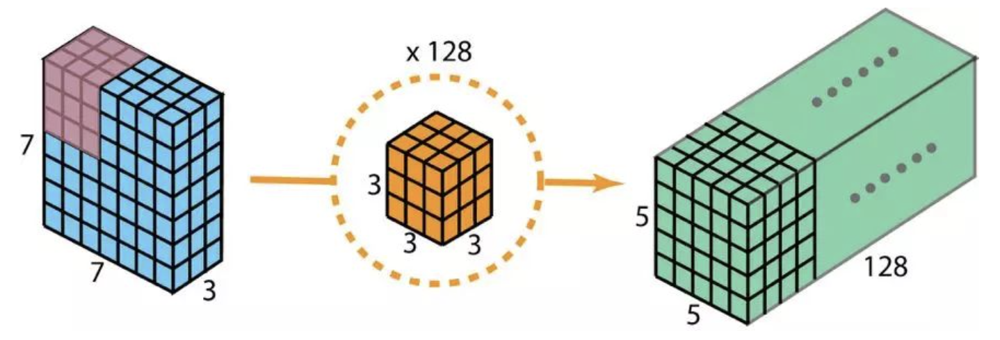
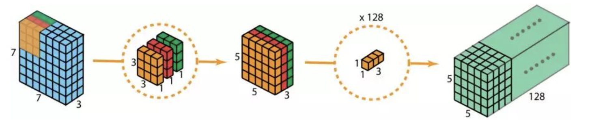

# 神经网络基础

## 1. 张量

### 1.1. 术语

| 索引 |  计算机  |    数学     |
| :--: | :------: | :---------: |
|  0   |  number  |   scalar    |
|  1   |  array   | vector |
|  2   | 2d-array |   matrix    |
|  n   | nd-array |  nd-tensor  |

- order：索引个数
- rank：索引层数
- axis：指定索引的数组
- shape：`[axis 个数，axis 长度]`

### 1.2. 计算机视觉

- 卷积张量`[B, C, H, W]`
  - B：Batch
  - C: Channel, Depth
  - H：Height
  - W：Width

## 2. 数据集

### 2.1. 考察

- 创建者
- 创建方式
- 意图
- 可能的意外后果
- 偏差
- 道德问题

### 2.2. 训练

- epoch：数据集上的一次迭代
- batch：数据集的一部分
- iteration：数据集大小 / 批大小

## 3. 卷积运算

深度学习领域的卷积本质上是信号/图像处理领域内的互相关（cross-correlation）。

在信号/图像处理领域，卷积的定义是，两个函数中一个函数经过反转和位移后再相乘得到的积的积分：

$$
(f ∗ g)(t) = ∫_{-∞}^{∞} f(τ) g(t - τ) dτ
$$

互相关是两个函数之间的滑动点积或滑动内积。互相关中的过滤器不经过反转，而是直接滑过函数 f。f 与 g 之间的交叉区域即是互相关。

在深度学习中，卷积中的过滤器不经过反转。严格来说，这是互相关。本质上是执行逐元素乘法和加法。

> ⋆ 表示相关运算

### 3.1. 转置卷积

对于很多网络架构的很多应用而言，往往需要进行与普通卷积方向相反的转换，即上采样。传统方法有应用插值方案或人工创建规则。而神经网络等现代架构则倾向于让网络自己自动学习合适的变换，无需人类干预。为了做到这一点，可以使用转置卷积。

转置卷积，有时也被称为去卷积（deconvolution）。严格来讲，信号处理中的去卷积是卷积运算的逆运算，但这里却不是这种运算。

在卷积中，定义 C 为卷积核，Large 为输入图像，Small 为输出图像。经过卷积（矩阵乘法）后，我们将大图像下采样为小图像。这种矩阵乘法的卷积的实现遵照：C × Large = Small。

若在等式的两边都乘上矩阵的转置 CT，并借助「一个矩阵与其转置矩阵的乘法得到一个单位矩阵」这一性质，则我们就能得到公式 CT × Small = Large

### 3.2. 扩张卷积（Atrous 卷积）

标准的离散卷积

$$
(F * k)(𝒑) = ∑_{𝐬 + 𝐭 = 𝒑} F(𝐬) k(𝐭)
$$

扩张卷积

$$
(F *_l k)(𝒑) = ∑_{𝐬 + l𝐭 = 𝒑} F(𝐬) k(𝐭)
$$

直观而言，扩张卷积就是通过在核元素之间插入空格来使核「膨胀」。新增的参数 l（扩张率）表示希望将核加宽的程度。具体实现可能各不相同，但通常是在核元素之间插入 l-1 个空格。

扩张卷积可用于廉价地增大输出单元的感受野，而不会增大其核大小，这在多个扩张卷积彼此堆叠时尤其有效。

### 3.3. 空间可分卷积

空间可分卷积操作的是图像的 2D 空间维度，即高和宽。从概念上看，空间可分卷积是将一个卷积分解为两个单独的运算。例如，3×3 的 Sobel 核可以被分成了一个 3×1 核和一个 1×3 核。

$$
\begin{bmatrix}
-1 & 0 & 1 \\
-2 & 0 & 2 \\
-1 & 0 & 1
\end{bmatrix}
=
\begin{bmatrix}
1 \\ 2 \\ 1
\end{bmatrix} ×
\begin{bmatrix}
-1 & 0 & 1
\end{bmatrix}
$$

假设现在将卷积应用于一张 N×N 的图像上，卷积核为 m×m，步幅为 1，填充为 0。传统卷积需要 (N-2) × (N-2) × m × m 次乘法，空间可分卷积需要 N × (N-2) × m + (N-2) × (N-2) × m = (2N-2) × (N-2) × m 次乘法。空间可分卷积与标准卷积的计算成本比为：

$$
\frac{2}{m} + \frac{2}{m(N-2)}
$$

尽管空间可分卷积能节省成本，但深度学习却很少使用。主要原因是并非所有的核都能分成两个更小的核。若用空间可分卷积替代所有的传统卷积，则就限制了在训练过程中搜索所有可能的核。这样得到的训练结果可能是次优的。

### 3.4. 深度可分卷积

深度可分卷积包含两个步骤：深度卷积和 1×1 卷积。

一般来说，两个神经网络层之间会应用多个过滤器。假设有 128 个过滤器。

- 应用这 128 个 2D 卷积之后，有 128 个 5×5×1 的输出映射图。
- 将这些映射图堆叠成大小为 5×5×128 的单层。

通过这种操作，可将输入层（7×7×3）转换成输出层（5×5×128）。空间维度（即高度和宽度）会变小，而深度会增大。

现在使用深度可分卷积

- 分开使用 3 个核。每个过滤器的大小为 3×3×1。每个这样的卷积都能提供大小为 5×5×1 的映射图。
- 将这些映射图堆叠在一起，得到大小为 5×5×3 的输出。
- 应用一个核大小为 1×1×3 的 1×1 卷积。将 5×5×3 的输入图像与每个 1×1×3 的核卷积，可得到大小为 5×5×1 的映射图。

对于大小为 H×W×D 的输入图像，若使用 Nc 个大小为 h×h×D 的核执行 2D 卷积（步幅为 1，填充为 0，其中 h 是偶数）。为了将输入层（H×W×D）变换到输出层（(H-h+1)x (W-h+1) × Nc），所需的总乘法次数为：

$$
\text { Nc } × h × h × D × (H - h + 1) × (W - h + 1)
$$

另一方面，对于同样的变换，深度可分卷积所需的乘法次数为：

$$
D × h × h × 1 × (H - h + 1) × (W - h + 1) + Nc × 1 × 1 × D × (H - h + 1) × (W - h + 1) = (h × h + Nc) × D × (H - h + 1) × (W - h + 1)
$$

则深度可分卷积与 2D 卷积所需的乘法次数比为

$$
\frac{1}{N_{C}} + \frac{1}{h^2}
$$

现代大多数架构的输出层通常都有很多通道，可达数百甚至上千。对于这样的层（Nc >> h），则上式可约简为

$$
\frac{1}{h^2}
$$

注意，深度可分卷积会降低卷积中参数的数量。对于较小的模型而言，若用深度可分卷积替代 2D 卷积，模型的能力可能会显著下降。得到的模型可能是次优的。

### 3.5. 分组卷积

在分组卷积中，过滤器会被分为不同的组。每一组都负责特定深度的典型 2D 卷积。
