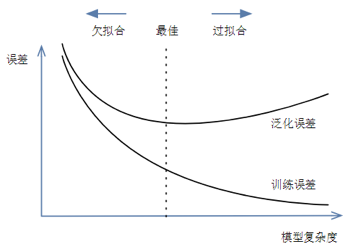

# 统计学习引言

## 1. 统计学习简史

假设检验和统计建模之间的方法存在很大差异。通过假设检验，人们通常会从零假设开始。根据问题和数据，然后选择适当的统计检验以及所需的显着性水平，并接受或拒绝零假设。

相反，统计建模通常涉及对数据的更具交互性的分析。一开始是对数据进行目视检查，寻找相关性和/或关系。基于该第一次检查，选择可描述数据的统计模型。

在统计建模的基础上衍生出的统计学习（Statistical Learning）成为现代数据分析的理论基础，其发展历程如下：

- 1805 年，勒让德（Adrien-Marie Legendre，1752∼1833）首次对最小二乘法（Least Squares）进行了具体而清晰的阐述。

- 1809 年，高斯（Karl Friedrich Gauß，1777∼1855）在其发表的关于天体计算的文章中声称他自 1795 年就一直使用最小二乘法

- 1810 年，LaPlace（Pierre-Simon LaPlace，1749∼1827）利用中心极限定理（Central Limit Theorem，CLT）为最小二乘法提供了一个大样本证明

- 1822 年，高斯指出，在误差的均值为零、不相关且方差相等的线性模型中，最小二乘估计是系数的最佳线性无偏估计（best linear unbiased estimator，BLUE），该结果被称为高斯 - Markov 定理（Gauss-Markov Theorem）

- 1936 年，费舍尔爵士（Sir Ronald Aylmer Fisher，1890∼1962）提出线性判别分析（linear discriminant analysis，LDA）

- 1944 年，Joseph Berkson（1899∼1982）提出分对数（logit），众多学者在此基础上发展出逻辑回归（Logistic Regression）

- 20 世纪 70 年代，John Nelder（1924∼2010）和 Robert Wedderburn（1947∼1975）提出广义线性模型（Generalized Linear Model，GLM）

- 1984 年，Leo Breiman（1928∼2005）、Jerome Harold Friedman、Charles Stone 和 Richard Olshen 提出分类和回归树（Classification and Regression Trees，CART）

- 1986 年，Trevor Hastie 和 Robert Tibshirani 提出广义可加模型（Generalized Additive Model，GAM）

## 2. 机器学习的内容

机器学习是一个试图使计算机在无需明确编程的情况下即可获得学习能力的研究领域（Arthur Samuel, 1959）。

### 2.1. 监督程度

依照受到监督的程度，机器学习可被划分为

- 监督（supervised）
- 非无监督（unsupervised）
- 半监督（semi-supervised）
- 强化学习（reinforcement learning，RL）

通常情况下，数据集中的各个观测（observations）被称为特征（features），而算法的已知解被称为标签（labels），标签的数量决定着算法受到监督的程度。

典型的监督学习包括

- 分类（classification）：将一组特征分为不同的类（class）
- 回归（regression）[^1]：利用特征，来预测一个目标（target）的数值

非监督学习目前多用于探索性数据分析（exploratory data analysis，EDA），主要任务如下：

- 聚类（clustering）：根据特征的相似度，将其分组
- 降维（dimensionality reduction）：在最少丢失信息的情况下，简化数据，如将相关特征合并
- 离群值和新颖度检测（anomaly and novelty detection）
- 关联规则学习（association rule learning）

大多数半监督学习均是监督学习和非监督学习的结合。受限玻尔兹曼机机（restricted Boltzmann machines，RMBs）是一类应用广泛的半监督学习技术，其以无监督的方式进行顺序训练，然后使用监督的学习技术对整个系统进行微调。Geoffrey Hinton 于 2006 年在其基础上提出的深度信念网络（deep belief networks，DBNs），通过训练神经元间的权重，使整个神经网络按照最大概率来生成训练数据。

强化学习与前三者有极大的不同。算法中的学习单元被称为代理（agent），其可观察环境，选择并执行动作，并获得回馈（rewards）或惩罚（penalties）。然后，它必须自己了解什么是最好的战略，这里称为方针（policy），以便随着时间的推移获得最大的回馈。方针定义代理在给定情况下应选择的操作。

### 2.2. 训练方式

在批处理学习（batch learning）中，系统无法进行持续学习，只能使用所有可用数据对其进行训练。通常，这将花费大量时间和计算资源，因此通常是脱机完成的，故也叫离线学习（offline learning）。当然，这种模式仅适用于其现有数据。幸运的是，培训，评估和启动机器学习系统的整个过程可相当容易地实现自动化，故，即使是批处理学习系统也可适应变化。只需更新数据并根据需要从头开始训练系统的新版本。该解决方案很简单，且通常可很好地工作，但，使用全套数据进行培训可能会花费很多小时。

在线学习（online learning）可通过逐个或小批量（mini-batches）的分组形式依次填鸭（feed）数据实例来逐步训练系统。每个学习步骤既快速又便宜，因此系统可在到达时即时了解新数据。在线学习算法还可用于在无法容纳在一台机器的主存储器中的庞大数据集上训练系统，这被称为核外学习（out-of-core learning）。该算法将加载部分数据，对该数据进行训练，然后重复该过程，直到对所有数据运行为止。

在线学习系统的一个重要参数是它们适应变化的数据的速度：这称为学习率（learning rate）。若设置较高的学习率，则系统将迅速适应新数据，但也往往会很快忘记旧数据。相反，若将学习率设置得较低，则系统将具有更大的惯性，但对新数据中的噪声或离群值的敏感性也将降低。

在线学习面临的一大挑战是，若将不良数据输入系统，系统的性能将逐渐下降。若是实时系统，客户会注意到。为了降低这种风险，若发现性能下降，则需要密切监视系统并立即关闭学习功能（并可能恢复到以前的工作状态），还需要异常检测算法监视输入数据并对异常数据做出反应。

### 2.3. 泛化模式

大多数机器学习任务都与做出预测有关。这意味着，给定许多训练实例，系统需要能够对（从未有过的）实例做出良好的预测。即对训练数据的表现进行度量是不够的，真正的目标是在新实例上也表现良好。

实例学习（instance-based learning）通过学习实例并记忆，然后通过使用相似性度量将其与学习的实例（或其中的一部分）进行比较，将其推广到新的案例。而通过对现有实例建立模型，然后使用该模型进行预测的技术被称为模型学习（model-based learning），对模型的度量可定义拟合函数（fitness function），也可定义成本函数（cost function）。

## 3. 挑战

### 3.1. 数据质量

使用代表要概括的案例的训练集至关重要。这通常比听起来要难：若样本太小，则会产生采样噪声（sampling noise）；但，若采样方法有缺陷，则即使非常大的样本也可能不具代表性（representative）。这称为采样偏差（sampling bias）。此外高质量的数据还需要：

- 去除非相关数据，这个过程也叫特征工程（feature engineering）
- 去除错误数据

### 3.2. 拟合程度

在训练数据上表现良好的模型，但泛化效果不一定好，对于模型的评价需要兼顾以下几个方面：

1. 训练误差：模型在训练数据集上表现出的误差
2. 泛化误差（generalization error）：模型在任意一个测试数据样本上表现出的误差的期望
3. 欠拟合（underfitting）：也叫高偏差，所建模型无法得到较低的训练误差，不能用于判别。
   - 只能尝试更加复杂的模型，**增加数据量是无效的**。
4. 过拟合（overfitting）：也叫高方差，所建模型的训练误差远小于它在测试数据集上的误差，即过度专一于个例，而不能对普遍现象进行准确判别。
   - 扩增数据量
     - 原有数据增加
     - 原有数据加随机噪声
     - 重采样
   - 正则化：限制模型的复杂度
   - 创建验证集，交叉验证
   - 早停止：在训练中多次迭代后发现模型性能没有显著提高就停止训练
   - 特征工程
     - 特征选择
     - 特征降维

为了对这类问题进行评估，一个通行的做法是将数据切分为训练集（training set）和测试集（test set），利用后者来度量泛化误差。若训练误差较低，但泛化误差较高，则意味着模型过拟合了训练数据。现在要应用一些正则化（regularization）方法来避免过拟合。这里涉及到超参数（hyperparameters）的设定。超参数是学习算法（而不是模型）的参数。故，它不受学习算法本身的影响；必须在训练之前进行设置，且在训练过程中保持不变，则如何选择正则化超参数的值？常见的解决方案是保留验证（holdout validation），即保留一部分训练集，称为验证集（validation set），然后在简化的训练集上训练具有各种超参数的多个模型，然后选择在验证集上表现最佳的模型。

这种解决方案通常效果很好。但，若验证集太小，则模型评估将不精确，可能最终会错误地选择次优模型。相反，若验证集太大，则剩余训练集将比完整训练集小得多。解决此问题的一种方法是使用许多小型验证集执行重复的交叉验证（cross-validation）。在对其余数据进行训练后，每个模型对每个验证集评估一次。通过对模型的所有评估求均值，可更准确地度量模型的性能。但，这有一个缺点：训练时间会随着验证集的大小翻倍。

### 3.3. 数据错配

在某些情况下，很容易获得大量用于训练的数据，但，这些数据可能无法完全代表将用于生产中的数据。在这种情况下，要记住的最重要规则是，验证集和测试集必须尽可能代表希望在生产中使用的数据。一个战略是对其进行洗牌和将一半放入验证集中，将一半放入测试集中（确保两个集中都没有重复或接近重复的结果），但，这样的话，若结果不理想，将无法知道这是因为模型过度拟合了训练集，还是因为目标结果和模型之间的不匹配。

一个解决方案是，在取出验证集的训练集中再取出一部分数据，作为开发集（train-dev set）。在训练模型后，使用开发集对其进行评估。

- 若模型在训练集上表现良好，但在开发集上表现不佳，则该模型可能会过度拟合训练集。
- 若模型在训练集和开发集上都表现良好，但在验证集上表现不佳，则训练数据与验证集 + 测试集之间可能存在明显的数据不匹配，因此应该尝试改进训练 数据，使其看起来更像验证集 + 测试集。

### 3.4. 没有免费的午餐

David Wolpert 在 1996 年发表的一篇著名论文 [^2] 中证明，若您对数据绝对不做任何设，则没有理由比其他模型更喜欢一种模型。这称为无免费午餐（No Free Lunch，NFL）定理。对于某些数据集，最佳模型是线性模型，而对于其他数据集，它是神经网络。没有任何一种模型可保证先验地（a priori）工作更好。要确定哪种模型最好，唯一的方法就是对它们全部进行评估。由于这是不可能的，因此在实践中您对数据做出一些合理的设，并仅评估一些合理的模型。

## 4. 概率与模型

假设我们有训练数据$(X,Y)$，$X$是特征集合，$Y$是标签集合。这时来了一个新的样本$x$，想要预测它的类别$y$，即求得最大的条件概率$P(y ∣ x)$作为新样本的分类。

在建模时有判别式和生成式两种手段，其中，前者学习类别的边界，后者描述每种类别的分布。

### 4.1. 判别式模型

- 由数据直接学习决策函数 $Y = f(X)$或条件概率$P(Y ∣ X)$
- 优势
  - 在小数据集上表现效果很好
- 劣势
  - 易过拟合
  - 准确性高度依赖于决策函数的准确性

### 4.2. 生成式模型

- 关注 X 和 Y 如何同时出现
- 由数据学习联合概率密度分布函数 $P(x, y) = P(y) * p(x ∣ y)$
- 优势
  - 不易过拟合，尤其当采集的数据的分布与真实世界整体数据集的分布相近
- 劣势
  - 计算量更大
  - 易受到异常值影响

> 由生成模型可以得到判别模型，但由判别模型得不到生成模型。

## 5. 约定

### 5.1. 术语

- 估计器（estimator）：可基于数据集估算某些参数的对象。
- 变换器（transformer）：可变换数据集的估算器。
- 预测器（predictor）：能够对给定数据集的做出预测的估算器。
- 管道（pipeline）：一系列数据处理组件。组件通常异步运行，每个组件均是相当独立的，组件之间的接口只是数据存储。这使系统易于掌握，且不同的团队可专注于不同的组件。
- 信号（signal）：输入到机器学习系统的一条信息，参照克劳德·香农（Claude Shannon，1916∼2001）的信息论。

[^1]: Regression 源自 Francis Galton 在研究高个子的孩子往往比父母矮的事实时引入的一个统计术语。他称这种现象为回归均值（regression to the mean）。此后将该名称被他用于其分析变量之间相关性的方法。
[^2]: David Wolpert, "The Lack of A Priori Distinctions Between Learning Algorithms", Neural Computation 8, no. 7 (1996): 1341-1390.
