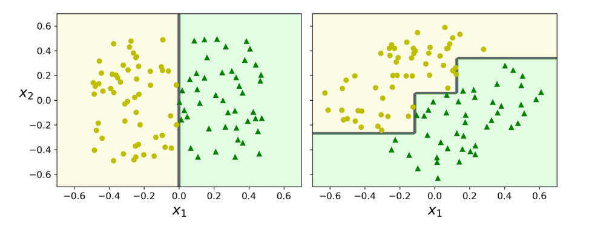

# 非线性分类

## 1. 最近邻

最近邻方法（Nearest Neighbor）背后的原理是找到距离新点最近的预定义数量的训练样本，并从这些预测标签中预测标签。样本的数量可是用户定义的常数（_k_-最近邻学习），或基于点的局部密度（基于半径的近邻学习）而变化。通常，距离可是任何度量标准。基于近邻的方法被称为非泛化机器学习方法，也叫消极学习（lazy learning）。因为它们只是"记住"其所有训练数据（可能变换为快速索引结构，例如**Ball Tree**或**KD Tree**）。

最近邻学习不是在整个样本空间上一次性地估计目标函数，而是针对每个待测样本作出局部的目标函数逼近。当目标函数很复杂，但它可用不太复杂的局部函数来逼近，这样做有非常明显的优势。作为一种非参数方法，它通常在决策边界非常不规则的分类情况下是成功的。

最近邻学习的思想非常简单：给定待测样本，首先基于某种近邻索引方法找出训练集中与其最靠近 的$k$个样本，然后基于这$k$个样本的后验概率来预测 待测样本的类标记。具体算法分为两个阶段

- 训练阶段：将每个训练样本保存起来
- 工作阶段：
  - 给定一个待测样本
  - 基于某种近邻索引方法找出训练样本集中与其最靠近$k$ 个样本
  - 基于这$k$个训练样本的后验概率来预测待测样本的类标记

> 关于最近邻算法，若两个邻居具有相同的距离但不同的标签，结果将取决于训练数据的排序。

### 1.1. 最近邻分类

`KNeighborsClassifier` 中的 $k$-近邻分类是最常用的技术。$k$的最佳选择高度依赖于数据：通常，较大的$k$会抑制噪声的影响，但会使分类边界变得不则明显。

在数据未被均匀采样的情况下，`RadiusNeighborsClassifier` 中基于半径的最近邻分类可能是更好的选择。用户指定固定半径$r$，使得较稀疏的邻域中的点使用较少的最近邻进行分类。对于高维参数空间，由于所谓的"维度诅咒"，该方法变得不则有效。

基本近邻分类使用**均匀权重**：即，分配给查询点的值是从最近邻的简单多数投票计算的。在某些情况下，最好对最近邻进行加权，以使较近的最近邻对拟合做出更多贡献。

### 1.2. 最近邻回归

基于近邻的回归可用于数据标签是连续的而不是离散的变量的情况。分配给查询点的标签是根据其最近邻居的标签的均值计算的。

### 1.3. 距离索引

最近邻学习的所有计算几乎都花费在索引近邻问题上。故，如何有效地索引近邻样本，以减少分类时所需计算是一个重要的实践问题。

目前，使用最多的近邻索引方法就是通过计算待测样本与每个训练样本之间的距离，然后基于距离排序，选择距离最短的$K$个训练样本作为待测样本的最近邻样本。因此如何度量样本点之间的距离就变得非常重要了。

为度量样本点之间的距离，学者们提出了许多经典的距离度量函数。根据样本点的数据类型划分，主要有

- 连续属性：Euclidean 距离，Manhattan 距离等
- 离散属性：Overlap Metric 距离，Value Difference Metric 距离等
- 混合属性：HEOM 距离（Heterogeneous Euclidean -Overlap Metric），HVDM（Heterogeneous Value Difference Metric）等

### 1.4. 树型索引

- KD Tree

KD-Tree 数据结构（K 维树的简称）把训练样本存储在树的叶子节点上，邻近的样本存储在相同或相近的叶子节点上，然后通过测试待测样本在内部节点上的划分属性把待测样本划分到相关的叶子节点上。

这种方法因为树的构建是在训练阶段进行的，故比基于距离排序的索引方法所需的计算量要小得多。但如何构建有效的树成了另外一个需要解决的问题。

- Ball Tree

为了解决更高维度的 KD 树的低效问题，开发了球树数据结构。在 KD 树沿 Cartesian 轴分割数据的地方，球树在一系列嵌套超球体中划分数据。这使得树构造比 KD 树的构建成本更高。但，导致数据结构在高度结构化的数据上非常有效，即使在非常高的维度上亦为如此。

## 2. 最近邻改进

### 2.1. 维度 & 邻域

前面讲到的许多学习方法，如决策树学习，只测试部分属性就可作出判断，而最近邻学习中样本间的距离是根据样本的所有属性来计算的。若目标函数仅依赖于很多属性中的几个时，样本间的距离会被大量不相关的属性所支配，从而导致相关属性 的值很接近的样本相距很远。

解决维度诅咒的常用方法主要包括

- 属性加权
- 属性选择

另一个很重要的参数，那就是邻域的大小，即最近邻样本的数目$k$，最近邻学习的预测结果与$k$的大小密切相关。同样的数据，$k$值不同可能导致不同的预测结果。

目前对于$k$值的选取主要有两种办法

- 基于经验直接给定
  - 选择较小的$k$值，相当于用较小的领域中的训练实例进行预测，$k$值的减小就意味着整体模型变得复杂，容易过拟合；
  - 选择较大的$k$值，相当于用较大领域中的训练实例进行预测，$k$值的增大就意味着整体的模型变得简单，容易欠拟合；
- 基于数据自动学习

### 2.2. 最近质心法

`NearestCentroid` 分类器通过其成员的质心来表示每个类。实际上，这使得它类似于 `sklearn.KMeans` 算法的标签更新阶段。它也没有选择的参数，使其成为一个很好的基线分类器。但，它确实受到非凸类以及类具有完全不同的方差的影响，因为设所有维度都存在相等的方差。

`NearestCentroid` 分类器具有 `shrink_threshold` 参数，该参数实现最近的缩小的质心分类器。实际上，每个质心的每个要素的值除以该要素的类内方差。然后通过 `shrink_threshold` 减小特征值。最值得注意的是，若特定特征值过零，则将其设置为零。实际上，这会消除该功能影响分类。这很有用。例如，用于删除噪音特征。

### 2.3. 后验 & 偏置

给定待测样本的$k$个最近邻样本，估计其后验概率的常用方法包括

- 投票法
- 加权投票法
- 局部概率模型法

当计算得到的后验概率出现相同的情况下，可使用随机分类或拒判的方法进行处理。

在计算后验概率的过程经常会使用一些常用的概率估计方法

- 基于频率的最大似然估计
- LaPlace 估计
- 基于相似度（距离）加权的 LaPlace 估计
- 朴素贝叶斯估计

最近邻学习的归纳偏置是：在输入空间上相近的样本点具有相似的目标函数输出。即，一个待测样本的类标记与它在输入空间中相邻的训练样本的类标记相似。

有效的距离度量方法可在一定程度上缓解归纳偏置问题，如属性加权的距离度量方法。

## 1. 树方法

树方法主要依据分层（stratifying）和切割（segmenting）的方式将预测器的空间划分为一系列简单区域，这些规则可被概况为一棵树，因而也称决策树（Decision Tree，DT）。

决策树可执行分类和回归任务，甚至可执行多输出任务，能够拟合复杂的数据集，甚至**不在乎数据是否放缩**。决策树是直观的，其决策也易于解释。这种模型通常称为**白盒模型**。与之相反，正如我们将看到的，通常将随机森林或神经网络视为**黑盒模型**。他们做出了很好的预测，可轻松地检查他们为做出这些预测而执行的计算；但，通常很难用简单的术语来解释为什么做出预测。

### 1.1. 树的结构

一棵决策树一般包含一个根节点、若干个内部节点和若干个叶子节点。

- 叶子节点对应于决策结果；
- 每个内部节点对应于一个属性测试，每个内部节点 包含的样本集合根据属性测试的结果被划分到它的子节点中；
- 根节点包含全部训练样本；
- 从根节点到每个叶子节点的路径对应了一条决策规则。

在下面的示例中，决策树从数据中学习以使用一组 if-then -else 决策规则来近似正弦曲线。树越深，决策规则越复杂，模型越适合。

^2
$$

2. 对$j$和$s$，定义一对半平面$R_1(j, s) = \{X | X_j <s\}$

$$
∑_{i: x_i ∈ R_1(j, s)}(y_i - ŷ_{R_1})^2 +
∑_{i: x_i ∈ R_2(j, s)}(y_i - ŷ_{R_2})^2
$$

3. 重复上述步骤，直到符合某一准则，如所有区域包含的实例值个数都不大于 5 时。

:::

### 1.2. 不纯度

一般而言，随着长树过程的不断进行，我们希望决策树的分支节点所包含的样本越来越归属于同一类别，即节点的不纯度（impurity）越来越低。

令$p_i$为节点$t$中第$i$类样本的占比，$c$为类别数目，则节点$t$的不纯度度量主要包括：

- 信息熵

$$
H_i = -∑_{k=1 \atop p_{i, k ≠ 0}}^n p_{i, k} \log_2 p_{i, k}
$$

- Gini 不纯度

$$
\mathrm{Gini}(p) = ∑_{k=1}^M p_k(1-p_k) = 1 - ∑_{k=1}^M p_k^2
$$

其中，$p_{i, k}$是$k$类实例在第$i$个节点中的的占比。

Gini 不纯度的计算速度稍快，是一个很好的默认值。但，Gini 不纯度趋向于分离出最频繁出现的类别，而熵趋于产生稍微更平衡的树。

### 1.3. 条件熵

条件熵，即样本信息熵的期望，表达式为

$
  \begin{aligned}
  H(Y ∣ X) &:= -∑_{x, y} p(x) p(y ∣ x) log p(y ∣ x) \\
  &= E(H(Y ∣ X = x^{(k)}))
  \end{aligned}
$

求条件熵最大，即求

$
  \min_{x, y} ∑_{x, y} \tilde{p}(x) p(y ∣ x) log p(y ∣ x)\\
  s.t.
  \begin{cases}
  &Δ_k &- E_p(f_k(x, y)) &= 0, &k = 1, 2 …, m \\
  &1 &- ∑_{y} p(y ∣ x) &= 0
  \end{cases}
$

利用 Lagrange 乘子法：

$
  \begin{aligned}
  L(P, λ) &= ∑_{x, y} \tilde{P}(x) P(y ∣ x) log P(y ∣ x)\\
  & + λ_0\big(1- ∑_y P(y ∣ x)\big) + ∑_{k=1}^m λ_k(Δ_k-E_P(f_k(x, y)))
  \end{aligned}
$

可得

$
  P(y ∣ x)=\frac{e^{η^{⊤}⋅f(x, y)}}{∑_{y} e^{η^{⊤}⋅f(x, y)}}
$

其中，$η$为常数向量。

### 1.4. 运算复杂度

决策树进行预测需要从根到叶遍历。决策树通常是近似平衡的，因此遍历决策树需要经过大约$O(\log_2 m)$个节点。由于每个节点仅需要检查一个特征的值，因此总预测复杂度为$O(\log_2 m)$，与特征数量无关。故，即使处理大型训练集，预测也非常快。

训练算法比较每个节点上所有样本上的所有特征。比较每个节点上所有样本的所有特征会导致训练复杂度为$O(n × m\log_2 m)$。对于小型训练集（少于几千个实例），可通过对数据进行预排序来加快训练速度，但，这样做会大大减慢对大型训练集的训练速度。

## 2. 树的生成

### 2.1. CART

分类和回归树（Classification and Regression Tree，CART），又称生长树（growing trees），该算法的工作原理是，使用单个特征$k$和阈值$t_k$将训练集分为两个子集，$(k, t_k)$通过成本函数计算得到最纯子集：

$$
J(k, t_k) = \frac{m_{left}}{m} G_{left} + \frac{m_{right}}{m} G_{right}
$$

其中，$G$为左右子集的 Gini 不纯度，$m$为左右子集的实例个数。

分类树通常使用 Gini 系数，即

$$
\begin{aligned}
Gini_{index} &= ∑ \frac{|D_i|}{|D|} Gini(D_i) \\
&= \frac{|D^{a=v}|}{|D|} Gini(D^{a=v}) + \frac{|D^{a\ne v}|}{|D|} Gini(D^{a\ne v})
\end{aligned}
$$

回归树通常用 MSE 代替，即

$$
\mathrm{MSE}_{node} = ∑_{i ∈ node}(ŷ_{node} - y^{(i)})
$$

其中，

$$
ŷ_{node} = \dfrac{∑_{i ∈ node}y^{(i)}}{m_{node}}
$$

CART 算法是一种贪婪算法：它选取最小特征划分，直至满足停止条件。其还有以下特点：

- 不检查拆分是否会导致最低的不纯度降低几个级别
- 通常会产生合理的解决方案，但不能保证是最优的
- **仅生成二叉树**，而其他算法，如 ID3，可生成具有> 2 的子节点的决策树。

- 优点
  - 简单灵活，可用于非线性数据的判别或拟合
  - 不需要对数据标准化或归一化。
- 缺点
  - 只能产生正交边界，对微小变化敏感，易过拟合，此时需要依赖集成算法。

### 2.2. ID3（基于信息增益）

ID3（迭代二分法器 3）创建一个多路树，以贪婪的方式为每个节点找到将产生分类目标的最大信息增益的分类特征。ID3 基于信息增益，即

$$
\mathrm{Gain}(D, A) = H(D) - H(D∣A)
$$

其中，

$$
H(D) = -∑_{k=1}^k \frac{|C_k|}{|D|} \log_2 \frac{|C_k|}{|D|}
$$

$$
\begin{aligned}
H(D ∣ A) &= ∑_{i=1}^n \frac{|D_i|}{|D|} H(D_i)\\
&= ∑_{i=1}^n \frac{|D_i|}{|D|} \big(-∑_{k=1}^{k} \frac{|D_{ik}|}{|D_i|} \log_2 \frac{|D_{ik}|}{|D_i|} \big)
\end{aligned}
$$

> 即，信息增益 = 信息熵 - 条件熵，也就是说，已知特征$a$的取值后，$y$的不确定性减少量。

缺点

- 信息增益偏向取值较多的特征
- 不能剪枝，易过拟合

### 2.3. C4.5、C5.0（基于信息增益比）

C4.5 是 ID3 的后继者，并通过动态定义离散属性（基于数值变量）来消除特征必须分类的限制，该离散属性将连续属性值划分为一组离散的间隔。C4.5 将训练的树（即 ID3 算法的输出）变换成 `if-then` 规则集。然后评估每个规则的这些准确性以确定它们应该应用的顺序。若规则的准确性在没有它的情况下得到改善，则通过删除规则的前提条件来完成剪枝。

$$
\mathrm{Gain}_{\text{Ratio}}(D, A)=  \frac{\mathrm{Gain}(D, A)}{H_A(D)}
$$

其中，

$$
H_A(D) = -∑_{i=1}^n \frac{|D_i|}{|D|} \log _2 \frac{|D_i|}{|D|}
$$

选取“信息增益 > 信息增益均值”的特征，然后选取信息增益比最高的特征。

缺点

- 信息增益比偏向取值较少的特征
- 容易陷入局部最优

## 3. 剪枝

为了防止构建的树过大，产生过拟合且缺乏可解释性，往往需要对树进行剪枝（pruning）。

### 3.1. 预剪枝

预剪枝（pre-pruning）是指在树的构建过程（只用到训练集），设置一个阈值，使得当在当前分裂节点中分裂前和分裂后的误差超过这个阈值则分列，否则不进行分裂操作。这样可大大降低运算成本，但也可能带来短视的问题：一些被忽略的分裂可能会对模型准确性产生重大影响。

### 3.2. 后剪枝

针对预剪枝存在的问题，后剪枝（post-pruning）的战略是在用训练集首先无限制地训练决策树，然后修剪（删除）不必要的节点。一种常用方法是代价复杂度剪枝（Cost Complexity Pruning，CCP）。这种方法不考虑每一棵树，而是考虑以非负调整参数$α$标记的一系列子树。每个$α$的取值对应一棵子树$T⊂ T_0$，当$α$一定时，其对应的子树使下式最小：

$$
∑_{m= 1}^{|T|} ∑_{i: x_i ∈ R_m} (y_i - ŷ_{R_m})^2 +
α|T|
$$

其中，$|T|$表示树$T$的终端节点树，$R_m$是第$m$个终结节点对应的矩形（预测向量空间的一个子集），$ŷ_{R_m}$是对$R_m$对应的预测值。

- 当$α = 0$，子树$T$等于原树$T_0$。
- 当$α$增大，终结节点数多的树将为它的复杂付出代价。

若某一节点的子节点全部为叶节点，则认为其对纯度提高在统计上不显着，即该节点是不必要的。使用标准的统计检验，如$χ^2$检验来估计这种改进纯粹是偶然结果的概率（零假设）。

### 3.3. 其他战略

- 错误率降低剪枝（Reduced Error Pruning，REP)
- 悲观剪枝（Pessimistic Error Pruning，PEP)

## 4. 回归树

### 4.1. 误差度量

CART 算法的工作原理与以前的方法大致相同，不同之处在于，它不再尝试以最小化不纯度的方式拆分训练集，而是尝试以最小化 MSE 的方式拆分训练集：

$$
\begin{aligned}
\displaystyle J(k, t_k) =
\frac{m_\mathrm{left}}{m} \mathrm{MSE}_\mathrm{left} + \frac{m_\mathrm{right}}{m} \mathrm{MSE}_{\mathrm{right}} \\
\\
\mathrm{where}
\begin{cases}
  \displaystyle\mathrm{MSE}_\mathrm{node} =
    ∑_{i ∈ \mathrm{node}}(ŷ_\mathrm{node} - y_i)^2 \\
  \displaystyle ŷ_\mathrm{node} =
  \frac{1}{m_\mathrm{node}} ∑_{i ∈ \mathrm{node}} y_i
\end{cases}
\end{aligned}
$$

### 4.2. 树的局限

决策树有一些限制。首先，决策树喜欢正交的决策边界（所有分割都垂直于轴），这使它们对训练集旋转敏感。限制此问题的一种方法是使用主成分分析（详见 20.3），这通常可使训练数据的方向更好。

决策树的更主要问题是它们对训练数据中的**细微变化非常敏感**。随机森林可通过对许多树木进行平均预测来限制这种不稳定性，详见后续章节。
