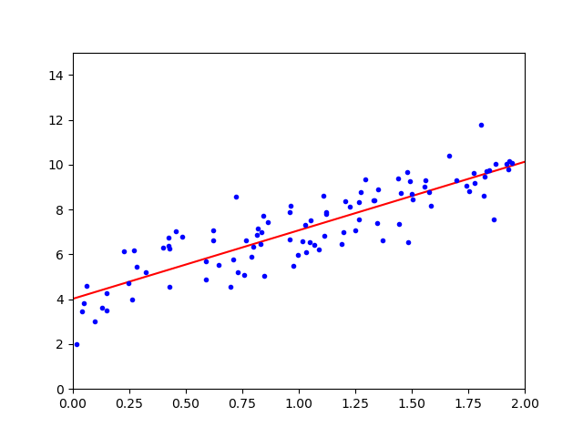

# 线性回归

## 1. 线性回归

### 1.1. 简单线性回归

广义上的线性回归，包括线性回归和多项式回归，其目的是找到一条直线或曲线，并以最小的误差来拟合数据，回归的核心就是寻找**误差的最小值**。

> 回归分析的前提是，$𝑿_i$相互独立，$𝒀$服从高斯分布

对于简单线性回归，其总体回归线可表示为

$$
𝒀 = θ_0 + θ_1𝑿 + ϵ,\ ϵ ∈ N(0, σ^2)
$$

其中，$ϵ$为均值为$0$的随机误差，其简化形式为

$$
𝒀 ≈ θ_0 + θ_1𝑿
$$

这里，$θ_0$和$θ_1$为未知常量，被称为模型的系数（coefficient）或参数（parameter）。通过训练数据，对其进行估计，即可得到想要的预测值：

$$
ŷ = \hat{θ}_0 + \hat{θ}_1 x
$$

### 1.2. 多元线性回归

设有$p$个不同的预测器，则多元线性回归模型为：

$$
𝒀 = θ_0 + ∑_{i=1}^p θ_i 𝑿_i + ϵ
$$

经过系数估计，可得

$$
ŷ = \hat{θ}_0 + ∑_{i=1}^p \hat{θ}_i x_i
$$

### 1.3. 模型语言

对线性模型回归模型

$$
𝒀 = θ𝑿 + ϵ
$$

其中，

- $𝑿$被称为模型的设计矩阵（design matrix）。
- $𝒀_i$被称为回归量（regressand），内生变量，响应变量，测量变量。
- $𝑿_i$被称为回归子（regressor），外生变量，解释变量，协变量（covariates）。通常情况下，回归子中会包含一个常数，$θ$中的对应值为截距。线性模型的许多统计推断过程需要存在截距，即使理论上其值应为零。
- $θ$为参数向量，也称效应量（effects），只要参数向量是线性的，模型就保持线性。
- $ϵ_i$为残差、误差项或噪音（noise），误差项和回归量之间的关系，例如它们是否相关，是制定线性回归模型的关键步骤。

| Operator |            Meaning            |
| :------: | :---------------------------: |
|   `～`   | 因变量 - 自变量连接符，弱相关 |
|   `**`   | 因变量 - 自变量连接符，强相关 |
|   `+`    |            取并集             |
|   `-`    |            取差集             |
|   `*`    | 所有关系，$a*b ≡ a + b + a:b$ |
|   `/`    |   非交互关系，$a/b ≡ a + b$   |
|   `:`    |        交互关系连接符         |

### 1.4. 运算复杂度

规范方程需要计算的$𝑿^{⊤}𝑿$的逆是一个$(n + 1) × (n + 1)$的矩阵，其运算复杂度为$O(n^{2.4})$∼$O(n^3)$，即，若特征$n$加倍，则运算时间将乘以$2^{2.4}∼2^3$倍。

相比较之下，SVD 的运算复杂度只有$O(n^2)$。从积极的一面来看，两者均与训练集中的实例数（它们为$O(m)$）呈线性关系，故，只要它们适合内存，它们就可有效地处理大型训练集。

## 2. 模型检验

### 2.1. 估计系数

在做出预测之前，需要根据数据集估计系数。令

$$
(x_1, y_1), (x_2, y_2), …, (x_n, y_n)
$$

表示$n$组实例，每组中都包含$𝑿$和$𝒀$的一个观测值。此处使用最常用的残差平方和（residual sum of squares，RSS）来度量误差（error），用$e_i = y_i - ŷ_i$表示第$i$个残差（residual），则

$$
\mathrm{\mathrm{RSS}} = ∑e_i^2 = ∑(y_i - ŷ_i)^2
$$

使用普通最小二乘法（Ordinary Least Squares，OLS）选择$θ_0$和$θ_1$来使$\mathrm{\mathrm{RSS}}$最小，求出

$$
\begin{aligned}
  \hat{θ}_1 &= \dfrac{∑(x_i - x̄)(y_i - ȳ)}{∑(x_i - x̄)^2} \\
  \hat{θ}_0 &= ȳ - \hat{θ}_1 x̄
\end{aligned}
$$

这里，$ȳ ≡ \frac{1}{n} ∑y_i$ 和 $x̄ ≡ \frac{1}{n} ∑_{i=1}^{n x_i}$ 为样本均值，这种估计即称为最小二乘估计（least squares estimates，LSE），可表示为：

$$
\mathrm{LSE} = (𝒀 - θ𝑿)^{⊤}(𝒀 - θ𝑿)
$$

求导得

$$
\hat{θ} = (𝑿^{⊤} 𝑿)^{-1} 𝑿^{⊤} 𝒀
$$

> $\frac{∂𝑿^{⊤}𝑨}{∂𝑿} = 𝑨$, $\frac{∂𝑨𝑿}{∂𝑿} = 𝑨^{⊤}$, $\frac{∂𝑿^{⊤}𝑨𝑿}{∂𝑿} = (𝑨 + 𝑨^{⊤})𝑿$

即$\hat{θ}$是$𝒀$的线性组合，这个等式被称为规范方程（Normal Equation）。

为了避免$𝑿$不可逆的情况，实践中多使用奇异值分解（Singular Value Decomposition，SVD）来代替求解规范方程：

$$
\hat{θ} = 𝑿⁺𝒀
$$

其中，$𝑿⁺$是$𝑿$的伪逆（pseudo-inverse），也叫 Moore-Penrose 逆，其由下式给出：

$$
𝑿⁺ = 𝑽𝜮⁺𝑼^{⊤}
$$

对于矩阵$𝜮⁺$，SVD 取$𝜮$，并将所有<微小阈值的值设置为 0，然后将所有非零值替换为其反值，最后对所得矩阵进行转置。
