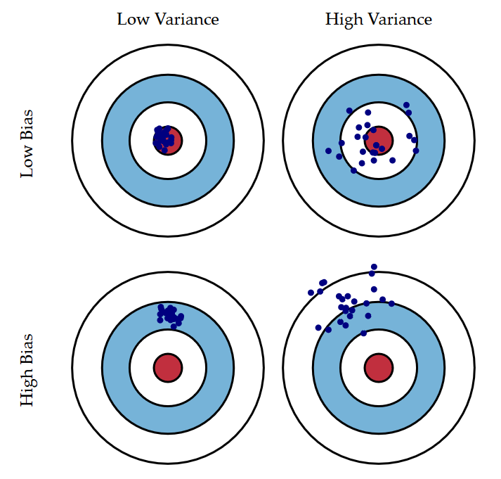
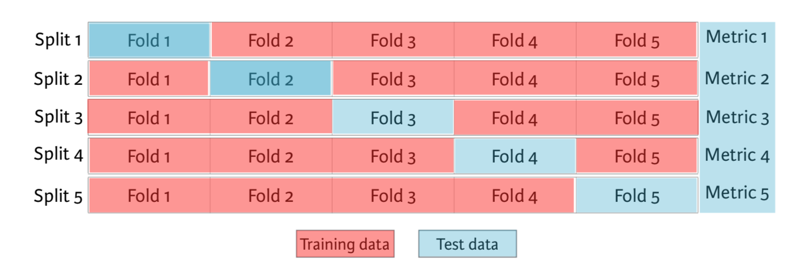
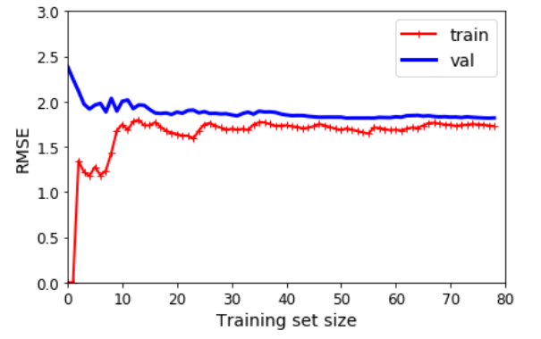
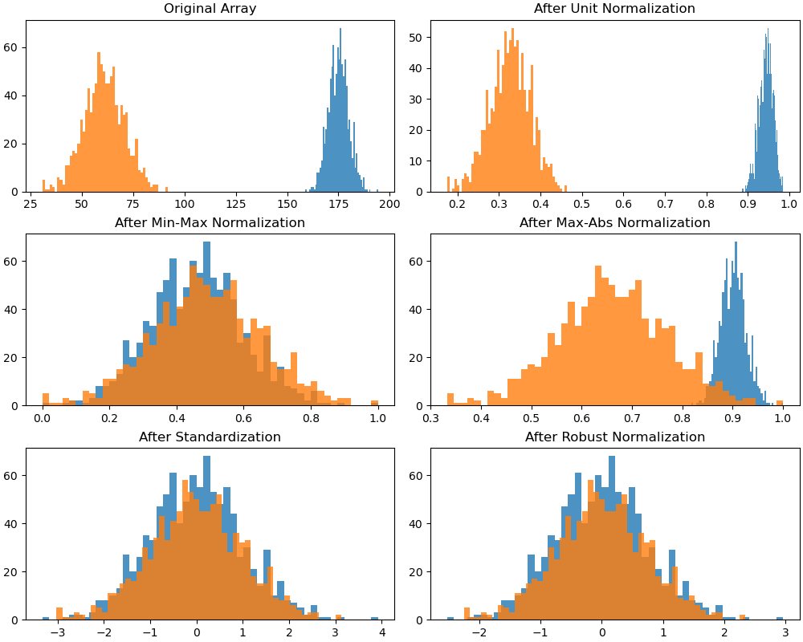

# 模型选择

## 1. 选择标准

### 1.1. 拟合效果

| 测度  |          |       定义        |
| :---: | :------: | :---------------: |
| 误差  |  error   |   测定值 - 真值   |
| 偏差  |   bias   | 测定值 - 总体均值 |
| 残差  | residual | 测定值 - 样本均值 |
| 方差  | variance | 样本离均差的均方  |
| 噪音  |  noise   |     系统误差      |

如图所示，方差或标准差（std），也叫模型参数误差，往往是是模型精确度（precision）的测度；偏差，也叫样本内误差，则是模型准确度（accuracy）的测度。

- 过拟合：过多拟合了误差
- 欠拟合

### 1.2. 范数

对距离的测度在数学上被称为范数（norm）。广义上，对于一个含有$n$个元素的向量$v$来说，其$ℓ_k$范数可定义为：

$$
∥v∥_k = \sqrt[^{^{k}}]{∑|v_i|^{k}}
$$

机器学习中，常常选取训练集的均方误差（mean squared error，MSE）的开方值 RMSE 作为误差测度，即

$$
\mathrm{RMSE} = \sqrt{\frac{1}{n} ∑{(y_i - ŷ_0)}^2}
$$

其实际上是欧式距离，对应$ℓ_2$范数，记为 $∥⋅∥_2$。

对于给定值$x_0$：

$$
\begin{aligned}
  \mathrm{MSE}_\mathrm{test}
  &= E(y_0 - ŷ_0) \\
  &= {[\mathrm{Bias}(ŷ_0)]}^2 + D(ŷ_0) + D(ϵ)
\end{aligned}
$$

当数据集中，离群值较多时，应该考虑使用平均绝对误差（mean absolute error）：

$$
\mathrm{MAE} =
\frac{1}{n} ∑|y_i - ŷ_0|
$$

其实际上是曼哈顿距离，对应$ℓ_1$范数，记为 $∥⋅∥_1$。

对于百分数有

$$
\mathrm{MAPE} = \frac{100}{n} ∑\big|\frac{y_i - ŷ_i}{y_i}\big|
$$

范数指数越高，它越关注大值而忽略小值。因而，对离群值 RMSE 比 MAE 更敏感。但，当离群值很少出现时，RMSE 表现非常好，通常是首选。

### 1.3. 超参数

超参数（hyperparameters）是算法参数，而非模型参数，如学习率、应用正则化的数量等。当不知道超参数的标度应为多少时，一个很有用的工具是倒数分布（reciprocal distribution），又称对数均匀分布（log-uniform distribution），其 PDF 为：

$$
f(x; a, b) = \frac{1}{x[\ln(b) - \ln(a)]}
$$

其中，$x ∈ [a, b]$且$a > 0$。对应的 CDF 为：

$$
F(x; a, b) = \frac{\ln(x) - \ln(a)}{\ln(b) - \ln(a)}
$$

指数分布最好当或多或少知道超参数的标度应该是多少时使用。

## 2. 误差优化

### 2.1. 最小二乘法

即对 MSE 进行优化，求得 $\mathrm{argmin}\{\mathrm{MSE}\}$

### 2.2. 极大似然估计

极大似然估计估计（MLE）的基本思想与 LSQ 有很大的不同：

- 在 LSQ 中，模型是恒定的，响应的误差是可变的；
- 在 MLE 中，数据响应值被视为恒定的，模型的似然是最大化的；

MLE 分为如下步骤

1）列出随机变量$X$的 PDF 或 PMF

由 $ϵ = \mathrm{RSS} ∈ N(0, σ)$，得

$$
p(ϵ_i) = Φ\big(\frac{y_i - μ}{σ} \big)
$$

2）列出似然函数

此时模型的 MLE 为

$$
\begin{aligned}
  \ln ℒ
  &= \ln \big[∏_{i=1}^n \frac{1}{σ\sqrt{2π}} \exp \big(-\frac{(y_i - ŷ_i)^2}{2σ^2} \big)\big] \\
  &= -\frac{n}{2} \ln(2πσ^2) - \frac{1}{2σ^2}∑_{i=1}^n(y_i - ŷ_i)^2 \\
  &= A - \frac{1}{2σ^2}∑_{i=1}^n(y_i - ŷ_i)^2
\end{aligned}
$$

3）最大化似然函数

$$
\frac{∂\ln ℒ}{∂w} = 2∑ (y_i - wx_i - b)(-x_i) = 2\big(w∑ x^2 - ∑ (y - b)x\big)
$$
类似地

$$
\frac{∂ℒ}{∂b} = -2∑ (y - wx - b)
$$
于是，有

$$
\frac{∂^2 ℒ}{∂w^2} = 2∑ x^2,\
\frac{∂^2 ℒ}{∂b^2} = 2n,\
\frac{∂^2 ℒ}{∂w∂b} = 2nx
$$

不难得到，$∇^2 ℒ$半正定，$ℒ$为凸函数。

### 2.3. 矩阵形式

$$
\begin{bmatrix}
y_1 - ŵ^{⊤} x̂_1 \\
⋮ \\
y_n - ŵ^{⊤} x̂_n
\end{bmatrix} =
\begin{bmatrix}
y_1 \\
⋮ \\
y_n
\end{bmatrix} -
\begin{bmatrix}
x̂_1^{⊤}ŵ \\
⋮ \\
x̂_n^{⊤}ŵ
\end{bmatrix}
$$
即

$$
𝒚 - 𝒙ŵ
$$
于是，有

$$
\frac{∂ ℒ}{∂w} = 2𝒙^{⊤}(𝒙ŵ - 𝒚), \ \frac{∂^2 ℒ}{∂w^2} = 2𝒙^{⊤}𝒙
$$

## 3. 模型评估

### 3.1. $\bar{R}^2$

由此前$R^2$的定义可知，其会随着模型包含的特征的增加而增加。对于包含$d$个特征的 OLS，调整$R^2$的计算公式如下：

$$
\bar{R}^2 = 1 - \frac{\mathrm{RSS}/(n - d - 1)}{\mathrm{TSS}/(n - 1)}
$$

$\bar{R}^2$的思想是当模型包含了所有正确的特征，再增加其他冗余特征会导致 RSS 小幅度减小。不过，相对于拥有严格证明的$C_p$与信息准则，调整$R^2$虽然适用广泛且直观，使用需更加谨慎。

CV 的适用范围更广，即便在很难确定模型自由度，或难以估计误差方差的情况下仍可使用。当对不同折数重复使用 CV 时，会得到不同最低测试误差。针对这种情况，可使用一倍标准误差规则（one-standard-error rule）：

- 首先计算不同规模下模型测试 MSE 估计值的标准误差
- 然后选择测试集误差估计值在曲线最低点一倍标准误差之内且规模最小的模型。

### 3.2. 留一交叉验证

交叉验证（Cross-Validation）可用于估算模型的泛化性能。若模型在训练数据上表现良好，但根据交叉验证指标的泛化较差，则模型过拟合。若两者均表现不佳，则说明欠拟合。

留一交叉验证（Leave-One-Out Cross-Validation，LOOCV），将训练集分为 2 个部分，将一个单独的训练$(x_1, y_1)$作为验证集，其余组成训练集。对此大小为$n - 1$个的训练集进行拟合，然后用$x_1$预测$ŷ$。重复上述步骤$n$次，得到$n$个 MSE，则对测试 MSE 的估计为：

$$
\mathrm{CV}_{(n)} = \frac{1}{n} ∑\mathrm{MSE}_i
$$

LOOCV 法的计算量可能很大。而用 OLS 拟合线性回归或多项式回归时，LOOCV 法的计算时长被神奇地缩减至与拟合$n = 1$的时长：

$$
\mathrm{CV}_{(n)} = \frac{1}{n} ∑\big(\frac{y_i - ŷ_i}{1 - h_i} \big)^2
$$

其中，$h_i$为杠杆值。

### 3.3. K-折交叉验证

$k$折交叉验证（k-fold Cross-Validation）是 LOOCV 法的一种替代，其将原始训练数据集分割成$k$个**不重合**的**大小基本一致**的子数据集，每一次使用一个子数据集验证模型，并使用其他$k-1$个子数据集来训练模型：

$$
\mathrm{CV}_{(k)} = \frac{1}{k} ∑_{i=1}^{k} \mathrm{MSE}_i
$$

在这$k$次训练和验证中，每次用于验证模型的子数据集都不同。最后，只需对这$k$次训练误差和验证误差分别求平均作为最终的训练误差和验证误差。

### 3.4. 学习曲线

学习曲线是另一种评估模型的方法：这是模型在训练集和验证集上的性能与训练集大小（或训练迭代）的函数关系图，示例如下：

### 3.5. 信息准则

通常，训练集的 MSE 比测试集的要低，但训练集的 RSS 不能用于对预测个数不同的模型进行选择。此时需要根据模型规模对训练误差进行调整。

若回归模型的误差项服从高斯分布，则极大似然估计估计和最小二乘估计是等价的。此时可信息准则添加惩罚项。常见信息准则有赤池信息准则（Akaike information criterion，AIC）和贝叶斯信息准则（Bayesian information criterion，BIC），它们基于对数似然。这两种措施都会对模型复杂性造成损失，但 AIC 对复杂性的惩罚程度要低于 BIC。

$$
\begin{aligned}
  \mathrm{AIC} &= \dfrac{1}{nσ̂^2}(\mathrm{RSS} + 2dσ̂^2) \\
  \\
  \mathrm{BIC} &= \dfrac{1}{nσ̂^2}(\mathrm{RSS} + \log (n) dσ̂^2)
\end{aligned}
$$

其中，$n$为实例数量。AIC 是不同模型之间信息丢失的相对估计。BIC 最初是使用 Bayesian 论证提出的，与信息的概念无关。

## 4. 标度与放缩

- 线性变换
  - 局部归一化
    - 单位归一化（unit normalization）
    - 标准化（standardization，Z-Score normalization）
    - 鲁棒归一化（robust normalization)
  - 整体归一化
    - 极值归一化（min-max normalization）
    - 绝对值归一化（max-abs normalization）
  - 不改变原始数据的数值排序
- 非线性变换
- 使用场景
  - 基于梯度下降的算法
  - 基于距离的算法：K 近邻、SVM、PCA、K-Means

### 4.1. 标准化

标准化将数据放缩为均值为 0，方差为 1 的状态。

- 依照特征矩阵的列处理数据
- 使用场景
  - 存在异常值和较多噪音
  - 线性降维：PCA

$$
\frac{x_i - μ_{x}}{σ_{x}}
$$

### 4.2. 归一化

归一化将数据的值压缩到$[0, 1]$或$[-1, 1]$。

- 依照特征矩阵的行处理数据
- 使用场景
  - 对输出结果范围有要求
  - 不存在极端的最值
  - 数据不符合正态分布

$$
\frac{x_i - \min (x_i)}{\max (x_i) - \min (x_i)}
$$
