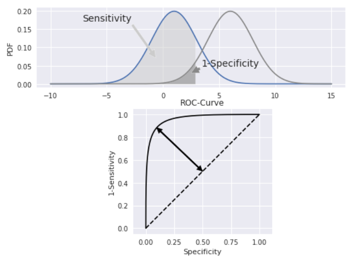
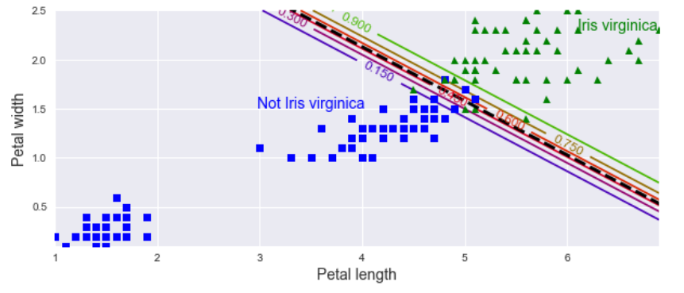
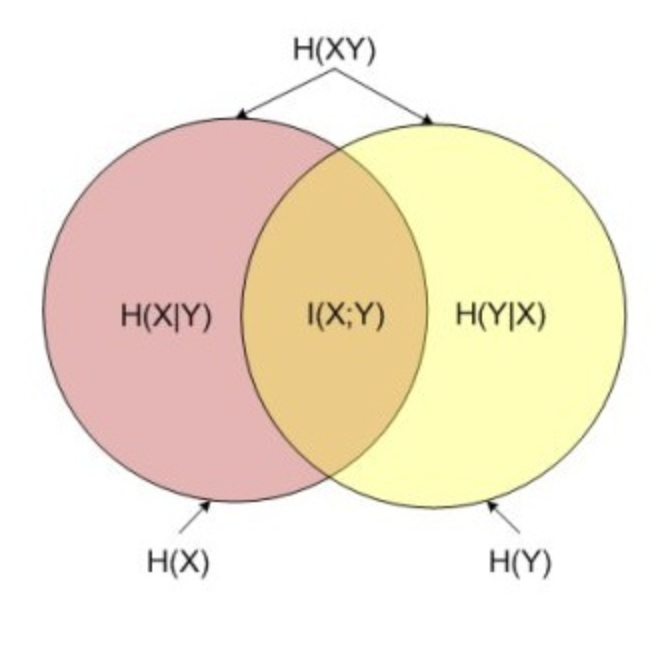

# 线性分类

## 1. 逻辑回归

### 1.1. 模型推导

若预测器存在线性关系，为了使其可对二元分类进行预测，需要找到一个函数，使对任意$X$，该函数的输出都在 0 和 1 之间。逻辑回归（logistic regression）使用 sigmoid 函数：

$$
p̂(X) = \frac{1}{1 + e^{-θ^{⊤}X}}
$$

其源自几率（odd）

$$
\mathrm{odd} = \frac{p̂(X)}{1 - p̂(X)} = e^{θ^{⊤}X}
$$

两边取对数，可得分对数（logit）

$$
\log \big(\frac{p̂(X)}{1 - p̂(X)} \big) = θ^{⊤} X = y
$$

### 1.2. 估计系数

对式$p̂(X)$求导

$$
\begin{aligned}
p̂'(y) &= \frac{e^y}{(1+e^y)^2} \\
&= p̂(y) * [1 - p̂(y)]
\end{aligned}
$$

由最大似然，有

$$
P(y ∣ x) = p̂^{y} \cdot(1 - p̂)^{1 - y}
$$

取对数，得

$$
J(θ) = -\frac{1}{m} ∑_{i=1}^m \big[y_i \log(p̂_i) + (1 - y_i) \log(1 - p̂_i)\big]
$$

实际上，这就是交叉熵

> 若使用对数损失，参数更新速率会受到 Sigmoid 函数影响，接近 0 或 1 时会变得非常慢

坏消息是，没有已知的闭合形式方程式可计算出使该成本函数最小的$θ$值。好消息是，此成本函数是凸函数，因此可保证梯度下降（或其他优化算法）可找到全局最小值。对上式求偏导

$$
\frac{∂}{∂θ_{j}}J(θ) = \frac{1}{m} ∑_{i=1}^m (σ(θ^{⊤}x) - y) x_{j}
$$

其中，$σ$表示 Sigmoid 函数。一旦有了包含所有偏导数的梯度向量，就可在 SGD 算法中使用它。

## 2. 分类的准确性

### 2.1. 混淆矩阵

混淆矩阵用于概览分类的具体结果。下图为二元分类的示例，其可推广至多类分类。由图可知，对角线表示得到正确分类的实例个数，故**对角线上的值越大，分类结果越好**。混淆矩阵的行、列分别表示预测值、真实值。

整体分类结果的正确率（accuracy）为

$$
\mathrm{A} = \frac{\mathrm{TP + TN}}{\mathrm{TP + TN + FP + FN}} = \frac{正判个数}{样本总数}
$$

> 由于样本不平衡的问题，导致了得到的高准确率结果含有很大的水分。即若样本不平衡，准确率就会失效。

**行和**为每个类别的正确检出量，其中阳性正确检出率被称精确度（precision），又叫测准率：

$$
\mathrm{P} = \frac{\mathrm{TP}}{\mathrm{TP + FP}} = \frac{真阳}{判阳}
$$

**列和**为每个类别的合计检出量，其中阳性合计检出率被称为召回率（recall），也叫灵敏度（sensitivity）、测全率、真阳性率：

$$
\mathrm{R} = \frac{\mathrm{TP}}{\mathrm{TP + FN}} = \frac{真阳}{实阳}
$$

阴性合计检出率被称为特异性（specificity）、真阴性率：

$$
\mathrm{S} = \frac{\mathrm{TN}}{\mathrm{TN + FP}} = \frac{真阴}{实阴}
$$

此外，对于精确度和灵敏度，还有一种简便的表示方法，$F_1$得分，即测准率和测全率的调和平均数

$$
F_1 = \frac{2}{\mathrm{1/P + 1/R}}
$$

### 2.2. ROC & AUC

受试者操作特性（receiver-operating-characteristic，ROC）曲线是显示灵敏度（真阳性率，纵轴）和 1-特异性（假阳性率，横轴）之间关系的图表。而 ROC 曲线下的积分面积（area under the ROC，AUC）用于测量机器学习算法对二进制分类问题的性能（泛化能力）。

$$
\mathrm{AUC} = \frac{∑_{i=1}^{n_0} r_i - n_0 × (n_0 + 1)/2}{n_0 × n_1}
$$

其中，$n_0, n_1$分别为反例和正例的个数，$r_i$为第$i$个反例在整个测试集中的排序。

纵轴 TPR：越大，预测正类中实际正类越多。
横轴 FPR：越大，预测正类中实际负类越多。

### 2.3. 决策方程

决策方程（decision function）会计算每个实例的分数，若该分数大于阈值，则将实例分配给阳性类；反之，将其分配给阴性类。**分数离 0 越远，分类结果的可信度越高**。通过降低决策方程的阈值，可增加召回率，但需要损失精确度。这在多类分类时，十分有用。机器学习中，拟合得到的系数 `coef_` 即为决策方程的系数，拟合得到的截距 `intercept_` 即为决策方程的偏差。

## 3. 熵

### 3.1. 信息熵

信息熵（information entropy）是信息论的基石，是不确定性的重要度量。其定义简述如下：

- 熵：当一件事情有多种可能情况时，这件事情对某人而言的不确定性
- 信息：能够消除该人对这件事情不确定性的事物

令$p_i$为可能结果$i$的概率，则自信息为

$$
I_i = -\log_2 p_i
$$
也就是说，$(-\log_2p_i)$为可能结果发生的信息量。若共有$c$种可能结果，则系统的信息熵为

$$
H(X) = E(I(X)) = \frac{1}{c} \sum I_i = -\sum p_i \log_2 p_i
$$
即系统的信息量的期望。

> 1 bit 信息熵 = ln2 kJ/K 热力熵（$k$为 Boltzmann 常数）

对高斯随机变量$x$，其概率密度函数为

$$
p(x) = \frac{1}{\sqrt{2π}σ} e^{\frac{-(x - μ)^2}{2σ^2}}
$$

取对数

$$
\log p(x) = -\frac{1}{2} \log (2π) - \log σ - \frac{(x - μ)^2}{2σ^2}
$$

由$∫_{x = -∞}^{∞} p(x) dx = 1$

$$
\begin{aligned}
H(X) &= -∫_{x = -∞}^{∞} p(x)\big(-\frac{1}{2} \log (2π) - \log σ - \frac{(x - μ)^2}{2σ^2}\big) dx \\
&= \frac{1}{2} \log (2π) ∫_{x = -∞}^{∞} p(x) dx + \log σ ∫_{x = -∞}^{∞} p(x) dx + \frac{1}{2σ^2} ∫_{x = -∞}^{∞} p(x)(x - μ)^2 dx \\
&= \frac{1}{2} \log (2π) + \log σ + \frac{1}{2σ^2} ∫_{x = -∞} p(x)(x - μ)^2 dx
\end{aligned}
$$

再由

$$
∫_{x = -∞}^{∞} p(x)(x - μ)^2 dx = 𝔼[(x - μ)^2] = σ^2
$$

得

$$
\begin{aligned}
H(X) &= \frac{1}{2} \log (2π) + \log σ + \frac{σ^2}{2σ^2} \\
&= \frac{1}{2} \log (2π) + \log σ + \frac{1}{2} \\
&= \frac{1}{2} \log (2πeσ^2)
\end{aligned}
$$

对多元高斯分布

$$
\begin{aligned}
H(X) &= \frac{1}{2} \log (2π) + \log (\det(Σ)) + \frac{1}{2} \\
&= \frac{1}{2} \log (2πe\det(Σ))
\end{aligned}
$$

### 3.2. 交叉熵

交叉熵（cross entropy）用于度量一组估计的类别概率与目标类别的匹配程度。对两个不同的分布$p, q$可表示为

$$
H(p, q) = -∑_i p(x) \log q(x)
$$

在一定程度上，相对熵可度量 2 个随机变量的"距离"，以其度量的成本函数为

$$
J(θ) = -\frac{1}{m} ∑_{i=1}^m ∑_{k=1}^{k} y_{ik} \log (p̂_{ik})
$$

其中，$θ$为多个$s_k(x)$中$θ_k$组成的参数矩阵；$y_{ik}$为第$i$个实例属于$k$类的目标概率，即 0 或 1。对其求偏导

$$
∇_{θ_k} J(B) = -\frac{1}{m} ∑_{i=1}^m (y_{ik} - p̂_{ik}){x}_i
$$

### 3.3. KL 散度

Kullback-Leibler 散度（KL divergence）是度量两个分布接近程度的一种方法，也称为相对熵，其定义如下

$$
\begin{aligned}
  D_\mathrm{KL}(p ∥ q) &:= ∑p_i ((-\log_2q_i) - (-\log_2p_i))\\
  &= \underbrace{-∑p_i \log q_i}_{交叉熵} -\big(\underbrace{-∑p_i \log p_i}_{p 的信息熵}\big)  \\
  &= ∑p_i \log \frac{p_i}{q_i}
\end{aligned}
$$

其中，$p$和$q$是两个概率分布。这读作从$q$到$p$的 KL 散度，或$p$相对于$q$的相对熵。

> $D_\mathrm{KL}(p ∣ q)$散度可被解释为通过使用概率分布$q$来近似分布$p$而引入的额外熵或不确定性。

由 Gibbs 不等式，交叉熵 ⩾ 单个系统熵，当且仅当$p_i = q_i$时，等号成立，故 KL 散度 ⩾ 0。

> 不难得到，交叉熵 = 信息熵 + 相对熵

### 3.4. 互信息

互信息：两个随机变量$X, Y$的互信息定义为$X, Y$的联合分布和各自独立分布乘积的相对熵

$$
\begin{aligned}
I(X;Y) &= ∑_{x, y} p(x, y) \log \frac{p(x, y)}{p(x) p(y)} \\
&= H(X) + H(Y) - H(XY) \\
&= H(X) - H(X ∣ Y) \\
&= H(Y) - H(Y ∣ X)
\end{aligned}
$$

满足

$$
I(X;Y) = D(P(X;Y) || P(X) P(Y))
$$

## 4. 多元逻辑回归

多元逻辑回归（multinomial logistic regression）。当给定实例$x$时，首先利用 sigmoid 函数为每个类别$k$计算一个分数$s_k(x)$，然后通过对分数应用 Softmax 函数（因为将值都转化为 0∼1）来估计每个类别的概率。

### 4.1. Softmax 函数

对$K$个类别的 Softmax 函数如下

$$
p̂_k = σ(s(x))_k = \frac{e^{s_k(x)}}{∑_{j=1}^k e^{s_{j}(x)}}
$$

其中

$$
s(x) = x^{⊤}θ
$$

是$x$对所有类别的概率向量；$σ(s(x))_k$是$x$对类别$k$的估计概率。即，每个概率>0，所有概率之和=1。

$$
\begin{aligned}
  J(θ)
  &= -\frac{1}{m} ∑_{i=1}^m\big(\log \frac{e^{s_k(x)}}{∑_{j=1}^k e^{s_{j}(x)}}\big)\\
  &= -\frac{1}{m} ∑_{i=1}^m \big(\log e^{s_k(x)} + \log ∑_{j=1}^k e^{s_{j}(x)}\big)\\
  &= -\frac{1}{m} ∑_{i=1}^m \big(s_k(x) + \log ∑_{j=1}^k e^{s_{j}(x)} \big)
\end{aligned}
$$

其中，第一项是第$k$个类别被预测正确的概率，第二项为$K$个类别的总概率。

Softmax 分类器一次只能预测一个类别（它是多类别，但不是多输出），因此它只能与**互斥类别**一起使用，而无法用于在一张照片中识别多个人。

### 4.2. 最大熵原理

直观地说，一个分布越分散，其熵就越大。对于完全随机的变量（等可能），信息熵最大。假设数据是离散分布的，$k$个特征的概率分别为$p_k$，最大熵原理（maximum entropy principle）可以表述为：

$$
\max\{H(p)\} = \min\big\{∑_{k=1}^k p_k\log p_k\big\}\\
s.t.\ ∑_{k=1}^k p_k = 1
$$

利用 Lagrange 乘子法：

$$
L(p,λ) = ∑_{k=1}^k p_k\log p_k + λ\big(1 - ∑_{k=1}^k p_k\big)
$$

于是可得：

$$
p_1 = p_2 = ⋯ = p_k = \frac{1}{k}
$$

因此等可能的情况熵最大。

### 4.3. 条件熵

$$
\begin{aligned}
  H(Y ∣ X) &:= -∑_{x, y} p(x) p(y ∣ x) \log p(y ∣ x) \\
  &= E(H(Y ∣ X = x^{(k)}))
\end{aligned}
$$

求条件熵最大，即求

$$
\min_{x, y} ∑_{x, y} \tilde{p}(x) p(y ∣ x) \log p(y ∣ x)\\
s.t.
\begin{cases}
  &Δ_k &- E_p(f_k(x, y)) &= 0, &k = 1, 2 …, m \\
  &1 &- ∑_{y} p(y ∣ x) &= 0
\end{cases}
$$

利用 Lagrange 乘子法：

$$
\begin{aligned}
  L(P, λ) &= ∑_{x, y} \tilde{P}(x) P(y ∣ x) \log P(y ∣ x)\\
  & + λ_0\big(1- ∑_y P(y ∣ x)\big) + ∑_{k=1}^m λ_k(Δ_k-E_P(f_k(x, y)))
\end{aligned}
$$

可得

$$
P(y ∣ x)=\frac{e^{η^{⊤}⋅f(x, y)}}{∑_{y} e^{η^{⊤}⋅f(x, y)}}
$$

其中，$η$为常数向量。

由上，sigmoid 和 Softmax 符合最大熵原理。

## 5. 多类分类

一些算法，如随机梯度下降（SGD），随机森林（RF）和朴素贝叶斯本身（nB）就可处理多个类别的分类，属于多类分类器（multi-class classifiers）。而逻辑回归或 SVM 严格来说是二元分类器（binary classifiers）。要使用二元分类器处理多类分类，需要采取一些战略。

> 为了绕开这种处理，可以选择树模型。

### 5.1. 一对一

一对一（one-versus-one，OvO）也称全配对（all-pairs），其将$n$个类别两两配对，产生$\binom{n}{2}$个二元分类器。随后进行如下步骤：

- 新样本提交给所有分类器预测：$\binom{n}{2}$个分类结果
- 投票产生最终分类结果：被预测最多的类别为最终类别

### 5.2. 一对其余

一对其余（one-versus-the-rest，OvR），也叫一对全部（one-versus-all），是将数据集中某一类作为正例，其余类作为反例，产生$n$个二元分类器。随后进行如下步骤：

- 新样本提交给所有分类器预测：$n$个分类结果
- 比较各分类器的预测置信度：
  - 仅有一个分类器预测为正类，则对应的类别标记作为最终分类结果
  - 若有多个分类器预测为正类，选择置信度最大类别作为最终类别

|                    |    一对一    | 一对其余 |
| :----------------: | :----------: | :------: |
|   训练分类器个数   | $n(n - 1)/2$ |   $n$    |
| 存储开销和测试时间 |      大      |    小    |
|    训练样例类别    |   二元分类   | 多类分类 |
|      训练时间      |      短      |    长    |

某些算法，如 SVM，其不能随训练集的大小而较好地放缩。对于这些算法，OvO 是首选的，因为在小型训练集上训练多个分类器比在大型训练集上训练几个分类器更快。但对于大多数二进制分类算法，OvR 是首选。

### 5.3. 多对多

多对多（all-versus-all，AvA）将若干类作为正类，若干个其他类作为反类，然后对各类别使用纠错输出码（error correcting output code，ECOC）编码，大致步骤如下

:::{admonition} 步骤

- 编码：对$n$个类别做$m$次随机划分，每次划分将一部分类别划为正类，其余类划为反类
  - 构建$m$个二类分类器，得到每个类标记长度为$m$的编码
- 解码：测试样本交给$m$个分类器预测
  - 长度为$m$的预测编码
  - 距离最小的类别为最终类别

:::

多对多对分类器错误有一定容忍和修正能力，编码越长、纠错能力越强；对同等长度的编码，理论上来说，任意两个类别之间的编码距离越远，则纠错能力越强。

## 6. 多输出分类

考虑一个人脸识别分类器：若识别同一张图片中的多个人该怎么办？每个识别的人都应该附上一个标签。这种输出多个二元标签的分类系统称为多标签分类（multi-label classification）系统。

评估多标签分类器的方法有很多，选择正确的指标确实取决于您的项目。一种方法是测量每个单独标签的 F1 得分，然后简单地计算平均分数。这个假设是所有标签都同样重要，但，事实并非如此。一种简单的选择是给每个标签赋予等于其支持的权重（即具有该目标标签的实例数）。

多输出分类（multi-output classification）只是多标签分类的推广，其中每个标签可是多类（即，它可具有两个以上的可能值）。多输出系统不限于分类任务；它还可用于多个任务。您甚至可能拥有一个系统，该系统每个实例输出多个标签，包括类标签和值标签。
