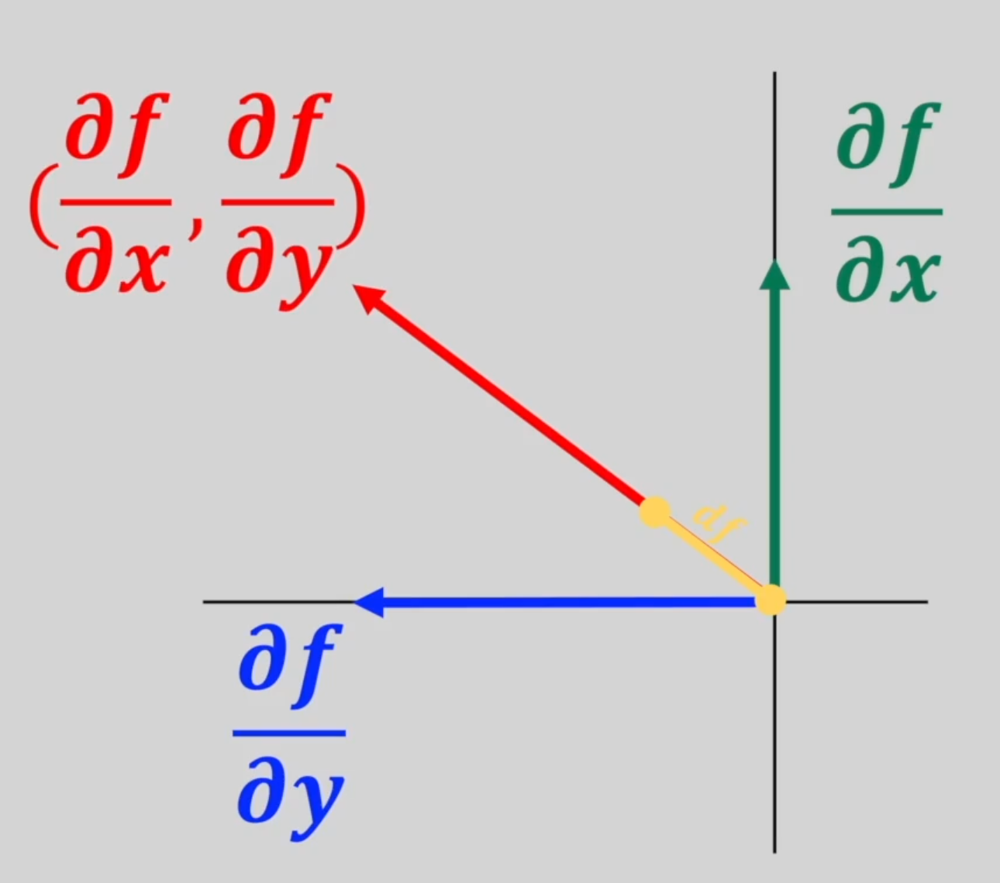
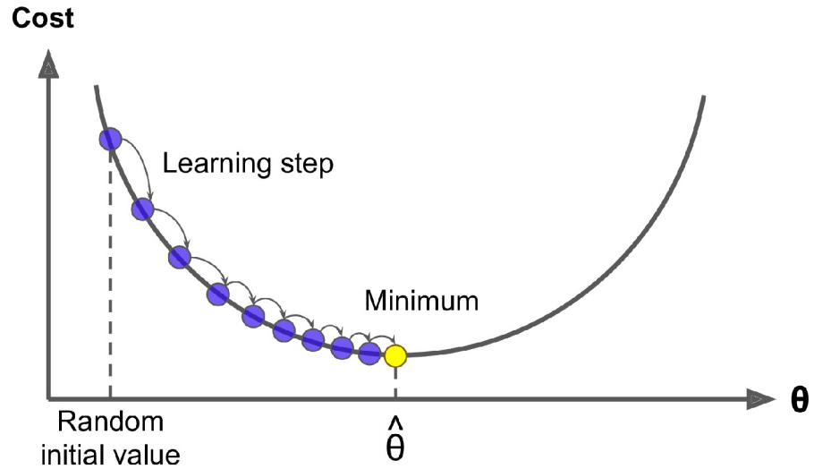
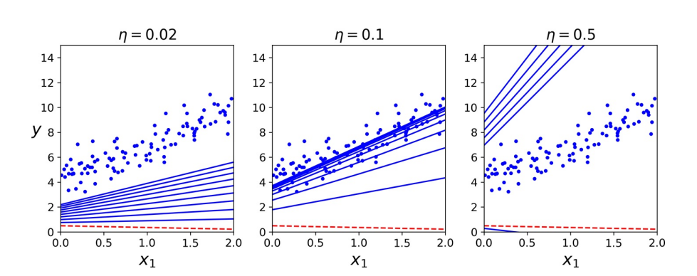
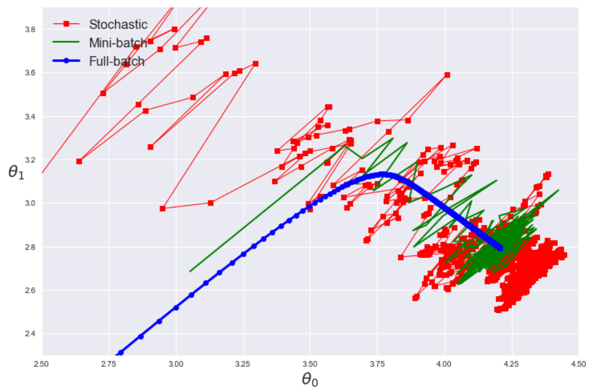

# 梯度下降

## 1. 梯度

### 1.1. 定义

梯度（gradient）是一个向量，表示某一函数在该点处的方向导数沿着该方向取得最大值，即函数在该点处沿着该方向（此梯度的方向）变化最快，变化率最大（此梯度的模）。

$$
\big(\frac{∂f}{∂x}, \frac{∂f}{∂y}\big) ⋅ (dx, dy) = df
$$

梯度原是为场论设定的，任何场都可以用来理解梯度，后来被引用到数学中用来指明函数在指定点的变量率最快的方向和大小，是一种变化效率的数字抽象。

梯度是 Jacobian 矩阵的一种特殊形式，当$m = 1$时函数的 Jacobian 矩阵就是梯度。

:::{admonition} ∇ 算子

$∇$表示某一物理量在三个坐标方向的偏导数的矢量和，即

$$
∇ = \frac∂{∂x}𝐢 + \frac∂{∂y}𝐣 + \frac∂{∂z} 𝐤
$$

:::

### 1.2. 应用

梯度下降（Gradient Descent）是一种通用的优化算法，能够找到针对各种问题的最佳解决方案。其一般思想是迭代调整参数以最小化成本函数。具体地说，梯度下降首先用随机值填充$β$，这称为随机初始化（random initialization）。然后逐步改善它，一次迈出一步，每一步都试图降低成本函数，如 MSE，直到算法收敛到最小。

梯度下降中的一个重要参数是步长，由超参数学习速率（learning rate）确定。若学习速率太小，则该算法将不得不经过多次迭代才能收敛，这将需要很长时间。另一方面，若学习速率太大，可能会跳过最小值，使算法随着值越来越大而发散。

幸运的是，线性回归模型的 MSE 恰好是凸函数（convex function），这意味着若选择曲线上的任意两个点，则连接它们的线段将永远不会穿过曲线。这意味着没有局部最小值，只有一个全局最小值。同时，它亦为一个连续函数，其斜率不会突然改变。这两个事实具有重大意义：保证**梯度下降可任意接近全局最小值**。

## 2. 原始版本

### 2.1. 全梯度下降

要实全梯度下降（Full-batch Gradient Descent，FGD），需要针对每个模型参数$β_{j}$计算成本函数的梯度：

$$
\frac∂{∂β_{j}} \mathrm{MSE}(β) = \frac{2}m ∑_{i=1}^m (β^{⊤} x_i - y_i) x_{ij}
$$

则梯度矩阵为：

$$
∇_β \mathrm{MSE}(β) =
\begin{bmatrix}
  \frac∂{∂β_0} \mathrm{MSE}(β) \\
  \frac∂{∂β_1} \mathrm{MSE}(β) \\
  ⋮ \\
  \frac∂{∂β_n} \mathrm{MSE}(β)
\end{bmatrix} = \frac{2}{m} 𝑿^{⊤}(𝑿β - y)
$$

一旦有了指向上坡的梯度向量，就向相反的方向下坡即可。这意味着从$β$中减去$∇_β \mathrm{MSE}(β)$。这就是学习速率$η$发挥作用的地方：将梯度向量乘以$η$来确定下坡步长的大小。

$$
β_{i+1} = β_i - η∇_β \mathrm{MSE}(β)
$$

对于迭代次数，若太低，当算法停止时，将远离最佳解决方案；若太高，将浪费时间，而模型参数不再更改。一个简单的解决方案是设置大量的迭代，但，在梯度向量变得很小时，即当其范数变得小于一个很小的数值$ϵ$[^1] 中断算法时，因为这种情况发生在梯度下降已经或几乎达到最小值。

此外，当成本函数为凸且其斜率不会突然改变时（如 MSE），具有固定学习率的 FGD 将最终收敛到最优解，但，可能需要等待一段时间：根据成本函数的形状，可能需要$O(1/ϵ)$迭代才能在范围内达到最佳。若将公差除以 10 以获得更精确的解决方案，则该算法可能需要运行大约 10 倍的时间。

FGD 在每个步骤都使用整批训练数据。在非常大的训练集上，它的速度非常慢。不过，梯度下降可很好地对特征数量放缩。在具有成千上万个特征的情况下训练线性回归模型，使用梯度下降比使用 SVD 要快得多。

### 2.2. 随机梯度下降

与 FGD 相反，随机梯度下降（Stochastic Gradient Descent，SGD）在每一步中从训练集中选择一个随机实例，并仅基于该单个实例来计算梯度。显然，一次处理单个实例使该算法更快，因为它每次迭代需要处理的数据很少。由于每次迭代仅需要在内存中存储一个实例，因此还可在庞大的训练集上进行训练。另一方面，由于它的随机性，该算法的规则性比 FGD 的规则性要低得多：与其逐渐降低直到达到最小值，不如逐渐降低成本函数，仅平均地降低。随着时间的流逝，它最终将非常接近最小值，但，一旦到达最小值，它将继续反弹，永不停下来。故，一旦算法停止运行，最终参数值将是良好的，但不是最佳的。

当成本函数非常不规则时，这实际上可帮助算法跳出局部最小值，故，与梯度下降相比，SGD 更有可能找到全局最小值。故，随机性可逃避局部最优，但，坏消息是它也可能意味着算法永远都不能满足最小值。解决这一难题的一种方法是**逐渐降低学习速率**。步骤从大开始，然后变得越来越小，从而使算法能够稳定在全局最小值。此过程类似于模拟退火（simulated annealing）。

SGD 已成功应用于文本分类和自然语言处理中经常遇到的大规模稀疏机器学习问题。考虑到数据稀疏，常见 SGD 分类器可轻松解决超过$10^5$个训练实例和$10^5$个以上特征的问题。

注意，由于实例是随机选取的，因此某些实例可能每个迭代期（epoch）被选取几次，而其他实例则可能根本不被选取。若要确保算法在每个时期遍历每个实例，则另一种方法是对训练集进行洗牌（确保对特征和标签都进行洗牌），然后逐个实例对其进行遍历，然后对其进行再次洗牌，依此类推。但这种方法通常收敛较慢。

> 现在的 SGD 一般指小批量梯度下降（Mini-batch Gradient Descent）。

### 2.3. 注意事项

- 前处理
  - 预先对数据进行标准化，以加快训练速度
  - 训练实例必须**独立同分布**，以确保平均而言将参数拉向全局最优值。
    - 训练过程中对实例进行洗牌。
- 缺点
  - 选择合适的学习率比较困难。对于稀疏数据或者特征，有时我们可能想更新快一些对于不经常出现的特征，对于常出现的特征更新慢一些，这时候 SGD 就不太能满足要求了
  - SGD 容易收敛到局部最优，并且在某些情况下可能被困在鞍点

## 3. 反向传播
