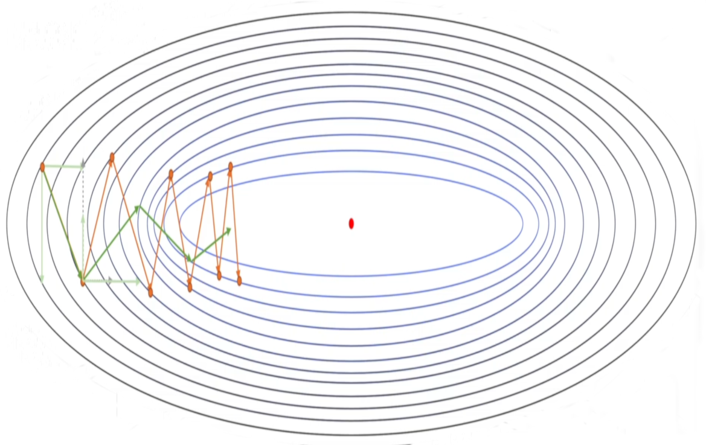
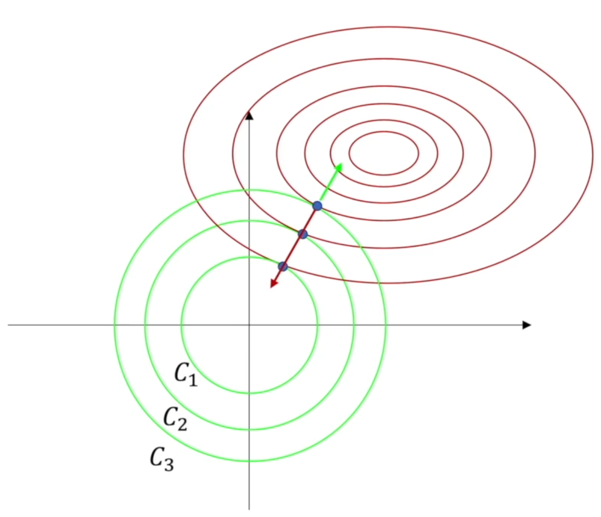
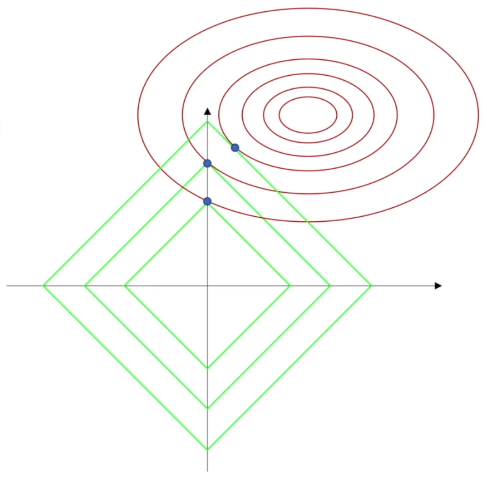
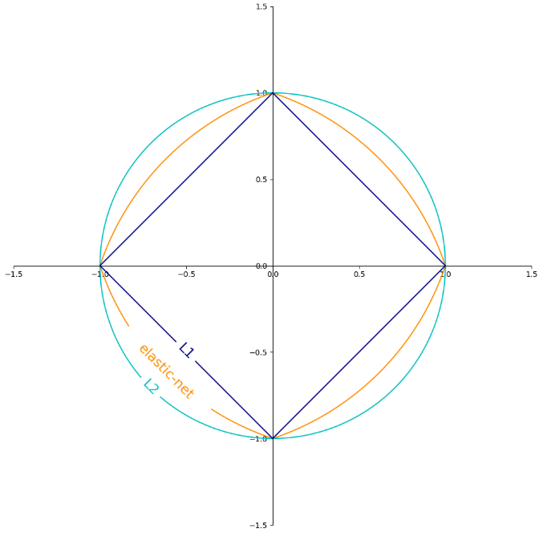
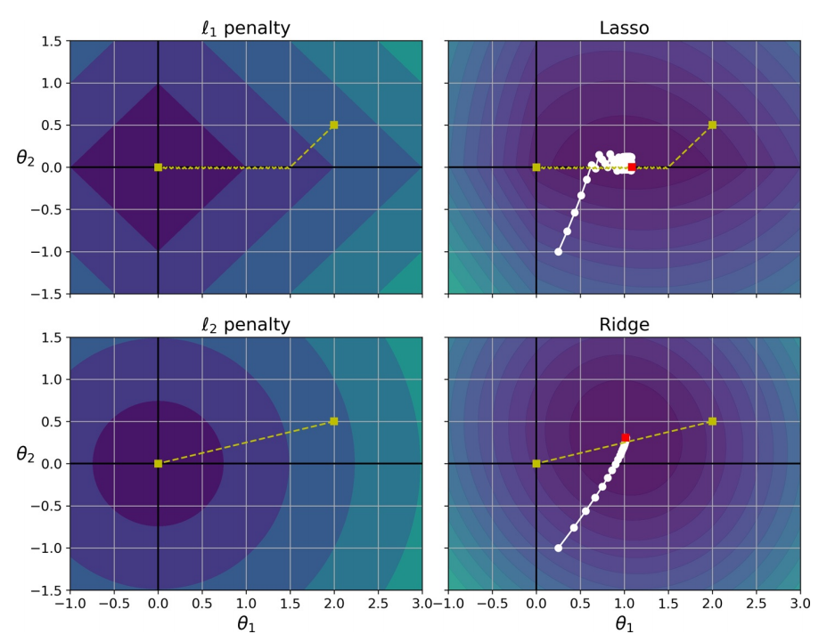

# 梯度下降优化

随机梯度下降需要的计算量很大，现在的计算机是没有办法承担这个量的，所以需要对梯度下降法进行优化，使其以更少的计算实现差不多的效果。

优化梯度下降法，大概有两个思路：

- 调整神经网络结构
  - 增加池化层
  - Dropout
- 对梯度下降法本身上进行优化

随机梯度下降法是一个凸问题，可表述为

$$
f(x^{(k)}) - f^{*} = O\big(\frac{1}{\sqrt{k}}\big)
$$

其中，$k$为迭代次数，$f^{*}$代表极值点。

经过$k$次训练过后，最后随机梯度下降法能达到的误差是根号$k$分之一这个量级的，这个和标准梯度下降法没有特别大的差别，所以不如直接使用随机梯度下降法。若是强凸问题，收敛的还会更快。

## 1. 抑制震荡

SGD 的一个显著特征是，梯度往往在一个方向上向前，而另一个方向上震荡，若能抑制住震荡，就能更为高效地使梯度收敛。

### 1.1. 动量法

由 SGD

$$
θ_{(t)} = θ_{(t-1)} - 𝑱
$$

这里，令

$$
Δθ_{(t) i} = \frac{∂J(θ_{(t-1) i})}{∂θ_i}
$$

则有

$$
θ_{(t) i} = θ_{(t-1) i} - θ_{(t) i}
$$

引入动量（momentum）来代替之前的梯度，令

$$
\begin{aligned}
  𝑽_{(t)} &= 𝑽_{(t-1)} + θ_{(t) i}\\
  &= \underbrace{θ 𝑽_{(t-1)}}_{偏导的 0 次项} + \underbrace{(1 - θ )⋅Δθ_{(t) i}}_{偏导的 1 次项}
\end{aligned}
$$

> 这里使用了指数加权移动平均法（exponentially weighted moving average，EWMA），其表示各数值的加权系数随时间呈指数式递减，越靠近当前时刻的数值加权系数就越大。

于是有

$$
θ_{(t) i} = θ_{(t-1) i} - v_{(t)}
$$

- 下降初期时，使用上一次参数更新，下降方向一致，乘上较大的能够进行很好的加速。
- 下降中后期时，在局部最小值来回震荡的时候，使得更新幅度增大，跳出陷阱。
- 在梯度改变方向的时候，动量项能够在相关方向加速 SGD，抑制振荡，从而加快收敛。

### 1.2. Nesterov

Nesterov 加速（Nesterov accelerated gradient，NAG）在动量法的基础上，提前引入动量项$𝑽_{(t-1) i}$。

$$
Δθ_{(t) i} = \frac{∂J(θ_{(t-1) i} + γ𝑽_{(t-1) i})}{∂θ_i}
$$

## 2. 自适应

### 2.1. Adagrad

2012 年，AlexNet 引入的 Adagrad 是梯度下降的现代路径优化方法的开端。Adagrad 其实是对学习率进行了一个约束。即：

$$
θ_{(t) i} = θ_{(t-1) i} - \frac{η}{\sqrt{𝑺_{(t)} + ϵ}}⋅Δθ_{(t) i}
$$

其中，$𝑺_{(t)}$为历史上所有梯度的平方再开方，即

$$
\begin{cases}
  𝑺_{(t)} &= 𝑺_{(t-1)} + Δθ_{(t) i}⋅ Δθ_{(t) i}\\
  \\
  Δθ_{(t) i} &= \dfrac{∂J(θ_{(t-1) i})}{∂θ_i}
\end{cases}
$$

此处，$ϵ$对从 1 到进行一个递推形成一个约束项正则化因子，保证分母非 0。

### 2.2. RMSprop

当 Adagrad 经过平台区域，由于其考虑所有历史数据，其收敛速度将难以得到提升，RMSprop 结合 EWMA，选择性地考虑较近的历史数据，使经过平台区后，梯度收敛速度能在非平台区得到恢复。

$$
\begin{cases}
  𝑺_{(t)} &= θ 𝑺_{(t-1)} + (1 - θ )Δθ_{(t) i}⋅ Δθ_{(t) i}\\
  \\
  θ_{(t) i} &= θ_{(t-1) i} - \frac{η}{\sqrt{𝑺_{(t)} + ϵ}}⋅Δθ_{(t) i}
\end{cases}
$$

### 2.3. Adam

Adam 在 RMSprop 基础上进一步结合了动量法

$$
\begin{cases}
  𝑺_{(t)} &= θ_1 𝑺_{(t-1)} + (1 - θ_1 )Δθ_{(t) i}⋅ Δθ_{(t) i}\\
  𝑽_{(t)} &= θ_2 𝑽_{(t-1)} + (1 - θ_2 )⋅Δθ_{(t) i}\\
  θ_{(t) i} &= θ_{(t-1) i} - \frac{η}{\sqrt{𝑺_{(t)} + ϵ}}⋅𝑽_{(t)}
\end{cases}
$$

## 3. 参数正则化

由最开始部分的偏差 - 方差权衡，可知

- 模型越大，则样本内误差越小，但是参数的误差可能会很大：若使用高阶的多项式，样本点的一个小小的扰动都会使得估计出的模型参数有非常大的变化
- 模型越小，样本内的均方误差会大一些，但是参数的均方误差可以变的比较小：每个维度的数据点很少，观察中的噪声便会导致高方差，即精确度下降

凡是可以减少泛化误差，而不是减少训练误差的方法均可称为正则化（regularization）。这里的正则化，指的是**收缩估计**（shrinkage estimation），其通过引入 Lₚ 范数作为惩罚项，限制模型规模，降低模型（参数，即权重）的误差，从而提高样本外的预测效果，防止过拟合。

### 3.2. 岭回归

岭回归（Ridge Regression），也叫 Tikhonov 正则化或 ℓ2 正则化，其惩罚项使用 L_2 范数，即

$$
\begin{aligned}
J(θ) &= \mathrm{MSE}(θ) + \fracλ2 ∑θ_i^2\\
&= \mathrm{MSE}(θ) + \fracλ2 ∥θ∥_2^2
\end{aligned}
$$

其中，$λ ⩾ 0$是一个控制收缩量的超参数：$λ$的值越大，收缩量越大。截距项$θ_0$用于测量当$x_{i1} = x_{i2} = … = x_{ip} = 0$时响应特征的均值，所有不会受到惩罚。设$X$的列在 Ridge 之前已经中心化，均值为 0，则截距项估计值为

$$
\hat{θ}_0 = ȳ = ∑y_i / n
$$

系数向量为：

$$
\hat{θ} = (𝑿^{⊤}𝑿 + λ𝑰)^{-1} 𝑿^{⊤}y
$$

> 实际上，$𝑰$可以是任意实正定矩阵

其中，

$$
𝑿^{⊤}𝑿 + λ𝑰 =
\begin{bmatrix}
x_{11} + λ & x_{12} & x_{13} & ⋯ & x_{1n} \\
0 & x_{22} + λ & x_{23} & ⋯ & x_{2n} \\
0 & 0 & x_{33} + λ & ⋯ & x_{3n} \\
⋮ & ⋮ & ⋮ & ⋱ & ⋮ \\
0 & 0 & 0 & ⋯ & λ
\end{bmatrix}
$$

最后得到的行列式已经不存在全 0 行或全 0 列了，除非以下两种情况，否则矩阵$𝑿^{⊤}𝑿 + λ𝑰$永远都是满秩

- $λ = 0$
- 原矩阵$𝑿^{⊤}𝑿$存在对角线上元素为$λ$，且其他元素都为 0 的行或列

当特征个数$p$和实例个数$n$差不多时，OLS 估计方差会很大；当$p>n$，OLS 没有唯一解，此时可考虑使用 Ridge。

由下图，$λ$控制着 L_2 范数所代表的集合（圆）的**半径**，其作用是进行**等值缩减**，使损失函数的梯度和惩罚项的梯度之和为 0。

此前曾提到，OLS 权重是标度不变的（scale invariant）：无论第$j$个预测器按什么比例变化，$X_{j}θ_{j}$保持不变。但 Ridge 会受到很大影响。故，在使用 Ridge 前必须进行**标准化**。

> 若特征未按比例缩放，则正则化模型可能会收敛至次优解决方案：由于正则化会惩罚较大的权重，因此与具有较大值的特征相比，具有较小值的特征往往会被忽略。

### 3.3. 套索回归

然而，Ridge 最终还是会包含全部$p$个特征，且，其惩罚项进行的是**等比缩减**，不会把任何一个特征的系数确切地收缩到 0（除非$λ = ∞$，整个模型只剩下常数项）。这种设定不影响预测精度，但当$p$非常大时，不便于模型的解释。最小绝对收缩和选择算子回归（Least Absolute Shrinkage and Selection Operator Regression，Lasso Regression），也叫套索回归或 ℓ1 正则化，是一种弥补此缺陷的方法，它倾向于选择具有较少参数值的解决方案，从而有效地减少给定解决方案所依赖的特征的数量：

$$
\begin{aligned}
J(θ) &= \mathrm{MSE}(θ) + λ∑|θ_i|\\
&= \mathrm{MSE}(θ) + λ∥θ∥_1
\end{aligned}
$$

> 在 Lasso 中，正则化系数$λ$无法对矩阵 造成任何影响，即 Lasso 无法解决特征之间 "精确相关"的问题。

现实中，数据量大且很复杂，很难遇到"精确相关的问题"，因此假设矩阵$𝑿^{⊤}𝑿$的逆存在，则

$$
\hat{θ} = (𝑿^{⊤}𝑿θ)^{-1}\big(𝑿^{⊤}𝒚 - \frac{λ𝑰}2\big)
$$

可以通过增大$λ$而限制参数估计中的$\hat{θ}$的大小，而防止多重共线性引起的参数 被估计过大导致模型失准的问题。Lasso 不是从根本上解决多重共线性问题，而是限制多重共线性带来的影响。

由下图，L_1 范数的作用是进行**等值缩减**。当$λ$足够大时，L_1 范数所代表的集合与损失函数的交点很容易在坐标轴上，这意味某一特征的权重被削减为 0，Lasso 建立起的是一个**稀疏模型**，只包含所有特征的一个子集，故更容易解释。。

> Lasso 及其变体是收缩传感领域的基础。在某些条件下，它可恢复精确的非零权重集。

可证明，上述两种回归的权重分别等价于求解：

$$
\begin{aligned}
\min_θ(\mathrm{RSS}) &s.t. ∑_{j=1}^p θ*j^2 ⩽ s
\\
\min_θ(\mathrm{RSS}) &s.t. ∑_{j=1}^p |θ_{j}| ⩽ s
\end{aligned}
$$

这就等同于在满足至多$s$个系数不为 0 的条件下，寻找使得$\mathrm{RSS}$最小的系数。

### 3.4. 弹性网络

弹性网络（Elastic Net）是介于 Ridge 回归和 Lasso 回归之间的中间地带。正则项是 Ridge 和 Lasso 的正则项的简单混合。设混合比为$r$。当$r = 0$时，弹性网络等效于 Ridge 回归，而当$r = 1$时，弹性网络等效于 Lasso 回归：

$$
J(θ) = \mathrm{MSE}(θ) + r λ ∑|θ_i|+ \frac{1 - r}2 λ∑θ_i^2
$$

通常，弹性网络优于 Lasso，因为当特征的数量>训练实例的数量或多个特征紧密相关时，Lasso 的行为可能会不稳定。

### 3.5. 衰减角度

设$θ$为原损失函数中的权重，$J(θ^{*})$为原损失函数中最值点的权重，则对岭回归有

$$
\begin{aligned}
J(θ) &≈ J(θ^{*}) + ∇\_{θ} J(θ^{*})(θ - θ^{*}) + \frac{1}{2}(θ - θ^{*})^{⊤} 𝑯(θ - θ^{*})\\
&= J(θ^{*}) + \frac{1}{2}(θ - θ^{*})^{⊤} 𝑯(θ - θ^{*})
\end{aligned}
$$

其中，$𝑯$为 Hessian 矩阵。

可得

$$
∇\_{θ}J(θ) = 𝑯(θ - θ^{*})
$$

又令正则化后的损失函数为$Ĵ(θ)$，即

$$
Ĵ(θ) = J(θ^{*}) + \frac{1}{2}(θ - θ^{*})^{⊤} 𝑯(θ - θ^{*}) + \frac{α}2 θ^{⊤} θ
$$

可得

$$
∇_θĴ(θ) = 𝑯(θ - θ^{*}) + αθ
$$

联立，可得

$$
\begin{aligned}
\hat{θ} &= (𝑯 + α⋅𝑰)^{-1} 𝑯⋅θ^{*} \\
&= (𝑸𝜦𝑸^{⊤} + α⋅𝑰)^{-1} 𝑸𝜦𝑸^{⊤} ⋅ θ^{*} \\
&= 𝑸(𝜦 + α⋅𝑰)^{-1} 𝜦𝑸^{⊤} ⋅ θ^{*}
\end{aligned}
$$

> 此处用到了，Hessian 矩阵为对称阵的性质和相似矩阵。

即

$$
\hat{θ}_i = \frac{λ_i}{λ_i + α}⋅θ_i^{*}
$$

对套索回归，假设数据经过了 PCA 预处理，此时$𝑯$为对角阵，

$$
\begin{aligned}
Ĵ(θ) &= J(θ^{*}) + \frac{1}{2}(θ - θ^{*})^{⊤} 𝑯(θ - θ^{*}) + α ∥θ∥_1 \\
&= J(θ^{*}) + ∑_i^n(\frac{1}{2} 𝑯_{i, i} ⋅(θ_i - θ_i^{*})^2+ α ∥θ_i∥)
\end{aligned}
$$

求导得

$$
\hat{θ}_i = θ_i^{*} - \frac{α ⋅ \mathrm{sign}(\hat{θ}\_i)}{𝑯_{i, i}}
$$

即

$$
\begin{aligned}
\hat{θ}_i &=
\begin{cases}
θ_i^{*} - \frac{α}{𝑯_{i, i}} &
θ*i^{*} ∈ (\frac{α}{𝑯_{i, i}}, ∞) \\
θ*i^{*} + \frac{α}{𝑯_{i, i}} & θ*i^{*} ∈ (-∞, -\frac{α}{𝑯_{i, i}}) \\
0 & θ*i^{*} ∈ (-\frac{α}{𝑯_{i, i}}, \frac{α}{𝑯_{i, i}})
\end{cases}
\\
&= \mathrm{sign}(θ_i^{*})⋅\max \{|θ_i^{*}| - \frac{α}{𝑯_{i, i}}, 𝟎\}
\end{aligned}
$$

## 4. 调参策略

### 4.1. 坐标轴下降法

Lasso 因其损失函数不是连续可导的，因此梯度下降法、牛顿法就没法用了。坐标轴下降法是一种迭代算法，与梯度下降法利用目标函数的导数来确定搜索方向不同，坐标轴下降法是在当前坐标轴上搜索函数最小值，不需要求目标函数的导数。

凸函数$J(θ)$有$n$个参数向量$θ_i$。令参数向量$θ_i$为$p$维向量，即对于每个参数向量有$θ=(θ_1, θ_2, ⋯, θ_p)$固定$(p-1)$个参数，计算剩下的那个参数使得凸函数$J(θ)$达到最小的点，$p$个参数都来一次，就得到了该次迭代的最小值点。

### 4.2. 降低学习率

为了避免使用 Lasso 时梯度下降最终在最佳值附近反弹，需要在训练过程中**逐渐降低学习速率**（它仍然会在最佳值附近反弹，但，步长会越来越小，因此会收敛）。另外，Lasso 成本函数在$θ_i = 0 (i = 1，2，…，n)$时是不可微的，但，若您使用次梯度向量（sub-gradient vector）代替任何$θ_i = 0$，则梯度下降仍然可有效：

$$
g(θ, J) = ∇_θ \mathrm{MSE}(θ) + λ
\begin{bmatrix}
\mathrm{sign}(θ_1) \\
\mathrm{sign}(θ_2) \\
⋮ \\
\mathrm{sign}(θ_n)
\end{bmatrix}
$$

其中，

$$
\mathrm{sign}(θ_i) =
  \begin{cases}
  -1 & θ_i < 0 \\
  0 & θ_i = 0 \\
  +1 & θ_i > 0
  \end{cases}
$$

### 4.3. 早停

早停（early stopping）指一旦验证误差达到最小值，就停止训练。使用 SGD 时，曲线不是则平滑，且可能很难知道是否达到了最小值。一种解决方案是仅在验证误差超过最小误差一段时间后（当确信模型不会做得更好时）停止，然后将模型参数回滚到验证误差最小的点。

梯度下降法并不一定是全局下降最快的方向，它只是目标函数在当前的点的切平面（或超切平面）上下降最快的方向。在实际应用中，牛顿方向（考虑 Hessian 矩阵）才一般被认为是下降最快的方向。

## 5. 网络结构正则化
