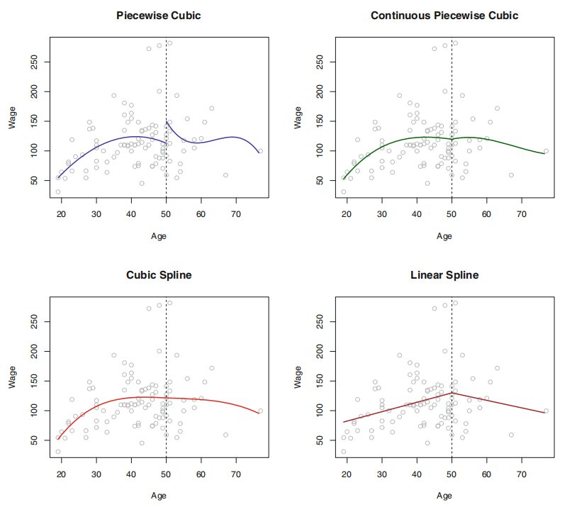

# 非线性分类

## 1. 多项式回归

### 1.1. 模型推导

当数据关系不是线性的，可尝试多项式回归（polynomial regression）来进行拟合，简单说，就是将线性模型推广至如下多项式形式

$$
y_i = β_0 + ∑_{j=1}^d β_{j} x_i^j + ϵ_i
$$

其中，通常选择$d<4$。

### 1.2. 阶梯函数

在线性模型中使用特征变量的多项式形式作为预测器可得到$X$在取值空间全局皆非线性的拟合函数。若不希望得到全局的模型，可使用阶梯拟合（step fitting）。这里，把$X$的取值范围分成一些区间，每个区间拟合不同的常数，这相当于将一个连续的变量变换成一个有序的分类变量。即在$X$取值空间上创建分割点$c_1, c_2, …, c_k$，构造$K + 1$个新变量：

$$
\begin{aligned}
  C_0(X) &= I(X < c_1) \\
  C_1(X) &= I(c_1 ⩽ X < c_2) \\
  C_2(X) &= I(c_2 ⩽ X < c_3) \\
  &\ ⋮ \\
  C_{K - 1}(X) &= I(c_{K - 1} ⩽ X < c_k) \\
  C_k(X) &= I(c_k ⩽ X)
\end{aligned}
$$

其中，$I(⋅)$为示性函数（indicator function）。当条件成立时返回 1 反之返回 0。这样定义的变量也被称为哑变量（dummy variables）。对$∀X$，$C_0(X) + C_1(X) + … + C_k(X) = 1$。以$C_1(X), C_2(X), …, C_k(X)$为预测器用 OLS 拟合线性模型

$$
y_i = β_0 + ∑_{j=1}^k β_{j} C_{j}(x_i) + ϵ_i
$$

对于$X$的一个给定值，$C_{j}(X)$中之多有一项系数非 0。

- $X ∈ (-∞, c_1)$时，每个变量都为 0, 故$β_0$即为$X < c_1$时的$Y$的均值。
- $X ∈ (c_{j}, c_{j+ 1})$时，预测值为$β_0 + β_{j}$，故$β_{j}$可被解释为当$X$由$c_1$增加至$(c_{j}, c_{j+ 1})$时，响应变量的平均增量。

### 1.3. 基函数

阶梯函数实际上是一类特殊的基函数（basis function）方法。其基本原理是对变量$X$的函数或变换$b_1(X), b_2(X), …, b_k(X)$进行建模：

$$
y_i = β_0 + ∑_{j=1}^k β_{j} b_{j}(x_i) + ϵ_i
$$

其中，基函数$b_1(⋅), b_2(⋅), …, b_k(⋅)$的值是给定的且已知的。

## 2. 样条

### 2.1. 回归样条

样条（spline）是一类光滑的基函数。对于如下分段多项式，其系数$β_{j}$在不同区域内变化的临界点被称为结（knot）。在对如下三次多项式的拟合中，为了消除阶跃，需要使在 `Age=50` 处的一阶导数，二阶导数均是连续的，而每次施加的约束都会有效释放 1 个自由度，减少模型的复杂性，这样的样条通常被称为三次样条（cubic spline）。一般情况下，与$K$个结点一同使用的三次样条会产生$K+4$个自由度。

但，保证多项式本身和其前$d-1$阶导数均是连续的条件下拟合$d$阶分段多项式很多时候并不轻松。使用基函数表示回归样条，并通过选择合适的基函数$b_1, b_2, …, b_{K+3}$，一个有$K$个结点的三次样条函数可表示如下

$$
y_i = β_{0} + ∑_{j=1}^{K+3} β_{j} b_{j}(x_i) + ϵ_i
$$

这个等式可选择不同的基函数得到等价的三次样条。其中，最直接的方法是先以三次多项式的基$x, x^2, x^3$为基础，然后在每个结点添加 1 个截断幂基（truncated power basis，TPB）函数。TPB 可定义为

$$
h(x, ξ) = (x -ξ)₊^3 =
  \begin{cases}
  (x - ξ)^3 & \mathrm{if} \ x > ξ \\
  0 & \mathrm{otherwise}
  \end{cases}
$$

其中，$ξ$是结点。而考虑到一些情况下，样条在预测器之外的区域会有较大的方差，自然样条（natural spline）附加了边界约束：函数在边界区域应该是线性的。

对于结点个数和位置的选择，通常使用交叉验证的方法：先移除一部分数据，然后用其余的数据来拟合样条函数，接着用拟合得到的样条函数来对移除的那部分数据做预测。不断重复直到所有数据都被移除过一次，最后计算整体交叉验证$\mathrm{RSS}$，选择$\mathrm{RSS}$最小的样条函数对应的$K$。

### 2.2. 光滑样条

为了对给定数据拟合光滑曲线，需要找到一个函数$g(x)$，使$\mathrm{RSS} = ∑(y_i - g(x_i))^2$最小。但，若不对$g(x)$添加任何约束条件，只要选择$g(x)$在每个$y_i$处插值，就能得到一个取值为 0 的$\mathrm{RSS}$。为避免这一点，可引入惩罚项

$$
∑(y_i - g(x_i))^2 + λ∫g^{″}(t)^2 dt
$$

其中，$λ$是超参数。该式利用二阶导数度量曲线的粗糙度，并对波动性进行惩罚。在每个结点处的一阶导数，二阶导数连续，同时其在边界的结点之外的区域是线性的。

$λ$还控制着样条的有效自由度。后者定义稍显复杂，令

$$
ĝ_{λ} = S_{λ} {y}
$$

其中，$ĝ$是一个关于$λ$的特别解，即$ĝ$是一个$n$维向量，其元素是训练集$x_1, …, x_n$对应的光滑样条的拟合值。于是，有效自由度的定义即

$$
d f_{λ} = ∑\{S_{λ}\}_{ii}
$$

即，有效自由度是矩阵$S_{λ}$的迹。而利用如下式子可有效计算光滑样条的 LOOCV 误差。

$$
\begin{aligned}
  \mathrm{RSS}_{c v}(λ)
  &= ∑(y_i - ĝ_{λ}^{-i}(x_i))^2 \\
  &= ∑\big[\frac{y_i - ĝ_{λ}(x_i)}{1 - \{S_{λ}\}_{ii}} \big]^2
\end{aligned}
$$

这里的$ĝ_{λ}^{-i}(x_i)$指光滑样条在$x_i$的拟合值，其计算过程使用的是剔除实例$(x_i, y_i)$外的所有训练实例。相反地，$ĝ_{λ}(x_i)$指的是光滑样条用所有的训练数据拟合的结果。

### 2.3. 局部回归

局部回归是对一个目标点拟合时，仅使用其附近的训练实例的一种方法。其算法如下

:::{admonition} 步骤

1。选取占所有数据的比例为$s = k/n$的最靠近目标点$x_0$的数据$x_i$
2。对选出的数据点赋予其权重$K_{i0} = K(x_i, x_{0})$。离$x_0$最远的点的权重为 0，最近的最高，没有被选中的为 0。
3。用定义好的权重在$x_i$处拟合加权 OLS，即对下式最小化

$$
∑K_{i0}(y_i - β_0 - β_1 x_i)^2
$$

4。根据$f̂(x_0) = \hat{β}_0 + \hat{β}_1 x_0$得到$x_0$的拟合结果。

:::

## 3. 最近邻

最近邻方法（Nearest Neighbor）背后的原理是找到距离新点最近的预定义数量的训练样本，并从这些预测标签中预测标签。样本的数量可是用户定义的常数（_k_-最近邻学习），或基于点的局部密度（基于半径的近邻学习）而变化。通常，距离可是任何度量标准。基于近邻的方法被称为非泛化机器学习方法，也叫消极学习（lazy learning）。因为它们只是"记住"其所有训练数据（可能变换为快速索引结构，例如**Ball Tree**或**KD Tree**）。

最近邻学习不是在整个样本空间上一次性地估计目标函数，而是针对每个待测样本作出局部的目标函数逼近。当目标函数很复杂，但它可用不太复杂的局部函数来逼近，这样做有非常明显的优势。作为一种非参数方法，它通常在决策边界非常不规则的分类情况下是成功的。

最近邻学习的思想非常简单：给定待测样本，首先基于某种近邻索引方法找出训练集中与其最靠近 的$k$个样本，然后基于这$k$个样本的后验概率来预测 待测样本的类标记。具体算法分为两个阶段

- 训练阶段：将每个训练样本保存起来
- 工作阶段：
  - 给定一个待测样本
  - 基于某种近邻索引方法找出训练样本集中与其最靠近$k$ 个样本
  - 基于这$k$个训练样本的后验概率来预测待测样本的类标记

> 关于最近邻算法，若两个邻居具有相同的距离但不同的标签，结果将取决于训练数据的排序。

### 3.1. 最近邻分类

`KNeighborsClassifier` 中的 $k$-近邻分类是最常用的技术。$k$的最佳选择高度依赖于数据：通常，较大的$k$会抑制噪声的影响，但会使分类边界变得不则明显。

在数据未被均匀采样的情况下，`RadiusNeighborsClassifier` 中基于半径的最近邻分类可能是更好的选择。用户指定固定半径$r$，使得较稀疏的邻域中的点使用较少的最近邻进行分类。对于高维参数空间，由于所谓的"维度诅咒"，该方法变得不则有效。

基本近邻分类使用**均匀权重**：即，分配给查询点的值是从最近邻的简单多数投票计算的。在某些情况下，最好对最近邻进行加权，以使较近的最近邻对拟合做出更多贡献。

### 3.2. 最近邻回归

基于近邻的回归可用于数据标签是连续的而不是离散的变量的情况。分配给查询点的标签是根据其最近邻居的标签的均值计算的。

### 3.3. 距离索引

最近邻学习的所有计算几乎都花费在索引近邻问题上。故，如何有效地索引近邻样本，以减少分类时所需计算是一个重要的实践问题。

目前，使用最多的近邻索引方法就是通过计算待测样本与每个训练样本之间的距离，然后基于距离排序，选择距离最短的$K$个训练样本作为待测样本的最近邻样本。因此如何度量样本点之间的距离就变得非常重要了。

为度量样本点之间的距离，学者们提出了许多经典的距离度量函数。根据样本点的数据类型划分，主要有

- 连续属性：Euclidean 距离，Manhattan 距离等
- 离散属性：Overlap Metric 距离，Value Difference Metric 距离等
- 混合属性：HEOM 距离（Heterogeneous Euclidean -Overlap Metric），HVDM（Heterogeneous Value Difference Metric）等

### 3.4. 树型索引

- KD Tree

KD-Tree 数据结构（K 维树的简称）把训练样本存储在树的叶子节点上，邻近的样本存储在相同或相近的叶子节点上，然后通过测试待测样本在内部节点上的划分属性把待测样本划分到相关的叶子节点上。

这种方法因为树的构建是在训练阶段进行的，故比基于距离排序的索引方法所需的计算量要小得多。但如何构建有效的树成了另外一个需要解决的问题。

- Ball Tree

为了解决更高维度的 KD 树的低效问题，开发了球树数据结构。在 KD 树沿 Cartesian 轴分割数据的地方，球树在一系列嵌套超球体中划分数据。这使得树构造比 KD 树的构建成本更高。但，导致数据结构在高度结构化的数据上非常有效，即使在非常高的维度上亦为如此。

## 4. 最近邻改进

### 4.1. 维度 & 邻域

前面讲到的许多学习方法，如决策树学习，只测试部分属性就可作出判断，而最近邻学习中样本间的距离是根据样本的所有属性来计算的。若目标函数仅依赖于很多属性中的几个时，样本间的距离会被大量不相关的属性所支配，从而导致相关属性 的值很接近的样本相距很远。

解决维度诅咒的常用方法主要包括

- 属性加权
- 属性选择

另一个很重要的参数，那就是邻域的大小，即最近邻样本的数目$k$，最近邻学习的预测结果与$k$的大小密切相关。同样的数据，$k$值不同可能导致不同的预测结果。

目前对于$k$值的选取主要有两种办法

- 基于经验直接给定
  - 选择较小的$k$值，相当于用较小的领域中的训练实例进行预测，$k$值的减小就意味着整体模型变得复杂，容易过拟合；
  - 选择较大的$k$值，相当于用较大领域中的训练实例进行预测，$k$值的增大就意味着整体的模型变得简单，容易欠拟合；
- 基于数据自动学习

### 4.2. 最近质心法

`NearestCentroid` 分类器通过其成员的质心来表示每个类。实际上，这使得它类似于 `sklearn.KMeans` 算法的标签更新阶段。它也没有选择的参数，使其成为一个很好的基线分类器。但，它确实受到非凸类以及类具有完全不同的方差的影响，因为设所有维度都存在相等的方差。

`NearestCentroid` 分类器具有 `shrink_threshold` 参数，该参数实现最近的缩小的质心分类器。实际上，每个质心的每个要素的值除以该要素的类内方差。然后通过 `shrink_threshold` 减小特征值。最值得注意的是，若特定特征值过零，则将其设置为零。实际上，这会消除该功能影响分类。这很有用。例如，用于删除噪音特征。

### 4.3. 后验 & 偏置

给定待测样本的$k$个最近邻样本，估计其后验概率的常用方法包括

- 投票法
- 加权投票法
- 局部概率模型法

当计算得到的后验概率出现相同的情况下，可使用随机分类或拒判的方法进行处理。

在计算后验概率的过程经常会使用一些常用的概率估计方法

- 基于频率的最大似然估计
- LaPlace 估计
- 基于相似度（距离）加权的 LaPlace 估计
- 朴素贝叶斯估计

最近邻学习的归纳偏置是：在输入空间上相近的样本点具有相似的目标函数输出。即，一个待测样本的类标记与它在输入空间中相邻的训练样本的类标记相似。

有效的距离度量方法可在一定程度上缓解归纳偏置问题，如属性加权的距离度量方法。

## 5. 核函数

### 5.1. Hermitan 矩阵

若一个矩阵的共轭转置矩阵和自己相等，即

$$
𝑨^{H} = 𝑨
$$

称此矩阵为 Hermitan 矩阵。

若矩阵$𝑨$是实矩阵，则满足$𝑨^{⊤} = 𝑨$的矩阵即为 Hermitan 矩阵。

### 5.2. Rayleigh 商

$$
R(𝑨, 𝒙) = \frac{𝒙^{H} 𝑨𝒙}{𝒙^{H} 𝒙} ∈ [λ_{\min}, λ_{\max}]
$$

其中，$x$为非零向量，$𝑨$为$n$阶 Hermitan 矩阵，$λ$为矩阵$𝑨$的特征值

当向量$𝒙$是标准正交基时，即满足$𝒙^{H} 𝒙 = 1$时，Rayleigh 商退化为$R(𝑨, 𝒙) = 𝒙^{H}𝑨𝒙$，这个形式在频谱聚类和 PCA 中都有出现。

- 广义 Rayleigh 商

$$
R(𝑨, B, x) = \frac{𝒙^{H} 𝑨𝒙}{x^{H} Bx}
$$

其中，$𝒙$为非零向量，$𝑨$为$n$阶 Hermitan 矩阵

当$𝑩$为正定矩阵

$$
R(𝑨, 𝑩, 𝒙) ∈ \big[λ(𝑩^{-1}𝑨)_{\min}, λ(𝑩^{-1/2}𝑨𝑨 𝑩^{-1/2})_{\max} \big]
$$
