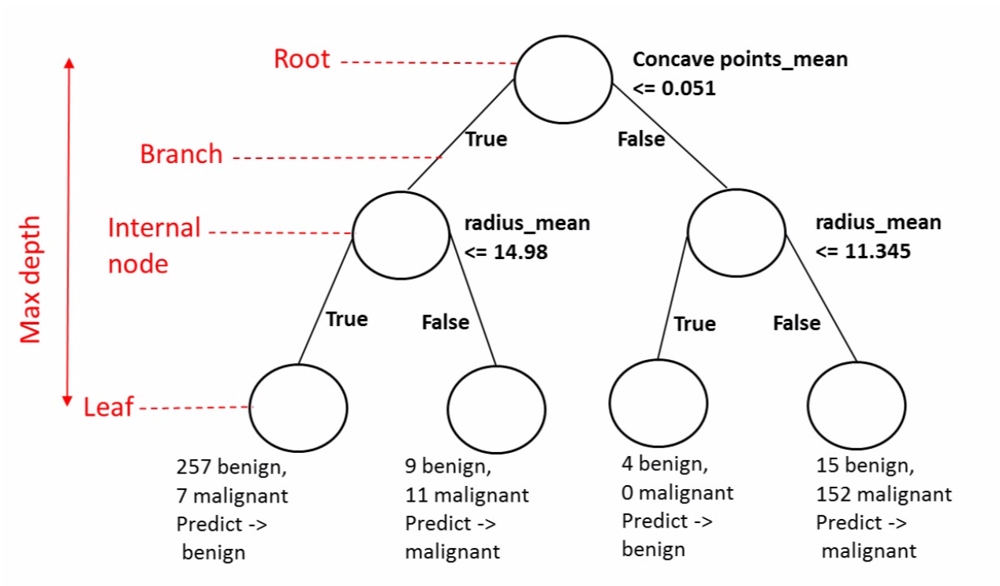
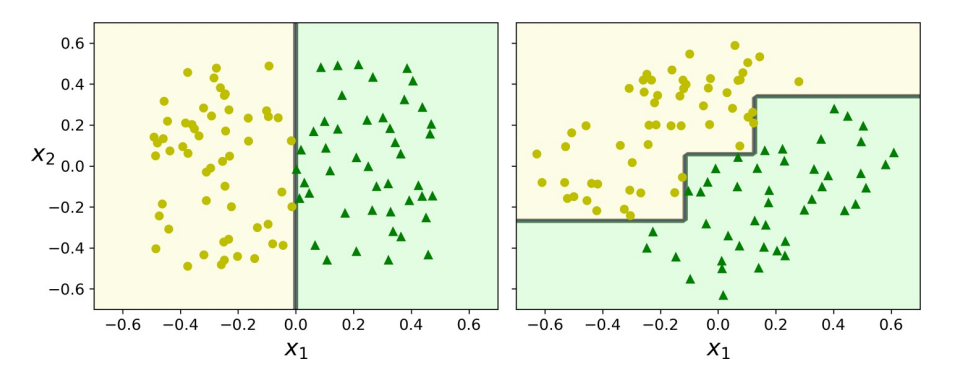

# 决策树

## 1. 广义可加模型

### 1.1. GAM 回归

对多元线性模型的非线性关系的预测

$$
y_i = θ_0 + ∑_{j=1}^p θ_j x_{ij} + ϵ_i
$$

可使用一个光滑的非线性函数$f_j(x_{ij})$代替$θ_j x_{ij}$。于是，模型可写作如下形式：

$$
\begin{aligned}
  y_i &= θ_0 + ∑_{j=1}^p f_j(x_{ij}) + ϵ_i \\
  &= θ_0 + f_1(x_{i1}) + f_2(x_{i2}) + ⋯ + f_p(x_{ip}) + ϵ_i
\end{aligned}
$$

这就是一个广义可加模型（Generalized Additive Models，GAM）。其有如下优点：

- 允许对每个$X_j$都拟合一个非线性的$f_j$，这意味着不需要手动对每个变量设置不同的变形方式。
- 针对变量$X_j$的函数$f_j$的光滑性可通过对自由度的分析得到。

但缺点也显而易见：

- 可加形式：多变量情况下，通常会忽略有意义的交互项。

GAM 被视为线性模型、完全非参数模型之间的一类折中建模方法。

### 1.2. GAM 分类

对逻辑回归

$$
\log \big(\frac{p(X)}{1 - p(X)}\big) = θ_0 + ∑^p θ_j X_j
$$

推广为如下模型

$$
\log \big(\frac{p(X)}{1 - p(X)}\big) = θ_0 + ∑^p f_j(X_j)
$$

## 2. 树方法

树方法主要依据分层（stratifying）和切割（segmenting）的方式将预测器的空间划分为一系列简单区域，这些规则可被概况为一棵树，因而也称决策树（Decision Tree，DT）。

决策树可执行分类和回归任务，甚至可执行多输出任务，能够拟合复杂的数据集，甚至**不在乎数据是否放缩**。决策树是直观的，其决策也易于解释。这种模型通常称为**白盒模型**。与之相反，正如我们将看到的，通常将随机森林或神经网络视为**黑盒模型**。他们做出了很好的预测，可轻松地检查他们为做出这些预测而执行的计算；但，通常很难用简单的术语来解释为什么做出预测。

### 2.1. 树的结构

一棵决策树一般包含一个根节点、若干个内部节点和若干个叶子节点。

- 叶子节点对应于决策结果；
- 每个内部节点对应于一个属性测试，每个内部节点 包含的样本集合根据属性测试的结果被划分到它的子节点中；
- 根节点包含全部训练样本；
- 从根节点到每个叶子节点的路径对应了一条决策规则。

在下面的示例中，决策树从数据中学习以使用一组 if-then -else 决策规则来近似正弦曲线。树越深，决策规则越复杂，模型越适合。

为将特征空间划分为$J$个矩形区域的所有可能性，一般使用自上而下（top-down）的贪婪方法，即递归二叉分裂（recursive binary splitting）。其大致步骤如下：

:::{admonition} 步骤

1. 选择预测器$X_j$和分割点$s$，将预测器空间分为 2 个区域，$\{X | X_j <s\}$

$$
∑_{j=1}^{J} ∑_{i ∈ R_j}(y_i - ŷ_{R_j})^2
$$

2. 对$j$和$s$，定义一对半平面$R_1(j, s) = \{X | X_j <s\}$

$$
∑_{i: x_i ∈ R_1(j, s)}(y_i - ŷ_{R_1})^2 +
∑_{i: x_i ∈ R_2(j, s)}(y_i - ŷ_{R_2})^2
$$

3. 重复上述步骤，直到符合某一准则，如所有区域包含的实例值个数都不大于 5 时。

:::

### 2.2. 不纯度

一般而言，随着长树过程的不断进行，我们希望决策树的分支节点所包含的样本越来越归属于同一类别，即节点的不纯度（impurity）越来越低。

令$p_i$为节点$t$中第$i$类样本的占比，$c$为类别数目，则节点$t$的不纯度度量主要包括：

- 信息熵

$$
H_i = -∑_{k=1 \atop p_{i, k ≠ 0}}^n p_{i, k} \log_2 p_{i, k}
$$

- Gini 不纯度

$$
\mathrm{Gini}(p) = ∑_{k=1}^M p_k(1-p_k) = 1 - ∑_{k=1}^M p_k^2
$$

其中，$p_{i, k}$是$k$类实例在第$i$个节点中的的占比。

Gini 不纯度的计算速度稍快，是一个很好的默认值。但，Gini 不纯度趋向于分离出最频繁出现的类别，而熵趋于产生稍微更平衡的树。

### 2.3. 运算复杂度

决策树进行预测需要从根到叶遍历。决策树通常是近似平衡的，因此遍历决策树需要经过大约$O(\log_2 m)$个节点。由于每个节点仅需要检查一个特征的值，因此总预测复杂度为$O(\log_2 m)$，与特征数量无关。故，即使处理大型训练集，预测也非常快。

训练算法比较每个节点上所有样本上的所有特征。比较每个节点上所有样本的所有特征会导致训练复杂度为$O(n × m\log_2 m)$。对于小型训练集（少于几千个实例），可通过对数据进行预排序来加快训练速度，但，这样做会大大减慢对大型训练集的训练速度。

## 3. 树的生成

### 3.1. CART

分类和回归树（Classification and Regression Tree，CART），又称生长树（growing trees），该算法的工作原理是，使用单个特征$k$和阈值$t_k$将训练集分为两个子集，$(k, t_k)$通过成本函数计算得到最纯子集：

$$
J(k, t_k) = \frac{m_{left}}{m} G_{left} + \frac{m_{right}}{m} G_{right}
$$

其中，$G$为左右子集的 Gini 不纯度，$m$为左右子集的实例个数。

分类树通常使用 Gini 系数，即

$$
\begin{aligned}
Gini_{index} &= ∑ \frac{|D_i|}{|D|} Gini(D_i) \\
&= \frac{|D^{a=v}|}{|D|} Gini(D^{a=v}) + \frac{|D^{a\ne v}|}{|D|} Gini(D^{a\ne v})
\end{aligned}
$$

回归树通常用 MSE 代替，即

$$
\mathrm{MSE}_{node} = ∑_{i ∈ node}(ŷ_{node} - y^{(i)})
$$

其中，

$$
ŷ_{node} = \dfrac{∑_{i ∈ node}y^{(i)}}{m_{node}}
$$

CART 算法是一种贪婪算法：它选取最小特征划分，直至满足停止条件。其还有以下特点：

- 不检查拆分是否会导致最低的不纯度降低几个级别
- 通常会产生合理的解决方案，但不能保证是最优的
- **仅生成二叉树**，而其他算法，如 ID3，可生成具有> 2 的子节点的决策树。

- 优点
  - 简单灵活，可用于非线性数据的判别或拟合
  - 不需要对数据标准化或归一化。
- 缺点
  - 只能产生正交边界，对微小变化敏感，易过拟合，此时需要依赖集成算法。

### 3.2. ID3（基于信息增益）

ID3（迭代二分法器 3）创建一个多路树，以贪婪的方式为每个节点找到将产生分类目标的最大信息增益的分类特征。ID3 基于信息增益，即

$$
\mathrm{Gain}(D, A) = H(D) - H(D∣A)
$$

其中，

$$
H(D) = -∑_{k=1}^k \frac{|C_k|}{|D|} \log_2 \frac{|C_k|}{|D|}
$$

$$
\begin{aligned}
H(D ∣ A) &= ∑_{i=1}^n \frac{|D_i|}{|D|} H(D_i)\\
&= ∑_{i=1}^n \frac{|D_i|}{|D|} \big(-∑_{k=1}^{k} \frac{|D_{ik}|}{|D_i|} \log_2 \frac{|D_{ik}|}{|D_i|} \big)
\end{aligned}
$$

> 即，信息增益 = 信息熵 - 样本信息熵的期望（条件熵），也就是说，已知特征$a$的取值后，$y$的不确定性减少量。

缺点

- 信息增益偏向取值较多的特征
- 不能剪枝，易过拟合

### 3.3. C4.5、C5.0（基于信息增益比）

C4.5 是 ID3 的后继者，并通过动态定义离散属性（基于数值变量）来消除特征必须分类的限制，该离散属性将连续属性值划分为一组离散的间隔。C4.5 将训练的树（即 ID3 算法的输出）变换成 `if-then` 规则集。然后评估每个规则的这些准确性以确定它们应该应用的顺序。若规则的准确性在没有它的情况下得到改善，则通过删除规则的前提条件来完成剪枝。

$$
\mathrm{Gain}_{\text{Ratio}}(D, A)=  \frac{\mathrm{Gain}(D, A)}{H_A(D)}
$$

其中，

$$
H_A(D) = -∑_{i=1}^n \frac{|D_i|}{|D|} \log _2 \frac{|D_i|}{|D|}
$$

选取“信息增益 > 信息增益均值”的特征，然后选取信息增益比最高的特征。

缺点

- 信息增益比偏向取值较少的特征
- 容易陷入局部最优

## 4. 剪枝

为了防止构建的树过大，产生过拟合且缺乏可解释性，往往需要对树进行剪枝（pruning）。

### 4.1. 预剪枝

预剪枝（pre-pruning）是指在树的构建过程（只用到训练集），设置一个阈值，使得当在当前分裂节点中分裂前和分裂后的误差超过这个阈值则分列，否则不进行分裂操作。这样可大大降低运算成本，但也可能带来短视的问题：一些被忽略的分裂可能会对模型准确性产生重大影响。

### 4.2. 后剪枝

针对预剪枝存在的问题，后剪枝（post-pruning）的战略是在用训练集首先无限制地训练决策树，然后修剪（删除）不必要的节点。一种常用方法是代价复杂度剪枝（Cost Complexity Pruning，CCP）。这种方法不考虑每一棵树，而是考虑以非负调整参数$α$标记的一系列子树。每个$α$的取值对应一棵子树$T⊂ T_0$，当$α$一定时，其对应的子树使下式最小：

$$
∑_{m= 1}^{|T|} ∑_{i: x_i ∈ R_m} (y_i - ŷ_{R_m})^2 +
α|T|
$$

其中，$|T|$表示树$T$的终端节点树，$R_m$是第$m$个终结节点对应的矩形（预测向量空间的一个子集），$ŷ_{R_m}$是对$R_m$对应的预测值。

- 当$α = 0$，子树$T$等于原树$T_0$。
- 当$α$增大，终结节点数多的树将为它的复杂付出代价。

若某一节点的子节点全部为叶节点，则认为其对纯度提高在统计上不显着，即该节点是不必要的。使用标准的统计检验，如$χ^2$检验来估计这种改进纯粹是偶然结果的概率（零假设）。

### 4.3. 其他战略

- 错误率降低剪枝（Reduced Error Pruning，REP)
- 悲观剪枝（Pessimistic Error Pruning，PEP)

## 5. 回归树

### 5.1. 误差度量

CART 算法的工作原理与以前的方法大致相同，不同之处在于，它不再尝试以最小化不纯度的方式拆分训练集，而是尝试以最小化 MSE 的方式拆分训练集：

$$
\begin{aligned}
\displaystyle J(k, t_k) =
\frac{m_\mathrm{left}}{m} \mathrm{MSE}_\mathrm{left} + \frac{m_\mathrm{right}}{m} \mathrm{MSE}_{\mathrm{right}} \\
\\
\mathrm{where}
\begin{cases}
  \displaystyle\mathrm{MSE}_\mathrm{node} =
    ∑_{i ∈ \mathrm{node}}(ŷ_\mathrm{node} - y_i)^2 \\
  \displaystyle ŷ_\mathrm{node} =
  \frac{1}{m_\mathrm{node}} ∑_{i ∈ \mathrm{node}} y_i
\end{cases}
\end{aligned}
$$

### 5.2. 树的局限

决策树有一些限制。首先，决策树喜欢正交的决策边界（所有分割都垂直于轴），这使它们对训练集旋转敏感。限制此问题的一种方法是使用主成分分析（详见 20.3），这通常可使训练数据的方向更好。

决策树的更主要问题是它们对训练数据中的**细微变化非常敏感**。随机森林可通过对许多树木进行平均预测来限制这种不稳定性，详见后续章节。
