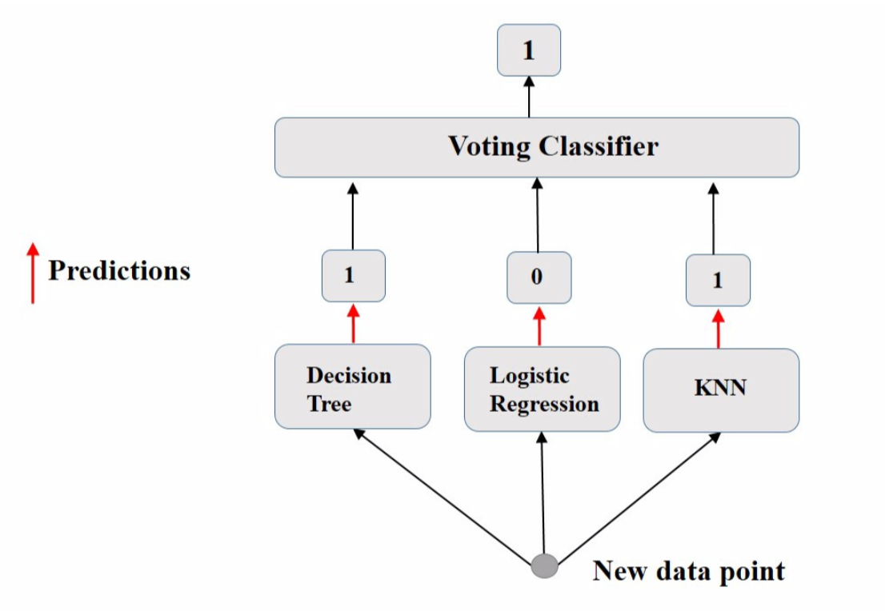
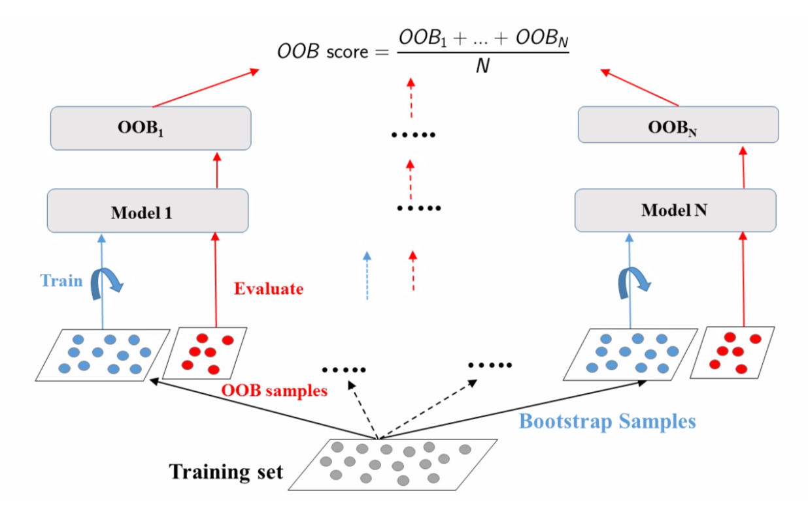
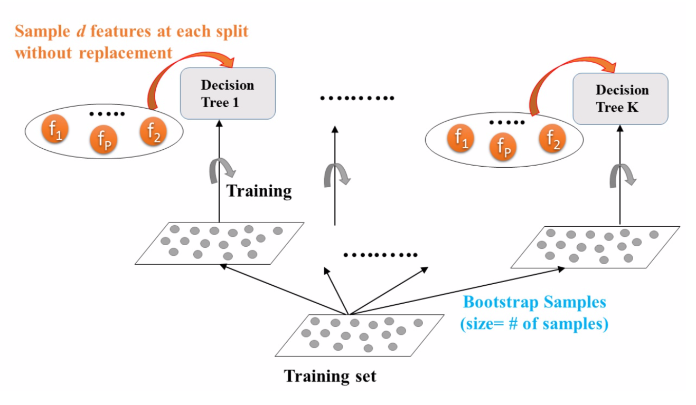
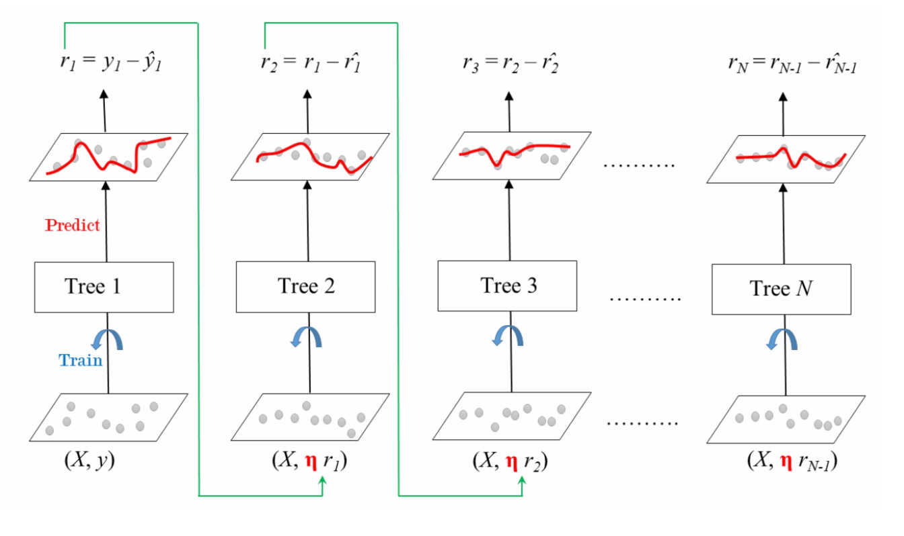

# 集成学习

## 1. 集成方法

若汇总一组预测器（例如分类器或回归变量）的预测，则通常会获得比使用最佳单个预测器更好的预测。一组预测器称为集成（ensemble）。故，这种技术称为集成学习（Ensemble Learning），其目标是组合使用给定学习算法构建的几个基基础计器的预测，以便改善单个估算器的泛化能力及鲁棒性。

当预测器彼此尽可能独立时，集成方法最有效。获得不同分类器的一种方法是使用完全不同的算法对其进行训练。这增加了他们犯非常不同类型的错误的机会，从而提高了集成的准确性。

主流的集成方法包括袋装法（bagging）、提升法（boosting）和堆叠法（stacking）。

### 1.1. 平均集成

平均集成中，驱动原则是独立构建多个估算器，然后对其预测进行平均。平均而言，组合估计通常优于任何单基估计，因为其方差减小。包括投票法和采样法。

- 投票法

投票法（voting）最简单的集成方法之一，是许多集成模型的基础。其思想是聚合每个分类器的预测，并预测获得最高票数的类别。这种多数投票分类器称为硬投票分类器（hard voting classifier）。

若所有分类器都能够估计分类概率，则可预测分类概率最高的分类，该分类概率在所有单个分类器上平均。这称为软投票（soft voting）。它通常比硬投票获得更高的性能，因为它可赋予高度可信的投票更多的权重。

- 袋装法

采样法对每个预测器使用相同的训练算法，并在训练集的不同随机子集上对其进行训练。即并行训练多个模型取均值，具有二重随机性（数据采样随机，特征选择随机），泛化程度高。若是又放回的采样，则称袋装（bagging）[^1]，即自举聚合（bootstrap aggregating）的简称；若是不放回采样，则称粘贴（pasting）[^2]。

$$
f(x) = \frac{1}{k} ∑_{k=1}^{k} f_m(x)
$$

bootstrap 会在每个预测器的训练子集中引入更多的多样性，因此袋装最终的偏差要比粘贴略高。但，额外的多样性也意味着预测器的相关性降低，因此整体方差减小了。总体而言，**袋装通常会产生更好的模型**。

对每个预测器，bagging 采样率只能达到 $1-e^{-1} ≈ 63.212\%$，未采样的训练实例称为**袋外的**（out-of-bag，OOB）。由于预测器在训练过程中从未看到 OOB 实例，因此可在这些实例上对其进行评估，而无需单独的验证集。可通过平均每个预测器的 OOB 评估来评估整体。

袋装分类器有 2 种采样模式，分别为实例采样和特征采样。前者的 2 个超参数为 `max_samples` 和 `bootstrap`，后者的 2 个超参数控制：`max_features` 和 `bootstrap_features` 。对于特征采样，每个预测器将在输入特征的随机子集中进行训练。当处理高维输入（如图像）时，此技术特别有用。对实例和特征进行采样的方法称为随机补丁（Random Patches）[^3]。保留所有实例（设置 `bootstrap=False` 和 `max_samples = 1.0` ）但进行特征采样（设置 `bootstrap_features=True` 和/或 `max_features< 1.0` ）的方法称为随机子空间（Random Subspaces）[^4]。采样功能可导致更多的预测器，从而为**降低方差而增加了一些偏差**。

### 1.2. 提升法

提升最初被称为假设提升（hypothesis boosting），其基基础计器按顺序构建，且试图减少组合估计器的偏差。动机是结合几个弱模型来产生强大的整体。

$$
\begin{aligned}
  F_{m+ 1}(x) = F_m(x) + β_m h_m(x;a_m) \\
  F_m(x;P) = ∑_{m= 1}^n β_m h_m(x;a_m)
\end{aligned}
$$

其中，$h(x;a_m)$就是一个个的弱分类器，$a_m$是弱分类器学习到的最优参数，$β_m$就是弱学习在强分类器中所占比重，$𝑷$是所有$a_m$和$β_m$的组合。

### 1.3. 堆叠法

堆叠，是堆叠泛化的简称（stacked generalization），基于一个简单的想法：与其使用琐碎的函数来汇总集合中所有预测器的预测，不如训练模型来执行这种聚合。例如对新实例执行回归。三个预测器中的每个预测器都将预测一个不同的值，然后输入给最终的预测器进行最终预测，最终的预测器被称为混合器（blender）或元学习器（meta learner）。

> 这类方法还不够成熟，这里暂不介绍。

## 2. 随机森林

随机森林（Random Forest，RF）是最典型的 bagging 模型 [^5]，是多个决策树的集成，其在树木生长时会引入额外的随机性；它不是在分割节点时搜索最佳特征，而是在特征的随机子集中搜索最佳特征。该算法导致更大的树多样性，这将较高的偏差换为较低的方差，通常会产生总体较好的模型。其优势简述如下：

- 能够处理很高维度（feature 很多）的数据，且不用做特征选择
- 在训练完后，能够给出哪些 feature 比较重
- 易并行，速度快
- 可进行可视化展示，便于分析

> 对某一特征添加噪音，若加入噪声前后，模型的误差率变化很小，则此特征不重要

### 2.1. Extra-Trees

当在随机森林中生长一棵树时，在每个节点上，仅考虑要素的随机子集进行拆分。通过为每个特征使用随机阈值，可使树变得更加随机。这种极随机树的森林称为极随机树集成（Extremely Randomized Trees Ensemble，Extra-Trees）[^6]。这将以更大的偏见换取更低的方差。这也使 Extra-Trees 的训练速度比常规的 RF 要快得多，因为在每个节点上为每个特征找到最佳的阈值是生长树木最耗时的任务之一。但二者的效果对比需要交叉验证进一步判定。

### 2.2. 特征重要性

随机森林的另一个出色品质是，它们使测量每个特征的相对重要性（feature importance）变得容易。通过查看使用该特征的树节点平均减少了多少不纯度来度量该特征的重要性。更准确地说，它是一个加权均值，其中每个节点的权重等于与其关联的训练样本数。

## 3. 梯度提升

### 3.1. GBRT

梯度提升（Gradient Boosting）的工作原理是将预测器顺序地添加到一个集成中，尝试**使新的预测器适合先前预测器造成的残差**。

梯度提升回归树（Gradient Boosted Regression Trees）使用超参数 `learning_rate` 来放缩每一棵树的贡献。若将其设置为较低的值，则集成中将需要更多树以适合训练集，但通常可更好地进行预测。为了找到最佳的树数量，可使用提前停止。一种方案是是**阶段预测**（stage prediction），在训练的每个阶段上返回由集成预测的迭代器。

也可通过**热启动**（warm start），即在每次拟合时保留现有树（而不是先训练大量树然后回头寻找最佳数量）来实现提前停止。

## 4. LightGBM

[^1]: Leo Breiman, "Bagging Predictors, " Machine Learning 24, no. 2 (1996): 123-140
[^2]: Leo Breiman, "Pasting Small Votes for Classification in Large Databases and On - Line, " Machine Learning 36, no. 1-2 (1999): 85-103.
[^3]: Gilles Louppe and Pierre Geurts, "Ensembles on Random Patches, " Lecture Notes in Computer Science 7523 (2012): 346-361.
[^4]: Tin Kam Ho, "The Random Subspace Method for Constructing Decision Forests, " IEEE Transactions on Pattern Analysis and Machine Intelligence 20, no. 8 (1998): 832-844.
[^5]: Tin Kam Ho, "Random Decision Forests, " Proceedings of the Third International Conference on Document Analysis and Recognition 1 (1995): 278.
[^6]: Pierre Geurts et al., "Extremely Randomized Trees, " Machine Learning 63, no. 1 (2006): 3-42.
