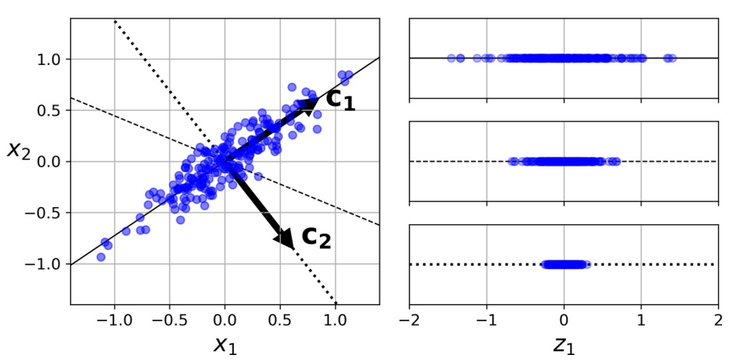
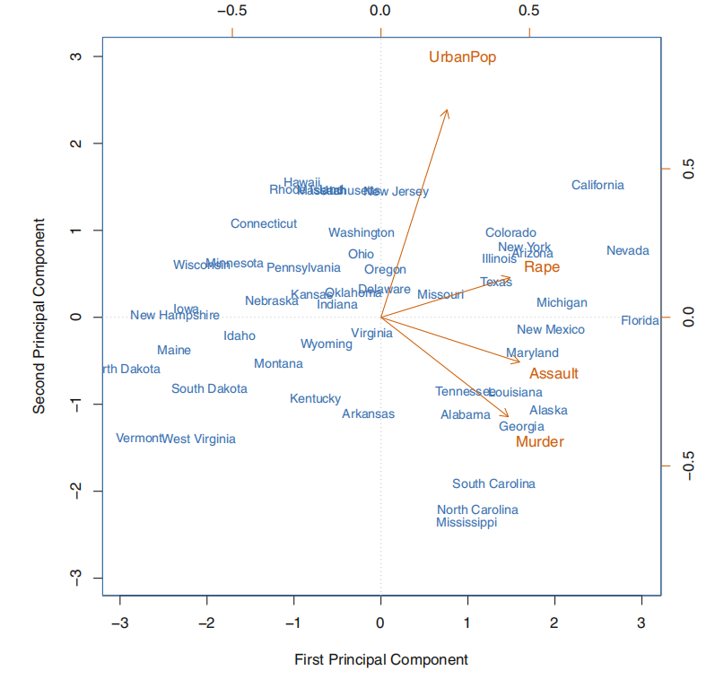
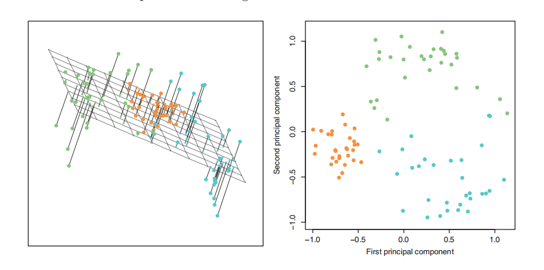
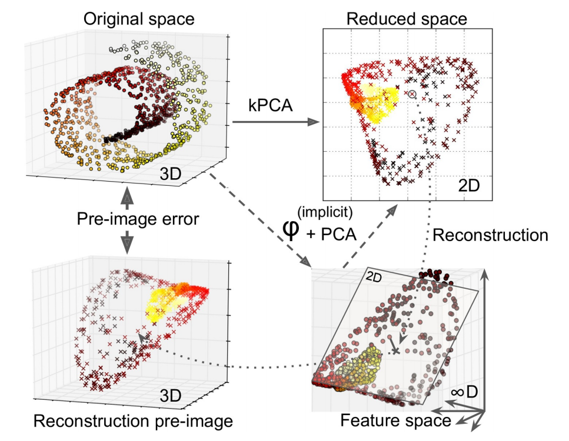
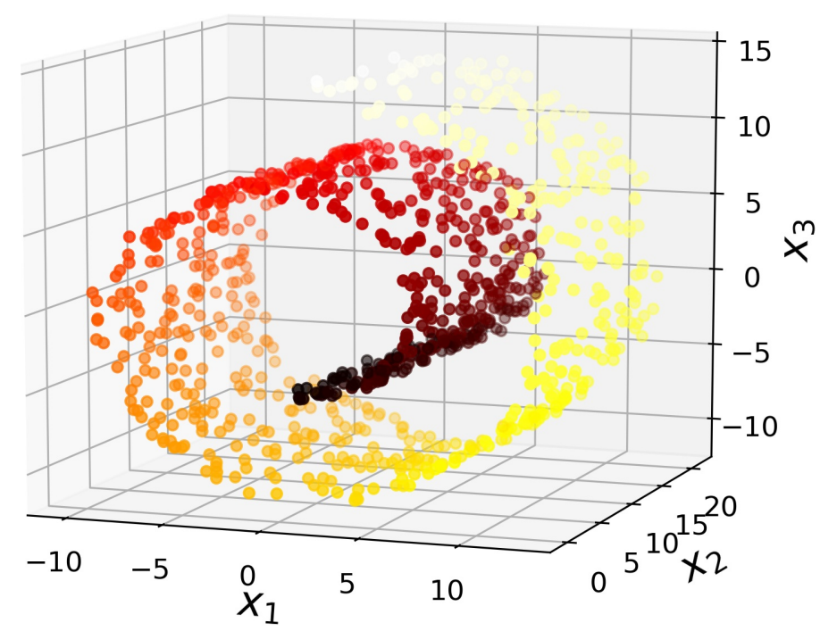
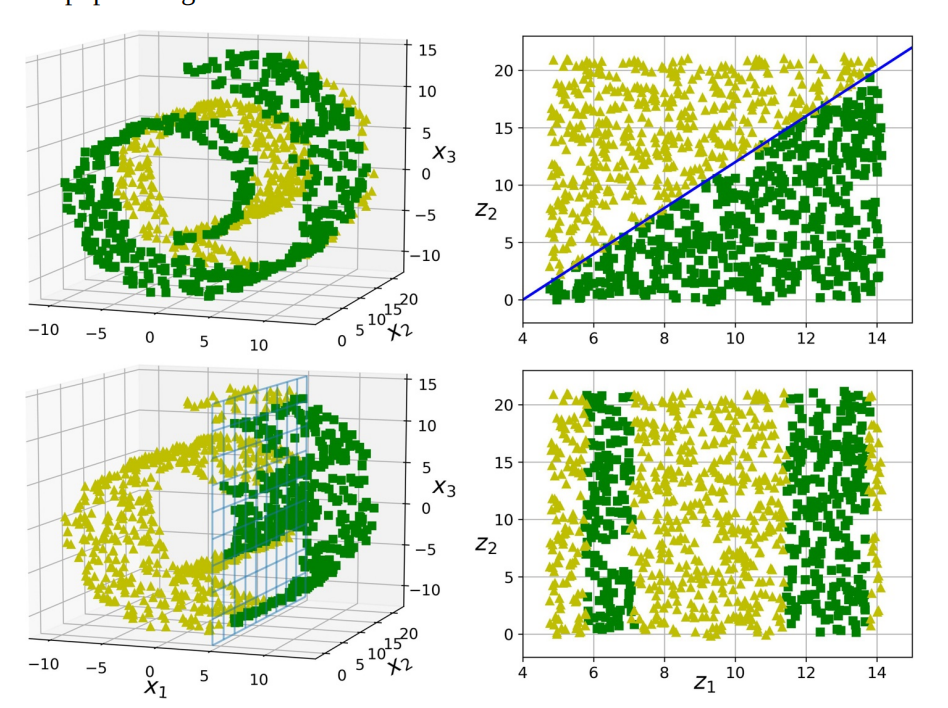

# 降维

## 1. PCA

主成分分析（Principal Component Analysis，PCA）是当前最流行的降维算法。首先，它确定最靠近数据的超平面，然后将数据投影到其上。



上图中

- 实线保留最大方差，反映数据结构
- 点线的投影保留中等方差（由测定误差导致）

证明该选择的一种方法是，该轴使原始数据集与其在该轴上的投影之间的均方距离最小 [^1]。

优化目标

- 降维后方差最大
- 不同维度间相关性为 0

:::{admonition} 步骤

- 数据：数组$X$，大小为$p× n$。
- 结果：数组$Z$，大小为$k× n, k<d$
- 开始
  - 计算协方差矩阵$𝑨$
  - 特征值分解$𝑸𝜮𝑸^{-1}$
  - 将特征值按递增顺序排序
  - 选择$𝑽 = 𝑸_{p-k:p-1}$，计算$Z= 𝑽^{⊤} X$
- 结束

:::

```python
def pca(X):
    cov_matrix = np.cov(X, rowvar=False)
    l, e = np.linalg.eig(cov_matrix)
    return l, e


x_0 = np.random.normal(0, 100, N)
x_1 = 2 * x_0 + np.random.normal(0, 20, N)
X = np.column_stack((x_0, x_1))

principal_val, principal_vec = pca(X)
X_proj = np.dot(X, first_princpal_vec)
```

### 1.1. 主成分

一组变量$X_1, X_2, …, X_p$的第一主成分（first principal component，1st PC）是标准化线性组合中方差最大的组合，记为：

$$
Z_1 = ∑_{j=1}^p ϕ_{j1} X_{j}
$$

这里，归一化的含义是：

$$
∑_{j=1}^p ϕ_{j 1}^2 = 1
$$

其中，$ϕ_{ji}$被称为第一主 PC 的载荷（loading），其构成了 PC 的载荷向量$ϕ_1 = \begin{bmatrix}
ϕ_{11} & ϕ_{21} & … & ϕ_{p 1}
\end{bmatrix}^{⊤}$。为防止载荷的绝对值过大而导致方差过大，故限定这些载荷的平方和为 1。

设有一个$n × p$维度据集$X$，

$$
X=
\begin{bmatrix}
  x_{0, 0} & x_{0, 1} & ⋯ & x_{0, n - 1} \\
  ⋮ & ⋱ & & ⋮ \\
  x_{p-1, 0} & x_{p-1, 1} & ⋯ & x_{p-1, n - 1}
\end{bmatrix} =
\begin{bmatrix}
  x_0 … x_{n-1}
\end{bmatrix}
$$

经过**中心化**处理（这是 PCA 的基本设之一），均值为 0，然后寻求具有如下形式的样本特征值的线性组合：

$$
z_{i1} = ∑_{j=1}^p ϕ_{j1} x_{ij}
$$

该线性组合在限定条件$∑_{j=1}^p ϕ_{j 1}^2 = 1$下有最大的样本方差，此时，此前的问题转化为优化问题：

$$
\max_{ϕ_{11}, …, ϕ_{p 1}}
\big\{
  \frac{1}{n} ∑\big(∑_{j=1}^p ϕ_{j1} x_{ij} \big)^2
\big\} =
\max_{ϕ_{11}, …, ϕ_{p 1}}
\big\{
  \frac{1}{n} ∑z_{i1}^2
\big\} \\
s.t.
∑_{j=1}^p ϕ_{j 1}^2 = 1
$$

由于

$$
\frac{1}{n} ∑x_{ij} = 0
$$

则

$$
\frac{1}{n} ∑z_{i1} = 0
$$

这里，称$z_{11}, …, z_{n 1}$为第一 PC 的得分。从几何角度来看，载荷向量$ϕ_1 = \begin{bmatrix}ϕ_{11} & ϕ_{21} & … & ϕ_{p 1} \end{bmatrix}^{⊤}$定义了一个在向量空间上数据最大变异的方向。若将$n$个数据点投影到这个方向上，这些投影的值即为 PC 的得分$z_{11}, …, z_{n 1}$。

当第一主成分$Z_1$确定后，继续寻找第二主成分$Z_2$。后者亦为$X_1, X_2, …, X_p$的线性组合，且为与$Z_1$不相关的各种线性组合中方差最大的一个，其得分有如下形式：

$$
z_{i2} = ∑_{j=1}^p ϕ_{j2} x_{ij}
$$

同时，第二主成分的载荷向量$ϕ_2 ⊥ ϕ_1$。



### 1.2. 模型细节

对于每个 PC，PCA 都找到一个指向 PC 方向的零中心单位向量。由于两个相对的单位向量位于同一轴上，因此 PCA 返回的单位向量的方向不稳定：若稍微扰动训练集并再次运行 PCA，则单位向量可能指向与原始向量相反的方向。但，它们通常仍将位于相同的轴上。在某些情况下，一对单位向量甚至可旋转或交换（若沿这两个轴的方差接近），但，它们定义的平面通常保持不变。

实际上，通过**奇异值分解**（SVD），可轻松通过数据集找到 PC 所在的矩阵，即$U𝜮𝑽^{⊤}$中的$V$。

一旦确定了所有主成分，就可通过将数据集投影到前$d$个主成分定义的超平面上，将数据集的维度降低到$d$维。选择此超平面可确保投影将保留尽可能多的方差。

$$
X_{d - \mathrm{proj}} = X β_d
$$

其中，$β_d$定义为包含$V$的前$d$列的矩阵。

### 1.3. 方差与维度

选取的 2 个主成分构成一个空间平面，其使得每个数据点到达这个平面的距离的平方和最小。其中，第$m$个主成分的可解释方差为：

$$
\frac{1}{n} ∑z_{im}^2 =
\frac{1}{n} ∑\big(∑_{j=1}^p ϕ_{j m} x_{ij} \big)^2
$$

由数据集的总方差：

$$
∑_{j=1}^p \mathrm{Var} \big(X_{j} \big) =
∑_{j=1}^p \frac{1}{n} ∑x_{ij}^2
$$

于是，第$m$个主成分的方差解释率（proportion of variance explained，PVE）可表示为：

$$
\frac{∑\big(∑_{j=1}^p ϕ_{j m} x_{ij} \big)^2}{∑_{j=1}^p ∑x_{ij}^2}
$$



为计算前$M$个主成分的累积 PVE，可简单地对前$M$个 PVE 求和，一共有$\min(n - 1, p)$个主成分，其和为 1。

实践中，与其任意选择要减小到的维度，**不如选择相加足够大的方差（例如 95％）的维度**。当然，除非要降低数据可视化的维度，这种情况下，通常需要将维度降低到 2 或 3。另一个选择是**将方差解释率绘制为维度的函数**来判断。

## 2. PCA 变体

### 2.1. RPCA, IPCA

RPCA（Randomized PCA，RPCA）就是在使用 SVD 求解时使用随机方法，其运算复杂度为$O(m × d^2) + O(d^3)$，故，当$d < n × 80\%$

常规 PCA 实现的一个问题是，它们要求整个训练集都适合内存，才能运行算法。幸运的是，递增 PCA（Incremental PCA，IPCA）可将训练集划分为多个小批，并一次小批量输入。但速度慢于常规 PCA。

### 2.2. kPCA

核 PCA（Kernel PCA，kPCA）用于复杂非线性投影，它通常擅长于在投影后保留实例簇，有时甚至可展开位于扭曲流形附近的数据集。内核技巧可将实例隐式映射到一个非常高维的空间，称特征空间（feature space），从而实现非线性分类和回归。高维特征空间中的线性决策边界对应于原始空间（original space）中的复杂非线性决策边界。

通过应用 PCA 投影的逆变换，还可将缩小的数据集解压缩回原来的维度。虽然投影会丢失一些信息（5％偏差之内），但，很可能接近原始数据。原始数据和重构数据（压缩后再解压缩）之间的均方距离称为重构误差（reconstruction error）。选择内核和超参数可找到最低重构误差（重建并不像使用线性 PCA 那样容易）。多亏了内核技巧，此变换在数学上等效于使用特征映射（feature map）φ 将训练集映射到无限维特征空间，然后使用线性 PCA 将变换后的训练集投影到 2D。



注意，若给定实例的线性 PCA 可在缩小的空间中反转，则重构点将位于特征空间中，而不是原始空间中。由于特征空间是无限维的，因此无法计算真实的重构误差。幸运的是，可在原始空间中找到一个点，该点将映射到重建点附近。这一点称为重建原像（pre-image）。获得该原像后，可测量其与原始实例的平方距离。然后，选择内核和超参数，以最大程度地减少此重构前图像错误。简言之，**并非所有降维算法都可通过计算重构误差评估性能**。

> 一种常用重构方案是训练有监督的回归模型，其中将投影实例作为训练集，而将原始实例作为目标。

### 2.3. 主成分回归

将一个点投影到一条线，可简单理解成为这条线寻找离这个点最近的位置。

## 3. 流形学习

### 3.1. 流形

在大多数实际问题中，训练实例并不能均匀地分布在所有维度上。许多特征几乎是恒定不变的，而其他特征则是高度相关的。结果，所有训练实例都位于（或接近于）高维空间的低维子空间内。这时，可考虑投影（projection）。但，投影并不总是降维的最佳方法。在许多情况下，子空间可能会扭曲和旋转，如在著名的瑞士卷（Swiss roll）玩具数据集中。



Swiss Roll 是 2D 流形（manifold）的一个示例。简而言之，2D 流形是可在更高维度的空间中弯曲和扭曲的二维形状。更一般而言，$d$维流形是$n$维空间（其中$d < n$

许多降维算法通过对训练实例所在的流形进行建模来工作。这称为流形学习（Manifold Learning，MfL）。它依赖于流形假设，该设认为**大多数现实世界的高维度据集都接近于低维流形**。通常根据经验可观察到这种设。

考虑一下"MNIST"数据集：所有手写数字图像都有一些相似之处。它们由连接的线组成，边界为白色，且或多或少居中。若尝试随机创建数字图像，则可用的自由度大大低于若允许生成所需图像的自由度。这些约束倾向于将数据集压缩为低维流形。

流形设通常还伴随着另一个隐式设：手头的任务若用流形的低维空间表示，将更加简单。如下图上半部分。但，这种隐含设并不总是成立，如下图下半部分。简而言之，在训练模型之前减小训练集的维度通常可加快训练速度，但**不一定总能带来更好或更简单的解决方案**。这一切都取决于数据集。



### 3.2. LLE

局部线性嵌入（Locally Linear Embedding，LLE）是另一种强大的非线性降维技术。它是一种流形学习技术，它不像以前的算法那样依赖投影。简而言之，LLE 的工作方式是：首先测量每个训练实例与其最近邻（c.n.）的线性相关程度，然后寻找最能保留这些局部关系的训练集的低维表示形式。这种方法特别适用于展开扭曲的流形，尤其是在没有太多噪音的情况下。

对实例$x_i$，找到$k$个最近邻，然后尝试将$x$重建为这些邻居的线性函数：

$$
\begin{aligned}
  \hat{β} &= \underset{β}{\mathrm{argmax}} ∑_{i=1}^m
  \big(x_i - ∑_{j=1}^m β_{ij} x_{j} \big)^2 \\
  &s.t.
    \begin{cases}
    β_{ij} = 0 x_{j} ∉ c.n \\
    \\
    ∑_{j=1}^m β_{ij} = 1 i ∈ [1, m]
  \end{cases}
\end{aligned}
$$

随后将训练实例映射到$d$维（$d<n$）空间

$$
Ẑ = \underset{Z}{\mathrm{argmax}} ∑_{i=1}^m
\big(z_i - ∑_{j=1}^m \hat{β}_{ij}z_{j}\big)^2
$$

其中，$z_i$是$x_i$映射后的图像，$Z$是包含所有$z_i$的矩阵。由此。整个算法的运算复杂度为：$O(m\log(m)n\log(k))$用于找到$k$个最近的邻居，$O(mnk^3)$用于优化权重，$O(dm^2)$用于构建低维表示。不幸的是，最后一项中的$m$使该算法很难扩展到非常大的数据集。

> 实践中会选择串联战略：**先使用 PCA 快速消除大量无用的维度，然后应用 LLE 等进行微调**。

### 3.3. UMAP

## 4. 交叉降维

### 4.1. 偏最小二乘

[^1]: Karl Pearson, "On Lines and Planes of Closest Fit to Systems of Points in Space, " The London, Edinburgh, and Dublin Philosophical Magazine and Journal of Science 2, no. 11 (1901): 559-572.
