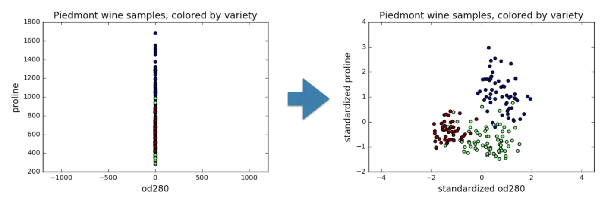
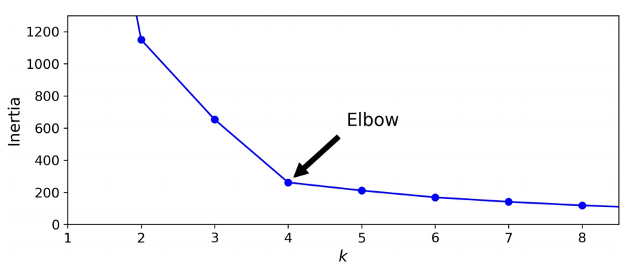
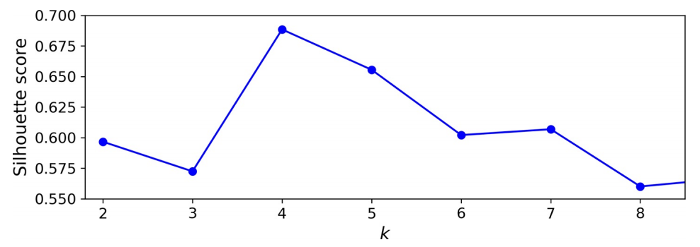
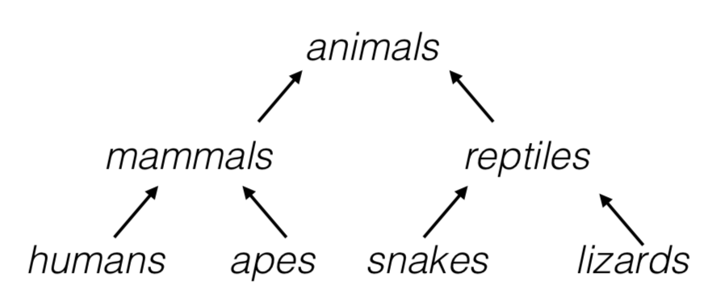

# 硬聚类

## 1. 距离聚类

### 1.1. _k_-均值

_k_-均值（k-means）[^1] 是聚类算法中最为简单、高效的，在聚类时只具有线性复杂度$O(m)$。其核心思想是：_k_ 由用户指定 _k_ 个初始质心（initial centroids）来表示簇（cluster），重复迭代直至算法收敛。2003 年，Elkan[^2] 发现通过利用三角形不等式（即两点之间，直线最短）并跟踪实例和质心之间的上下限可避免很多不必要的计算，这是机器学习中，_k_-均值默认使用的算法；2006 年，David Arthur 和 Sergei Vassilvitskii[^3] 引入了一个更智能的初始化步骤，该步骤倾向于选择彼此相距较远的质心，这一改进使 _k_-均值算法收敛到次优解决方案的可能性大大降低。由此，_k_-均值算法流程如下：

:::{admonition} 步骤

1. 从数据集中随机选取一个质心$c_1$。
2. 取一个新的质心$c_i$，以如下概率选择一个实例$x$：

$$
D(x_i)^2 / ∑_{j=1}^m D(x_i)^2
$$

其中，$D(x)$是实例$x$与已经选择的最接近质心之间的距离。这种概率分布确保距离已选择质心较远的实例更有可能被选择为质心。

3. 重复上一步，直到选择了所有 _k_ 个质心。
4. 对每个样本点，计算得到距其最近的质心，将其类别标为该质心所对应的簇
5. 重新计算 _k_ 个簇对应的质心
6. 重复 2，3，直至质心不再发生变化

:::

_k_-均值是典型的距离聚类方法，无法保证恢复基本事实。首先，选择正确数量的簇很难。其次，算法**对初始化很敏感**，且**可能收敛于局部最小值**。此外，这类方法基于划分需要满足如下两个条件：

- 每个簇至少包含一个实例：$C_1 ∪ C_2 ∪ … ∪ C_k = \{1, …, n\}$
- 每个实例属于且仅属于某一个簇：$∀k ≠ k', C_k ∩ C_{k'} = ∅$

一个好的簇是使簇内差异尽可能小。第$C_k$个簇内差异是对自身中实例互不相同程度的测度，因此需要进行的优化为：

$$
\min_{C_1, …, C_k}
\big\{∑_{k=1}^k W(C_k)\big\}
$$

对 Euclidean 空间的样本数据，测度如下：

$$
W(C_k) =
\frac{1}{|C_k|} ∑_{i, i' ∈ C_k} ∑_{j=1}^p(x_{ij} - x_{i' j})^2
$$

其中，$|C_k|$表示在第 _k_ 类中实例的数量。$W(C_k)$表示样本点$x$到簇$C_k$的质心的距离平方和。为方便计算，需要对数据进行标准化。

此处有如下性质：

$$
\frac{1}{|C_k|} ∑_{i, i' ∈ C_k} ∑_{j=1}^p (x_{ij} - x_{i' j} )^2 =
2 ∑_{i ∈ C_k} ∑_{j=1}^p (x_{ij} - x̄_{kj})^2
$$

其中，$x̄_{kj} = \frac{1}{|C_k|} ∑_{i ∈ C_k} x_{ij}$是第$C_k$类中第$j$个分量的均值。

### 1.2. 模型评价

当簇的直径非常不同时，_k_-均值算法的性能就不会很好，因为将实例分配给簇时，它所关心的只是与质心的距离。一种解决方案是使用**不同的随机初始化多次运行算法**，并留下最佳解决方案。机器学习以模型的惯性（inertia）作为度量，即每个实例与其最接近的质心之间的均方距离，运行 `n_init` 次算法并使模型保持最低惯性。通过实例簇个数 _k_ -惯性曲线，可判断最佳 _k_。

而对于最佳簇个数的选择，更加精确（运算成本更高）的方法是轮廓分数（silhouette score），也就是所有实例的平均轮廓系数。轮廓系数的定义为：

$$
(b - a)/\max(a, b)
$$

其中，$a$是到同一簇中其他实例的平均距离（即平均簇内距离），$b$是最近的平均最近簇距离。轮廓系数可在$-1$和$+1$之间变化。接近$+1$表示该实例很好地位于其自身的簇中，且远离其他簇，而接近 0 的系数表示该实例接近一个群集的边界，最后接近$-1$的系数意味着该实例可能已分配给错误的簇。

绘制每个实例的轮廓系数，可获得更加丰富的可视化效果，并按它们分配给的簇和系数值进行排序。这称为轮廓图。每个图每个簇包含一个刀形。形状的高度表示群集包含的实例数，宽度表示群集中实例的排序轮廓系数（越宽越好）。

尽管 _k_-均值有许多优点，但它并不完美。正如我们所看到的，有必要多次运行该算法以避免次优解决方案，此外，还需要指定集群数量，这很麻烦。此外，当聚类具有不同的大小，不同的密度或非球形时，_k_-均值的表现也不佳。在运行之前**缩放**输入很重要，虽然这并不能保证所有的聚类都很好且球形，但，总体上可改善。

### 1.3. 小批量 _k_-均值

David Sculley[^4] 在 2010 年的论文中提出了 _k_-均值算法的另一个重要变体。该算法使用小批量处理，在每次迭代时稍微移动质心。这大致将 _k_-均值的速度提高了 3~4 倍，且可对庞大数据集进行聚类。

尽管小批量 _k_-均值算法比常规 _k_-均值算法快得多，但其惯性通常稍差一些，尤其是随着簇数的增加。两条曲线之间的差异保持相当恒定，但，随着 k 的增加，由于惯性变得越来越小，该差异变得越来越明显。

### 1.4. 半监督化

标记数据集既昂贵又费时，故，通常有很多未标记的实例。标签传播（label propagation）将某些（或全部）标签从已标记实例复制到相似的未标记实例。这可大大扩展标记实例的数量，从而使监督算法达到更好的性能（这是半监督学习的一种形式）。一种方法是在所有实例上使用一种聚类算法，如 _k_-均值，然后为每个群集找到最常见的标签或最具代表性的实例的标签（即最接近质心的实例）并将其传播到同一簇中未标记的实例。

## 3. 密度聚类

### 3.1. DBScan

设簇结构能够通过样本分布的紧密程度来确定，它通过一组邻域参数$(ϵ, MinPts)$来描述样本分布的紧密程度。算法简述如下：

:::{admonition} 步骤

1. 对于每个实例，算法都会计算在距它的小距离$ϵ$内有多少个实例。该区域称为实例的$ϵ$-邻域：

$$
N_{ϵ}({x_i}) = \{x_j ∈ D|\mathrm{dist}(x_i, x_j) ⩽ ϵ\},\ D\ = \{{x_1}, {x_2}, ⋯, {x_N} \}
$$

2. 若一个实例$x_i$在其$ϵ$-邻域（包括自身）中至少有 `min_samples` 个实例，则将其视为核心实例（core instance）。换句话说，核心实例是位于密集区域（dense regions）中的实例。
3. 核心实例附近的所有实例都属于同一簇。这个邻域可能包括其他核心实例；故，一系列相邻的核心实例形成一个簇。
4. 任何不是核心实例且附近没有实例的实例都被视为异常。

:::

若所有聚类足够密集且被低密度区域很好地隔开，则该算法会效果很好。

简言之，DBSCAN 是一种非常简单但功能强大的算法，能够识别任何数量的**任何形状的簇**。它**对离群值具有鲁棒性**，且只有两个超参数（ `eps` 和 `min_samples` ）。但，若密度在整个群集中变化很大，则不可能正确捕获所有簇。它的计算复杂度大约为$O(m\log m)$，使其在实例数方面非常接近线性，但，若 `eps` 大，可能需要多达$O(m^2)$的内存。

### 3.2. 密度关系

- 密度直达

若${x_i}$是一个核心对象，且$x_j ∈ N_{ϵ}(x_i)$，则称$x_j$由${x_i}$密度直达，记作${x_i} → x_j$

- 密度可达

对${x_i}$和$x_j$，若存在样本序列${x_i}, {p_1}, ..., {p_m}, x_j$，其中每个向量均与相邻向量密度直达，则称$x_j$由${x_i}$密度可达，记作${x_i} ∼> x_j$

- 密度相连

对${x_i}$和$x_j$，若存在${x_k}$，使得${x_i}$和$x_j$均由${x_k}$密度可达，则称$x_j$由${x_i}$密度相连，记作${x_i}∼x_j$

- 噪声

不属于任何一类簇的点，从任一核心点出发，均是密度不可达

## 4. 层级聚类

### 4.1. 凝聚聚类

凝聚（Agglomerative）是一种自下而上（bottom-up）的聚类方法，每个观察在其自己的簇中开始，且以这样的方式迭代地合并簇以最小化连接标准。若为每对合并的簇绘制一个带有分支的树，则将得到一个簇的二叉树，其中的叶子是各个实例。这种方法可**很好地扩展到大量实例或簇**。它可捕获**各种形状的簇**，它生成灵活且信息丰富的簇树，而不必强迫选择特定的簇比例，且可与任何成对的距离一起使用。若提供连通性矩阵（connectivity matrix），它可很好地扩展到大量实例。连通性矩阵是一个稀疏的$m × m$矩阵，指示哪些实例对是邻居。

当感兴趣的簇仅由少数观察结果构成时，这种方法特别有意义。当簇的数量很大时，它比 _k_-均值计算效率高得多。其算法大致如下：

:::{admonition} 步骤

1. 计算$n$个实例中所有$\binom{n}{2}$对每 2 个数据之间的距离，将每个实例看作一类
2. 令$i = n, n-1, …, 2$：
   - (a) 在$i$个类中，比较任意两类间的距离，找到最小者，将其连接。用这两个类之间的距离（linkage 距离）表示树状图（dendrogram）中的交汇高度。
   - (b) 计算剩余的$i-1$类，每两类间的距离

:::

### 4.2. 分裂聚类

分裂（Divisive）：一种自上而下（top-down）的聚类方法，所有观察都在一个集群中开始，当一个集群向下移动时，迭代地分裂。为了估计大量的簇，这种方法既缓慢（由于所有观察开始为一个簇，它以递归方式分割）和统计上不适合。

### 4.3. BIRCH

使用层级结构的平衡迭代约简和聚类（Balanced Iterative Reducing and Clustering using Hierarchies，BIRCH）算法是专为非常大的数据集设计的，只要特征数量不太大（<20），它可比批处理 _k_-均值更快，且结果相似。训练期间，它构建一个树结构，该树结构仅包含足够的信息以快速将每个新实例分配给簇，而不必将所有实例存储在树中：这种方法允许它在处理庞大的数据集时使用有限的内存。

### 4.4. 频谱聚类

频谱聚类（spectral clustering）在实例之间使用相似性矩阵，并从中创建低维嵌入（即降维），然后在该低维空间中使用另一种聚类算法（如 _k_ -均值）。该算法可捕获复杂的聚类结构，也可用于切割图。它不能很好地扩展到大量实例，且当群集的大小完全不同时，它的运行也不会很好。

[^1]: Stuart P. Lloyd, "Least Squares Quantization in PCM", IEEE Transactions on Information Theory 28, no. 2 (1982): 129-137.
[^2]: Charles Elkan, "Using the Triangle Inequality to Accelerate k-Means, " Proceedings of the 20th International Conference on Machine Learning (2003): 147-153.
[^3]: David Arthur and Sergei Vassilvitskii, "k-Means ++: The Advantages of Careful Seeding, "Proceedings of the 18th Annual ACM-SIAM Symposium on Discrete Algorithms (2007): 1027-1035.
[^4]: David Sculley, "Web-Scale K-Means Clustering", Proceedings of the 19th International Conference on World Wide Web (2010): 1177-1178.
