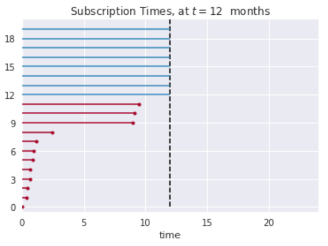
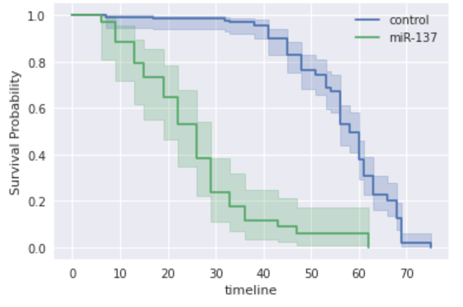
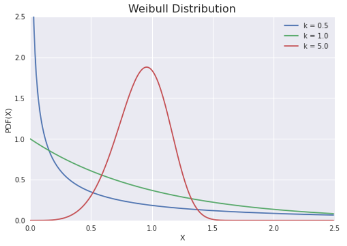

# 生存分析

## 1. 生存概率

在分析存活时间时，会出现不同于目前为止的讨论的问题。一个问题是如何处理受试者退出研究的问题。设我们测试一种新的癌症药物。当一些受试者死亡时，其他受试者可能认为新药无效，并决定研究结束前退出研究。这类研究使用的术语是生存分析（survival analysis）。

这种方法也用于分析其他领域的类似问题。例如：可用于研究机器在坏掉之前的寿命有多长；或人们订阅邮件列表的时间（其中"死亡"对应的是取消订阅邮件列表）。

### 1.1. 删失

进行生存分析的难点在于，在一项研究结束时，许多个体可能还"活着"。在统计学中，对于只能部分知道的测量值的表达方式是删失（censoring）。若未知数据位于生存阈值右侧，则称为右删失，反之称为左删失。

举个例子，考虑一个邮件列表，其订阅者分为两个子组。第一组很快就厌倦了邮件，三个月后就会退订。第二组人很喜欢，一般会订阅一年半的时间。

红线表示有退订行为的个人的订阅时间，蓝线表示没有退订行为（被右删失）的个人的订阅时间。若要求估计总体的平均订阅时间，而又本能地决定不包括被右删失的个人，很明显会严重低估真实的平均订阅时间。

### 1.2. Kaplan–Meier 曲线

若一些受试者在研究中期增加了他们的隐私设置，即在研究结束前禁止我们对他们进行监控，就会出现类似的、进一步的问题。而处理这些问题的一个巧妙方法是用 Kaplan -Meier 曲线来描述这类数据。首先，时间被细分为几个小的时期。然后计算受试者在给定时期内存活的可能性。生存概率由以下公式给出

$$
p_k = p_{k-1} * \frac{r_k - f_k}{r_k}
$$

其中，$p_k$为第$k$期存活的概率；$r_k$为第$k$天之前仍有风险（仍被跟踪）的受试者人数，$f_k$为第$k$天观察到的失败人数。

下面的数据给出了苍蝇的基因型和存活的天数。由于工作对象是苍蝇，故不需要担心左删失的问题：因为知道所有苍蝇的出生日期。不过确实有误杀一些或若一些逃跑的问题。因为实际上并没有观察到它们因自然原因而死亡，这些将被右删失。

## 2. Weibull 分布

Weibull 分布可靠性数据或寿命数据建模的最常用分布。由于它最早是由 Fréchet 确定的（1927 年），但由 Weibull 详细描述的（1951 年），故有时它也以 Fréchet 分布为名。

Weibull 分布有两个参数，可处理增加，减少或恒定的故障率。

$$
f(x, k) =
\begin{cases}
    \dfrac{k}λ(\dfrac{x}λ)^{k-1}e^{-(x/λ)^{k}}, & x ⩾ 0\\
    0, & x < 0
\end{cases}
$$

其中，$k > 0$为形状参数，$λ> 0$为标度参数（可省略），其互补累积分布函数是拉伸指数函数。

若数量$x$是"失效时间"，则 Weibull 分布给出失效率与时间功率成比例的分布。

- $k< 1$表示故障率随时间降低。若存在显著的"婴儿死亡率"，或有缺陷的物品早期失效，且随着时间的推移失败率随着缺陷物品被淘汰出局而发生，则会发生这种情况。
- $k = 1$表示故障率随时间不变。这可能表明随机外部事件导致死亡或失败。
- $k>1$表示故障率随时间增加。若存在"老化"过程，或随着时间的推移更可能发生故障的部件，则会发生这种情况。一个例子是具有内置弱点的产品在保修期满后很快就会失败。
