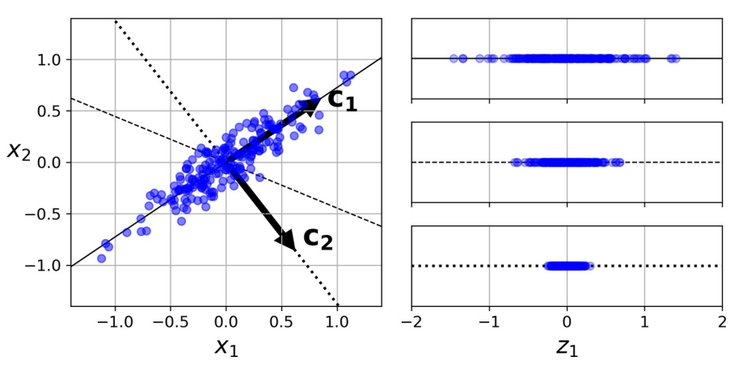
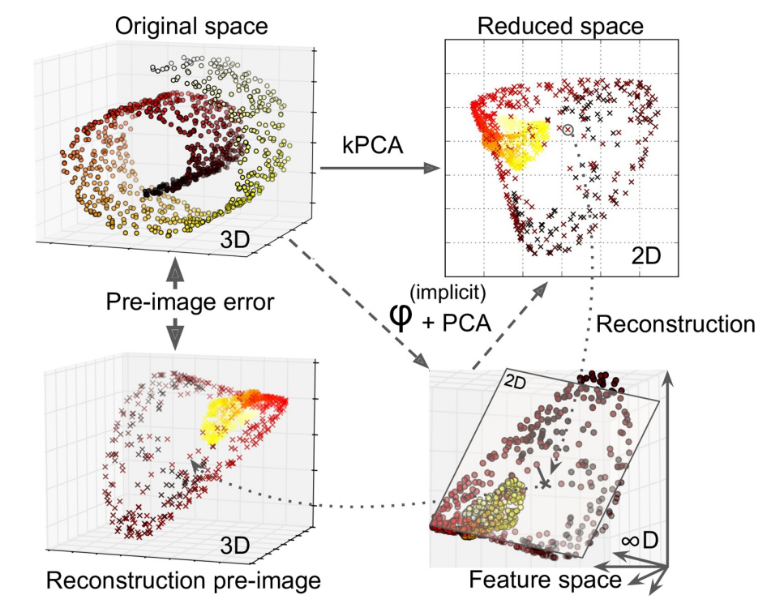

# 降维

解决过拟合的问题除了正则化和添加数据之外，最好的方法就是降维。降维的思路来源于维度灾难的问题，假设$n$维球的体积为$C R^n$，则在球体积与边长为$2R$的超立方体比值为

$$
\lim_{n → 0} \frac{C R^n}{2^n R^n} = 0
$$

这就是所谓的维度灾难，在高维数据中，主要样本都分布在空间的边缘，故数据集更加稀疏。

降维算法分为

- 直接降维：特征选择
- 线性降维：PCA，MDS
- 流形降维：UMAP，LLE

## 1. PCA

主成分分析（Principal Component Analysis，PCA）是当前最流行的降维算法。

### 1.1. 投影

PCA 首先确定最靠近数据的超平面，然后将数据投影到其上。



上图中

- 实线保留最大方差，反映数据结构
- 点线的投影保留中等方差（由测定误差导致）

证明该选择的一种方法是，该轴使原始数据集与其在该轴上的投影之间的均方距离最小。

优化目标

- 降维后方差最大
- 不同维度间相关性为 0

:::{admonition} 步骤

- 数据：数组$X$，大小为$p× n$。
- 结果：数组$Z$，大小为$k× n, k<d$
- 开始
  - 计算协方差矩阵$𝑨$
  - 特征值分解$𝑸𝜮𝑸^{-1}$
  - 将特征值按递增顺序排序
  - 选择$𝑽 = 𝑸_{p-k:p-1}$，计算$Z= 𝑽^{⊤} X$
- 结束

:::

```python
def pca(X):
    cov_matrix = np.cov(X, rowvar=False)
    l, e = np.linalg.eig(cov_matrix)
    return l, e


x_0 = np.random.normal(0, 100, N)
x_1 = 2 * x_0 + np.random.normal(0, 20, N)
X = np.column_stack((x_0, x_1))

principal_val, principal_vec = pca(X)
X_proj = np.dot(X, first_princpal_vec)
```

首先将协方差矩阵中心化：

$$
\begin{aligned}
  𝑺 &= 1 / N ∑_{i=1}^n (x_i - \hat{x})(x_i - \hat{x})^⊤\\
  &= 1 / N (x_1 - \bar{x}, x_2 - \bar{x} …, x_N - \hat{x})(x_1 - \bar{x}, x_2 - \bar{x} …, x_N - \hat{x})^⊤\\
  &= 1 / N (𝑿^⊤ - 1 / N 𝑿^⊤ 𝑰_{N_1} 𝑰_{N_1}^⊤)(𝑿^⊤ - 1 / N 𝑿^⊤ 𝑰_{N_1} 𝑰_{N_1}^⊤)^⊤\\
  &= 1 / N 𝑿^⊤(E_N - 1 / N 𝑰_{N_1} 𝑰_{1 N})(E_N - 1 / N 𝑰_{N_1} 𝑰_{1 N})^⊤ 𝑿\\
  &= 1 / N 𝑿^⊤ 𝑯_N 𝑯_N^⊤ 𝑿\\
  &= 1 / N 𝑿^⊤ 𝑯_N 𝑯_N 𝑿 = 1 / N 𝑿^⊤ 𝑯 𝑿
\end{aligned}
$$

这个式子利用了中心矩阵$𝑯$的对称性，这也是一个投影矩阵。

### 1.2. 主成分

一组变量$X_1, X_2, …, X_p$的第一主成分（first principal component，1st PC）是标准化线性组合中方差最大的组合，记为：

$$
Z_1 = ∑_{j=1}^p ϕ_{j1} X_{j}
$$

这里，归一化的含义是：

$$
∑_{j=1}^p ϕ_{j 1}^2 = 1
$$

其中，$ϕ_{ji}$被称为第一主 PC 的载荷（loading），其构成了 PC 的载荷向量$ϕ_1 = \begin{bmatrix}
ϕ_{11} & ϕ_{21} & … & ϕ_{p 1}
\end{bmatrix}^{⊤}$。为防止载荷的绝对值过大而导致方差过大，故限定这些载荷的平方和为 1。

设有一个$n × p$维度据集$X$，

$$
X=
\begin{bmatrix}
  x_{0, 0} & x_{0, 1} & ⋯ & x_{0, n - 1} \\
  ⋮ & ⋱ & & ⋮ \\
  x_{p-1, 0} & x_{p-1, 1} & ⋯ & x_{p-1, n - 1}
\end{bmatrix} =
\begin{bmatrix}
  x_0 … x_{n-1}
\end{bmatrix}
$$

经过**中心化**处理（这是 PCA 的基本设之一），均值为 0，然后寻求具有如下形式的样本特征值的线性组合：

$$
z_{i1} = ∑_{j=1}^p ϕ_{j1} x_{ij}
$$

该线性组合在限定条件$∑_{j=1}^p ϕ_{j 1}^2 = 1$下有最大的样本方差，此时，此前的问题转化为优化问题：

$$
\max_{ϕ_{11}, …, ϕ_{p 1}}
\big\{
  \frac{1}{n} ∑\big(∑_{j=1}^p ϕ_{j1} x_{ij} \big)^2
\big\} =
\max_{ϕ_{11}, …, ϕ_{p 1}}
\big\{
  \frac{1}{n} ∑z_{i1}^2
\big\} \\
s.t.
∑_{j=1}^p ϕ_{j 1}^2 = 1
$$

由于

$$
\frac{1}{n} ∑x_{ij} = 0
$$

则

$$
\frac{1}{n} ∑z_{i1} = 0
$$

这里，称$z_{11}, …, z_{n 1}$为第一 PC 的得分。从几何角度来看，载荷向量$ϕ_1 = \begin{bmatrix}ϕ_{11} & ϕ_{21} & … & ϕ_{p 1} \end{bmatrix}^{⊤}$定义了一个在向量空间上数据最大变异的方向。若将$n$个数据点投影到这个方向上，这些投影的值即为 PC 的得分$z_{11}, …, z_{n 1}$。

当第一主成分$Z_1$确定后，继续寻找第二主成分$Z_2$。后者亦为$X_1, X_2, …, X_p$的线性组合，且为与$Z_1$不相关的各种线性组合中方差最大的一个，其得分有如下形式：

$$
z_{i2} = ∑_{j=1}^p ϕ_{j2} x_{ij}
$$

同时，第二主成分的载荷向量$ϕ_2 ⊥ ϕ_1$。

### 1.3. 模型细节

对于每个 PC，PCA 都找到一个指向 PC 方向的零中心单位向量。由于两个相对的单位向量位于同一轴上，因此 PCA 返回的单位向量的方向不稳定：若稍微扰动训练集并再次运行 PCA，则单位向量可能指向与原始向量相反的方向。但，它们通常仍将位于相同的轴上。在某些情况下，一对单位向量甚至可旋转或交换（若沿这两个轴的方差接近），但，它们定义的平面通常保持不变。

实际上，通过**奇异值分解**（SVD），可轻松通过数据集找到 PC 所在的矩阵，即$U𝜮𝑽^{⊤}$中的$V$。

一旦确定了所有主成分，就可通过将数据集投影到前$d$个主成分定义的超平面上，将数据集的维度降低到$d$维。选择此超平面可确保投影将保留尽可能多的方差。

$$
X_{d - \mathrm{proj}} = X β_d
$$

其中，$β_d$定义为包含$V$的前$d$列的矩阵。

### 1.4. 方差与维度

选取的 2 个主成分构成一个空间平面，其使得每个数据点到达这个平面的距离的平方和最小。其中，第$m$个主成分的可解释方差为：

$$
\frac{1}{n} ∑z_{im}^2 =
\frac{1}{n} ∑\big(∑_{j=1}^p ϕ_{j m} x_{ij} \big)^2
$$

由数据集的总方差：

$$
∑_{j=1}^p \mathrm{Var} \big(X_{j} \big) =
∑_{j=1}^p \frac{1}{n} ∑x_{ij}^2
$$

于是，第$m$个主成分的方差解释率（proportion of variance explained，PVE）可表示为：

$$
\frac{∑\big(∑_{j=1}^p ϕ_{j m} x_{ij} \big)^2}{∑_{j=1}^p ∑x_{ij}^2}
$$

为计算前$M$个主成分的累积 PVE，可简单地对前$M$个 PVE 求和，一共有$\min(n - 1, p)$个主成分，其和为 1。

实践中，与其任意选择要减小到的维度，**不如选择相加足够大的方差（例如 95％）的维度**。当然，除非要降低数据可视化的维度，这种情况下，通常需要将维度降低到 2 或 3。另一个选择是**将方差解释率绘制为维度的函数**来判断。

### 1.5. 损失函数

主成分分析（PCA）中，我们的基本想法是将所有数据投影到一个子空间中，从而达到降维的目标。

寻找子空间的基本想法是

- 所有数据在子空间中更为分散
- 损失的信息最小，即在补空间的分量少

原来的数据很有可能各个维度之间是相关的，于是我们希望找到一组$p$个新的线性无关的单位基$u_i$，降维就是取其中的$q$个基。于是对于一个样本$x_i$，经过这个坐标变换后

$$
  \hat{x}_i = ∑_{i=1}^p (u_i^⊤ x_i) u_i = ∑_{i=1}^q (u_i^⊤ x_i) u_i + ∑_{i = q + 1}^p (u_i^⊤ x_i) u_i
$$

对于数据集来说，我们首先将其中心化然后再去上面的式子的第一项，并使用其系数的平方平均作为损失函数并最大化

$$
\begin{aligned}
  J &= 1 / N ∑_{i=1}^n ∑_{j=1}^q ((x_i - \hat{x}^⊤) u_j)^2 \\
  &= ∑_{j=1}^q u_j^⊤ 𝑺 u_j \quad s.t.\quad u_j^⊤ u_j = 1
\end{aligned}
$$

由于每个基都是线性无关的，于是每一个$u_j$的求解可以分别进行，使用 Lagrange 乘子法

$$
\argmax_{u_j} L(u_j,λ) = \argmax_{u_j^⊤} 𝑺 u_j + λ(1-u_j^⊤ u_j) $$

于是

$$ 𝑺 u_j = λ u_j $$

可见，我们需要的基就是协方差矩阵的特征矢。损失函数最大取在特征值前$q$个最大值。

下面看其损失的信息最少这个条件，同样适用系数的平方平均作为损失函数，并最小化

$$
\begin{aligned}
  J &= 1 / N ∑_{i=1}^n ∑_{j = q + 1}^p ((x_i - \hat{x}^⊤) u_j)^2\\
  &= ∑_{j = q + 1}^p u_j^⊤ 𝑺 u_j \quad s.t. u_j^⊤ u_j = 1
\end{aligned}
$$

同样的

$$
  \argmin_{u_j} L (u_j, λ) = \argmin_{u_j} u_j^⊤ 𝑺 u_j + λ (1 - u_j^⊤ u_j)
$$

损失函数最小取在特征值剩下的个最小的几个值。数据集的协方差矩阵可以写成$𝑺 = 𝑼 𝚲 𝑼^⊤$，直接对这个表达式当然可以得到特征矢。

PCA 的问题是，其所产生的变量是原始变量的线性组合，一般会混淆结果的可解释性。

### 1.6. pPCA

下面从概率的角度对 PCA 进行分析，此方法称 pPCA。使用线性模型，选定一个方向，对原数据$x ∈ ℝ^p$，降维后的数据为$z ∈ ℝ^q, q < p$。降维通过一个矩阵变换（投影）进行

$$
\begin{aligned}
  z & ∼ N (OO_{q_1}, 𝑰_{q q})\\
  x &= 𝐖 z + μ + ɛ\\
  ɛ & ∼ N (0, σ^2 𝑰_{p p})
\end{aligned}
$$

对于这个模型，我么可以使用期望最大（EM）算法进行学习，在进行推断的时候需要求得$p(z|x)$，推断的求解过程和线性高斯模型类似。

由

$$
\begin{aligned}
  p(z|x) &= frac(p(x|z), p(z)), p(x)\\
  E[x] &= E[𝐖 z + μ + ɛ] = μ\\
  Var[x] &= 𝐖 𝐖^⊤ + σ^2 𝑰_{p p}
\end{aligned}
$$

可得

$$
  p(z|x) = N (𝐖^⊤(𝐖 𝐖^⊤ + σ^2 𝑰))^(-1)(x - μ), 𝑰 - 𝐖^⊤(𝐖 𝐖^⊤ + σ^2 𝑰)^(-1) 𝐖
$$

## 2. PCA 变体

### 2.1. RPCA, IPCA

rPCA（randomized PCA，rPCA）就是在使用 SVD 求解时使用随机方法，其运算复杂度为$O(m × d^2) + O(d^3)$，故，当$d < n × 80\%$

常规 PCA 实现的一个问题是，它们要求整个训练集都适合内存，才能运行算法。幸运的是，递增 PCA（incremental PCA，iPCA）可将训练集划分为多个小批，并一次小批量输入。但速度慢于常规 PCA。

### 2.2. kPCA

核 PCA（kernel PCA，kPCA）用于复杂非线性投影，它通常擅长于在投影后保留实例簇，有时甚至可展开位于扭曲流形附近的数据集。内核技巧可将实例隐式映射到一个非常高维的空间，称特征空间（feature space），从而实现非线性分类和回归。高维特征空间中的线性决策边界对应于原始空间（original space）中的复杂非线性决策边界。

通过应用 PCA 投影的逆变换，还可将缩小的数据集解压缩回原来的维度。虽然投影会丢失一些信息（5％偏差之内），但，很可能接近原始数据。原始数据和重构数据（压缩后再解压缩）之间的均方距离称为重构误差（reconstruction error）。选择内核和超参数可找到最低重构误差（重建并不像使用线性 PCA 那样容易）。多亏了内核技巧，此变换在数学上等效于使用特征映射（feature map）φ 将训练集映射到无限维特征空间，然后使用线性 PCA 将变换后的训练集投影到 2D。



注意，若给定实例的线性 PCA 可在缩小的空间中反转，则重构点将位于特征空间中，而不是原始空间中。由于特征空间是无限维的，因此无法计算真实的重构误差。幸运的是，可在原始空间中找到一个点，该点将映射到重建点附近。这一点称为重建原像（pre-image）。获得该原像后，可测量其与原始实例的平方距离。然后，选择内核和超参数，以最大程度地减少此重构前图像错误。简言之，**并非所有降维算法都可通过计算重构误差评估性能**。

> 一种常用重构方案是训练有监督的回归模型，其中将投影实例作为训练集，而将原始实例作为目标。

### 2.3. 主成分回归

将一个点投影到一条线，可简单理解成为这条线寻找离这个点最近的位置。

## 3. 主坐标分析

对中心化后的数据集进行奇异值分解

$$
 𝑯 𝑿 = 𝑼 𝜮 𝑽^⊤, 𝑼^⊤ 𝑼 = E_N, 𝑽^⊤ 𝑽 = E_p, 𝜮 : N × p
$$

于是

$$
\begin{aligned}
  𝑺 &= 1 / N 𝑿^⊤ 𝑯 𝑿\\
  &= 1 / N 𝑿^⊤ 𝑯^⊤ 𝑯 𝑿\\
  &= 1 / N 𝑽 𝜮^⊤ 𝜮 𝑽^⊤
\end{aligned}
$$

因此，直接对中心化后的数据集进行 SVD，就可以得到特征值和特征向量$𝑽$，在新坐标系中的坐标就是

$$ 𝑯 𝑿 ⋅ 𝑽 $$

由上面的推导，我们可以得到另一种方法，主坐标分析（PCoA），定义并进行特征值分解

$$
\begin{aligned}
  T &= 𝑯 𝑿 𝑿^⊤ 𝑯\\
  &= 𝑼 𝜮 𝜮^⊤ 𝑼^⊤
\end{aligned}
$$

由于

$$ T 𝑼 𝜮 = 𝑼 𝜮 (𝜮^⊤ 𝜮) $$

于是可以直接得到坐标。这个方法也可以得到主成分，但是由于方差矩阵是$p × p$的，而$T$是$N × N$的，故对样本量较少的时候可以采用 PCoA 的方法。
