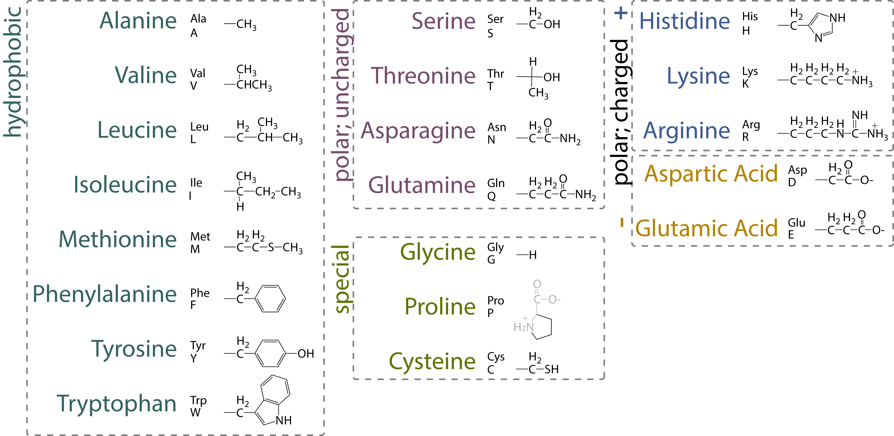
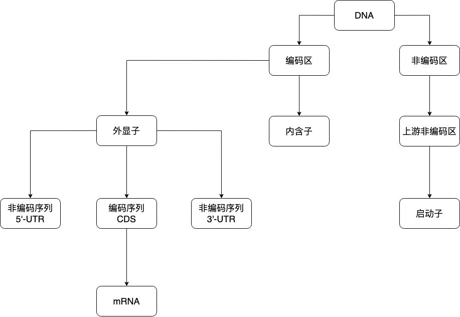
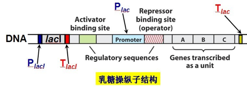
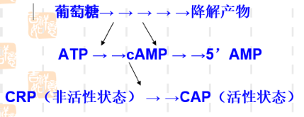
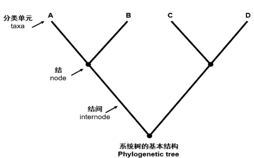

# 分子生物学基础

## 1. 微生物命名

### 1.1. 分类

- 分类
  - 非细胞型：病毒、亚病毒
  - 原核细胞型：细菌（支原体、衣原体、立克次氏体、放线菌和螺旋体）
  - 真核细胞型：酵母、霉菌、原生动物、藻类
- 双名法
  - 属名 + 种名（斜体）+ 命名者姓氏缩写（正体）
  - 属名：首字母大写
  - 种名：小写字母
  - 名词所有格（表来源）
  - 形容词主格（表性质）

### 1.2. 基因

- 一般方法（三部分）
  - 3 lower case letters (pathway)
  - 1 capital letter (actual gene)
  - 1 allele number
- 突变体

|     Superscripts      |        Meaning        |    Example    |       Comment        |
|:---------------------:|:---------------------:|:-------------:|:--------------------:|
|           +           |       Wild type       |   $leuA⁺$-    |        Mutant        |
|          ts           | temperature sensitive |  $leuA^{ts}$  |                      |
|          cs           |    cold sensitive     |  $leuA^{cs}$  |                      |
|          am           |    amber mutation     |  $leuA_{am}$  |                      |
|          um           | umber (opal) mutation |  $leuA_{um}$  |       琥珀突变       |
|          oc           |    ochre mutation     |  $leuA_{oc}$  |       赭石突变       |
|           R           |       resistant       |    $rif^R$    |                      |
|           Δ           |       deletion        |    $ΔleuA$    |                      |
|           -           |        fusion         |  $leuA-lacZ$  |                      |
|           :           |        fusion         |  $leuA:lacZ$  | `:` 前的基因是断裂的 |
|          ::           |       insertion       | $leuA::Tn10Ω$ |                      |
| Δ(gene)::(resistance) | deletion/replacement  |  ΔleuA::npt   |                      |

### 1.3. 表型

1. first-letter capitalized
2. not italicized

   - _DnaA⁻_ the protein produced by the _dnaA_ gene
   - _LeuA⁻_ the phenotype of a _leuA_ mutant

## 2. 基因结构

### 2.1. 基础概念

- 基因（gene）：即遗传因子，是产生一条多肽链或功能 RNA 所需的全部核苷酸序列，即带有遗传讯息的 DNA 片段；
- 顺反子（cistron）：即结构基因，为决定一条多肽链合成的功能单位。顺反子在一定条件下与基因同义；
- 多顺反子 mRNA：含有编码一个以上蛋白质的编码信息，且，这些蛋白质均是以独立的多肽被翻译的 mRNA；
- 全酶（holoenzyme）：一些酶除蛋白质外，还含有对热稳定的小分子物质。前者称为酶蛋白（apoenzyme），后者称为辅因子（cofactor）。只有酶蛋白和辅因子结合成完整的分子时，才具有活力；
- 辅酶（coenzyme）：一类可将化学基团从一个酶转移到另一个酶上的有机小分子。与酶较为松散地结合，对于特定酶的活性发挥是必要的；

### 2.2. 复制、转录、翻译

- 复制

以 DNA 为模板，在 DNA 聚合酶的催化作用下，将四种游离的 dNTP 按照碱基互补配对原则合成新链 DNA，为半保留复制，需要引物。

- 转录

以 DNA 为模版，在 DNA 指导的 RNA 聚合酶的作用下，将四种游离的 NTP 按照碱基互补配对的原则合成 RNA，为半不连续转录，需要引物。

- 翻译

以 mRNA 为模板，原料为 20 中游离的氨基酸，3 个碱基决定 1 个氨基酸。

### 2.3. ORF, CDS

开放读码框（Open Reading Frame, ORF）是从一个起始密码子开始到一个终止密码子结束的一段序列；不是所有读码框都能被表达出蛋白产物或有生物学功能的蛋白；

- CDS 必定是一个或多个 ORF；但，每个 ORF 不一定均是 CDS；
- ORF = translation（理论可能）
- CDS = transcription（事实存在）；

### 2.4. 启动子（Promoter）

位于编码区上游的非编码区。真核生物启动子包括下列几种不同顺序，能促进转录过程：

- 帽子位点

  - 转录的起始位点；

- TATA 框（Hogness box）

  - 似于原核生物的 Pribnow 框，决定转录起点的选择，为 RNA 聚合酶的结合处；
  - 一致顺序为 TATAATAAT；
  - 约在基因转录起始点上游约 -30-50bp 处；

- CAAT 框（CAAT box）

  - 真核生物基因常有的调节区，控制转录的起始频率，可能亦为 RNA 聚合酶的结合处之一；
  - 一致顺序为 GGGTCAATCT；
  - 位于转录起始点上游约 -80-100bp 处；

- GC 框（GC box）

  - 转录因子 Sp1 能识别 GC 框且与之结合，其 N 端有激活转录的作用；
  - 由 GGCGGG 组成；
  - 位于 CAAT 框的两侧，有 2 个拷贝；

### 2.5. 增强子（Enhancer）

又称远上游序列（far upstream sequence），一般都在 -100bp 以上；

- 对依赖于 TATA 框的转录和不依赖 TATA 框的转录都有增强效应，但对前者增强效应高；
- 增强子是通过启动子来增加转录的，有效的增强子可位于基因的 5'端，也可位于基因的 3'端，有的还可位于基因的内含子中；
- 增强子的效应很明显，一般能使基因转录频率增加 10-200 倍，有的甚至可高达上千倍；

### 2.6. 终止子（Terminator）

在一个基因的末端往往有一段特定顺序，具有转录终止的功能，为反向重复序列，是 RNA 聚合酶停止工作的信号，反向重复序列转录后，可形成发夹式结构，且形成一串 U。发夹式结构阻碍了 RNA 聚合酶的移动，一串 U 的 U 与 DNA 模板中的 A 结合不稳定，从模板上脱落下来，转录终止。

## 3. 乳糖操纵子

### 3.1. 操纵子（Operon）

很多功能相关的结构基因串联排列在染色体上，由一个共同的控制区来操纵这些基因的表达，包含这些结构基因和控制区的整个核苷酸序列就称为操纵子。

- 1960∼1961 年，Monod 和 Jacob 首次提出"操纵子"学说（Lodish et al. 2000），获 1965 年诺贝尔生理学和医学奖；
- 1940 年，Monod 发现细菌在含葡萄糖和乳糖的培养基上生长时，细菌先利用葡萄糖，葡萄糖用完后，才利用乳糖；在糖源变换期，细菌的生长会出现停顿。即产生"二次生长曲线"。

### 3.2. 相关概念

- 组成型表达（constitutive expression）：在个体发育的任一阶段都能在大多数细胞中持续进行的基因表达，受环境因素的影响较少；
- 持家基因（housekeeping gene）：表达产物通常是对生命过程必需的、必不可少的基因；
- 诱导（induction）：在特定的环境信号刺激下，相应基因被激活，从而使基因的表达产物增加的过程；
- 阻遏（repression）：在特定环境信号刺激下，相应基因被抑制，从而使基因的表达产物减少的过程；
- 协调表达（coordinate expression）：在一定机制控制下，功能上相关的一组基因，无论其为何种表达方式，均需协调一致、共同表达，使各表达产物的分子比例适当，从而正常发挥功能的现象；
- 安慰诱导物（gratuitous inducer）：能诱导酶的合成，但又不被分解的分子；

### 3.3. 组成

- 三个特异性序列

  - 操纵子 O（operator）: 阻遏蛋白结合位点，指能被调控蛋白特异性结合的一段 DNA 序列；
  - 启动子 P（promoter）: 位于结构基因的上游，指能被 RNA 聚合酶识别、结合并启动基因转录的一段 DNA 序列；
  - CAP 结合位点：环 cAMP 受体蛋白（分解代谢物激活蛋白）结合位点；

- 一个调节基因

  - _lac I_：编码阻遏蛋白，能结合于操纵序列位点；

- 结构基因

  - 结构基因（structural gene，SG）：操纵元中被调控的编码蛋白质的基因
  - Z 编码 _β_-半乳糖苷酶：将乳糖水解成葡萄糖和半乳糖；
  - Y 编码 _β_-半乳糖苷透过酶：使外界的 _β_-半乳糖苷（如乳糖）能透过大肠杆菌细胞壁和原生质膜进入细胞内；
  - A 编码 _β_-半乳糖苷乙酰基转移酶：乙酰 CoA 上的乙酰基转到 _β_-半乳糖苷上，形成乙酰半乳糖；

### 3.4. 多顺反子 mRNA

多顺反子 mRNA 在细菌中很普遍。多顺反子 _lac_ mRNA 中的 lacZ，lacY，lacA 经翻译生成的产物分别生成代谢分解乳糖的三种酶，且始终存在着一定的比例关系（Z:Y:A = 5:2:1）

- lacZ，lacY，lacA 基因的转录是由 lacI 基因指令合成的阻遏蛋白 R 所控制；
- lacI 一般和结构基因相毗连，但它本身具有自己的启动子和终止子，成为独立的转录单位；
- 由于 lacI 的产物是可溶性蛋白，按照理说是无需位于结构基因的附近，它是能够分散到各处或结合到分散的 DNA 位点上；

## 4. 乳糖操纵子的调控

### 4.1. 阻遏蛋白的负调控

- 无乳糖：lac 操纵子处于阻遏状态（repression）；
- 有乳糖（presence of lactose）：_lac_ 操纵子即可被诱导；
- 诱导剂（inducer）：别乳糖、半乳糖、IPTG（异丙基硫代半乳糖苷）

### 4.2. IPTG

由于乳糖虽可诱导酶的合成，但又随之分解，产生很多复杂的动力学问题，因此人们常用安慰诱导物来进行各种实验，如异丙基-_β_-D-硫代半乳糖苷（IPTG）；

- IPTG 与自然的 _β_-半乳糖苷酶相似，且不能被酶分解，它的浓度在实验中不会改变。能在缺乏_lacY_ 基因下而有效地被运送。
- 半乳糖苷键中用硫代替了氧，失去了水解活性，但硫代半乳糖苷和同源的氧代化合物与酶位点的亲和力相同，IPTG 虽不为 _β_-半乳糖苷酶所识别，但它是 lac 基因簇十分有效的诱导物；
- X-gal（5-溴 -4-氯 -3-吲哚-_β_-半乳糖苷）亦为一种人工化学合成的半乳糖苷，可被 _β_-半乳糖苷酶水解产生兰色化合物，因此可用作 β－半乳糖苷酶活性的指示剂；IPTG 和 X-gal 都被广泛应用在分子生物学和基因工程的工作中；

### 4.3. CAP 的正调控

CAP（catabolite activator protein）：分解代谢基因激活蛋白，又称为 CRP（cAMP receptor protein），_lac_ 操纵子高水平转录必需的一个激活蛋白；

- CAP（同二聚体），含 DNA 结合区
  以二聚体的方式与特定的 DNA 序列结合，cAMP 结合区与 cAMP 特异结合，并发生空间构象的变化，形成 cAMP 复合物（有活性）；
- 当 CAP 与 CAP 结合位点这段序列结合时，可激活 RNA 转录酶活性，使之提高 50 倍；
- 葡萄糖效应

当细菌在含有葡萄糖套和乳糖的培养基中生长时，通常优先利用葡萄糖。只有当葡萄糖消耗完，经过一段停滞期，在乳糖的诱导下半乳糖苷酶开始合成，细菌才能充分利用乳糖。葡萄糖的降解物能抑制腺苷酸环化酶活性，并活化磷酸二脂酶，因而降低 cAMP 的浓度。故葡萄糖存在时，cAMP 浓度低；仅在葡萄糖消耗完毕时，cAMP 浓度增高，CAP-cAMP 复合物形成（结合于 _lac_ 操纵子 CAP 结合位点），才会促进转录。

### 4.4. 协调调控

由于 $P_{lac}$ 是弱启动子，单纯因乳糖的存在发生去阻遏使 _lac_ 操纵元转录开放，还不能使细菌很好利用乳糖，必需同时有 CAP 来加强转录活性，细菌才能合成足够的酶来利用乳糖；

- 关键条件：_lac_ 操纵子的强诱导既需要有乳糖的存在又需要没有葡萄糖可供利用。

### 4.5. 阻遏蛋白和 CAP 的双重调控

- 负调节与正调节协调合作

  - 阻遏蛋白封闭转录时，CAP 不发挥作用；
  - 如没有 CAP 加强转录，即使阻遏蛋白 R 从 P 上解聚仍无强大转录活性；
  - 葡萄糖可降低 cAMP 浓度，阻碍其与 CAP 结合从而抑制转录；

- 本底表达

在细胞中透性酶等总是以最低量存在着，足以供给底物开始进入时的需要。即，操纵子有一个本底水平（basal level）的表达，即使没有诱导物的存在，也保持此表达水平（诱导水平的 1‰）；有的诱导物是通过其他吸收系统进入细胞的。

## 5. 出芽酵母基因的命名

1. Dominant gene: 3 upper case letters + 1 number
2. Recessive gene: 3 lower case letters + 1 number
3. Alleles: gene symbol + a hyphen + 1 italic Arabic number, _e..g._, act1-606, his2-1
4. Protein: Proteins are referred to by the relevant gene symbol, non-italic, initial letter uppercase and with the suffix p, _e.g._, Ade5p, Cdc28p
5. Phenotypes: a non-italic three-letter abbreviation corresponding to the gene symbol, initial letter uppercase. _e.g._, Arg⁻, Arg⁺.

## 6. 生物的分类

### 6.1. 两界分类系统

- Karl von Linnaeus（1707∼1778 年）
- 1735 年出版《自然系统》（System Nature）

1. Vegetabilia（植物界）
2. Animalia（动物界）

### 6.2. 三界分类系统

- Haeckel（1866）

1. Animalia（动物界）
2. Plantae（植物界）
3. Protista（原生生物界）

### 6.3. 五界分类系统

- Whittaker（1969）

1. Prokaryotes（原核生物界）
2. Protista（原生生物界）
3. Plantae（植物界）
4. Fungi（真菌界）
5. Animalia（动物界）

### 6.4. 三域分类系统

- Woese et al. （1990）
  - 依据：16S rRNA

1. Archaea（古细菌）
2. Bacteria（细菌，真细菌）
3. Eukarya（真核生物）

### 6.5. 六界分类系统

- Cavalier-Smith（1998）
  - 依据：rDNA

1. Bacteria（细菌）
2. Protozoa（原生动物）
3. Chromista（藻物）
4. Plantae（植物）
5. Fungi（真菌界）
6. Animalia（动物界）

### 6.6. 生物分类的基本等级

1. Domain
2. Kingdom
3. Phylum（Called "Division" By Botanists)
4. Class
5. Order
6. Family
7. Genus (Plural: Genera)
8. Species

## 7. 发生树

### 7.1. 定义

- 系统发生（phylogeny）：某个生物类群的演化历史
- 发生树（phylogenetic tree）是表明被认为具有共同祖先的各物种间演化关系的树。是一种亲缘分支分类方法（cladogram）。树中的每个节点代表其各分支的最近共同祖先，而节点间的线段长度对应演化距离，如估计的演化时间。
- 祖征（plesiomorphic character）：与祖先特征状态相似的特征
- 衍征（apomorphic character）：由祖先特征演化而来的特征
- 趋异演化（divergent evolution）：起源于同一类生物，活在不环境中最终导致形成了新的适应了不同的环境。
- 趋同演化（convergent evolution）：亲缘关系较远、不是来自最近共同祖先的相似特征。

### 7.2. 有根树和无根树

- 有根树（rooted tree）：以最古老的物种为根，展示物种形成的顺序。

  > 根据系统发生树可推断出物种的起源包含唯一的节点，将其作为树中所有物种的最近共同祖先。最常用的确定树根的方法是使用一个或多个无可争议的同源物种作为外群（out-group），这个外群要足够近，以提供足够的信息，但又不能太近以至于和树中的种类相混。把有根树去掉根即成为无根树。一棵无根树在没有其他信息（外群）或设（如设最大枝长为根）时不能确定其树根。

- 无根树：无古老的物种参照，只有相互关系。

1. 单系类群（monophyletic）：来自于同一最近祖先的全部后代
2. 并系类群（paraphyletic）：来自于同一最近祖先的后代，但不是全部后代（一般来说含有一个完整的支）
3. 多系类群（polyphyletic）：来自于不同最近祖先的后代

### 7.3. 基因树和物种树

- 基于单个同源基因差异构建的系统发生数应称之为基因树。因为这种树代表的仅是单个基因的演化历史。
- 物种树一般最好是从多个基因数据的分析中得到。例如一项关于植物演化的研究中，用了 100 个不同的基因来构建物种树，因为演化是发生在生物体种群水平上的，而非发生在个体水平上的，虽然表面上不需要更多的数据，但实际上还是有必要的。若只用等位基因来构建物种数，那许多人人和大猩猩就会分到一起，而非和其他人分到一起。

### 7.4. 构建方法

- 独立元素法（discrete character methods）：演化树的拓扑形状是由序列上的每个状态决定的
  - 最大简约法（maximum Parsimony methods）：生物演化"沿着"最短的步骤进行，即演化的步骤越少，其实际发生的可能性越大
  - 最大似然法（maximum Likelihood methods）
- 距离依靠法（distance methods）：演化树的拓扑形状由两两序列的演化距离决定的，演化树枝条的长度代表着演化距离
  - 括除权配对法（UPGMAM）
  - 邻位相连法（neighbor-joining）
- Bayesian 法（Bayesian）
