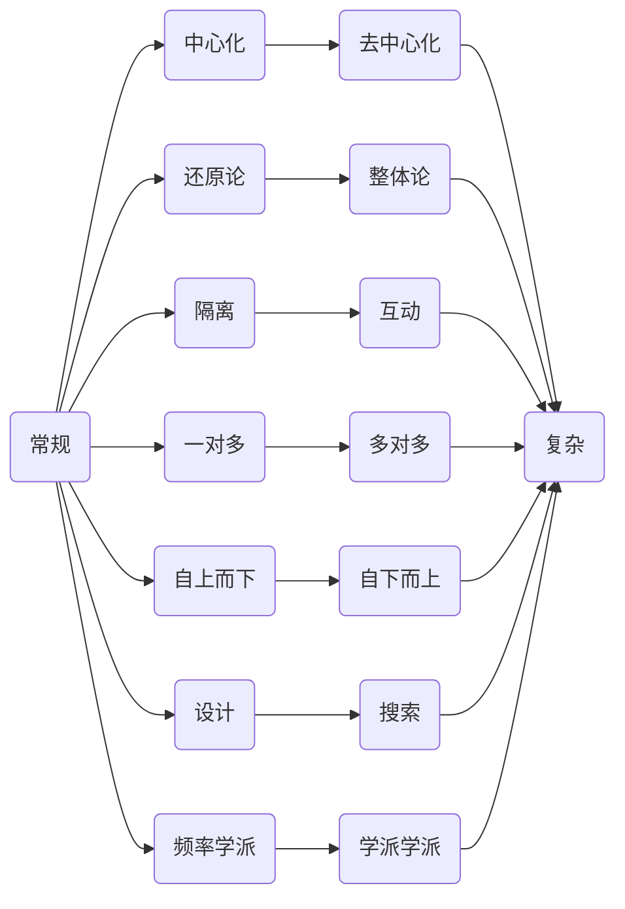
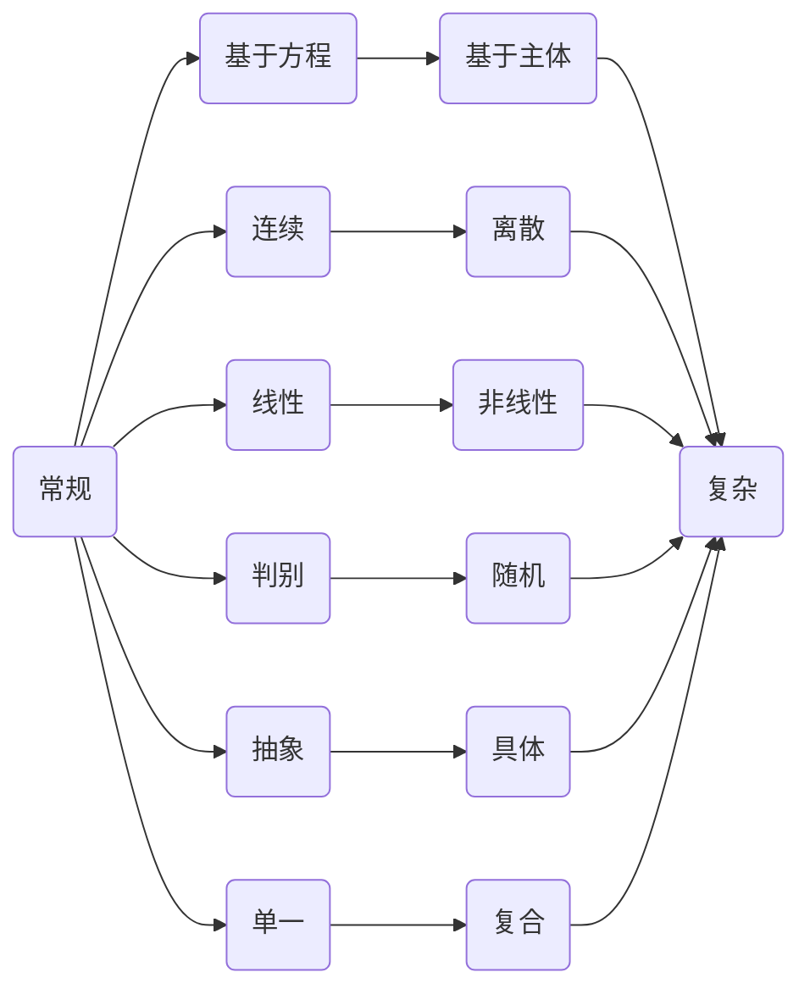

# 复杂性概述

## 1. 三论

### 1.1. 广义系统论

提出人：贝塔朗菲（Ludwig von Bertalanffy，1901∼1972）

提出时间：1937 年

主要内容：

- 整体性，整体大于部分之和
- 关联性，离开关联性就不能揭示复杂系统的本质。
- 层级性，不同层级上的系统运动有其特殊性。
- 统一性，不同层级上的系统运动都存在组织化的倾向，而不同系统之间存在着系统同构。
- 环境适应性，开放系统的外部环境发生变化时，系统内各要素会自动调节，使系统达到新的平衡。

### 1.2. 控制论

提出人：维纳（Norbert Wiener，1894∼1964）

提出时间：1948 年

主要内容：

### 1.3. 信息论

提出人：香农（Claude Elwood Shannon，1916∼2001）

提出时间：1948∼1949 年

主要内容：

### 2.1. 耗散结构理论

提出人：香农（Claude Elwood Shannon，1916∼2001）

提出时间：1948∼1949 年

### 2.2. 协同论

### 2.3. 突变论

## 3. 观念的变换

### 3.1. 模型的轴线

### 3.2. 思维的轴线

