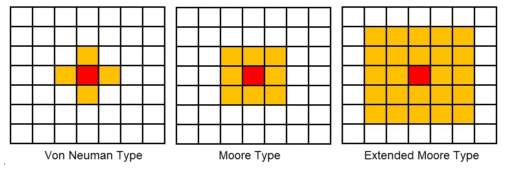
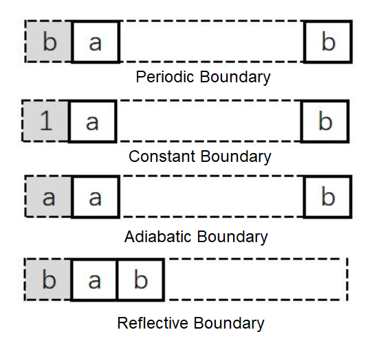

# 细胞自动机

## 1. 引言

### 1.1. 构成

细胞自动机（cellular automata，CA）是一个描述世界的模型，带有非常简单的物理。由冯·诺伊曼（John von Neumann，1903∼1957）和乌拉姆（Stanisław Marcin Ulam，1909∼1984）于 20 世纪 40 年代提出。

标准 CA 是一个由"细胞"、"细胞状态"、"邻域"和"状态更新规则"构成的四元组，数学上，可表示为

$$
𝑨 = (L_d, S, N, f)
$$

- $𝑨$：细胞自动机系统
- $L$：细胞空间
- $d$：细胞空间的维度
- $S$：细胞有限的、离散的状态集合
- $N$：某个邻域内所有细胞的集合
- $f$：局部映射或局部规则

### 1.2. 空间和邻居

- 细胞：细胞自动机最基本的组成部分。细胞分布在离散的 Euclidean 空间位置上，每个时刻有着离散的状态，如 $\{0, 1\}$ 等。
- 细胞空间：细胞所分布在 Euclidean 空间上的网格点的集合。最常见的为二维细胞空间，通常可按三角形、四边形和六边形三种网格排列。
- 邻居：细胞自动机的演化规则是局部的，对于指定细胞的状态进行更新时只需要知道其临近细胞的状态。某一细胞状态更新时要搜索的空间域称为该细胞的邻居。
- 邻居的划分：在四方网格划分下的二维细胞自动机的邻居通常有以下三种形式：

### 1.3. 边界

- 边界条件：实际模拟细胞自动机的演化时不可能处理无限网络，系统必须是有边界的。处理边界格点时，可为边界的信息进行编码，由此选择不同的演化规则。另一种方法是在边界处扩展，以满足边界有与内部类似的邻居。
- 周期型边界：周期型是指相对边界连接起来的细胞空间。这种空间与无限空间最为接近，进行理论探讨时，常以此类空间作为实验进行模拟。
- 固定边界：所有边界外细胞均取某一固定常量。
- 绝热边界：边界外细胞的状态始终和边界细胞的状态保持一致。
- 反射边界：在边界外邻居的细胞状态是以边界细胞为轴的镜面反射

## 2. 简单 CA

### 2.1. 零维 CA

考虑带有单个细胞的 CA（也称零维 CA，不涉及空间）。细胞状态是用变 量$x_i$表示的整数，其中下标$i$表示$x_i$是时间步骤$i$期间的系统状态。作为初始条件，$x_0 = 0$。制定一个规则

$$
x_i = x_{i-1} + 1
$$

执行简单的计算，即计数。

但，这个 CA 是不合规则的；可能的状态数通常是有限的。为了使其成立，选择状态个数$k =2$，和另一个简单的规则

$$
x_i = (x_{i-1} + 1)≡ 2
$$

这个 CA 的行为很简单：闪烁。即，在每个时间步之后，细胞的状态在$0$和$1$之间切换。

大多数 CA 是确定性的，这意味着规则没有任何随机元素；给定相同的初始状态，它们总是产生相同的结果。也有不确定性的 CA，但这里不涉及它们。

### 2.2. 初等 CA

初等 CA（elementary cellular automata）是状态集$S$只有两个元素，即状态个数$k =2$，邻居半径$r = 1$的一维 CA。其邻居个数为$N =2$。这样的局部规则的映射函数可写为如下形式：

$$
S_i^{t + 1} = f(S_{i-1}^t, S_i^t, S_{i+ 1}^t)
$$

此时，输入状态一共有$2^{2+1} = 8$种组合方式。每个输入条件都对应着两种输出状态$0$或$1$，一共存在$2^8=256$种状态组合。即，对于初等 CA 而言，总共存在$256$种规则。

> 假设一个细胞所具有的状态数为$k$，所使用的的邻居半径为$r$，则邻域内含$2r+ 1$个细胞，这样可能的输入条件的个数就是$k^{2r+ 1}$，总的规则数为$k^{k^{2r + 1}}$。

### 2.3. 规则与分类

沃尔夫勒姆（Stephen Wolfram，1959∼）在《一种新科学（A New Kind of Science）》和几篇从 80 年代中期开始的论文中根据 CA 呈现的范型（pattern）对 CA 进行了分类。按复杂性分类排序：

- I 类（homogenous）：自任何初始状态开始，经过一定时间运行后，细胞空间趋于一个空间平稳的构形，这里空间平稳即指每个细胞处于固定状态。不随时间变化而变化。
- II 类（periodic）：经过一定时间运行后，细胞空间趋于一系列简单的固定或周期范型。由于这些结构可看作是一种滤波器，故可应用到图像处理的研究中。
- III 类（chaotic）：自任何初始状态开始，经过一定时间运行后，细胞自动机表现出混沌的非周期行为，所生成的结构的统计特征不再变化，通常表现为分形分维特征。可用于产生随机数。
- IV（complex）：出现复杂的局部结构，或说是局部的混沌，其中有些会不断地传播。

2004 年，Wolfram 的研究助理 Matthew Cook 证明了初等 CA 中的规则 110 是通用的 [^1]，即，任何计算机可完成的任何计算都可由该 CA 完成。

### 2.4. 一维 CA

在一维 CA 中，有三种自然范型：

- 有限序列：数量有限的细胞排成一排。除第一个和最后一个之外的所有细胞都有两个邻居。
- 环：数量有限的细胞排列成一个环。所有细胞都有两个邻居。
- 无限序列：数量无限的细胞排列成一排。

## 3. 二维 CA

### 3.1. 生命游戏

约翰·康威（John Horton Conway，1937∼2020）的生命游戏（GoL，1970）是一种使用 Moore 邻域的二维 CA，遵循简单的规则并产生令人惊讶的复杂行为。就像 Wolfram 的规则 110 一样，事实证明 GoL 是 Turing 完备的；即，至少在理论上它可计算任何可计算的函数。

在二维 CA 的所有可能规则中，大多数产生简单的行为：大多数初始条件快速稳定或无限增长。通过避免无趣的 CA，Conway 也避免了 Wolfram 的一类（固定）和二类（周期）行为，且可能还有三类（混沌）。

在 GoL 中，每个单元格的下一个状态取决于其当前状态和活动邻居的数量。这种规则可概括为 DSRO（Death, Survival, Reproduction, Overpopulation）。

- 若细胞的生前邻居数量 \< D 或 > O，则细胞死亡；
- 若细胞的生前邻居数量 ⩽ S，则细胞存活；
- 若细胞的生前邻居数量 ⩾ R 且 ⩽ O，则细胞复活。

当 DSRO = (2, 3, 3, 3)，若一个细胞是活的，若它有两个或三个活动邻居就会生存，否则就会死亡。若一个细胞是死的，它将保持死亡，除非它恰好有三个邻居。

| 当前状态 | 邻居数量 | 下一个状态 |
| :------: | :------: | :--------: |
|   生存   |   2∼3    |    生存    |
|   生存   | 0∼1, 4∼8 |    死亡    |
|   死亡   |    3     |    生存    |
|   死亡   | 0∼1, 4∼8 |    死亡    |

从最初的条件来看，GoL 会迅速达到稳定状态，活细胞数量几乎不变（可能带有一些振荡）。但，一些简单的开始条件，需要很长时间才能稳定下来，并产生令人惊讶的活细胞数量。这些模式被称为寿星（Methuselahs，《旧约·创世纪》中，一位活了 969 年的牧首）。

生命游戏非常接近于秩序与混沌的边界。若对 CA 的规则进行某种程度的改变，CA 可能会形成永恒的生长，以稳定的速度不断向外生长。另一种可能是，CA 变得非常混乱，以至于生命似乎是随机的，没有形成任何规律，没有保留一丝一毫的秩序，少量的秩序使 CA 具有生命力。生命游戏恰巧落在了两者之间，即属于此前提到的复杂型 CA。规则使其具有很好的不可预测性，有一些漂亮的模式和有趣的现象出现。

### 3.2. 生命的范型

一般来说，稳定的生命范型至少有如下三类：

- 静物（still-life）：静物形的状是稳定的，除非其他形状与之碰撞，可认为其周期为 1。常见形状有
  - 块（block）：由 4 个细胞组成，类似汉字的"田"；
  - 蜂巢（beehive）
  - 面包片（loaf）
  - 舟（boat）
  - 船（ship）
- 振荡器（oscillators）：振荡器的形状会随着时间的推移而重复出现。例如，闪烁器（blinker）是一个周期为 2 的振荡器。它由 3 个连续线性细胞（上下或左右）组成，在水平方向和垂直方向之间旋转。
- 飞船（spaceship）：可在生命世界中移动的形状被称为 "飞船"。例如，滑翔机（glider）由 5 个细胞组成，形成一个小箭头形状，周期为 4。
- 炮（gun）是一类特别的范型，它的主体部分会像振荡器一样，周期性地重复出现，也会周期性地发射出飞船。1970 年，自诩为黑客的 Bill Gosper 发现了第一把滑翔机炮（glider gun）。这一发现最终证明了康威的"生命游戏"是通用的，并能像图灵机一样工作。

### 3.3. Langton 蚂蚁

Langton 蚂蚁是另一个经典的二维 CA，由克里斯·朗顿（Chris Langton，1948 ∼）于 1986 年提出 [^2]。平面上的正方形格子被填上黑色或白色。在其中一格正方形内有一只"蚂蚁"。蚂蚁的头部朝向为：上下左右其中一方。蚂蚁的移动规则十分简单：

- 若蚂蚁在黑格，右转 $90°$，将该格改为白格，并向前移一格；
- 若蚂蚁在白格，左转 $90°$，将该格改为黑格，并向前移一格。

规则虽然简单，蚂蚁的行为却十分复杂。刚刚开始时留下的路线都会有接近对称，像是会重复，但不论起始状态如何，蚂蚁经过漫长的混乱活动后，会开辟出一条规则的"高速公路"。

### 3.4. $λ$ 法则

Langton 对 CA 的另一个重要贡献是提出了$λ$法则，通过该法则，可对任一个 CA 的可预测性进行分类。
起初，Langton 做了一个量表；量表的范围在 0 到 1 之间，0 表示固定的、有序的、可预测的。当按小数点往上爬时，刻度的"面积"就从有序变成了所谓的周期性，然后又变成了复杂，最后，在这之上，就是混沌。

要计算出 CA 的$λ$值很容易。它仅仅是一个细胞的新状态所处的规则的分数，用小数表示。即，导致生命的规则越多，$λ$值就越大。在 CA 中，棋盘上的细胞越多，平面就越混沌。当棋盘变得更自由时，它就会变得有序。因为 CA 要简化得多，通常每个单元格都有 2 个状态，故通常把死亡看成是"清场"。

这种$λ$值的效果出奇的好。以 Wolfram 的一维 CA 为例。若把细胞的状态算作邻居的话，有 3 个邻居，故有$2^3 = 8$ 个不同的规则（相比之下，生命游戏是 512 个）。设置背景状态为 0，对于任意表，计算表中非零元素个数。$λ$的计算公式如下：

$$
λ = \frac{s^n -n_q}{s^n} = 1 - \frac{n_q}{s^n}
$$

其中，$s$为每个细胞的状态个数，$n$为邻域集合大小，$n_q$为非零元素个数。

对于$λ$讨论结果大致如下：

- $λ ∈ [0, 0.1]$时，所有细胞被吸引至某种固定状态，此时的 CA 属于固定型；
- $λ ≈ 0.2$时，系统在一些固定状态下循环，此时 CA 属于周期型；
- $λ = 0.3$时，CA 开始趋向于复杂型；
- $λ ∈ [0.3, 0.6]$时，此时 CA 属于复杂型，复杂度随$λ$递增；
- $λ ∈ [0.6, 1.0]$时，系统复杂结构消失，此时 CA 属于混沌型；

|  000 |  001 |  010 |  011 |  100 |  101 |  110 |  111 |
| ---: | ---: | ---: | ---: | ---: | ---: | ---: | ---: |
|    0 |    1 |    1 |    0 |    1 |    1 |    0 |    0 |

上表有 4 个规则代表生，$λ = 1 -4/2^3 = 0.5$。这似乎是个不错的值，使这个 CA 落入复杂领域。

[^1]: Cook, M. "Universality in Elementary Cellular Automata." Complex Systems 15, 1-40, 2004.  
[^2]: Christopher G Langton (1998). Artificial life: an overview. MIT Press.
