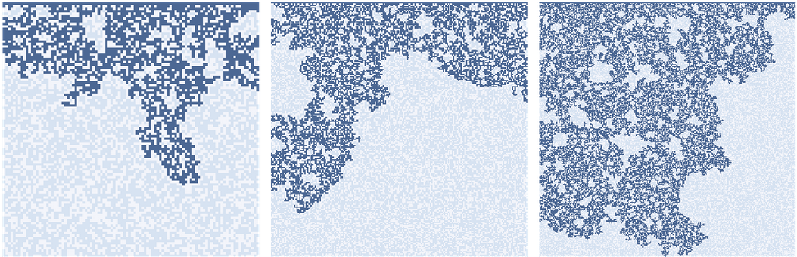
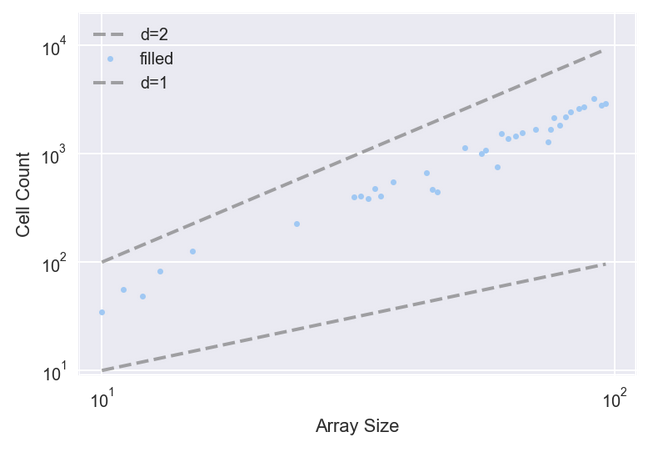
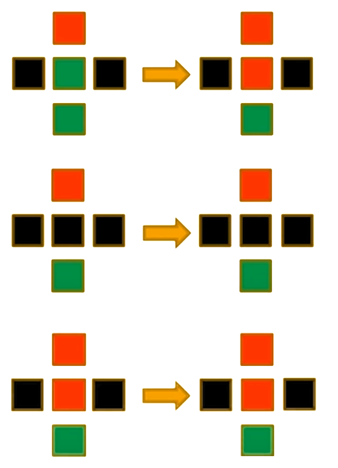
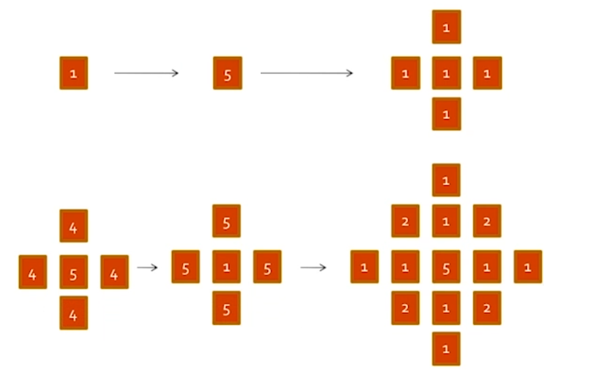
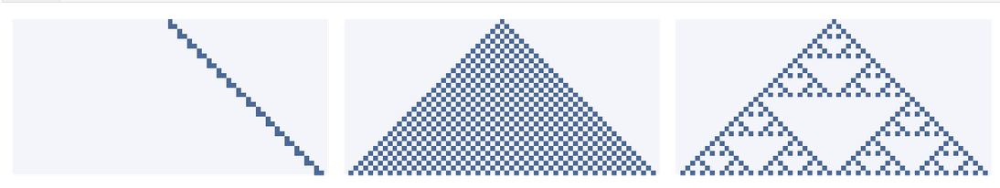
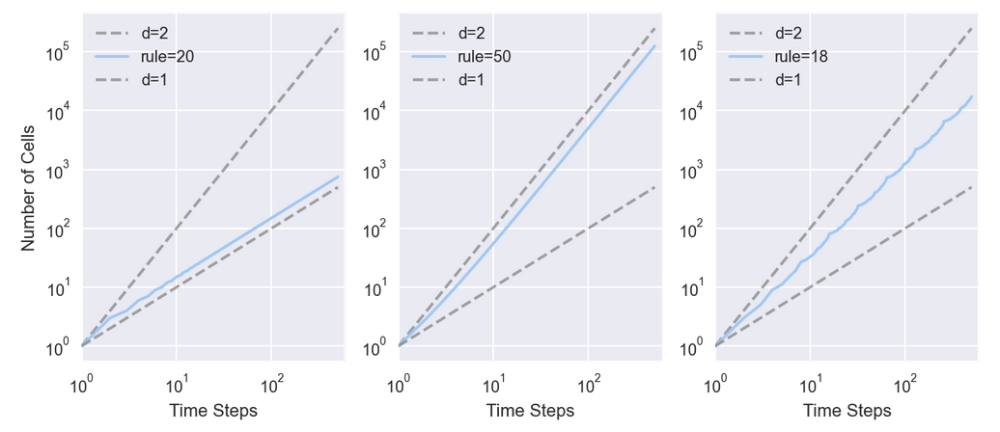
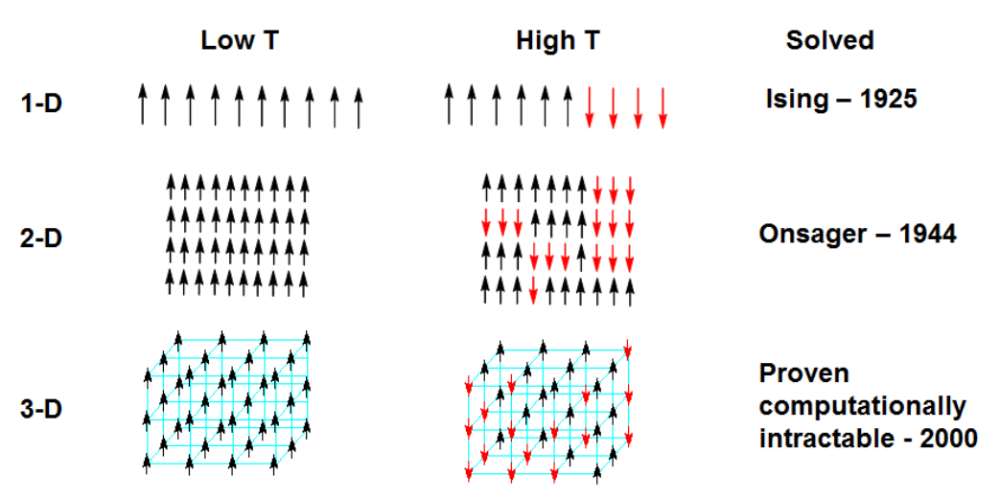

# 相变

## 1. 扩散

对于反应 - 扩散（reaction-diffusion，RD）模型，有两个数组，每种化学物质各一个。根据 [Sims](http://www.karlsims.com/rd.html) 的教程，使用一个包含对角线元素的内核。它们的权重较低，因为它们离中心单元更远。对于每一步，计算如下方程：

$$
ΔA = r_a ∇^2 A - AB^2 + f (1 - A)
$$

$$
ΔB = r_b ∇^2 B + AB^2 - (k + f) B
$$

其中，$∇^2$是内核近似的 LaPlace 算子。$r_a$和$r_b$分别为 A 和 B 的扩散速率，后者通常为前者的一半。$f$为进料速率，控制着 A 添加到系统的速度。$k$为移除速率，控制 B 从系统中移除的速度。

### 1.1. 渗流

渗流（percolation）是流体流过半多孔材料的过程。实例包括岩层中的油，纸中的水和微孔中的氢气。渗流模型也用于研究不是严格渗滤的系统，包括流行病和电阻网络。

渗流模型常常用随机图来表示，但也可用细胞自动机表示。简单的渗流模型的搭建过程如下：

- 每个细胞为多孔的概率为$p$，且除了顶部那行是湿的外，所有单元均是干的。
- 在每个时间步中，若多孔细胞至少有一个湿的邻居，它会变湿。非多孔细胞保持干燥。
- 模拟运行直至达到不再有细胞改变状态的固定点。
- 若存在从顶部到底部的湿细胞路径，则 CA 具有渗流簇。

临界值附近的行为的快速变化称为相变（phase transition），类似于物理系统中的相变，例如水在冰点处从液体变为固体的方式。在处于或接近临界点时，各种各样的系统展示了一组共同的行为和特征。这些行为被统称为临界现象。

下图点展示了每个渗流簇中的细胞数。拟合这些点的线的斜率大约为 1.85，这表明当$p$接近临界值时，渗滤簇实际上是分形的。

- 当$p$> 临界值时，几乎每个多孔细胞都被填充，因此湿单元的数量仅为$p*\mathrm{size}^2$，它的维度为$2$。
- 当$p≪$临界值时，湿细胞的数量与 CA 的线性大小成比例，因此它的维度为$1$。

### 1.2. 林火

1990 年，Per Bak（1947∼2002）、Chen 和 Chao Tang（汤超，1958~）提出了一种 CA，它是一种林火的抽象模型 [^1]。每个细胞处于三种状态之一：空地、树木、着火。这个 CA 参照了常规的渗流模型，其规则是：

- 空细胞以概率$p$被占用。
- 若任何一个邻居着火，则带有树的细胞就会燃烧。
- 即使没有邻居着火，带有树的细胞自发燃烧，概率为$f$。
- 在下一个时间步中，着火的细胞变为空细胞。

假设参数$p = 0.01$且$f = 0.001$

## 2. 自组织临界

### 2.1. 临界系统

许多临界系统表现出常见的行为：

- 分形几何：例如，冷冻的水倾向于形成分形图案，包括雪花和其他晶体结构。分形的特点是自相似性；即，图案的一部分与整体的缩放副本相似。
- 一些物理量的重尾分布：例如，在冷冻的水中，晶体尺寸的分布是幂律分布的。
- 呈现粉红噪声的时间变化。复合信号可分解为它们的频率分量。在粉红噪声中，低频分量比高频分量功率更大。具体而言，频率$f$处的功率与$1 / f$成正比。

临界系统通常不稳定。例如，为了使水保持部分冷冻状态，需要主动控制温度。若系统接近临界温度，则小型偏差倾向于将系统从一个相位移到另一个相位。许多自然系统表现出典型的临界性行为，但若临界点不稳定，它们本质上不应该是常见的。

### 2.2. 沙堆

沙堆（Sand Pile）由 Per Bak，Chao Tang 和 Kurt Wiesenfeld 于 1987 年提出 [^2]。它用大量与邻居互动的元素来模拟物理系统，解决了上述疑惑。这种解决方案称为自组织临界（self-organized criticality，SOC），其中，自组织意味着从任何初始状态开始，系统会不断转向临界状态，并停留在那里，无需外部控制。

沙堆模型是一个二维 CA，每个细胞的状态代表沙堆的部分斜率，拥有 $5$ 种状态（沙堆有 $5$ 种高度，或每个格点有 $1~5$ 粒沙子）。在每个时间步中，检查每个细胞来查看它是否超过临界值$K$，通常是$3$。若是，则它会"倒塌"并将沙子转移到四个相邻细胞；即，细胞的斜率减少$4$，且每个邻居增加$1$。在网格的周边，所有细胞保持为斜率$0$，故多余的会溢出边缘。

Bak 等人首先将所有细胞初始化为大于$K$的水平，然后运行模型直至稳定。然后他们观察微小扰动的影响；他们随机选择一个细胞，将其值增加$1$，然后再次运行模型，直至稳定。

对于每个扰动，他们测量$T$，这是沙堆稳定所需的时间步数，$S$是倒塌的细胞总数 [^3]。大多数情况下，放置一粒沙子不会导致细胞倒塌，因此$T = 1$和$S = 0$。但偶尔一粒沙子会引起雪崩，影响很大一部分网格。结果表明，$T$和$S$的分布是重尾的，这支持了系统处于临界状态的断言。这意味着从最初的状态开始，它不需要外部控制，就可向临界状态发展。随着更多沙粒的添加，模型仍处于临界状态。

### 2.3. 频谱密度

频谱分析指任何信号都可分解为一组具有不同音量或功率的频率分量。频谱分析是寻找构成信号的成分和它们的功率的过程，称为其频谱（spectrum）。

为了计算信号的频谱，可使用快速 Fourier 变换（fast Fourier transform，FFT）。唯一的问题是噪声信号的频谱往往是嘈杂的。但，可通过将一个长信号分成多个段，计算每个段的 FFT，然后计算每个频率的平均功率来使其平滑。

## 3. 复杂性特征

### 3.1. 分形

理解分形（fractal）必须从维度开始。对于简单的几何对象，维度根据缩放行为而定义。例如，若正方形的边长为$1$，则其面积为$1^2$。其中，指数$2$表示正方形是二维的。更一般地，可通过测量一个对象的尺寸（通过一些定义），将对象的维度估计为线性度量的函数。例如，通过测量一维 CA 的面积，将它的维度估计为行数的函数。

用以下函数来估计这些 CA 的维度，该函数计算每个时间步之后的细胞数。它返回一个元组列表，其中每个元组包含$i$和$i^2$，用于比较，以及细胞总数。

- 规则 20（左）每两个时间步产生三个细胞，故$i$步后的细胞总数为$y = 1.5*i$。两边取对数得$\log y = \log 1.5 + \log i$，故在双对数刻度上，线的估计的斜率为 1.01。
- 规则 50（中）在第$i$个时间步骤中产生$i + 1$个新细胞，因此$i$步之后的细胞总数为$y = i^2 + i$。若忽略第二项并取两边的对数，有$\log y ∼ 2 \log i$，故当$i$变大时，预计看到一条斜率为$2$的线。事实上，估计的斜率为$1.97$。
- 规则 18（右），估计的斜率大约是$1.57$，这表明其生成的图案具有"分数维度"；即，它是一个分形。

### 3.2. 幂律

在统计学中，幂律（power-law）是指两个量之间的函数关系，其中一个量的相对变化会导致另一个量的一个幂的相对变化。例如，用正方形的边长来考虑一个正方形的面积，若长度增加一倍，则面积乘以 4 的倍数。

幂律的一个特性是它们的标度不变性。给定一个关系 $f(x) = ax- k$，将参数$x$放缩一个常数$c$，只会导致函数本身的比例缩放。即

$$
f(cx) = a(cx)^{-k} = c^{-k} f(x) ∝ f(x)
$$

即，用一个常数$c$简单地将原始幂律关系乘以常数$c^{-k}$。故，**所有的幂律均是等效的**，因为每个定律都只是其他定律的放缩版本。这种行为就是当$f(x)$和$x$的对数时产生线性关系的原因，而**双对数（log-log）图上的直线通常被称为幂律的特征**。幂律定律的几个著名例子是 Pareto 准则（Pareto principle）、分形体的结构自相似性（self-similarity）和生物系统中的放缩定律（allometry）。

> 双对数图中，直线意味着无标度（scale-free）

对于真实数据来说，这种直线性是遵循幂律关系的必要条件，但不是充分条件。事实上，有许多方法可产生有限量的数据来模仿这种签名行为，但在它们的近似极限下，并不是真正的幂律（例如，某些数据的产生过程遵循对数）。

- $k>2$时，幂律$x^{-k}$在$x ∈ [1, ∞)$上有一个定义好的均值；
- $k>3$时，幂律$x^{-k}$的方差才是有限的；
- $k>1$时，存在中位数$m_d$，且$m_d=2^{1 /(k-1)} x_{\min}$[^4]

自然界中大多数已确定的幂律都有这样的指数，即均值是很好定义的，但方差不是，这意味着它们能够发生黑天鹅（black swan）行为 [^5]。这使得基于方差和标准差的传统统计方法在此处应用是不正确的。

### 3.3. 重尾分布

在概率论中，重尾分布（Heavy-tailed distributions）是指尾部不受指数约束的概率分布。即，它的尾部比指数分布的尾部更重。在许多应用中，人们关心的是分布的右尾，但一个分布可能有重尾的左尾，也可能两个尾均是重尾。

重尾分布有三个重要的子类：肥尾分布（fat-tailed distributions）、长尾分布（long-tailed distributions）和亚指数分布（sub-exponential distributions）。实际上，所有常用的重尾分布都属于亚指数族。

肥尾分布是指概率密度函数在$x$较大的情况下以$x^{-k}$为幂的方式归零的分布。由于这样的幂总是被指数分布的概率密度函数所约束，故肥尾分布总是重尾分布。但，有些分布的尾部归零速度比指数函数慢（意味着它们是重尾分布），但比幂快（意味着它们不是肥尾分布）。如对数 - 逻辑和 Pareto 分布亦为肥尾分布。

### 3.4. 粉红噪声

为了了解粉红噪声（pink noise），必须了解信号和噪声。

- 信号：信号是随时间变化的任何数量。
- 噪声：通常是一种不需要的声音，但在信号处理的情况下，它是一个包含许多频率成分的信号。噪声有很多种。
  - 白噪声：一种信号，它在很宽的频率范围内拥有相同功率的成分。其他种类的噪声在频率和功率之间有不同的关系。
  - 红噪声：频率为$1 / f^2$

更一般地，

$$
P(f) = 1 / f^β
$$

对两边取对数得，

$$
\log P(f) = −β \log f
$$

当$β = 0$时，该等式描述白噪声; 当$β = 2$时，该等式描述红噪声。任何介于 0 和 2 之间的噪声称为噪声。当$β ≈ 1$时，称为$1/f$噪声。若在双对数刻度上绘制功率与频率的关系，预计有一条斜率为$β$的直线。

## 4. 复杂相变

### 4.1. Ising 模型

Ising 模型的提出（Ising model）是为了解释铁磁物质的相变，即磁铁在加热到一定临界温度以上会出现磁性消失，而降温到临界温度以下又会表现出磁性的现象。这种有磁性、无磁性两相之间的变换，是一种连续相变（也叫二级相变）。

Ising 模型设铁磁物质是由一堆规则排列的小磁针构成，每个磁针只有上下两个方向（自旋）。相邻的小磁针之间通过能量约束发生相互作用，同时又会由于环境热噪声的干扰而发生磁性的随机变换（上下互变）。涨落的大小由关键的温度参数决定，温度越高，随机涨落干扰越强，小磁针越容易发生无序而剧烈地状态变换，从而让上下两个方向的磁性相互抵消，整个系统消失磁性，若温度很低，则小磁针相对宁静，系统处于能量约束高的状态，大量的小磁针方向一致，铁磁系统展现出磁性。而当系统处于临界温度的时候，Ising 模型表现出一系列幂律行为和自相似现象。

Ising 模型的 Hamiltonian 可以写作

$$ H(σ) = −\sum_{⟨ij⟩} J_{ij} σ_i σ_j − μ\sum_j h_j σ_j $$

其中，$σ ∈ \{-1, +1\}$为自旋方向，$μ$为磁矩，$h_j$为磁场，$J_{ij}$为相互作用。请注意，由于电子的磁矩与其自旋反平行，因此上述 Hamiltonian 第二项中的符号实际上应为正数，但传统上使用的是负数。

| $J?0$ | 交互作用 | $h_j?0$ | 自旋点 j 倾向排列 |
| :---: | :------: | :-----: | :---------------: |
|   >   |  顺磁性  |    >    |      正方向       |
|   <   |  逆磁性  |    <    |      负方向       |
|   =   |  无磁性  |    =    |      无倾向       |

自旋的配置概率（configuration probability）由 Boltzmann 分布给出

$$
P_β(σ) = e^{-βH(σ)} / Z_β
$$

其中，$β = 1/{k_B T} > 0$为温度，$Z_β$为归一化因子，又称配分函数（partition function）

$$
Z_β = \sum_σ e^{-βH(σ)}
$$

:::{admonition} Ising 模型

Ising 模型由物理学家 Wilhelm Lenz（1888∼1957）于 1920 年提出，其一维形式由其学生 Ernst Ising（1900∼1998）求解，但，并没有发现相变现象。随后，Lars Onsager（1903∼1976）于 1944 年对二维的 Ising 模型进行了解析求解，并发现了其中的相变现象，从而引起了更多学者的注意。

:::

由于 Ising 模型的高度抽象，可很容易地将它应用到其他领域之中。例如，将每个小磁针比喻为某个村落中的村民，而将小磁针上、下的两种状态比喻成个体所具备的两种政治观点，相邻小磁针之间的相互作用比喻成村民之间观点的影响。环境的温度比喻成每个村民对自己意见不坚持的程度。这样，整个模型就可建模该村落中不同政治见解的动态演化。

另一方面，若将小磁针比喻成神经元细胞，向上向下的状态比喻成神经元的激活与抑制，小磁针的相互作用比喻成神经元之间的信号传导，则，Ising 模型的变种还可用于建模神经网络系统，从而搭建可适应环境、不断学习的机器，如 Hopfield 网络或 Boltzmann 机。

[^1]: A forest-fire model and some thoughts on turbulence". Physics Letters A. Elsevier BV. 147 (5–6): 297–300 
[^2]: Self-organized criticality: an explanation of 1/f noise". Physical Review Letters. 59 (4): 381–384.  
[^3]: 原始论文使用了 S 的不同定义，但，后来的工作使用了这个定义。 
[^4]: Newman, Mark EJ. "Power laws, Pareto distributions and Zipf's law." Contemporary physics 46.5 (2005): 323-351.  
[^5]: Newman, Mark EJ.; Reggiani, Aura; Nijkamp, Peter (2005). "Power laws, Pareto distributions and Zipf's law". Cities. 30 (2005): 323–351
