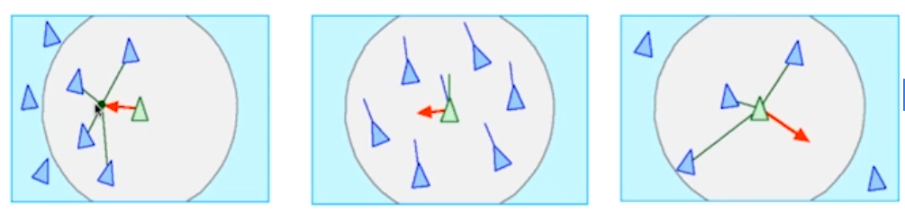
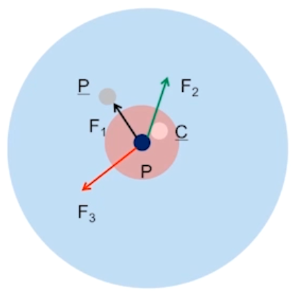
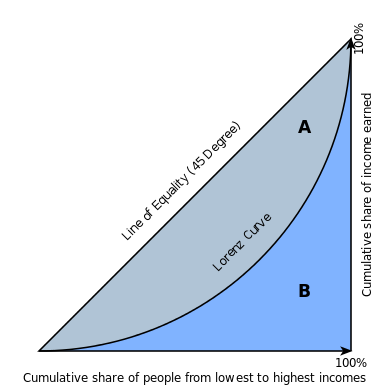

# 多主体建模

## 1. 多角色聚类

### 1.1. 英雄与懦夫

英雄与懦夫（Heroes and Cowards）这个游戏的起源很难确定。在 20 世纪 80 年代和 90 年代，意大利一个叫 Fratelli 剧团的剧团将这个游戏作为一种即兴活动。1999 年在马萨诸塞州剑桥市举行的"拥抱复杂性"会议上，弗拉泰利剧团与参会人员一起进行了这个游戏，这似乎是有记录的第一个公开游戏实例。

玩这个游戏，需要一群人。游戏开始时，要求每个人挑选一个人做他们的"朋友"和另一个人做他们的"敌人"。游戏有两个阶段。

- 阶段一：人们被要求表现为懦夫。为了表现得像个懦夫，你要移动，以便确保你的朋友总是在你和你的敌人之间（有效地，以懦弱的方式从你的朋友背后躲避你的敌人）。这个阶段的游戏，房间的中心变得空荡荡的，因为人们"逃离"了敌人。
- 阶段二：人们被要求表现为英雄，即在朋友和敌人之间移动（有效地保护你的朋友从你的敌人以英雄的方式）。第二个阶段时，房间的中心变得非常拥挤。这是一个戏剧性的差异。

### 1.2. 聚会

一个鸡尾酒会现场，人们三五成群地闲聊，于是产生如下场景：

- 若一个组中的异性比例过多，由于尴尬，人们会转向另一组；
- 适当的异性比例会为聚会带来乐趣；

于是对于这个场景，便有如下模型：

- 存在$n$个组
- 初始条件下，组$i$有$x_i$个人，每个人的性别为 $0$ 或 $1$（color 表示）
- 每个 Agent 做如下决策：
  - 考察本组内异性比例$r$
  - 若$r>p$，则随机选择其他组，反之，停留

### 1.3. 谢林模型

1971 年，谢林（Thomas C. Schelling，1921∼2016）发表了《Dynamic Models of Segregation》，该模型提出了种族隔离的简单模型。谢林模型的世界是一个网格；每个细胞代表一栋房子。房屋被两种主体占用，标记为红色和蓝色，数量大致相同。大约 10% 的房屋是空的。

在任何时候，主体可能会高兴或不高兴，这取决于领域中的其他主体，每个房屋的邻居是八个相邻细胞的集合。在一个版本的模型中，若主体至少有两个像他们一样的邻居，主体会高兴，但若是一个或零，他们就会不高兴。模拟的过程是，随机选择一个主体并检查他们是否高兴。若是这样，没有任何事情发生。若不是，主体随机选择其中一个未占用的细胞并移动。

模拟的过程是，随机选择一个主体并检查他们是否高兴。若是这样，没有任何事情发生。若不是，主体随机选择其中一个未占用的细胞并移动。很快，会出现相似主体的群落。随着时间的推移，这些群落会不断聚合，直到有少量的大型群落，且大多数主体生活在同质社区中。

若不知道这个过程，只看到结果，你可能会认为主体是种族主义者，但实际上他们都会在一个混合的社区感到非常高兴。由于他们不愿意数量过大，故在最坏的情况下，他们可能被认为是排外的。当然，这些主体是真实人物的过度简化，故这些描述可能根本不恰当。种族主义是一个复杂的人类问题；很难想象这样简单的模型可揭示它。但实际上，它提供了一个强有力论据，有关系统及其各部分之间关系的：若你观察真实城市的隔离，你不能总结为，个人的种族主义是直接原因，或，城市居民是种族主义者。当然必须牢记这个论述的局限性：谢林模型证明了隔离的一个可能原因，但没有提到实际原因。

### 1.4. 帕累托分布

帕累托分布是是一种幂律分布，用于描述社会、科学、地球物理、精算和许多其他类型的可观察现象。其最初被帕累托（Vilfredo Pareto，1848∼1923）用于描述社会中的财富分布 [^1]，它拟合了一小部分人掌握了很大一部分财富的趋势。

现在，帕累托分布已经成为人们所熟知的帕累托原理（Pareto principle），即"80-20 法则"（80-20 rule）。该法则指出，一个社会 80% 的财富是由 20% 的人口所掌握的。通过实证观察发现，80-20 的分布符合多种情况，包括自然现象 [^2] 和人类活动 [^3]。但不应该把帕累托分布与帕累托原则混为一谈，因为前者只对特定的幂$k$（$k = \log₄ 5 ≈ 1.16$）产生这一结果，而$k$是可变的。

Pareto 分布遵循幂律分布，其 PDF 为

$$
f_{X}(x) =
\begin{cases}
   \dfrac{kx_m^{k}}{x^{k+1}} & x ⩾ x_m \\
   0 & x<x_m
\end{cases}
$$

当绘制在线性轴上时，分布假设为 J 形曲线，该曲线在正交轴上的每一条正交轴上均是近似的。所有的曲线段均是自相似的（根据适当的缩放系数）。当绘制成双对数图时，分布用一条直线表示。

- $k < 1$时，分布不存在均值；
- $k ∈ [1, 2]$，分布存在均值，但均值无代表性；

## 2. 多行为竞争

### 2.1. 糖域

1996 年，Joshua M. Epstein 和 Robert Axtell 提出了糖域（SugarScape），这是一个人造社会的主体模型，旨在支持经济学和其他社会科学的相关实验。糖域是一款多功能的模型，适用于各种主题。

糖域最简单的形式是一个简单的经济模型，展现财富的转移过程。主体在二维网格上移动，收集和累积代表经济财富的"糖"。网格的一些部分比其他部分产生更多的糖，且一些主体比其他人更容易找到它。这个糖域的版本常用于探索和解释财富的分布，特别是不平等的趋势。在糖域的网格中，每个细胞都有一个容量，这是它可容纳的最大糖量。在原始状态中，有$2$个高糖区域，容量为$4$，周围是同心环，容量分别为$3, 2, 1$。

#### 2.1.1. 迭代

现在有随机放置的$400$个主体。每个主体有 3 个随机选择的属性：

- 糖：每个主体最开始都有先天的糖分，从$5$到$25$之间均匀选择。
- 代谢：在每个时间步骤中，每个主体都必须消耗一定数量的糖，从$1$到$4$之间均匀选择。
- 视力：每个主体可"看到"附近细胞中糖量，并移动到最多的细胞，但，与其它主体相比，一些主体可看到更远的细胞。主体看到的距离从$1$和$6$之间均匀选择。

在每个时间步中，主体以随机顺序一次移动一格。每个主体都遵循以下规则：

- 主体在$4$个罗盘方向的每个方向上调查$k$个细胞，其中$k$是主体的视野范围。
- 它选择糖分最多的未占用的细胞。在相等的情况下，选择较近的细胞；在距离相同的细胞中，它随机选择。
- 主体移动到选定的细胞并收获糖分，将收获增加到其积累的财富并将细胞清空。
- 主体根据代谢消耗其财富的一部分。若结果总量为负数，主体"饿死"并被删除。

在所有主体完成这些步骤之后，细胞恢复一些糖，通常为$1$单位，但每个细胞中的总糖分受其容量限制。大多数主体正在移到糖最多的地区。视力高的主体移动速度最快；视力低的主体往往会卡在高原上，随机游走，直到它们足够接近来看到下一个水平。出生在糖分最少的地区的主体可能会饿死，除非他们的视力很好，先天条件也很高。在高糖地区，随着糖分的出现，主体相互竞争，寻找和收获糖分。消耗高或视力低的主体最有可能挨饿。当糖在每个时间步骤增加$1$个单位时，就没有足够的糖来维持开始的$400$个主体。种群起初迅速下降，然后缓慢下降，在大约$250$左右停下。

该模型还表现出一种财富不平等，一些主体积累糖的速度比其他主体快。但，对于财富分布，很难说具体的事情，因为它不是"静止的"。即，分布随着时间的推移而变化且不会达到稳定状态。但，若给主体有限的寿命，这个模型会产生固定的财富分布。在这个版本的模型中，主体的年龄在每个时间步增加，且从$60~100$之间的均匀分布中，随机选择一个寿命。若主体的年龄超过其寿命，它就会死亡。当主体因饥饿或年老而死亡时，它由属性随机的新主体所取代，故总人口是不变的。

## 3. 多行为排布

### 3.1. 鸟群

鸟群（Boids）是由 Craig W. Reynolds（1953~）于 1986 年开发的人工生命程序，模拟鸟类的成群行为 [^4]。与大多数人工生命模拟一样，Boids 的复杂性来自于单个代理，遵守一套简单的规则：

- 凝聚（cohesion）：向着局部鸟群的平均位置（重心）方向移动；
- 对齐（alignment）：向着局部鸟群的平均方向行驶；
- 分离（separation）：避免挤占局部鸟群同伴；

其推导可通过牛顿第二定律，即

$$
\begin{aligned}
  F &= m\dfrac{d𝒗}{dt} \\
  𝒗 &= \dfrac{𝒙}{dt}
\end{aligned}
$$

令$P̄$、$V̄$和$C̄$分别表示平均位置向量（重心），平均速度向量，和平均碰撞向量。

$$
\begin{cases}
  \displaystyle P̄ = ∑_{i=1}^{n_1} m_i P_i/(n_1 ∑_{i=1}^{n_1} m_i) \\
  \displaystyle V̄ = ∑_{i=1}^{n_1} m_i V_i/(n_1 ∑_{i=1}^{n_1} m_i) \\
  \displaystyle C̄ = ∑_{i=1}^{n_2} m_i P_i/(n_2 ∑_{i=1}^{n_1} m_i)
\end{cases}
$$

其中，$n_1$为邻居的个数，$n_2$表示将发生碰撞的邻居的个数。对质量归一化，则有

$$
\begin{cases}
  F_1 &= P̄ - P\\
  F_2 &= V̄ \\
  F_3 &= \dfrac{(P - C̄)}{| (P - C̄) |^2} \\
  F &= \displaystyle ∑_{i=1}^ 3 w_i F_i
\end{cases}
$$

其中，$w_i$为超参数。又由 Euler 公式，

$$
\frac{dV}{dt} ≈ \frac{V(t + 1) -V(t)}{t + 1 -t} = V(t + 1) -V(t)
$$

则

$$
V(t + 1) = V(t) + F / m
$$

类似地，

$$
P(t + 1) = P(t) + V(t)
$$

## 4. 背景知识

### 4.1. 相关术语

- 杠杆点（leverage point）：复杂系统可能以最少的努力从一种制度（regime）转移到另一种制度的位置。
- 引爆点（tipping point）：一个输入中的微小变化会对结果产生巨大影响的位置。
- 路径依赖（path dependence）：指当前的可能性被过去的选择所限制。
- 稳健性（robustness）：指系统在受到扰动后仍能保持其特性行为的性质。

### 4.2. 洛伦兹曲线

在经济学中，洛伦兹曲线（Lorenz curve）是收入或财富分配的图形化表示。它是由美国经济学家洛伦兹（Max O. Lorenz，1876∼1959）在 1905 年提出的，它经常被用于表示收入分配，在这里，它显示的是对于最底层的 X% 的家庭来说，他们所拥有的收入占总收入的百分比 y% 是多少。它还可用于表示资产的分布情况。

这个概念在描述生态学中的个体大小不平等方面很有用 [^5]，在生物多样性的研究中也很有用，在生物多样性的研究中，将物种的累积比例与个体的累积比例作图。它在商业建模中亦为有用的 [^6]：例如，在消费金融中，用于度量风险评分最差的 X% 的人的实际拖欠比例 Y%。

[^1]: Pareto, Vilfredo (1898). "Cours d'économie politique". Journal of Political Economy. 6.  
[^2]: VAN MONTFORT, M.A.J. (1986). "The Generalized Pareto distribution applied to rainfall depths". Hydrological Sciences Journal. 31 (2): 151-162.  
[^3]: Oancea, Bogdan (2017). "Income inequality in Romania: The exponential-Pareto distribution". Physica A: Statistical Mechanics and Its Applications. 469: 486-498.  
[^4]: Reynolds, Craig W. (1987). "Flocks, herds, and schools: A distributed behavioral model". Proceedings of the 14th Annual Conference on Computer Graphics and Interactive Techniques (SIGGRAPH'87). ACM. 21 (4): 25-34.  
[^5]: Damgaard, Christian; Jacob Weiner (2000). "Describing inequality in plant size or fecundity". Ecology. 81 (4): 1139-1142.  
[^6]: Wittebolle, Lieven; et al. (2009). "Initial community evenness favours functionality under selective stress". Nature. 458 (7238): 623-6 26.
