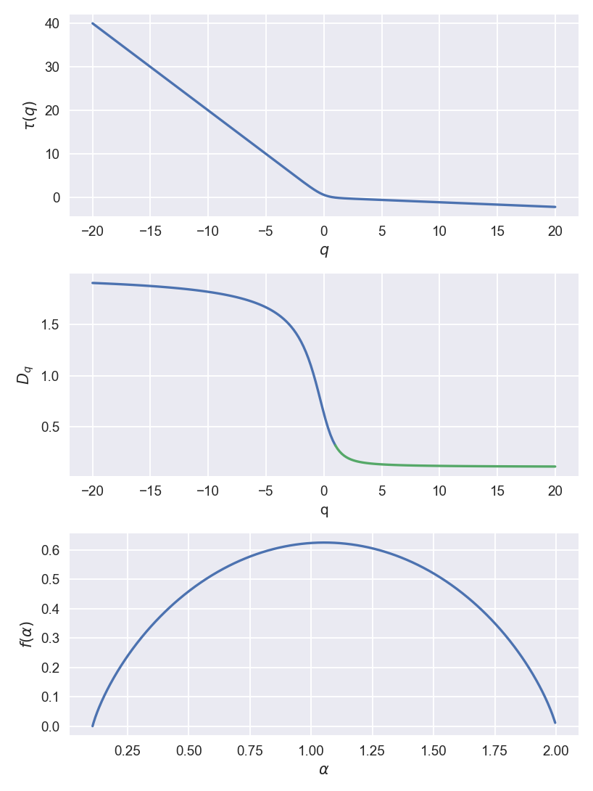

# 分形

## 1. 分形的构建

**分形**：分形是指在放大镜下显示出自相似性的物体，可用简单的图案（以不断缩小的比例重复的图像）来构建。虽然 Julia 集和 Mandelbrot 集不是真正的分形，但它们确实具有分形结构。

自然界中的许多物体在不同的标度上都显示出这种自相似性，例如，菜花、蕨类植物、树木、山脉、云朵，甚至血管网络都有一些分形结构。这些物体不能用线条、平面和球体的几何结构来描述。而是需要分形几何。

### 1.1. 牛顿分形

众所周知，在数值分析中 [^1]，可用牛顿法，或牛顿 - 拉弗逊法（Newton-Raphson）来求方程$f(z) = 0$的根，利用迭代公式

$$
z_{n+1} =z_n - \frac{f(z_n)}{f^{′}(z_n)}
$$

**牛顿分形**：牛顿分形是子午函数（meromorphic function），$z_{n+1} = f(z_n)$的 Julia 集，并表明数值方法对其初始起点的选择可非常敏感。

### 1.2. 康德分形

**康德集**：康德分形是 Georg Cantor 在 1870 年首先考虑的。它的构造是在每个构造阶段去掉一条线段的中间三分之一。因此在第 0 阶段，有一个单位长度的线段。在第 1 阶段，去掉中间的三分之一，留下两个长度各为 1/3 的线段。在第 2 阶段，将有 4 个长度各为 1/9 的线段。不难看出，在第$k$个阶段，将有$N = 2^{k}$段，每段长度为$l=3^{-k}$。

若这个过程一直持续到无穷大，则

$$
\begin{aligned}
  \lim_{k → ∞} 2^{k} = ∞ \\
  \lim_{k → ∞} 3^{-k} = 0
\end{aligned}
$$

故，康德集将由无限数量的离散点组成，不幸的是，这些点不可能在电脑屏幕上生成。通过使用三元数系统，可区分单位区间中哪些点属于康德集，哪些不属于。三元正数分数可通过应用一个简单的算法来扩展。三倍于有关分数的分子；当这个数字大于或等于分母时，减去分母，记下线上的三元因数，然后继续计算余数。如，$4/7= 0.\underline{120102}$

$$
\begin{gathered}
  & 1 & 2 & 0 & 1 & 0 & 2 & 1 & … \\
  \hline 4 & 12 & & & & & & & \\
  & 5 & 15 & & & & & & \\
  & & 1 & 3 & 9 & & & & \\
  & & & & 2 & 6 & 18 & & \\
  & & & & & & 4 & 12 & \\
  & & & & & & & 5 & …
\end{gathered}
$$

其中，小数点后的下划线代表一个循环小数。不难看出，康德集可通过三元分数只由 0 和 2 组成的点来确定。

### 1.3. Koch 分形

**Koch 曲线**：Helge von Koch 在 1904 年首次想象出 Koch 曲线。它是由四条长度各为$1/3$的线段组成的图案代替了一条单位线段。这里，在第$k$阶段，有$N =4^{k}$条线段，每条线段的长度为$l=3^{-k}$。因此对于构造到无穷大的数学分形来说

$$
\begin{aligned}
  \lim_{k → ∞} 4^{k} =∞\\
  \lim_{k → ∞} 3^{-k} = 0
\end{aligned}
$$

故数学上的 Koch 曲线由一条无限长的曲线组成。

**Koch 正方形**：考虑一个 Koch 曲线的变体，用 5 条长度各为$1/3$的线段代替一条线段来构造。此外，设这些曲线连接到一个单位正方形的外边。

可用下面的方法确定 Koch 正方形所限定的面积和周长。设在第$0$阶段，该正方形的面积为$A_0= 1$个平方单位。

$$
A_1 = 1 + 4(3^{-2})\ \mathrm{unit}^2
$$

第$2$阶段

$$
A_2 = 1 + 4(3^{-2}) + 4×5×(3^{-4})\ \mathrm{unit}^2
$$

第$k$阶段

$$
A_k = 1 + \frac{4}{9} + \frac{4}{9}*\sum_{i=1}^{k} \big(\frac{5}{9}\big)^i\ \mathrm{unit}^2
$$

当$k → ∞$

$$
A_{∞} = 1 + \frac{4}{9} + \frac{\frac{4×5}{9^2}}{1 - \frac{5}{3^2}} = 2\ \mathrm{unit}^2
$$

不难看出，第$k$阶段的周长$P_k$由以下公式给出

$$
P_k = 4 × \big(\frac{5}3\big)^{k}
$$

而$P∞=∞$。故，Koch 正方形的周长是无限的，面积是有限的。通过将 Koch 曲线附加到单位正方形的内边，可构造一个倒 Koch 正方形分形。

## 2. 迭代函数系统

**迭代函数系统（iterated function system）**：一个迭代函数系统（IFS）是一个有限集$T_1, T_2, T_3, …$。

ℝ^2 的仿射线性变换的$T_n$，其中

$$
T_{j}(x, y) = (a_{j} x + b_{j} y + c_{j}, d_{j} x +e_{j} y +f_{j})
$$

双曲迭代函数系统（hyperbolic iterated function system）是一个亦为收缩的仿射线性变换的集合。

### 2.1. 谢尔宾斯基三角形

**谢尔宾斯基三角形**：由 Wacław Sierpiński 在 1915 年提出。这个分形可通过多种方式来构建。

一种方法是用骰子玩一个所谓的混沌游戏。考虑一个顶点为 A，B，C 的等边三角形。混沌游戏的规则非常简单。从三角形内部某处的初始点$x_0$开始。

- 第一步：铸造一个有六个面的普通立方体骰子。
- 第二步：将骰子的六个面移动到三角形内
  - 若数字是 1 或 2，则移动一半到 A 点，并绘制一个点。
  - 若数字是 3 或 4，则移动一半到 B 点，并绘制一个点。
  - 若数字是 5 或 6，则移动一半到 C 点，并绘制一个点。
- 第 3 步：从步骤 2 中生成的新点开始，回到步骤 1。

骰子一次又一次地投掷，以生成一系列的点${x_0, x_1, x_2, x_3, …}$。与这里考虑的其他分形一样，数学分形将由无限数量的点组成。这样，就形成了一个混沌吸引子。

### 2.2. Barnsley 的蕨类

IFS 遵循基本规则，就像用于生成谢尔宾斯基三角形的混沌游戏一样。混沌游戏的规则可被概括为允许更大的自由度，具体如下。

1. 创建两个或多个非线性变换。
2. 给每个变换分配概率。
3. 从一个初始点开始。从一个初始点开始。
4. 选择一个随机变换，得到第二个点。选择一个随机变换，得到第二个点。
5. 重复这个过程。

用一个由四个变换组成的 IFS 类似于自然界中的蕨类植物，被称为 Barnsley 的蕨类（Barnsley’s fern）。通过取代表蕨类植物叶片的三角形的反射、旋转、缩放和平移，可找到仿射线性变换。

### 2.3. 皮亚诺曲线

在几何学中，皮亚诺曲线（Peano curve）是第一个被发现的空间填充曲线的例子，由皮亚诺（Giuseppe Peano，1858~1932）在 1890 年发现 [^2]。皮亚诺曲线是一个从单位区间铺满单位正方形的满射的连续函数。

希尔伯特曲线（Hilbert curve）是皮亚诺曲线的一个变体。

## 3. 维度计算

### 3.1. Hausdorff 指数

**Hausdorff 指数**：自相似分形的分形维度$D_f$由以下公式给出

$$
D_f = \frac{\ln N(l)}{- \ln l}
$$

其中，$l$代表一个比例，$N(l)$表示长度为$l$的段数，因此关系为

$$
N(l) ∝(l)^{-D_f}
$$

亦为有效的。$D_f$给出了分形对象的密度随长度标度变化的量度。

**分形**：分形是一个具有非整数分形维度的对象。

需要注意的是，$l$是线性的。因此线性比例是$1/2$，因为小三角形的边长是图案中原三角形边长的一半。在每个阶段，一个三角形被 3 个三角形所代替，故$ l ＝ 1/2, N(l)＝ 3$。数学上的谢尔宾斯基三角形生成到无穷大的分形维度是

$$
D_f = \frac{\ln 3}{\ln 2} ≈ 1.5850
$$

### 3.2. 框格计数

**框格计数维度**：到目前为止，计算出的分形维度均是针对现实世界中不可能存在的设分形对象。Mandelbrot[^3] 展示了分形是如何出现在整个科学和自然界中的。树木、云、岩石以及前面章节中生成的分形都可显示出某种类型的缩放和自相似性。其表明，这些物体在一定的标度范围内服从方程所描述的幂律。通过用不同大小的框格覆盖物体，并统计包含物体的框格数量，就可估计出一个所谓的框格计数维度，它相当于分形维度。Mandelbrot 将分形维度定义为

$$
D_f = \lim_{l → 0} \frac{\ln N(l)}{-\ln l}
$$

其中，长度为$l$的$N(l)$个框格覆盖了分形对象。这些框格不一定是正方形的。

**例**：用框格计数法说明该 Koch 曲线服从上式给出的幂律，从而估计出框格的尺寸。

|            |           |           |           |           |           |           |
| :--------: | :-------: | :-------: | :-------: | :-------: | :-------: | :-------: |
|    $l$     | $12^{-1}$ | $15^{-1}$ | $18^{-1}$ | $24^{-1}$ | $38^{-1}$ | $44^{-1}$ |
|   $N(l)$   |    14     |    24     |    28     |    34     |    60     |    83     |
|  $-\ln l$  |  2.4849   |  2.7081   |  2.8904   |  3.1781   |  3.6376   |  3.7842   |
| $\ln N(l)$ |  2.6391   |  3.1781   |  3.3322   |  3.5264   |  4.0943   |  4.4188   |

使用最小二乘法回归，在双对数图上的最佳拟合线为$y≈ 1.2246x - 0.2817$，相关系数约为$0.9857$。故，生成到第 6 阶段的 Koch 曲线的框格计数维度约为 1.2246。

很明显，这个对象有一个缩放限制，因为最小的段的长度是$3^{-6}≈ 0.0014$个单位，当框格接近这个维度时，框格计数法法会崩溃。物理图像总是有某种缩放限制，因为计算机屏幕上的像素数量有限。有趣的是，数学上的 Koch 曲线有一个较高的维度，约为$1.2619$。这是可预料的，因为真正的数学分形的密度要大得多。

## 4. 多分形

不幸的是，在现实世界中，分形并不是齐次的；很少有一个相同的图案在所有标度上重复。两个物体可能具有相同的分形维度，但看起来却完全不同。人们发现，现实世界的分形是异质的；即，有一种非均匀性拥有丰富的标度和自相似性，可从点到点的变化。还需要指出的是，物理分形总是存在某种缩放限制。这些比较复杂的物体被称为多分形（multifractal）。

### 4.1. 广义维度

令$μ$是一个定义在对象$S⊂ d$上的自相似概率度量，其中，$μ(B)$是由击中框格$B_i(l)$中对象的概率确定的概率度量，$N∝ 1/l^2$是网格中框格的数量。

广义分形维度$D_q$，或说，奇点谱$f(α)$可使用框格计数。首先，考虑广义分形维度。用大小为$l$的框格网格$(B_i(l))^n_{i=1}$来覆盖对象$S$。第$q$个矩（或分区函数）$Z_q$的定义为

$$
Z_q(l) = \sum_{μ(B) ≠ 0}[μ(B)]^q = \sum_{i=1}^{N} p_i^q
$$

对于自相似多分形，给定实数$q$，$τ(q)$可定义为满足以下条件的正数。

$$
\sum_{i=1}^{N} p_i^q r_i^{τ(q)} = 1
$$

其中，$p_i$代表概率（$\sum_{i=1}^{N} p_i = 1$），$r_i$为碎片比。函数$τ: ℝ → ℝ$是一个递减的实分析函数，其特征是

$$
\begin{aligned}
  \lim_{q → -∞} τ(q) &= ∞ \\
  \lim_{q → ∞} τ(q) &= -∞
\end{aligned}
$$

广义维度$D_q$和缩放函数$τ(q)$的定义为：

$$
τ(q) =D_q(1 - q) = \lim_{l → 0} \frac{\ln Z_q(l)}{- \ln l}
$$

广义维度由在$l → 0$和$N → ∞$的极限中，分区函数的一个假设的幂律行为获得。

$$
Z_q ∝ l^{D_q(q-1)}
$$

**广义框格计数维度**：$D_q$，其中$q ∈ ℝ$，由以下公式定义

$$
D_q = \lim_{l → 0} \frac{1}{1 -q} \frac{\ln \sum_{i=1}^{N} p_i^q(l)}{- \ln l}
$$

其中，指数$i$标示大小为$l$的各个框格，$p_i(l)$表示第$i$个框格的相对权重或物体落在框格里的概率。因此

$$
p_i(l) = \frac{N_i(l)}{N}
$$

其中，$N_i(l)$为第$i$个框格的权重，$N$为物体的总权重。当$q = 0$时

$$
D_0 =D_f = \lim_{l → 0} \frac{\ln N(l)}{- \ln (l)}
$$

其中，$N(l)$是最小覆盖中所包含的框格数。当$q = 1$时，可应用 L'Hopital 法则。

$$
D_1 = \lim_{l → 0} \frac{\sum_{i=1}^{N} p_i \ln(p_i)}{-\ln(l)}
$$

这被称为信息维度（information dimension）。这给出了形态如何随着$l → 0$而增加的指标。$D_2$被称为相关维度，表示每个框格中的点对之间的相关性。广义维度$D_3, D₄, …$与每个框中点的三倍、四倍等之间的相关性有关。

### 4.2. 维度谱

考虑维度谱$f(α)$。$s$类线段的权重$p_s$随框格的大小$l$而变化，

$$
p_s(l) ∝ (l)^{α_s}
$$

其中，$α_s$是粗 Hölder 指数，定义为

$$
α_s = \frac{\ln p_s(l)}{\ln l}
$$

类型$s$的段数$N_s$随框格大小$l$的大小而变化，根据

$$
N_s(l) ∝ (l)^{-f_s}
$$

然后，指数$α_s$和$f_s$可用于确定$f(α)$。

在许多情况下，$f(α) = \dim_HS_{α}$与集合$x ∈ S$的 Hausdorff-Besicovich 维度有关。在大多数情况下，多分形维度谱$f(α)$可通过 Legendre 变换从$τ(q)$中得到

$$
f(α) = ∞_{-∞<q<∞}(τ(q) + αq)
$$

反之亦然

$$
\begin{aligned}
  f(α(q)) &= qα(q) + τ(q) \\
  α &= -\frac{∂τ}{∂q}
\end{aligned}
$$

已知函数$f(α)$是严格的上限凸（cap convex），$α(q)$是$q$的递减函数。在实际工作中，要想利用分割函数计算$τ(q)$，需要进行以下三个步骤：

1. 用大小为$l$的框格$(B_i(l))^n_{i=1}$覆盖对象，并计算相应的框格度量$μ_i = μ(B_i(l)) = p_i(l)$。
2. 计算不同$l$值的分割函数$Z_q$。
3. 检查$Z_q$对$l$的双对数图是否为直线。若是，则$τ(q)$是指数$q$所对应的直线的斜率。

综上，$τ(q)$和$D_q$可由上式得到，$f(α)$值可按上述方法确定，也可利用表达式计算 [^4]。

$$
f(q) = \lim_{l → 0} \frac{\sum_{i=1}^{N} μ_i(q, l) \ln μ_i(q, l)}{\ln l}
$$

$$
α(q) = \lim_{l → 0} \frac{\sum_{i=1}^{N} μ_i(q, l) \ln p_i(l)}{\ln l}
$$

其中，$μ_i(q, l)$为归一化概率。

$$
μ_i(q, l) = \frac{p_i^q(l)}{\sum_{j=1}^{N} p_{j}^q(l)}
$$

设$p_1 = 1/9，p_2 =8/9$。

## 5. 其他标度

### 5.1. 克莱伯定律

克莱伯定律（Kleiber's law）是以瑞士农业生物学家（Max Kleiber，1893~1976）在 20 世纪 30 年代初的生物学工作而命名的，是指对绝大多数动物而言，生物的代谢率与动物质量的$3/4$次幂相当。符号化地讲：若$q_0$是生物的代谢率，$M$是生物的质量，则

$$
q_0 ∼ cM^{\frac{3}{4}}
$$

克莱伯定律中的指数$c$的确切值还不清楚，部分原因是目前还没有完全令人满意的理论解释。

英国物理学家 Goeffrey Brian West（1940∼）扩大验证了克莱伯定律 [^5]，发现后者适用范围跨度 20 个数量级，但不同物种的$q_0$对应着不同的系数。

生物体的特征时间

$$
T = c_1 M^{1/4}
$$

生物体的特征频率

$$
f= c_2 M^{-1/4}
$$

生物一生的心跳总数

$$
T f= c_1 M^{1/4} c_2 M^{-1/4} = c_1 c_2 ≈ 1.5 * 10⁹
$$

[^1]: A. Kharab and R.B. Guenther, An Introduction to Numerical Methods: A MATLAB Approach, 3rd Ed., CRC Press, Florida, 2011.  
[^2]: Peano, G. (1890), "Sur une courbe, qui remplit toute une aire plane", Mathematische Annalen, 36 (1): 157-160.  
[^3]: B.B. Mandelbrot, The Fractal Geometry of Nature, W.H. Freeman and Co., New York, 1983.  
[^4]: A.B. Chhabra, C. Meneveau, R.V. Jensen, and K.R. Sreenivasan, Direct determination of the f(α) singularity spectrum and its application to fully developed turbulence, Phys. Rev. A 40-9, (1989), 5284-5294.  
[^5]: West, G. B.; Brown, J. H.; Enquist, B. J. (1997). "A General Model for the Origin of Allometric Scaling Laws in Biology". Science. 276 (5309): 122-126.
