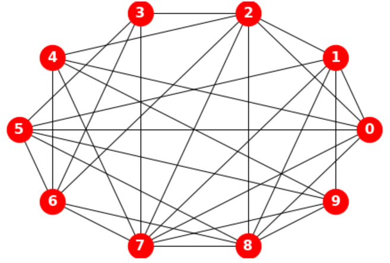
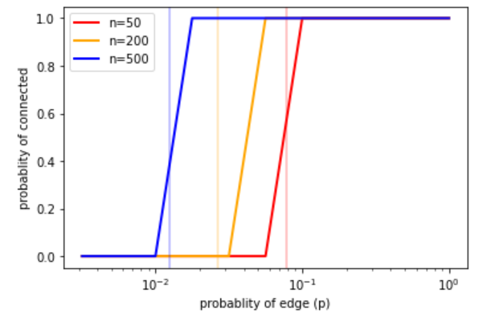
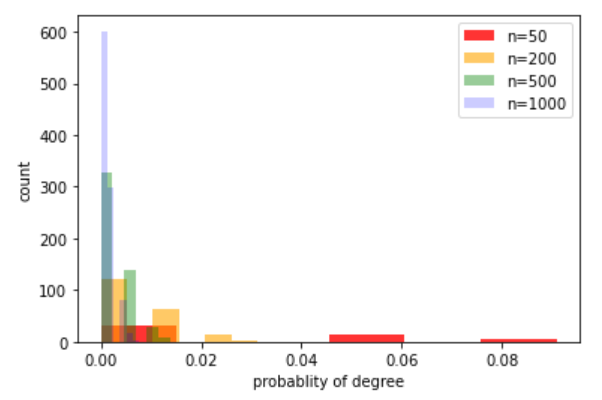
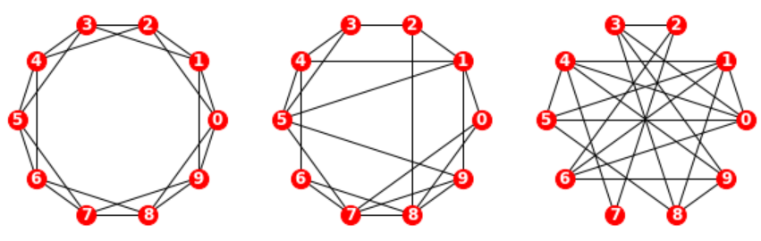
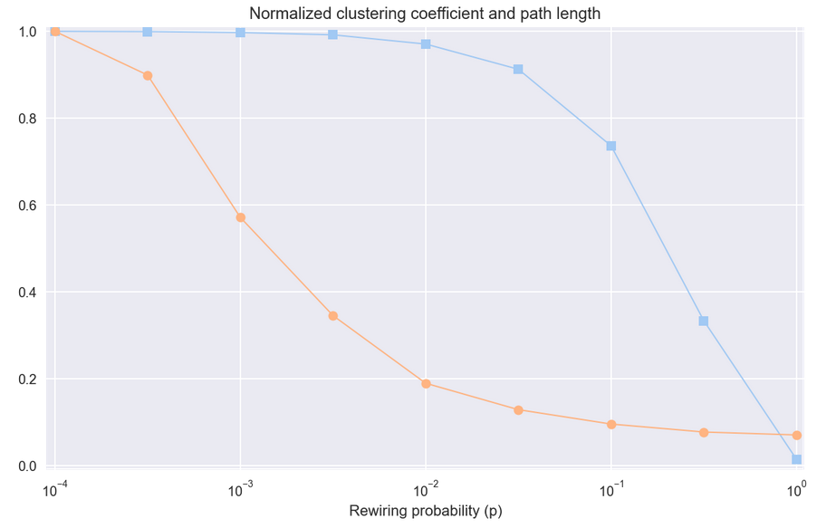
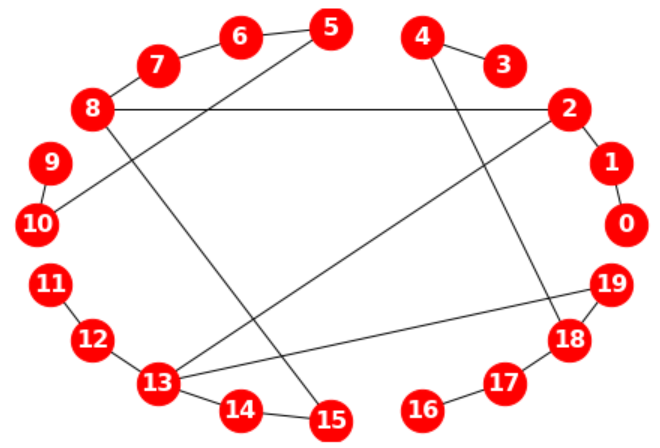
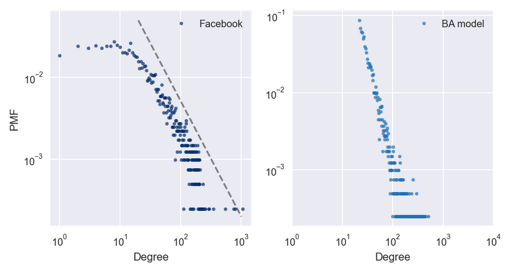
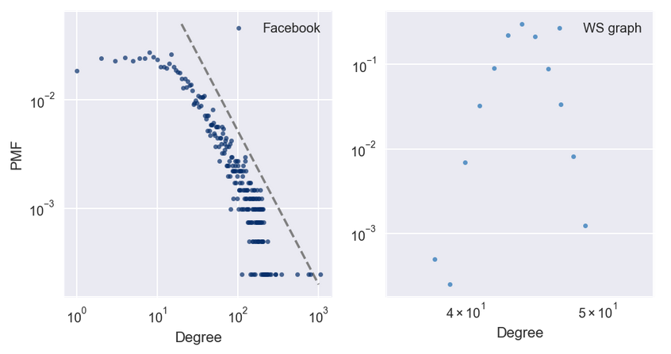
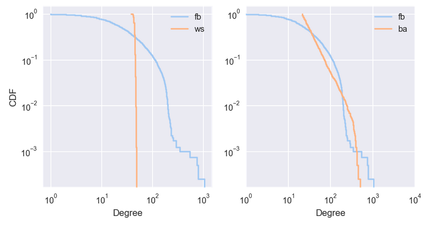

# 随机图

## 1. 随机图理论

### 1.1. 连通性

连通性（connectivity）是指在网络中从一个节点移动到另一个节点的能力。它是路径距离（route distance）和地测距离（geodesic distance）之间的比率。

设从顶点$s$起。可将$s$标记为"已访问"，然后可标记它的邻居。然后标记邻居的邻居，依此类推，直到无法再到达任何顶点。若访问了所有顶点，则图是连通图。

### 1.2. ER 图

1959 年，Edgar Gilbert（1923∼2013）在研究连通性临界值的论文中，首次引入了图模型$G(n, p)$[^1]。同年，Paul Erdős（1913∼1996）和 Alfréd Rényi（1921∼1970）提出图模型$G(n, M)$[^2]。次年，他们对上述两种图的连通性做了更详细的分析 [^3]。并建立随机图理论（random graph theory），被认为是开创了复杂网络拓扑结构系统性分析的先河。故，上述两个图模型统称为 Erdős-Rényi 图（ER 图）。

```python
import networkx as nx

G = nx.random_graphs.erdos_renyi_graph(10, 0.5)
draw(G)
```



### 1.3. 恒连接

在模型$G(n, M)$中，从$n$个节点、$M$个连边构成的所有图的集合里随机选择一个图。例如，在$G(3, 2)$模型中，3 个节点和 2 个连边能构成三种可能的图，每种图的概率为 1/3。

### 1.4. 恒概率

- 在模型$G(n, p)$中，随机连接节点构成一个图。图中每个连边彼此独立，连通的概率为$p$。等价地，拥有$n$个节点、$M$个连边的所有图具有相同的概率：

$$
p^{M}(1 - p)^{\binom{n}{2} - M}
$$

此模型中的参数$p$可看成是加权函数；当$p$较小时，图连通的概率非常低，而$p$较大时接近 1，图很有可能连通。在这两种状态之间，在$p$的临界值 $p*= \ln n/n$处存在快变换。特别地，与$p= 0.5$相对应的情况是，在拥有$n$个节点的$2^\binom{n}{2}$个图中，每个图被选择的概率相等。

> 通常研究节点数$n$趋于无穷时随机图的表现。



```python
import numpy as np

np.random.default_rng(17)

ns = [50, 200, 500]
ps = np.logspace(-2.5, 0, 11)
colors = ['red', 'orange', 'blue']

for n, color in zip(ns, colors):
  p_crt = np.log(n) / n
  ax.axvline(p_crt, color=color, alpha= 0.3)

  ys = []
  for p in ps:
    G = nx.random_graphs.erdos_renyi_graph(n, p)
    y = prob_connected(G)
    ys.append(y)

  ax.semilogx(ps, ys, label=f'n={str(n)}', color=color, linewidth=2)
  ax.legend()
  ax.set(xlabel='probablity of edge (p)')
  ax.set(ylabel='probablity of connected')
```

$G(n, p)$中的一个图平均有$\binom{n}{2} p$条连边。任意特定节点的度服从二项分布$B(n-1, p)$：

$$
P(\deg(v) = k) = \binom{n-1}{k}p^{k}(1 - p)^{n-1 -k}
$$

其中，$n$为图中节点的总数。

当$n$很大且$np$为常数时，服从 Poisson 分布$Poi(λ)$。

$$
\lim_{n → ∞ \atop np = λ}P(\deg(v) = k) → \frac{(λ)^{k} e^{- λ}}{k!}
$$

```python
ns = [50, 200, 500, 1000]
λ = 0.5
colors = ['red', 'orange', 'green', 'blue']
alphas = [0.8, 0.6, 0.4, 0.2]

for n, color, alpha in zip(ns, colors, alphas):
  G = nx.random_graphs.erdos_renyi_graph(n, λ/n)
  degrees = dict(G.degree()).values()
  # 将频次变换为频率
  d_prob = [d / float(sum(degrees)) for d in degrees]
  ax.hist(d_prob, label=f'n={str(n)}', alpha=alpha, bins =6, color=color, linewidth=2)
  ax.legend()
  ax.set(xlabel='probablity of degree', ylabel='count')
```



在 1960 年的论文中，Erdős 和 Rényi [^3] 非常精确地描述了$p$在不同取值下，$G(n, p)$的表现。其结论有：

- 当$λ< 1$，则$G(n, p)$中的一个图几乎一定没有连通分量的大小大于$O(\log(n))$。
- 当$λ = 1$，则$G(n, p)$中的一个图几乎必有最大的连通分量，其阶为$n^{2/3}$。
- 当$λ>1$，则$G(n, p)$中的一个图几乎必有唯一的包含节点有限部分的巨连通团。没有连通分量会有超过$O(\log(n))$个节点。
- 当$p<(1 - ϵ)\ln n/n$，则$G(n, p)$中的一个图几乎必有孤立节点，因而它是不连通的。
- 当$p>(1 + ϵ)\ln n/n$，则$G(n, p)$中的一个图几乎一定是连通的。

$G(n, p)$模型的两个主要假设（边独立，每条边的可能性相同）可能不适合为某些现实生活中的现象建模。尤其是 ER 图的度分布没有重尾（heavy tail），而许多实际网络的分布是重尾的。此外，与许多社交网络不同，ER 图集聚系数较低。其他较好的替代模型可见 WS 模型（Watts-Strogatz model）和 BA 模型（Barabási-Albert model）。

## 2. 小世界现象

现实世界中的许多网络，包括社交网络在内，具有"小世界属性"，即节点之间的平均距离，以最短路径上的边数来度量，远远小于预期。

- [Milgram 实验](https://en.wikipedia.org/wiki/Milgram_experiment)
- [小世界实验](https://en.wikipedia.org/wiki/Small-world_experiment)

### 2.1. WS 图

Watts-Strogatz（WS）图以特定顺序考虑边，并用概率$p$重新布置每个边（断边重连）。若边被重新布置，则它们使第一个节点保持不变，并随机选择第二个节点。它们不允许闭环或多边；即，节点不能拥有到它自身的边，且两个节点之间不能拥有多个边。

闭环对每个边执行一次。在这个循环中，除了计算"选择"之外，其他的时间均是恒定的，它是以$n$为单位的线性计算。故总的运行时间是${O}(nm)$。



```python
n, k = 10, 4
p = [0, 0.2, 1.0]

for i in range(3):
  plt.subplot(1, 3, 1 +i)
  g = nx.random_graphs.watts_strogatz_graph(n, k, p[i])
  draw(g, node_size=200, font_size= 12)
  ax.axis('equal')
```

### 2.2. WS 实验

WS 实验表明，对于一系列$p$值，WS 图具有像正则图像那样的高群聚性，像随机图一样的短路径长度。



### 2.3. Dijkstra 算法

Dijkstra 算法由 Edsger Dijkstra 于 1959 年发表，是现代通信网络中最重要的算法之一，亦为互联网上使用的许多所谓的路由算法的基础。它解决了"单源最短路径"问题。

Dijkstra 算法通过考虑边的长度，找到从给定节点到同一网络中的每个其他节点的最短路径。其每当找到一条新的更短路径时，这个记录就会被更新。在结束时，到每个顶点的最短距离被确定。其工作原理大致如下：

- 最初，队列包含单个元素 `start`，`dist` 将 `start` 映射为距离 0（这是 `start` 到自身的距离）。
- 每次循环中，使用 `popleft` 获取节点，按照添加到队列的顺序。其中，第一次循环中，`node` 是 `start`，`new_dist` 为 1。故 `start` 的邻居距离为 1，且进入了队列。
- 当处理 `start` 的邻居时，它们的所有邻居距离为 2。他们中没有一个距离为 1，因为若有的话，我们会在第一次迭代中发现它们。类似地，当处理距离为 2 的节点时，将他们的邻居的距离设为 3。
- 接下来，由于从起点到节点的距离是 `dist [node]`，到任何未访问的邻居的距离是 `dist [node] + 1` 。对于每个邻居，我们向 `dist` 添加一个条目，然后将邻居添加到队列中。



```python
from itertools import combinations

g = nx.watts_strogatz_graph(20, 2, 0.5)

nx.dijkstra_path(g, 0, 15)
# [0, 1, 2, 8, 15]
nx.dijkstra_path_length(g, 0, 15)
# 4
print(list(combinations(g.nodes(), 3))[:5])
# [(0, 1, 2), (0, 1, 3), (0, 1, 4), (0, 1, 5), (0, 1, 6)]
```

## 3. 无标度网络

### 3.1. BA 模型

WS 模型拥有高群聚性和短路径长度，但度的分布不规律。这种差异启发了 Barabási-Albert 模型。

1999 年，Albert-László Barabási（1967∼）和 Réka Albert（1972∼）发表了一篇论文 [^4]，描述了几个现实世界的网络的结构特征，用图展示了电影演员，万维网（WWW）页面和美国西部电网设施的互联性。

他们测量每个节点的度并计算$\mathrm{PMF}(k)$，即节点度为$k$的比例。然后他们在双对数标度上绘制$\mathrm{PMF}(k)$与$k$的关系。这些曲线可用一条直线拟合，至少对于$k$的较大数值；故他们得出结论，这些分布是重尾的。

Barabási 和 Albert 提出了一个模型，生成了属性相同的图。模型的基本特征与 WS 模型不同，分别是：

- 增长：BA 模型不是从固定数量的顶点开始，而是从一个较小图开始，每次添加一个顶点。
- 优先连接：当创建一个新的边时，它更可能连接到一个已经有很多边的节点。这种"富者更富"的效应是一些现实世界网络增长模式的特征。

实验结果证明，由 BA 模型模型生成的图，度的分布遵循幂律。



### 3.2. 重尾分布

在复杂性科学的许多领域中，重尾分布（heavy-tailed distribution）是一个常见特征。在双对数轴绘制它，来获得重尾分布的更清晰的图像。这种变换突显了分布的尾巴；也就是较大值的概率。在这种变换下，数据大致在一条直线上，这表明分布的最大值与概率之间存在"幂律"关系。在数学上，

$$
\mathrm{PMF}(k) ∼k^{−α}
$$

其中，$\mathrm{PMF}(k)$是度为$k$的节点的比例，$α$是一个参数，符号$∼$表示当$k$增加时，$\mathrm{PMF}(k)$渐近于$k^{−α}$。

对两边取对数，得到，

$$
\log\mathrm{PMF}(k) ∼ −α\log k
$$



### 3.3. CDF 与 CCDF

因为 CDF 的噪音比 PMF 少，故 CDF 更适合可视化。一旦习惯了 CDF 的解释，它们可提供比 PMF 更清晰的分布图像。

显然，WS 模型和数据集的 CDF 很大不同。BA 模型更好，但还不是很好，特别是对于较小数值。在分布的尾部（值大于 100），BA 模型看起来与数据集匹配得很好，但，很难看出来。此时可在对数坐标上绘制互补 CDF。互补 CDF（CCDF）定义为：

$$
\mathrm{CCDF}(x) = 1 − \mathrm{CDF}(x)
$$

若 PMF 服从幂律，CCDF 也服从：

$$
\mathrm{CCDF}(x) = (x/x_m)^{-α}
$$

其中，$x_m$是最小可能值，$α$是确定分布形状的参数。

对两边取对数：

$$
\log\mathrm{CCDF}(x) = -α (\log x − \log x_m)
$$

故，若分布服从幂定律，在双对数刻度上，CCDF 是斜率为 $-α$的直线。



### 3.4. HK 模型

[^1]: E.N. Gilbert (1959). "Random Graphs". Annals of Mathematical Statistics 30 (4): 1141-1144. ".doi:10.1214/aoms/1177706098"<br>
[^2]: Erdős, P.; Rényi, A. (1959). "On Random Graphs. I". Publicationes Mathematicae 6: 290-297. <br>
[^3]: Erdős, P.; Rényi, A. (1960). "On the evolution of random graphs". Magyar Tudományos Akadémia Matematikai Kutató Intézetének Kőzleményei. 5: 17-61. <br>
[^4]: Barabási, Albert-László; Albert, Réka (October 1999). "Emergence of scaling in random networks". Science. 286 (5439): 509-512.
