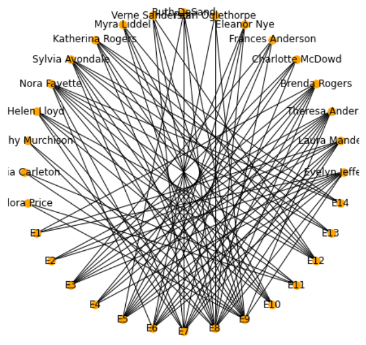
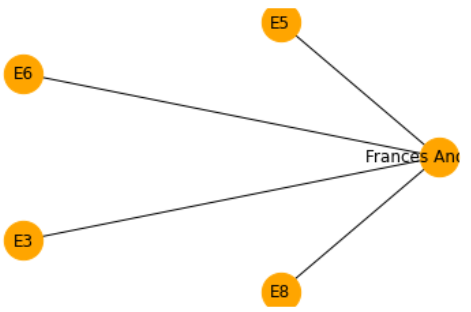
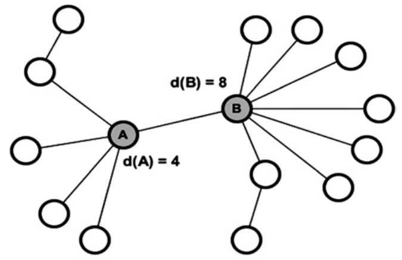
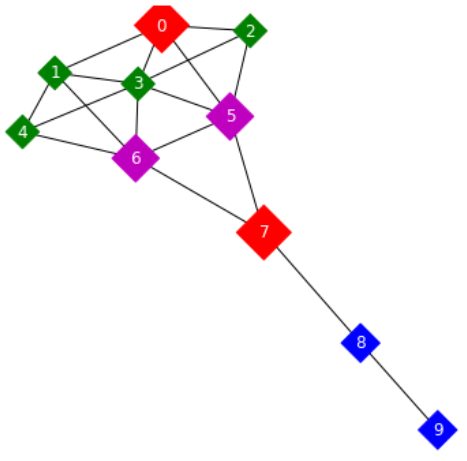
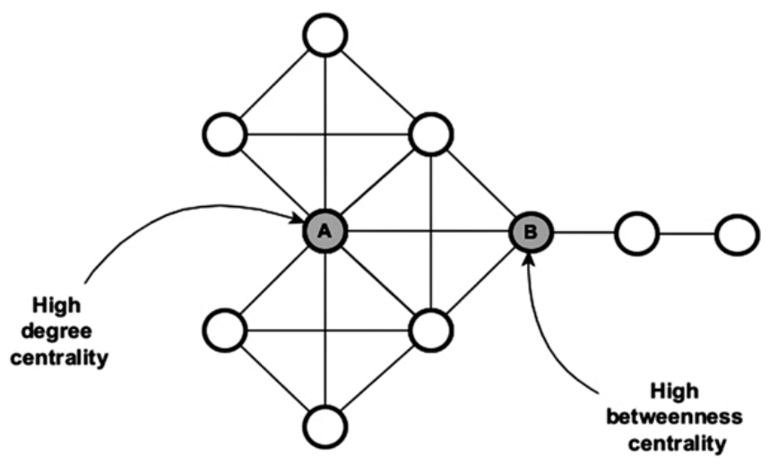
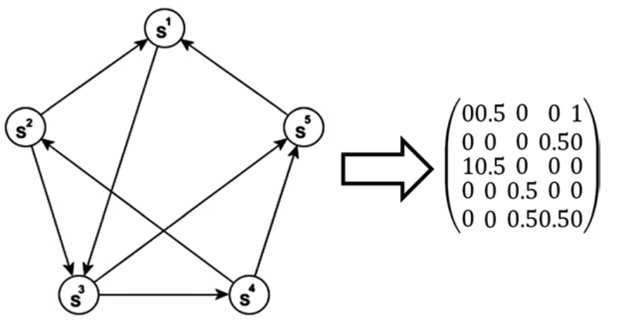
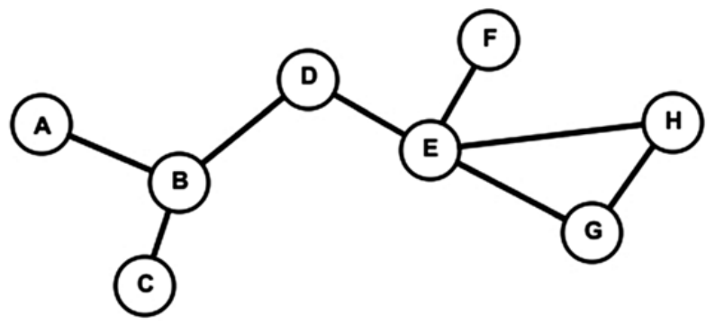
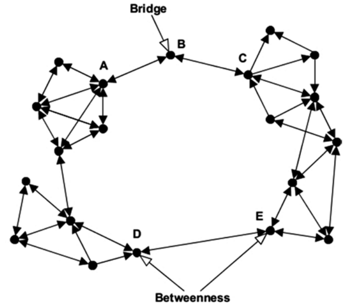

# 节点分析

## 1. 自我网络

### 1.1. 简介

自我网络（ego-network）是以特定的行为者为中心的网络。通过改变感兴趣的行为者，可在整个网络中的不同区域巡航。

网络上的所有信息都来自于焦点行为者。完全网络分析主要集中在密度、间距和聚类之间的结构属性上，而以自我网络分析则更多地关注行为人的关系内容，也就是关系的多重性，即关系有多少层。

自我网络的规模可从该网络所拥有的分身（alter），即行为者及与自我有关系的其他实体的数量来理解。这些分身形成一个所谓的 组件（component），在这个组件中，自我与分身的关系密度很高。同一个组件的分身相互关联、共享某种属性、具有共同的从属关系或共同发生。了解一个组件的结构，有助于理解和分析自我周围的环境。

在自我网络中，可能有不止一个附属于自我的成分，每个成分都有其大小和密度。即使自我可与许多成分发生关系（多样性），自我的关系依然集中在这些组件上，使其他成分没有突出的地位（层级）。

### 1.2. 二分图

二分图是一类图$(n, m)$，其中$n$是顶点的集合，m 为边的集合，且$n$可分成两个不相交的集合$u$和$v$，$m$中的任意一条边的一个顶点属于集合$u$，另一顶点属于集合$v$。故，二分图可表示为：$G= (u, v, m)$。

- 当两集合元素个数相等，该二分图称为平衡二分图（balanced bipartite graph）。
- 当两集合中顶点的度是相同的，该二分图称为双正则（biregular）。

### 1.3. 社交网络

```python
import networkx as nx
import matplotlib.pyplot as plt

g = nx.davis_southern_women_graph()
pos = nx.circular_layout(g)
nx.draw(g, pos,
  node_size = 90,
  node_color='red',
  font_color='black',
  font_size= 12,
  with_labels =True)
```



```python
ego_net = nx.ego_graph(g, 'Frances Anderson')
pos = nx.circular_layout(ego_net)
nx.draw_networkx(
  ego_net, pos,
  node_size=800,
  node_color='orange')
```



## 2. 中心度

### 2.1. 度中心度

度中心度（degree centrality）是对直接连接到其他节点的数量的度量。这意味着，相邻节点的数量越多，节点就越重要，因为它独立于其他行为者，可到达网络的大部分区域。这是一个局部的度量标准。

以社会化网络为例，在社会化网络中，节点度分布遵循幂律分布（power-law distribution），即极少数节点的连接数量极多。

一个节点$i$的度中心度$d(i)$可表述为：

$$
d(i) = \sum m_{ij}
$$

其中，若节点$i$和$j$之间存在链接，则$m_{ij} = 1$，若无这样的链接，则$m_{ij} = 0$。

> 对定向网络，需要区分内中心度（in-degree centrality）和外度中心度（out-degree centrality）。



Krackhardt 风筝图在社会网络用于显示不同网络中心度量的差异。边是不定向的，因为它们意味着相互接受标准。该图由十个两组不同的节点组成，具有风筝的形状。第一组节点从 0 到 6 个相互连接的节点，而第二组节点从 7 个到 9 个呈链状的节点组成。



```python
from operator import itemgetter

g = nx.krackhardt_kite_graph()

colors = ['r', 'g', 'g', 'g', 'g', 'm', 'm', 'r', 'b', 'b']
sizes = [800, 300, 300, 300, 300, 600, 600, 800, 400, 400]

nx.draw_networkx(g,
         node_color= colors,
         node_shape='D',
         with_labels =True,
         node_size=sizes,
         font_color='white')

print(sorted(
  nx.degree_centrality(g).items(),
  key =itemgetter(1),
  reverse=True))

"""
[(3, 0.6666666666666666),
(5, 0.5555555555555556),
(6, 0.5555555555555556),
(0, 0.4444444444444444),
(1, 0.4444444444444444),
(2, 0.3333333333333333),
(4, 0.3333333333333333),
(7, 0.3333333333333333),
(8, 0.2222222222222222),
(9, 0.1111111111111111)]
"""
```

### 2.2. 近中心度

近中心度（closeness centrality）是一个节点与网络中所有其他节点的地测距离之和。它计算了从一个行为体到网络中其他行为体的路径长度。

若该行为体与网络中其余的行为体集相对接近，则该行为体就会很重要。近中心度的数学表示方法$C(i)$如下：

$$
C(i) = \sum d_{ij}
$$

其中，$d_{ij}$是节点$i$到节点$j$的地测距离（从节点$i$到节点$j$的最短路径中的链接数）。

由于近中心度是基于最短路径计算，故，当它应用于大型网络时，其可行性会受到质疑，因为其产生的结果几乎没有什么变化，这使得区分节点之间的差异性更加困难。在信息网络（information network）中，近中心度揭示了信息从一个节点流向网络中其他节点所需的时间。高得分的节点通常与网络中其他节点之间的路径较短。

### 2.3. 间中心度

间中心度（betweenness centrality）可描述为一个行为体作为不同网络之间的联系，其重要性有多大。它代表了一个行为体需要通过某个行为体到达另一个行为体的次数。具有高中心度的节点之间的节点控制着信息的流动，因为它们在其他行为者或行为者群体之间形成了重要的桥梁。节点$i$之间中心度计算方法如下：

$$
b(i) = \sum_{j, k} \frac{g_{j i k}}{g_{j k}}
$$

其中，$g_{j k}$为从节点$j$到节点$k$（$j$和$k ≠ i$）的最短路径数，$g_{j i k}$为从节点$j$到节点$k$经过节点$i$的最短路径数。



### 2.4. 特征向量中心度

特征向量中心度描述了一个人在全局网络结构的中心度。它度量一个节点与连接良好的节点的连接程度。它通过取邻接矩阵（adjacency matrix）的主特征向量来计算。

PageRank 是特征向量中心度量的一个变体，计算出了通过考虑用户访问这个页面的概率，来考虑一个网页的重要性。基于超链接的排名算法。根据 PageRank 算法，页面的重要性决定了页面的重要性 被链接到的页面的排名。若一个页面的反向链接的排名之和高，则该页面被赋予高排名。否则，该页面被分配为低排名。

对于具有邻接矩阵$𝑨$的定向网络$G$，页面$u$的 PageRank 得分由其传入邻居的得分迭代确定：

$$
PR(u) = \frac{1 - α}{N} + α\sum A_{vu} PR(v) / d_{out}(v)
$$

其中，$α$是阻尼系数（damping factor），其值在 0 到 1 之间，$N$是节点总数，$d_{out}(v)$是$v$的出链程度。

在 PageRank 中：节点是网页，链接是网页链接，状态是该节点的临时"重要性"。它的计算方法是通过强制给所有的节点对赋以正的非零权重，使整个网络强连接。它的系数矩阵是一个过渡概率矩阵，可通过除以矩阵中的每一列的相邻矩阵的每一列均是由该列中的$1$的数量来计。



PageRank 算法只对非对称网络给出了非对称的结果。若链接是对称的（非定向的），则 PageRank 值将与节点度相同。在其基本形式下，PageRank 很容易被滥用，因此需要定期、秘密地对其进行调整。

PageRank 被提出来为网页建立索引。但，它也可应用于社交网络中的定向图的中心度计算。Twitter 在这里可作为一个很好的例子。

## 3. 其他度量

### 3.1. 离心度

离心度（eccentricity）是指从给定节点到一个网络中所有其他节点的最大距离。有别于全网度量（如直径和密度），离心度是一种流行的基于路径的度量标准，它可根据网络中每个节点的直接和间接连接给每个节点赋值。即，需要计算出节点$u$与其他所有节点之间的地测距离，并选择最大值。

$$
E(u) = \max_{v ∈ V} d(u, v)
$$

若计算出最大的离心度，也就是节点之间的最大距离，就可得到所谓的"直径"。除了离心度外，还有其他常用的基于路径的度量方法，如节点聚类系数、近似度和间隔度等。

计算离心度对于理解信息如何从一个节点向其他节点传播是很重要的。若信息从一个给定节点向图中的某些特定节点传播的步数最小，则意味着该节点具有较好的传播效率，尽管信息不一定要通过网络中最短的路径。



上图是一个有 8 个节点和 8 条边的图。可看到，最大离心度，也就是网络直径为 4。还可看到，节点 D 的离心度为 2，即，距离 D 最远的节点都在 2 跳之外。节点 D 传播的信息可用最少的步数通过节点 E 和 B，到达图中最远的节点。但，节点 A 的离心度为 4，这意味着信息需要经过至少 3 个节点（B、D、E）和 4 条边才能到达最远的节点。

### 3.2. 桥节点

1973 年，Granovetter 写了一篇题为《弱联系的力量（The Strength of the Weak Ties）》的文章，强调了桥节点（bridge）在社交网络对信息传播的重要性。Granovetter 的主要论点是，因为人们的朋友也有可能是朋友，与其他不相识的人连接的人更有可能建立起连接不相识的群体的网桥。桥节点的意义在于，它们减少了节点之间的总距离，从而加快了整个网络的信息传播速度。

确定网络桥接，虽然往往更具挑战性，但有时更重要。桥是连接两个独立群体的纽带，而这些纽带的锚就是桥节点。担任桥梁的人可能具有特殊的性格特征，如他们愿意听取他人的新想法。这里对桥节点的定义如下：

$$
B_i = \frac{\sum_{j=1}^{k}\big[C-C_{ij}'\big]}{k} + \frac{\sum_{j=1}^l\big[C-C_{j i}'\big]}{l}, (i ≠ j)
$$

其中，$C$为观察到的网络的内聚，$C_{ij}'$为去掉从$i$到$j$的链路时的内聚力，$_{j i}'$为去掉从$j$到$i$的链路时的内聚力，$k$和$l$分别为发送和接收的边数。

虽然一直以来，间中心度均是用于寻找桥接位置的中心节点，但桥接的重要意义在于寻找网络节点不是外围节点或中心节点，而是在网络中具有中间位置。这些节点可能在扩散过程中起到重要的中继作用，因此应加强以使网络内聚。



尽管如此，这两种措施之间仍然存在一定的相关性，以至于当网络结构均匀时，它们可能会识别出相同的节点。在上图中，位于网络顶部的 B 是桥接节点，而 D 和 E 是桥接节点。这两种情况的区别在于，节点 B 只有两条链路，若删除了这两条链路中的任何一条，则在距离上的均值就会比其他节点大。而节点 D 和 E 之间的距离值较高，且几乎相等。

### 3.3. 多联性

边可有强度（strength）。这可表现为关系的强度，也可表现为边包含多少不同类型的内容。只有一个维度的边被称为"单联"（uniplex），而有一个以上维度的边被称为"多联"（multiplex）。通常情况下，多联比单联更强。

## 4. 度量的选择

### 4.1. 用途

以下是对每项度量用途的简单总结。

1. 度中心度是度量人气的标准。它决定了节点能够快速传播信息到局部地区。
2. 间中心度是基于这样一种思想，即若一个人在网络中起到了更多的中介作用，则他的身份更重要。
3. 近中心度是到达能力的度量，信息从一个节点传播到其他所有节点的速度有多快？
4. 特征向量中心度是度量相关重要性的一个指标，在图中，谁与最有影响力的人最接近？

### 4.2. 复杂度

关于这三个中心度，度中心度相对来说是比较直接和快速的，只需要经过节点就可计算出连接的边数。另一方面，度和近中心度则需要实现最小跨度树，而最小跨度树又实现了 Kruskal 算法，其运行时复杂度约为$O(m\log m)$，其中$m$为边数。

对于特征向量中心度量。且由于算法必须通过每个节点的邻居来迭代计算加权度。算法需要$O(n*d̄)$的运算量。其中，$n$为节点个数，$d̄$为平均度。这使得该算法的计算复杂度非常昂贵，特别是对于非常大的网络来说。
