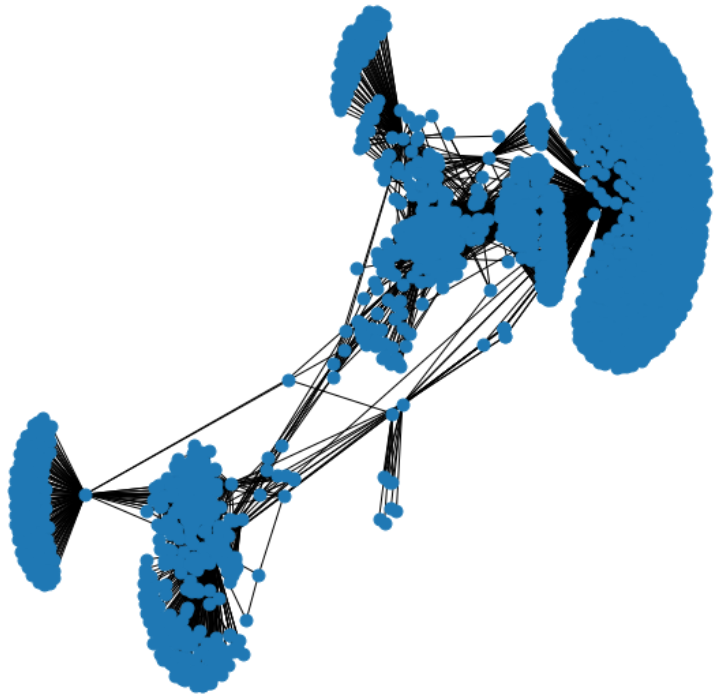
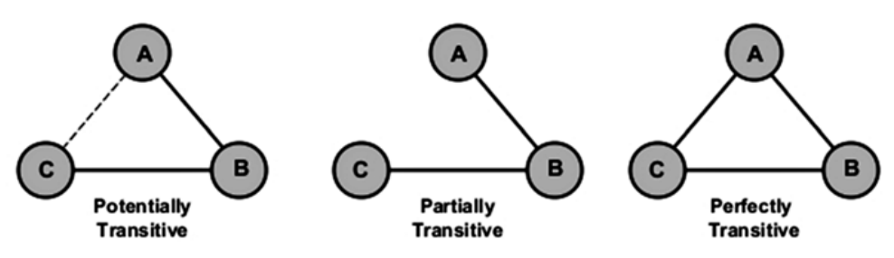
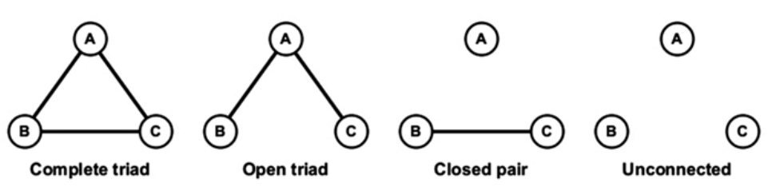
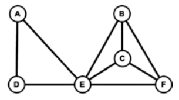
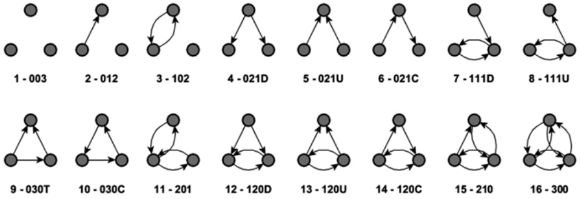
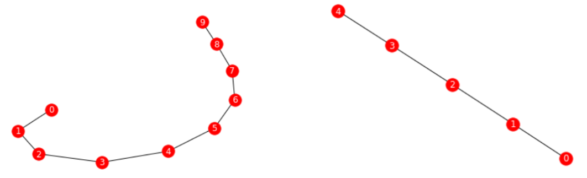

# 群分析

## 1. 内聚子群

中心度是社交网络分析用于识别重要人物的主要指标。但，它并没有告诉我们是什么力量使一些节点聚集在一起，且与中心节点建立良好的连接，或说是什么力量把网络撕开，且度高的节点是否被聚类或分散在网络中。

与其分析单个节点及其连接模式，不如分析整个子图和群组。这样做将帮助我们看到这种内聚子群（cohesive subgroup）在社会特征、规范、行为或密度方面是否有别于其他网络模式。

### 1.1. 特性

内聚子群中，节点与群体内的其他成员的联系比与群体外的成员的联系更频繁，使群体内的所有成员都能相互联系。在高度内聚群中，成员之间往往具有强烈的同质性信念。内聚子群是节点密度较高的区域。它们大多存在于无定向网络中。

群成员之间的联系可通过个人的联系（即直接联系）或联合群体成员（即间接联系）形成。故，个体与群体成员之间的联系越紧密，受群体标准的影响就越大。

识别网络中内聚子群的重要性在于，内聚子群是潜在的社会簇。主要有以下两种用于识别的结构：

- 团体（clique）
- m-slice
- k-core

### 1.2. 团体

团体（clique）是一个完整图。最大团体是指一个不是图中任何其他团体的子集的团体。



### 1.3. m-slice

m-slice 是一个最大的子网，其包含倍率 ⩾ m 的线，以及与这些线相交的顶点。其目标是根据线的倍率确定内聚子群。根据这个度量标准，孤立的节点被定义为 0-slice。但，m-slice 并不能保证 m-slice 组件内的所有顶点均是以最小的线倍率连接。相反，m-slice 的元素被认为是内聚的，而不是 m-slice 本身。

### 1.4. k-core

k-core 指在无定向网络中，最小度数 ⩾ k（每个节点都与至少有 k 个其他节点相连）。它是通过反复删除所有程度小于 k 的节点，这个过程的结果是所有 k-core 节点至少有一个度数为 k 的节点。直到不再有这样的节点存在为止。这些子图不一定是内聚的，但可告诉哪些区域包含了 clique-like 结构。可作为一种在图中找到内聚子群的方法

## 2. 度量

### 2.1. 聚类系数

聚类系数（clustering coefficient）是度量一个网络中的节点倾向于形成密集子图（clique、community、cluster）的程度。通常情况下，该度量被描述为图的传递性度量（传递性有时被称为全网聚类系数）。

对于社会化网络，可理解为一个人的两个朋友本身亦为朋友的概率。故，聚类系数值是一个介于 0 到 1 之间的数字。社会化网络的聚类系数值较高，表明该网络呈现出小世界现象（在小世界网络中，大多数节点均是同质化的，可通过少量的步数来达到）。

节点聚类系数的计算方法如下：

$$
C_i = \binom{k_i}2^{-1} T(i)
= \frac{2T(i)}{K_i(k_i -1)}
$$

其中，$T(i)$是节点$i$的距离三角形数，$K_i(k_i -1)$是$i$的邻居中可能的最大连接数。

网络平均聚类定义为：

$$
C= \frac{1}{n} ∑_{i ∈ v} C_i
$$

```python
nx.clustering(g)
nx.average_clustering(g)
```

节点聚类系数 Ci 的计算，在最坏的情况下，通过计算直接连接到节点 i 的所有边，时间复杂度为$O(n^2)$。网络聚类系数可通过计算所有闭合的三倍体来计算。

可用蛮力法来考察网络聚类系数，通过考察节点的组合，时间复杂度等于$O(n^3)$。

另一种方法提出了在图 G 的邻接矩阵表示上使用快速矩阵乘法，在$O(n^{2.376})$时间和$O(n^2)$空间内解决三倍体查找、计数和节点计数。在不存在三角形的二元图中，聚类系数为零。

### 2.2. 传递性

传递性（transitivity）是一种网络属性，指的是两个节点之间的关系在多大程度上可传递。在社交网络中，传递性反映了朋友之朋友（friend-of-a-friend）概念，有时被用作全网聚类系数的代名词。传递性越高表示节点的局部密度越高。完全闭合的团体可识别为群落（community）。



网络的平均传递性是指三角形数对连通三角形数的比。

$$
\mathrm{Transitivity} = \frac{3 * \mathrm{No. of triangles}}{\mathrm{No. connected triples}}
$$

其中，乘以 3 是因为每个三角形在图中都贡献了三个不同的连通的三倍体（triple），每个三倍体以不同节点为中心。传递性为 1 表示该网络包含了所有可能的边。在真实的社会网络中，传递性多在$[0.3, 0.6]$之间。

图的传递性与聚类系数（clustering coefficient）密切相关，因为每个节点的传递性均是度量三角形的相对频率。

```python
nx.radius(fb)
# 3
nx.diameter(fb)
# 5
nx.number_connected_components(fb)
# 1
```

### 2.3. 核度

一个节点的核度（核数，coreness）是$c$，意味着它属于 c-核，但属于（c+ 1）- 核。核度有助于确定该节点与网络的连接强度。计算核心度可将节点分为若干层，这对可视化很有帮助。

## 3. 结构推断

### 3.1. 三元分析

三元体（triad）是一个有三个节点的子图：一个焦点（自我）、一个祭坛（altar）以及另一个任意节点。完整三元体是一个规模为 3 的集团，不能向其中添加节点。



完整三元体可重合。完整的三元体 A、D、E 与另一个完整的三元体 B、C、E 重叠，因为这三个三元体共享节点 E。在社交网络的背景下，重叠派系是一个内聚子群，代表着重叠的社交圈。在完全连接的三元体中，三个人共享信息和规范，通过反馈建立信任，通过第三人解决或缓和矛盾。他们的行为就像一个群体，而不是作为一组个人



对于一个简单的定向图，有 16 种可能出现的三元体类型。每一种类型都用 M-A-N 三个字母表示（有时是一个字母）。

- M，表示互为正数的二元体（dyad）。
- A，指不对称的数量。
- N，是指空的二元体的数量。

可加上一个字母，表示不对称选择的方向。如 D 向下，U 向上，C 循环，T 过渡。研究发现，知道定向网络中出现的三元体的类型可帮助推断出网络的整体结构。

> 过渡三元体中，每条长度为 2 的路径都由从路径的起始节点到终点节点的弧线封闭。



### 3.2. 结构洞

所谓结构洞，是指在一个节点的自我网络中存在着一个空洞（没有边），以至于它的两个相邻的人（分身和第三方）不能直接连接。

在组织中，一个人若能把两个或两个以上不同部门的工作联系在一起，就会有更多的重要性和威望。

### 3.3. 经纪性

网络中的某些职位可大量参与信息、商品、疾病、谣言或服务的交换，而其他职位则不然。经纪性（brokerage）关注网络中作为交换渠道的社会关系。它度量的是自我在三元体中诱导和利用行动者之间的竞争的潜力。它还度量自我通过创造或利用其他行为者之间的冲突发挥颠覆作用的可能性。

一个行为者在网络中能发挥的中介作用在很大程度上取决于结构洞的存在：结构洞多了就意味着经纪性的增加。

与经纪性相关的另一个重要概念是聚合约束（aggregate constraint）。聚合约束是指对某一节点的所有边的二元约束之和。聚合约束越多，经纪人能发挥的作用就越小。在许多现实生活中的例子中，可看到聚合约束的意义。例如：受约束少的员工比其他员工更可能有成功的工作，受约束少的企业部门更有利润。

## 4. 模型分割

### 4.1. 层次聚类

层次聚类是可用于将结构近似等价的节点对聚类到位置。它可对网络的结构特征进行检查。首先，该算法对最相似的节点进行分组。然后，它再将下一对最相似的节点或簇进行分组。如此反复进行，直到所有的节点都被加入。该算法通过生成一个二叉树式的数据结构来处理聚类问题。

### 4.2. 块模型

块模型是一个大网络的缩小版，其中的节点被基于节点集的给定分区折叠。每个节点的分区（块），被表示为单个节点。同样地，原网络中的节点被聚合到新网络中的区块之间进行连接。故，块模型是一种与层次聚类非常相似的技术。

块模型旨在检测社会网络的一些结构特征，如内聚、核心/外延和排名等。在将节点分组成聚类，并确定这些聚类之间的关系的同时，区块建模使用矩阵（如邻接矩阵）来进行计算和数据可视化。它是一种灵活而高效的方法，用于分析小型密集的社会网络。

块模型的实现要求要么已经知道一个网络的块模型（节点对类的赋值和指定允许的块类型的图像矩阵），要么就是有一个网络，要找到捕捉网络结构的块模型。



```python
G = nx.path_graph(10)
draw(G)

partition = [[0, 1], [2, 3], [4, 5], [6, 7], [8, 9]]
M = nx.quotient_graph(G, partition, relabel=True)
draw(M)
```

### 4.3. 模块性

模块性是度量图的结构（不以节点为导向），是表征一个给定的群落结构在划分网络中的好坏的一个指标。其规定如下：

$$
Q= \frac{|E_{in}|-|E_{in-R}|}{|E|}
$$

其中，$|E_{in}|$是连接同一个社区的链接数，若链接是随机的，则估计$|E_{in-R}|$。

模块性是 Newman 和 Girvan 在 2003 年首次提出的，是目前使用最多的技术。它试图实现了对聚类的初步理解。这种技术包括两个步骤。

1. 分割（divisive），包括迭代去除网络中的边，最终将其分解成群落。
2. 重新计算（recalculation），当任何一条边被移除时，重新计算出的是社区之间的间中心度。

这两个过程重复进行，直到达到全局模块性的最大值。其结果是一组节点紧密内连的子网。模块性范围在 -0.5 到 + 1.0 之间，其中高分值表示良好的模块化。

### 4.4. 卢浮方法

卢浮方法（Louvain method）是由 Vincent Blondel、Jean-Loup Guillaume、Renaud Lambiotte 和 Etienne Lefebvre 提出的一种大型网络中的群落检测算法。它显示了一个网络如何自然地划分成多个节点群落。其中，群内形成密集的连接，群间形成较稀疏的连接。基于模块性最大的概念，卢浮方法是一种高效的贪婪方法，最多可扩展至到$10⁹$条边（或 100 万个节点）。该算法的运行时间为$O(n\log n)$。

该算法的工作原理如下：

1. 通过对所有节点进行局部的模块化优化，找到节点的小群落。
2. 然后将小群落分组到一个节点上，重复第一步。对于加权图，模块化的定义为：

$$
Q= \frac{1}{2m} ⋅∑_{ij}\big[a_{ij} - \frac{k_i k_{j}}{2m}\big]⋅δ(c_i c_{j})
$$

其中，$a_{ij}$是节点$i$和$j$之间的边权重；$k_i$和$k_{j}$分别是连接到节点$i$和$j$的连接线的权重之和；$m$是所有连接线的权重之和；$c_i$和$c_{j}$是节点的群落；δ 是 Kronecker-δ，即用于检查一对样本是否属于同一个社区。

Q 的值介于 -1 和 + 1 之间，理论上，优化这个值可产生更好的节点分组。但由于将所有可能迭代的节点进行分组并不实际，故使用了启发式算法。
