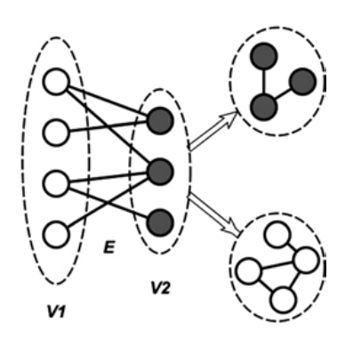
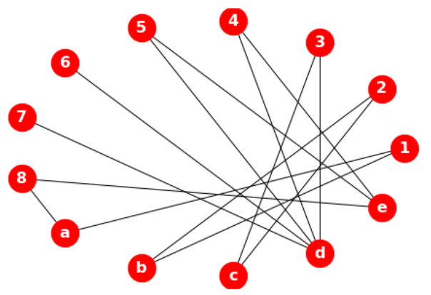
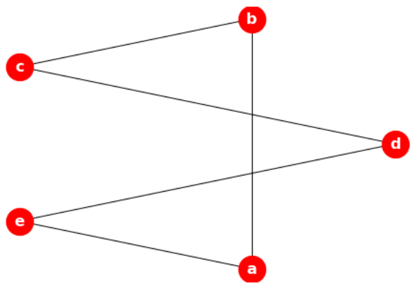

# 全网分析

## 1. 结构

### 1.1. 组件/孤点

- 组件：一组内部连接但与网络中其他顶点断开的行为体。
- 孤点：一个与其他顶点隔离的顶点。

### 1.2. 核心/周边

核心和外围的概念指出，在任何有方向的图中，节点应该属于两个类别中的一个。

- 核心（core），即节点被嵌入到一个连贯的子图中；
- 外围（periphery），即节点是松散连接的。

若考虑 k-core 结构，则属于 k-core 结构的节点是核心节点，而节点留在它之外的是外围节点。

## 2. 度量

### 2.1. 密度

密度被定义为网络边数除以该网络中节点间最大可能的边数。它可用于度量一个网络的完整程度。在一个完整图（一个图中所有可能的边都存在的图）的情况下，密度等于 1。

从形式上讲，图$G$的密度$D(G)$被定义为$G$中的边数与所有可能的边数的分量。密度值的范围在 0 到 1 之间。对于非定向图，可能的边数为$\binom{n}{2}$，因此

$$
D(G) = \frac{2m}{n(n-1)}
$$

其中，$m= |E|$ 是 G 中的边数。若 $D(G) = 1$，则表示图是完整的，每一对节点都有一条边连接。若$D(G) = 0$，则表示图中没有任何边，所有的节点均是孤立的。因为任何连接的图形至少应该有$n-1$条边，故连接图形的最小密度是$2/n$。

### 2.2. 最短路径

对于定向图，两个节点$(u, v)$之间的地测距离$d$定义为这两个节点之间的边数，而最短路径定义为从$u$到$v$的最小边数的路径。

对于无定向图，从$u$到$v$的距离$d$与从$v$到$u$距离相同。且两个相邻节点（即$u$和$v$之间只存在一条边）之间的距离为$1$。若$u$和$v$之间没有路径，则$d(u, v) =∞$。通常情况下，最短路径的计算是用 Dijkstra 算法进行的。

在所有节点对上的平均最短路径是一个有趣的度量，因为它可描述出网络所代表的世界有多大，其中较小的长度意味着网络在全局范围内连接良好。

```python
g = nx.karate_club_graph()

nx.shortest_path(g, 0, 8)
# [0, 8]
nx.shortest_path_length(g, 0, 8)
# 1
nx.average_shortest_path_length(g)
# 2.408199643493761
```

### 2.3. 直径、半径

图中最长的距离称为直径，它代表了网络中所有节点对上的最短路径（或网络中的最大离心率）。测量网络直径的目的是为了表示网络的扩展性（extensiveness），也就是网络中最远的两个节点之间的距离有多远。

半径是指网络中的最小离心率。在社会化网络中，相对于密度较高的网络，密度较低的网络会有较大的直径。此外，

计算图的直径有助于理解信息的流动或传播方式。在归一化图中，所有的边都有相同的机会接收信息，只要它们与信息源的距离相同。在加权图中，边可代表单个通信的频率，边的权重可告诉我们信息从一个节点流向另一个节点的速度。

### 2.4. 互惠性

有向图的互惠性（reciprocity）是指两个方向的边数（关系）与图中关系总数的比值。

单个节点$u$的互惠性也有类似的定义。它是指向两个方向的边数与附着在节点$u$上的总边数之比。这个度量只有对于有向图才可计算。

$$
R= |(u, v) ∈ G|(v, u) ∈ G|/|(u, v) ∈ G |
$$

## 3. 结构

### 3.1. 隶属网络

隶属网络（affiliation networks）是由至少两组不同的节点（行动者和事件）组成的网络，其将来自不同集的节点连接起来（隶属关系）。

人们可是多个组的成员，通常被称为共同成员关系（co-membership）。群或事件中的共同成员关系可作为某种社会联系的指标，因为共同参与网络允许社会联系的发展，这反过来又有助于创新、信息、新闻等在网络中流动。在一个群或事件中的共同成员关系会产生隶属关系数据，这些数据被用于表示两个不同集的两个实体之间的联系。

### 3.2. 双模网络

隶属网络有时也被称为双模网络（bimodal network）。由二分图$B = (V_1，V_2，E)$表示，其中$V_1$和$V_2$是两个不同的节点集，而$E$是只连接来自相反集的节点的一组边。

可说，双模网络是指只由两组节点组成的网络。对于双模网络的一些网络度量（如完整性和密度）的计算方式应该与应用于单模网络的方式不同。例如，完整度是指网络中最大的线数，在单模网络中的完整度要比双模网络高得多。而双模网络中的一个集的节点只能连接形成另一个集的节点。另外，与双模网络相比，单模网络的密度更高。

故，用于分析单模网络的技术不能应用于双模网络。一个好的解决方案是将双模网络改变为单模网络。其方法是将节点分成两个不相邻的集，使边不再连接来自不同集的节点。这样，就会形成两个单模网络。接下来可应用标准分析技术对新网络进行分析。



在上图中，两组节点 V1 和 V2 通过一组边 E 连接起来。现在的边是连接同一组节点之间的节点，而不是连接不同组的节点。新边的建立是基于原始网络中的节点共同成员关系或共同参与的节点来完成的。所得到的单模网络通常是密集的，且包含很多的群。分析群或完整子网的技术（如块模型、层次聚类、k-core 和 m-slice）可应用于此，以检测内聚子群。事实上，这是因为诱导网络是由相似性或相关性组成的网络。

在许多情况下，派生网络并不简单。这意味着，它可能包含循环。多线可用一条线代替，得到一个有值的网络，其线值表示这对节点之间的关系强度（线数）。这样的线值称为线倍数。线倍数越大，说明它们之间的联系越强或越有内聚力。

从双模网络中推导出一个单模网络将有助于发现角色之间的社会关系。

### 3.3. 同嗜性

从二模网络中推导出一模网络时获得的一个好处是可识别出相似的人之间的互动模式，至少比与不相似的人之间的互动模式更频繁。这种现象被称为同质性（homophily），即是指个人与具有相同态度和信仰的人联系在一起的倾向。

这种现象是由 Lazarsfeld 和 Merton 在 1954 年提出来的，它超越了网络模式，以及其他只关注网络结构的指标。准确地说，在社会网络中，节点（人）往往更倾向于与特征相似度较低的节点（人）联系在一起，而不是与特征相似度较低的节点联系在一起。

> 在企业网络（corporate network）中，同嗜性是指专业或学历的相似性。

```python
from networkx.algorithms import bipartite

B = nx.Graph()
B.add_nodes_from([1, 2, 3, 4, 5, 6, 7, 8], bipartite= 0)
B.add_nodes_from(['a', 'b', 'c', 'd', 'e'], bipartite= 1)
B.add_edges_from([(1, 'a'), (1, 'b'), (2, 'b'), (2, 'c'),
        (3, 'c'), (3, 'd'), (4, 'd'), (4, 'e'),
        (5, 'd'), (5, 'e'), (6, 'd'),
        (7, 'd'), (8, 'e'), (8, 'a')])
draw(B)
```



```python
bottom_nodes, top_nodes = bipartite.sets(B)

list(bottom_nodes)
# [1, 2, 3, 4, 5, 6, 7, 8]
list(top_nodes)
# ['d', 'b', 'c', 'e', 'a']
G = bipartite.projected_graph(B, top_nodes)
draw(G)
```


