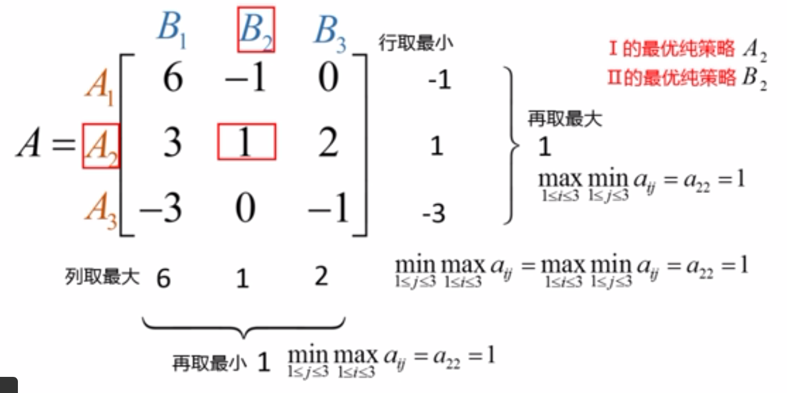
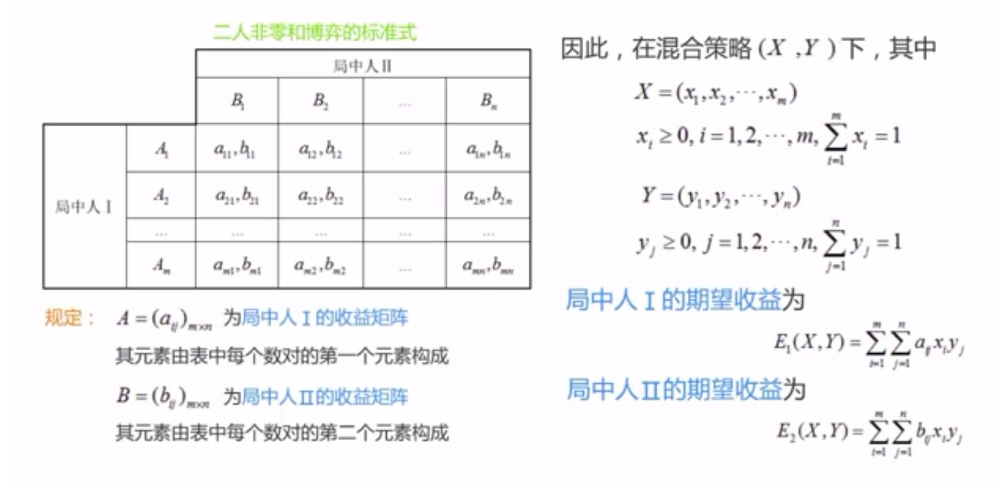
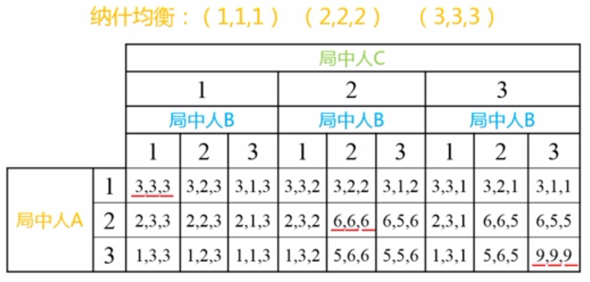
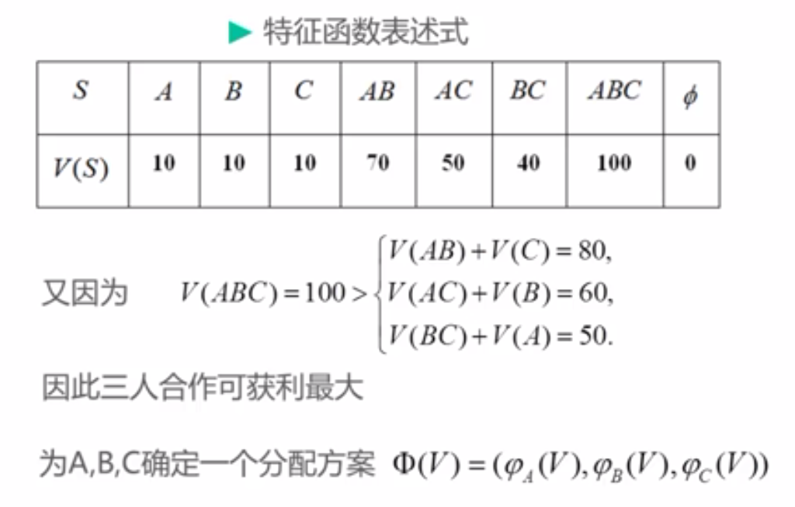
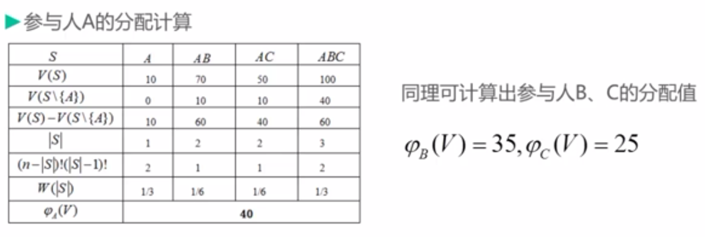

# 博弈论基础

## 1. 引言

### 1.1. 研究特点

博弈论涉及的决策者至少为两个；

- 博弈论中存在信息的不对称，即不同局中人对于有关其他参与人（对手）的特征和行动的知识可能存在不一致；
- 博弈论考虑了其他决策者的决策对自身利益的影响；
- 关键步骤是找出在别人选择既定的情况下，自己的最优反应战略（给自己带来最大收益的战略）；
- 问题解决过程一般包括：发现问题、提出问题（清晰表达）、分析问题、解决问题

### 1.2. 基本假设

理性选择范式的基本理论假设：

1. **个人理性**：个人是自身最大利益的追求者；
2. 在特定情境中有不同的行为战略可供选择；
3. 人在理智上相信不同的选择会导致不同的结果；
4. 人在主观上对不同的选择结果有不同的偏好排列；

### 1.3. 基本要素

- 局中人（player）：博弈中，独立决策、独立行动并承担决策结果的个人或组织。
- 战略（strategy）：局中人可选择的行动，具有完整性、多样性、不可观察性。

> 战略集为有限集合的博弈，称"有限博弈"，反之称"无限博弈"

支付函数（payoff function）：局中人选择出战略后，所获得的收益。

### 1.4. 表述形式

- 标准式：表格式，表示 2-3 人博弈
- 扩展式：二叉树式，与标准式可互换，多用于动态博弈
- 特征函数式：用于合作博弈

## 2. 非合作博弈

### 2.1. 分类

|    信息 ∥ 顺序     |      静态博弈      |      动态博弈      |
| :----------------: | :----------------: | :----------------: |
|  **完全信息博弈**  |  完全信息静态博弈  |  完全信息动态博弈  |
| **不完全信息博弈** | 不完全静态信息博弈 | 不完全信息动态博弈 |

### 2.2. 均衡

均衡：所有局中人的最优战略集合，即博弈最可能出现的结果

|    信息 ∥ 顺序     |         静态博弈          |             动态博弈              |
| :----------------: | :-----------------------: | :-------------------------------: |
|  **完全信息博弈**  |     Nash equilibrium      | subgame perfect Nash equilibrium  |
| **不完全信息博弈** | Bayesian Nash equilibrium | perfect Bayesian Nash equilibrium |

### 2.3. 占优战略

- 占优战略（Dominant Strategy）：指无论其他参与者采取什么战略，某参与者使用该战略的结果都优于其他战略。
- 占优战略均衡：指由博弈中的所有参与者的占优战略组合所构成的均衡。
- 战略弱占优（Weakly Dominant Strategy）：无论其他人采取什么样的战略，这个战略的回报都 ≥ 其他战略的回报。
- 严格占优战略（Strictly Dominant Strategy）：无论其他人采取什么战略，这个战略的回报都严格> 其他战略的回报。

### 2.4. 囚徒困境

囚徒困境（prisoner's dilemma，PD）[^1] 是博弈论中的一个话题，揭示了人类的动机和行为。简介如下：

两名犯罪团伙成员被逮捕并囚禁。每个囚犯都被单独监禁，无法与另一方交流。检察官缺乏足够的证据，来证明这两个人的主要指控。他们希望以较轻的指控被判处两年徒刑。同时，检察官为每个囚犯提供商量的余地。每个囚犯都有机会：

1. 通过证明对方犯罪出卖对方
2. 通过保持沉默与另一方合作。

代价是：若 A 和 B 各自背叛对方，每个人都服刑 2 年。若 A 背叛 B 但 B 保持沉默，A 将被释放，B 将被监禁 3 年（反之亦然）。若 A 和 B 都保持沉默，他们两人只会服刑 1 年（较轻的质控）。

| B ∥ A  | 认罪  | 不认罪 |
| :----: | :---: | :----: |
|  认罪  | 2, 2  |  0, 3  |
| 不认罪 | 3, 0  |  1, 1  |

不难发现，无论是对两个囚徒个人还是对两个囚徒总体，最佳的结果都不是同时认罪各得到 3 年的惩罚，而是都不认罪各得到 1 年的惩罚，这就形成了所谓"困境"。它反映了一个很深刻的问题

1. 个体理性与集体理性的冲突；
2. 以自我利益为目标的"理性"行为，最终导致了两个囚徒得到相对较劣的收益；
3. **个人理性通过市场机制导致社会福利最优的结论并不总是成立的**，换句话说，虽然"看不见的手"是有力的，但不是万能的。

自 20 世纪 50 年代，囚徒困境被首次讨论以来，它一直是社会心理学研究的热门话题。在 20 世纪 70 年代后期，密歇根大学的政治学家 Robert Axelrod 组织了一场比赛来比较囚徒困境的战略。他邀请参与者以计算机程序的形式提交战略，然后相互对抗并保持得分。具体来说，他们玩的是 PD 的迭代版本，其中智能体针对同一对手进行多轮比赛，因此他们的决定可基于历史。在 Axelrod 的比赛中，一个简单的战略出人意料地好，称为"针锋相对"，即 TFT，TFT 在第一轮迭代比赛中总是合作；之后，它会复制上一轮对手所做的任何事情。对手继续合作，TFT 保持合作，若对手任何时候都背叛，下一轮 TFT 背叛，但若对手变回合作，TFT 也会合作。

## 3. Nash 均衡

### 3.1. 概念

Nash 均衡：又称为非合作博弈均衡，在此均衡点上，每个理性参与者都不会有单独改变战略的冲动，因为局中每个参与者都不可能因为单方面改变自己的战略而增加获益。

Schelling 点：对于存在多个 Nash 均衡的问题，从各方的文化和经验中找到线索，以该线索为基础选择出的均衡称"Schelling 点"。

- 纯战略：要求参与者在每个给定信息情况下只选择一种特定的行动。
- 混合战略：要求参与者在给定信息情况下以某种概率分布随机地选择不同的行动。

### 3.2. Cournot 模型

设 1 在某个市场有$n$个厂商销售完全相同的商品，由于市场容量有限的原因，在一定的价格水平上该市场只能销售有限数量的该种商品。若向市场投放超出前述数量的该种商品，则必须要降价才能将它们全部销售出去，即商品总量越大，"市场出清价格"就越低。

设 2 这$n$个厂商的产量决策是各自独立的且不受任何限制，各厂商在决定自己生产多少时无法知道其他厂商的决定。

对生产厂商来说，收益就是生产利润（销售收入减去成本 后剩下的余额）。设第$i$个厂商的产量为$q_i(i = 1, 2, ..., n）$，则$n$个厂商的总产量就是

$$
Q= ∑q_i
$$

又已知"市场出清价格"是投放到该市场的该种商品总量的减函数，即

$$
P(Q) = P(∑q_i)
$$

再设第$i$个厂商生产每单位产量的成本为固定的$C$（假设不变成本为 0），则第$i$个厂商的收益就是

$$
q_i× P(∑q_i) -C× q_i
$$

### 3.3. 零和博弈

#### 3.3.1. 纯战略

以上$(A_2, B_2)$被称为鞍点，$a_{22}$被成为鞍点元素，其满足

$$
a_{i2} ⩽ a_{22} ⩽ a_{2 j}(i = 1, 2, 3 . j = 1, 2, 3)
$$

此不等式的推广，称"最小与最大定理"，即以最坏的打算，争取最好的结果。

博弈在纯战略下的战略可不唯一，但博弈的值，即鞍点元素的值是唯一的。

> 纯战略均衡以鞍点值表示

#### 3.3.2. 混合战略

当通过最小与最大定理不能得出鞍点值时，则纯战略下不存在最优，此时需要采取混合战略。

> 混合战略均衡以期望表示，即以期望代替原有的元素进行计算

$$
\max\min E(x, y) = \min\max E(x, y) = V_G
$$

- 案例

一场敌对的军事行动中，甲方拥有三种进攻性武器$A_1, A_2, A_3$，而乙方有三种防御性武器$B_1, B_2, B_3$来对付甲方。据平时演习得到的数据，各种武器间对抗时，相互取胜的可能如下：

A1 对 B1 2:1；A1 对 B2 3:1；A1 对 B3 1:2；
A2 对 B1 3:7；A2 对 B2 3:2；A2 对 B3 1:3；
A3 对 B1 3:1；A3 对 B2 1:4；A3 对 B3 2:1；

将甲方矩阵减去乙方矩阵的对应 元素，得零和对策时甲方的赢得矩阵如下：

$$
𝑨 = \begin{bmatrix}
  {1/3}&{1/2}&{-1/3}\\
  {-2/5}&{1/5}&{-1/2}\\
  {1/2}&{-3/5}&{1/3}
\end{bmatrix}
$$

解得$x̄ = (0.5283, 0, 0.4717)^{⊤}, ȳ = (0, 0.3774, 0.6226)^{⊤}, u = v= -0.0189$，故乙方有利。

### 3.4. 非零和博弈

任何一个给定的二元博弈，必存在混合战略的 Nash 均衡。

反复剔除严格劣战略，适用于二元零和博弈、二元非零和博弈。

由一方采取不同战略的收益期望相等，解得其采取不同战略的概率，从而得其战略组合$X^{*} = (p, 1 - p), Y^{*} = (q, 1 -q)$。

:::{admonition} 奇数定理

几乎所有有限战略的博弈存在奇数个 Nash 均衡，包括纯战略和混合战略均衡。

使用混合战略的博弈，往往是多次重复的无限博弈。
:::

## 4. 多元 Nash 均衡

### 4.1. 不结盟

划线法求解，同二元 Nash 均衡。

### 4.2. 结盟

- 只有符合 Nash 均衡的联盟才是稳定的。
- 大联盟：均衡即三者收益之和最大的组合。
- 部分结盟：均衡需要通过对比每两者之间的 Schelling 点确定。

### 4.3. 共谋博弈

抗共谋 Nash 均衡：要求局中人在此战略组合下没有单独偏离的动机，同时也没有合伙偏离的动机，是多元博弈的最终结果。

### 4.4. 物品

- 私人物品：具有消费排他性、消费竞争性
- 公共物品：具有非排他性、非竞争性。如环保、天气预报。每个人不管是否付费，均可从中获益。
- 俱乐部物品：人为限制在某些消费者范围内消费，超出此范围具有排他性。如有线电视节目、收费高速公路。
- 拟公共物品：具有非排他性、非竞争性，但随着消费者增多，将具有竞争性。如地下水、石油、街道。
- 集体反陷阱：个人对自身利益对追求导致集体对遭殃。

## 5. 合作博弈

### 5.1. Pareto 最优

绝对利己的模式只能保证生命个体的强大，对整个种群的繁衍是不利的。

### 5.2. 特征函数式

在多人合作博弈中，联盟是一个非常重要的概念。设有$n$个参与人的集合$I={1, 2, …, n}$，对任一子集$S⊂ I$，$S$称为一个联盟，定义一个实函数$V(s)$满足条件：

1. $V(ϕ) = 0$；
2. 超可加性（经济协同效应）：当$S_1∩ S_2= ϕ, S_1 ⊂ I, S_2⊂ I$时，$V(S_1∪ S_2) ≥ V(S_1) + V(S_2)$

把$[I, V]$称为一个$n$人合作博弈，称$V(s)$为这个$n$人合作博弈的特征函数，其中，$S$是$I$的任意子集（联盟），$V(s)$描述了联盟的效益。

若用$φ_i(V(I)), i ∈ I$表示参与人$i$从$n$人大联盟合 作 博弈中获得的收益，则$φ_i(V(I))$至少应满足：

1. 个体合理性：$φ_i(V(I)) ≥ V（\{i\}）, i ∈ I$，即合作至少不比单干差；
2. 总体合理性：$∑_{i ∈ I}φ_i(V(I)) = V(I)$，即将合作博弈$[I, V]$中获得的收益$V(I)$分光。

故，解决$n$人合作博弈问题的任务是如何获得一个合理的分配方案

$$
Φ(V(I)) = (φ_1(V(I)), φ_2(V(I)), …, φ_n(V(I)))
$$

在参与人多于两个的情况下，就可能出现部分参与人联合起来追求小团体利益的行为，但其前提条件是参与人在小团体中得到的利益 ≥ 在大联盟中得到的利益，即存在子集$S = \{i_1, i_2 …, i_k\}⊂ I$，相应的总收益为$V(s)$，分配方案

$$
Φ(V(s)) = (φ_{i_1}(V(s)), φ_{i_2}(V(s)), …, φ_{i_k}(V(s)))
$$

满足

$$
\begin{aligned}
  φ_{i_1}(V(s)) &≥ φ_{i_1}(V(I)) \\
  φ_{i_2}(V(s)) &≥ φ_{i_2}(V(I)) \\
  & ⋮\\
  φ_{i_k}(V(s)) &≥ φ_{i_k}(V(I))
\end{aligned}
$$

且其中至少有一个严格不等式成立。

### 5.3. Shapley 值

假设$I = \{1, 2, ⋯, n\}$，$n$个局中人依照随机次序形成联盟且各种次序发生的概率相等，显然这样的联盟共有$n!$个。局中人$i$与前面$|S|-1$个局中人形成联盟$S$，由于$S\{i\}$中的局中人排列的次序有$(|S|-1)!$种，而$I\ S$中的局中人排列的次序有$(n-|S|)!$种，故，各种次序发生的概率均为

$$
\frac{(n-|S|)!(|S|-1)!}{n!}
$$

又局中人$i$在联盟$S$的贡献为$V(S) - V(S\{i\})$，从而

$$
W(|S|) = \frac{(n-|S|)!(|S|-1)!}{n!}, i ∈ S ⊆ I
$$

其中，$|S|$为集合$S$的元素个数。

$W(|S|)$可作为局中人$i$在联盟$S$的贡献的一个加权因子。因此局中人$i$对所有他可能参加的联盟所作贡献的期望值就是 Shapley 值。

对任意$n$人合作博弈$[I, V]$，Shapley 值是惟一存在的，且

$$
φ_i(V) = ∑_{i ∈ SCL} W(|S|)\big[V(s) - V(S\{i\})\big], i = 1, 2 ⋯, n
$$

### 5.4. Banzhaf 权利力指数

对局中人集合为$I = \{1, 2, ⋯, n\}$的投票表决博弈，令特征函数

$$
V(s) - V(S\{i\}) =
\begin{cases}
  1 &若 S 获胜，其他联盟失败\\
  {0} & 局中人 j 的权力指数
\end{cases}
$$

则局中人$j$的权力指数

$$
c_{j} = ∑_{j ∈ S ⊆ I} [V(s) -V(S\{j\})]
$$

其相应的权力指数比

$$
Φ_{j} = \frac{c_{j}}{c_1 + c_2 + …+ c_n}
$$

### 5.5. 核与支付

- 核：使所有参与者中的任一个都不能从联盟重组中获益的结构，很多时候是空集。
- 强占优：
- 弱占优：

## 6. 动态博弈

### 6.1. 逆向归纳法

逆向归纳法：站在未来的立场，确定现实的行动。

1. 画出博弈树
2. 从最后阶段参与人开始考虑
3. 考虑次后阶段参与人的决策，制止第一阶段参与人的决策
4. 找出均衡路径

### 6.2. Stackelberg 模型

### 6.3. 子博弈

子博弈包括整个博弈

1. 解出所有子博弈的均衡收益
2. 同同样方法分析简化后的博弈
3. 直至博弈不含适当子博弈为止

### 6.4. 嵌入博弈

### 6.5. 无限重复博弈

有限重复博弈，其均衡同一次性博弈

[^1]: http://en.wikipedia.org/wiki/Prisoner's_dilemma
