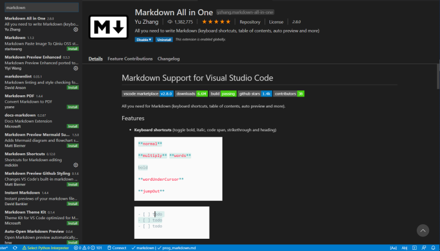
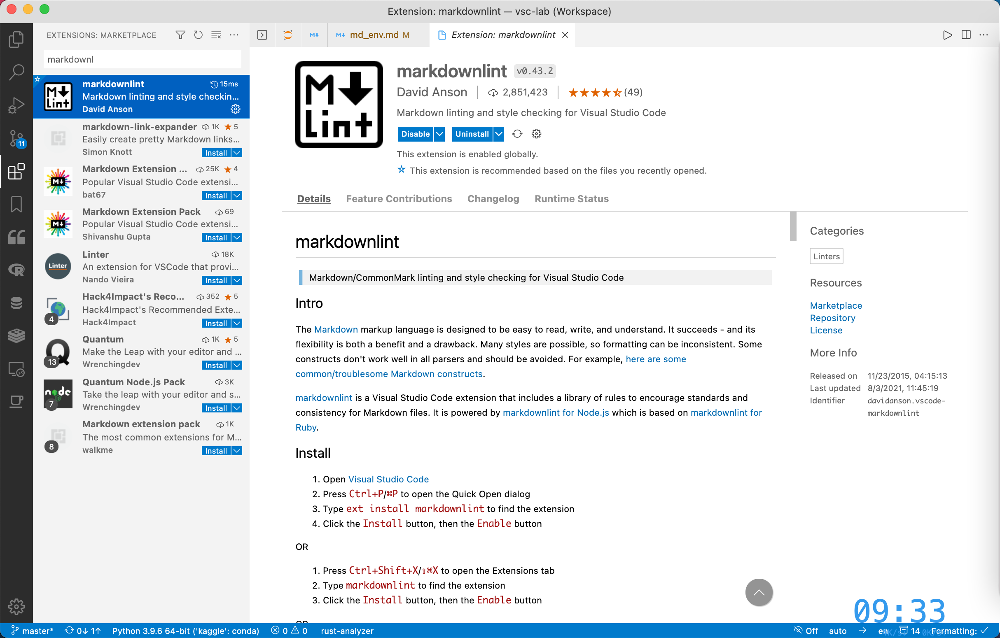
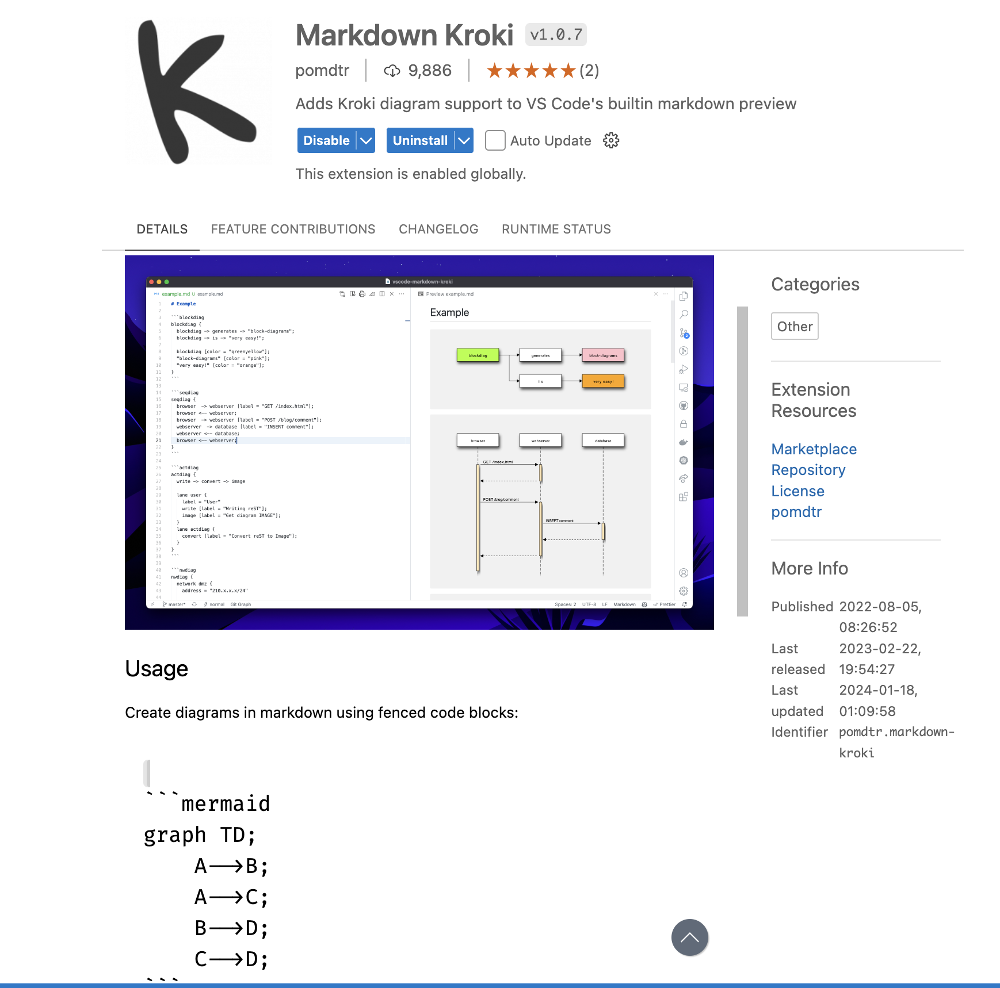
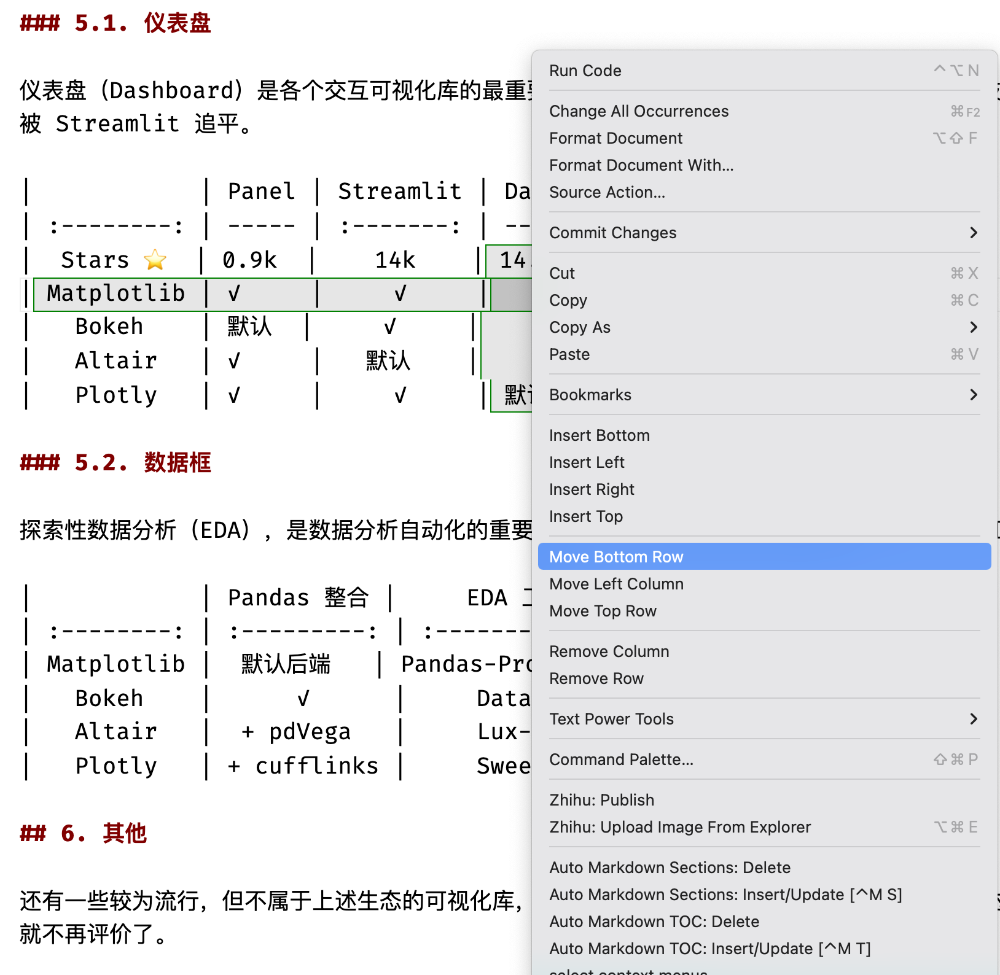
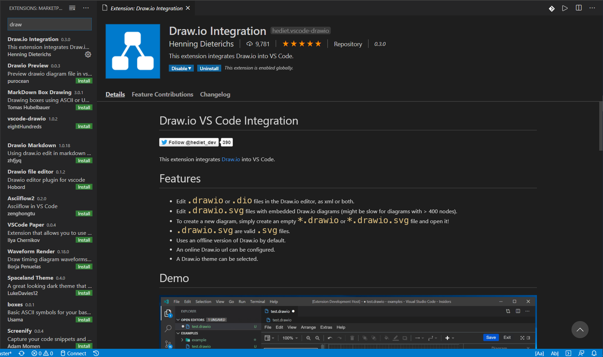
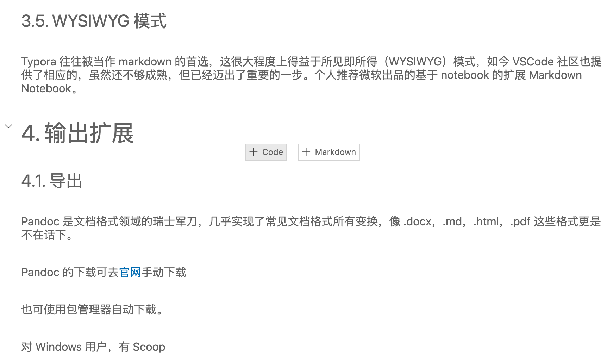
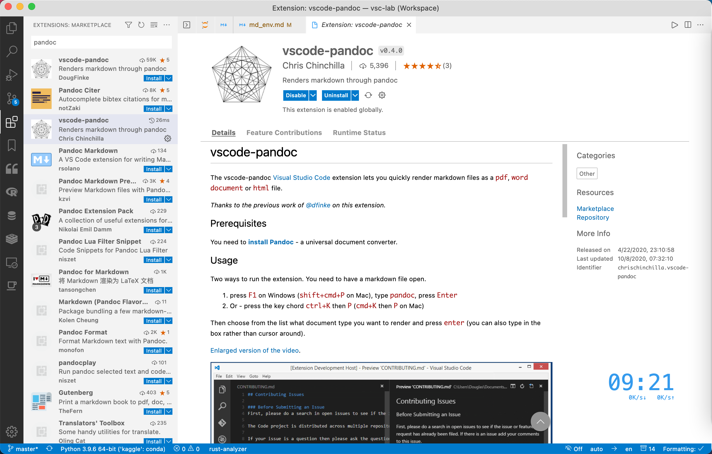

# 搭建 Markdown 强大写作环境（VSCode）

## 1. Markdown 编写环境概览

Markdown 是一种易于读写的轻量级的标记语言，编写出的作品简洁美观，近年来受到了越来越多的追捧，被广泛地用于日常写作，乃至电子书发表。与此同时，一系列优秀 Markdown 编辑器应运而生。其中较为著名的免费应用有

- 闭源：Obsidian、Typora
- 开源：Zettlr、妙言

VSCode 是当下最流行的代码编辑器，拥有丰富的扩展，搞定 Markdown 自然不在话下。与上面提到的编辑器相比，VSCode 的明显优势有

- 集成的布局：大纲（outline）、工作区（workspace）；
- 强大的补全：LaTeX 公式；
- 丰富的扩展：方便整合其他工具（详见下文的功能扩展部分）；

## 2. 语法扩展

VSCode 默认是支持 Markdown 的，但还是有必要安装下面的扩展提高写作效率。

- Markdown All in One
- markdownlint
- Markdown Kroki

### 2.1. Markdown All in One

如名称所述，这是个大一统型的扩展，集成了撰写 Markdown 时所需要的大部分功能，是 Markdown 类插件中下载榜榜首。可认为是 VSCode 中的 Markdown 必备扩展。其功能涵盖：

- 快捷命令及代码片
- 自动生成标题编号
- 自动生成并更新目录
- LaTeX 数学公式支持



```json
{
  "markdown.occurrencesHighlight.enabled": true,
  "markdown.preview.fontSize": 16,
  "markdown.preview.linkify": true,
  "markdown.preview.markEditorSelection": true,
  "markdown.preview.openMarkdownLinks": "inEditor",
  "markdown.preview.scrollPreviewWithEditor": true,
  "markdown.updateLinksOnFileMove.enabled": "always",
  "markdown.validate.duplicateLinkDefinitions.enabled": "warning",
  "markdown.validate.enabled": true,
  "markdown.extension.completion.enabled": true,
  "markdown.extension.italic.indicator": "*",
  "markdown.extension.tableFormatter.delimiterRowNoPadding": true,
  "markdown.extension.tableFormatter.normalizeIndentation": true,
  "markdown.extension.theming.decoration.renderLink": true,
  "markdown.extension.theming.decoration.renderParagraph": true,
  "markdown.extension.toc.levels": "2..4",
}
```

### 2.2. markdownlint

markdownlint 是个功能强大的 Markdown 语法检查器（linter）和格式化器（formatter），可以帮助你书写出规范的文档，同时避免书写错误导致文档无法渲染。个人观点，认为这个也是必装扩展。



```json
{
   "markdownlint.config": {
    "MD003": false,
    "MD024": false,
    "MD025": false,
    "MD026": false,
    "MD029": false,
    "MD033": false,
    "MD037": false,
    "MD041": false,
    "MD042": false
  },
}
```

### 2.3. Markdown Kroki

很多时候，写文档难免需要绘制一些用于说明的插图，如流程图、甘特图等，这个时候，若另开一个应用画图，再导入文档，则略显繁琐。Markdown Kroki 支持包括 mermaid，PlantUML，graphviz 等在内的多种文本绘图，不过这个扩展需要联网。



## 3. 编辑扩展

### 3.1. Markdown Table

安装 Markdown Table 扩展，提升表格编辑效率。



### 3.2. AutoCorrect

AutoCorrect 用于「自动纠正」或「检查并建议」文案，给 CJK（中文、日语、韩语）与英文混写的场景，补充正确的空格，同时尝试以安全的方式自动纠正标点符号等等。

### 3.3. Draw.io

虽然有 mermaid，但有时候我们总会需要绘制一些复杂的图形。这时，可以使用 VSCode 商店里大名鼎鼎的 [draw.io](https://app.diagrams.net/) 的内嵌扩展，安装完毕后三连：➡️ 新建 .drawio 文件 ➡️ 傻瓜绘图 ➡️ 导出为需要的格式。



### 3.4. Word Count CJK

这里推荐 Word Count CJK，可对各种字符进行统计，安装扩展后，在 setting.json 中修改

```json
{
  "wordcount_cjk.activateLanguages": ["markdown", "plaintext", "latex"],
  "wordcount_cjk.statusBarTextTemplate": "中文：${cjk} 字 + 英文：${en_words} 词",
  "wordcount_cjk.statusBarTooltipTemplate": "中文字数：${cjk} \\n 非 ASCII 字符数：\\t${total - ascii} \\n 英文单词数：${en_words} \\n 非空白字符数：${total - whitespace} \\n 总字符数：${total}"
}
```

至此，VSCode 已经实现了 Typora 等 Markdown 编辑器除所见即所得（WYSIWYG）之外的全部功能。

### 3.5. Markdown Notebook

Typora 往往被当作 Markdown 的首选，这很大程度上得益于所见即所得（WYSIWYG）模式，如今 VSCode 社区也提供了相应的，虽然还不够成熟，但已经迈出了重要的一步。个人推荐微软出品的基于 notebook 的扩展 Markdown Notebook。



这个扩展目前还处于开发早期，不能显示图片，但微软出品 + Notebook 框架，前景很好，后续有希望增加运行代码块等功能。

## 4. 输出扩展

### 4.1. Markdown PDF

写完了 Markdown 文档，往往要导出为 PDF，这时候可以使用 Markdown PDF 扩展来完成。


### 4.2. Pandoc

Pandoc 是文档格式领域的瑞士军刀，几乎实现了常见文本格式的所有变换。

Pandoc 的下载可去[官网](https://pandoc.org/) 手动下载，也可使用包管理器自动下载。

对 Windows 用户，有 Scoop

```powershell
scoop install pandoc
```

对 macOS 用户，有 Homebrew

```sh
brew install pandoc
```

安装完毕后，在 VSCode 中安装相关扩展，这里首推 vscode-pandoc，可实现 .md 到 .docx 以及 .pdf 和.html 的变换。

对于.pdf 的变换，需要在 `settings.json` 中添加：

```json
{
  "pandoc.docxOptString": "",
  "pandoc.htmlOptString": "--standalone --mathjax --shift-heading-level-by=-1",
  "pandoc.pdfOptString": "--pdf-engine=xelatex -f gfm -V geometry:a4paper -V geometry:margin=2cm -V CJKmainfont=\"STFangsong\""
}
```


