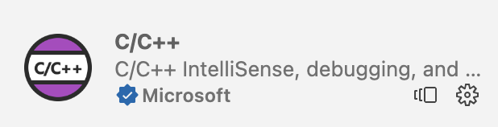

# 搭建 C/C++ 轻量级编程环境（VSCode）

## 1.  工具链

工具链是整个编程环境的核心，在 MacOS/Linux 上，系统内置了库文件，但是在 Windows 上，库文件需要自行下载，所以这里只介绍 Windows 上的库文件下载。我们这里选择的微软官方推荐的 MSYS2。

### 1.1. 安装

- 手动安装

下载[安装包](https://mirrors.tuna.tsinghua.edu.cn/msys2/distrib/msys2-x86_64-latest.exe)，默认一路向下，直至完成。

- 包管理器安装

```powershell
scoop install scoopforge/extras-cn/msys2-cn
```

### 1.2. 配置

进入 MSYS2 终端，执行如下命令，使用清华源

```sh
sed -i "s#https\?://mirror.msys2.org/#https://mirrors.tuna.tsinghua.edu.cn/msys2/#g" /etc/pacman.d/mirrorlist*
```

然后安装 UCRT (Universal C Runtime) 工具链

```sh
pacman -S --needed base-devel mingw-w64-ucrt-x86_64-toolchain
```

- 接受默认配置，一路向下直至完成安装。
- 将 `ucrt64\bin` 目录添加到环境变量 `PATH` 中
- 重启计算机

重启终端，在 PowerShell 中，检验是否安装成功

```powershell
gcc --version
g++ --version
gdb --version
```

## 2. VSCode 扩展

### 安装扩展

- C/C++
- Code Runner



### 配置扩展

安装完毕后，"ctrl +," 进入配置，点击右上角的图标，打开 `settings.json`

基本配置如下

```json
{
  "C_Cpp.autocompleteAddParentheses": true,
  "C_Cpp.default.cppStandard": "c++20",
  "C_Cpp.default.cStandard": "c17",
  "C_Cpp.default.mergeConfigurations": true,
  // Code Runner
  "code-runner.runInTerminal": true,
  "code-runner.executorMap": {
    "c": "cd $dir && gcc $fileName -o $fileNameWithoutExt && $dir$fileNameWithoutExt",
    "cpp": "cd $dir && g++ -std=c++20 $fileName -o $fileNameWithoutExt && $dir$fileNameWithoutExt"
  },
  "code-runner.fileDirectoryAsCwd": true
}
```

> macOS 用户将 `code-runner.executorMap` 中的 `gcc` 换成 `clang`，`g++` 换成 `clang++` 即可。
