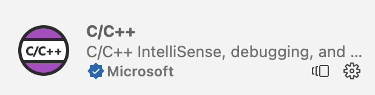
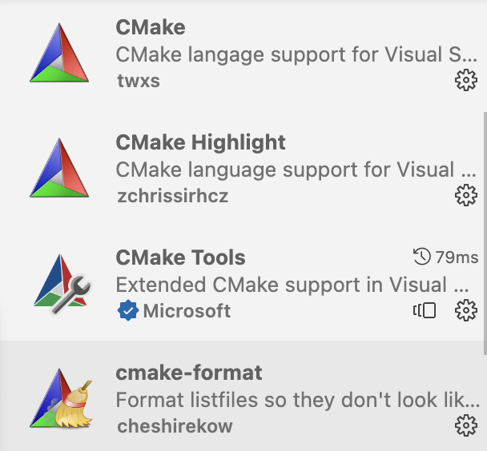

# 搭建 C/C++ 轻量级编程环境（VSCode）

## 1. 编写

### 1.1. 工具链

这个部分是整个编程环境的核心，在 MacOS/Linux 上，系统内置了库文件，但是在 Windows 上，库文件需要自行下载，所以这里只介绍 Windows 上的库文件下载。

- 下载 MSYS2

```powershell
scoop install msys2
```

- 进入 MSYS2 终端，执行如下命令

```bash
pacman -S --needed base-devel mingw-w64-ucrt-x86_64-toolchain
```

- 接受默认配置，一路向下直至完成安装。
- 将 `ucrt64\bin` 目录添加到环境变量 `PATH` 中
- 重启计算机（不可或缺）

### 1.2. C/C++

官方 C/C++ 扩展是必装的，虽然有些笨重，还有各种瑕疵，但是其集成了不少非常实用的工具链的接口。



安装完毕后，"ctrl"+", " 进入配置，点击右上角的图标，打开配置的 json 文件

基本配置如下

```json
{
  "C_Cpp.default.compilerArgs": [
    "-g",
    "${file}",
    "-std=c++20",
    "-o",
    "${fileDirname}/${fileBasenameNoExtension}"
  ],
  "C_Cpp.default.cppStandard": "c++20",
  "C_Cpp.autocompleteAddParentheses": true,
  "C_Cpp.clang_format_fallbackStyle": "LLVM",
  "C_Cpp.clang_format_sortIncludes": true,
  "C_Cpp.intelliSenseEngine": "Disabled"
}
```

`c_cpp_properties.json`：用于使用 VSCode 自带的代码提示工具，如 IntelliSense

```json
{
    "configurations": [
        {
            "name": "GCC",
            "includePath": [
                "${workspaceFolder}/**"
            ],
            "defines": [
                "_DEBUG",
                "UNICODE",
                "_UNICODE"
            ],
            "windowsSdkVersion": "10.0.22000.0",
            "compilerPath": "C:\\Scoop\\apps\\msys2\\current\\ucrt64\\bin\\g++.exe",
            "cStandard": "c17",
            "cppStandard": "c++17",
            "intelliSenseMode": "windows-gcc-x64"
        }
    ],
    "version": 4
}
```

### 1.3. clangd

clangd 扩展由 LLVM 团队维护，提供了非常智能的补全，和代码格式化，以及语法检查。相比于官方 C/C++ 扩展，其提示更快更准。

关于 clangd 的详细介绍，相见其官网 [clangd](https://clangd.llvm.org/)，此扩展使用需要保证系统内安装有 clangd，新版 macOS 已经内置，对于没有 clangd 的

> 网上有说，安装整个 LLVM；事实上，若无交叉编译的需求，大可不必。

macOS/Linux 用户

```bash
brew install clangd
```

Windows 用户

```powershell
scoop install clangd
```

基本配置如下

```json
{
    "clangd.arguments": [
        "--all-scopes-completion",
        "--background-index",
        "--clang-tidy",
        "--compile-commands-dir=.vscode",
        "--completion-parse=auto",
        "--completion-style=detailed",
        "--enable-config",
        "--fallback-style=LLVM",
        "--function-arg-placeholders=false",
        "--header-insertion-decorators",
        "--header-insertion=iwyu",
        "--log=verbose",
        "--pch-storage=memory",
        "--pretty",
        "--ranking-model=decision_forest",
        "-j=12"
    ],
    "clangd.fallbackFlags": [
        "-std=c++11",
        "-I${workspaceFolder}/src/includes",
        "-I/opt/homebrew/include"
    ],
    "clangd.onConfigChanged": "restart"
}
```

对应的 `.clangd` 文件可采用如下简单配置，主要用于检查项的调节

```yml
CompileFlags:
  Add: [-Wno-documentation, -Wno-missing-prototypes, -std=c++17]

Diagnostics:
  ClangTidy:
    Add:
      [
        performance-*,
        bugprone-*,
        modernize-*,
        clang-analyzer-*,
        readability-identifier*,
      ]
    CheckOptions:
      readability-identifier-naming.VariableCase: camelCase

  Suppress: [-Wdeprecated-declarations]
```

## 2. 编译

### 2.1. tasks.json

`tasks.json`：编译指令设置，用于编译

```json
{
    "tasks": [
        {
            "type": "cppbuild",
            "label": "C/C++: g++.exe build active file",
            "command": "C:\\Scoop\\apps\\msys2\\current\\ucrt64\\bin\\g++.exe",
            "args": [
                "-fdiagnostics-color=always",
                "-g",
                "${file}",
                "-o",
                "${fileDirname}\\${fileBasenameNoExtension}.exe"
            ],
            "options": {
                "cwd": "${fileDirname}"
            },
            "problemMatcher": [
                "$gcc"
            ],
            "group": {
                "kind": "build",
                "isDefault": true
            },
            "detail": "Task generated by Debugger."
        }
    ],
    "version": "2.0.0"
}
```

### 2.2. CodeRunner

CodeRunner 是一个通用的单文件一键编译/运行扩展，其相关配置如下

对 macOS 用户

> Intel macOS 用户也可以选择 gcc，gcc 目前不支持 arm64

```json
{
  "code-runner.runInTerminal": true,
  "code-runner.executorMap": {
    "c": "clang $dir$fileName -o $dir$fileNameWithoutExt && $dir$fileNameWithoutExt",
    "cpp": "clang++ -std=c++20 $dir$fileName -o $dir$fileNameWithoutExt && $dir$fileNameWithoutExt",
    "rust": "rustc $dir$fileName && $dir$fileNameWithoutExt"
  },
  "code-runner.fileDirectoryAsCwd": true
}
```

对 Linux 以及 Windows 用户

```json
{
  "code-runner.runInTerminal": true,
  "code-runner.executorMap": {
    "c": "gcc $dir$fileName -o $dir$fileNameWithoutExt && $dir$fileNameWithoutExt",
    "cpp": "gcc++ -std=c++20 $dir$fileName -o $dir$fileNameWithoutExt && $dir$fileNameWithoutExt",
    "rust": "rustc $dir$fileName && $dir$fileNameWithoutExt"
  },
  "code-runner.fileDirectoryAsCwd": true
}
```

### 2.3. CMake 扩展

对 C++ 工程来说，CMake 常常是其必不可少的一部分。常用 CMake 扩展有如下 4 个



- CMake Tools (&& CMake)

首先来说，CMake Tools 此为微软官方出品，绑定了 CMake 语言基础扩展。这是一个涵盖 了 CMake 的构建和 Debug 等大部分基础功能的扩展，可认为是 VSCode 中相关扩展的首选。

- CMake Highlight

相比于 CMake 相关的其他扩展，CMake Highlight 轻量好用，高亮和补全都有了，只是不能构建。可以用它取代 CMake Tools 绑定的 CMake（许久未更新）。

- cmake-format

cmake-format 是一个 Python 包，用于格式化 CMake 文件。使用其在 VSCode 扩展需要首先安装`clang-format`，并在`settings.json`中指定`cmakeFormat.exePath`。

- NeoCMake-LSP-VSCode

[NeoCMakeLSP](https://github.com/Decodetalkers/neocmakelsp) 是一款 Rust 编写的现代 CMake Language Server，其内置了 CMakeLists 语法高亮、自动补全、代码提示等功能。

不过，目前其在 Windows 上的兼容性仍然存在问题，MacOS 和 Linux 用户可以尝试。

### 2.4. CMake 配置

- 启动 CMake 扩展的 Quick Start，扫描工具链
- 选择刚刚安装好的 `GCC 14.1.0 x86_64-w64-mingw32 (ucrt64)`
- 最后会自动生成一个 `CMakePresets.json` 文件，可参考如下配置

```json
{
    "version": 8,
    "configurePresets": [
        {
            "name": "debug",
            "displayName": "GCC 14.1.0 x86_64-w64-mingw32 (ucrt64)",
            "description": "Using compilers: C = C:\\Scoop\\apps\\msys2\\current\\ucrt64\\bin\\gcc.exe, CXX = C:\\Scoop\\apps\\msys2\\current\\ucrt64\\bin\\g++.exe",
            "generator": "MinGW Makefiles",
            "binaryDir": "${sourceDir}/out/build/${presetName}",
            "cacheVariables": {
                "CMAKE_INSTALL_PREFIX": "${sourceDir}/out/install/${presetName}",
                "CMAKE_C_COMPILER": "C:/Scoop/apps/msys2/current/ucrt64/bin/gcc.exe",
                "CMAKE_CXX_COMPILER": "C:/Scoop/apps/msys2/current/ucrt64/bin/g++.exe",
                "CMAKE_BUILD_TYPE": "Debug"
            }
        }
    ]
}
```

## 3. 调试

### 3.1. launch.json

`launch.json`：调试器设置，用于使用 VSCode 自带的 debug 工具

- `label` 参数值和 `tasks.json` 的 `preLaunchTask` 参数值需要保持一致

```json
{
    "configurations": [
        {
            "name": "C/C++: g++.exe build and debug active file",
            "type": "cppdbg",
            "request": "launch",
            "program": "${fileDirname}\\${fileBasenameNoExtension}.exe",
            "args": [],
            "stopAtEntry": false,
            "cwd": "${fileDirname}",
            "environment": [],
            "externalConsole": false,
            "MIMode": "gdb",
            "miDebuggerPath": "C:\\Scoop\\apps\\msys2\\current\\ucrt64\\bin\\gdb.exe",
            "setupCommands": [
                {
                    "description": "Enable pretty-printing for gdb",
                    "text": "-enable-pretty-printing",
                    "ignoreFailures": true
                },
                {
                    "description": "Set Disassembly Flavor to Intel",
                    "text": "-gdb-set disassembly-flavor intel",
                    "ignoreFailures": true
                }
            ],
            "preLaunchTask": "C/C++: g++.exe build active file"
        }
    ],
    "version": "2.0.0"
}
```

### 3.2. CodeLLDB

虽然，官方 C/C++ 扩展也提供基于 LLDB 的 debug 功能，但是对于很多 C++ 场景还是太弱了，CodeLLDB 在很大程度上弥补了这个缺陷。

基本配置如下

```json
{
  "lldb.commandCompletions": true,
  "lldb.dereferencePointers": true,
  "lldb.evaluateForHovers": true,
  "lldb.launch.expressions": "native",
  "lldb.launch.terminal": "integrated",
  "lldb.suppressUpdateNotifications": true,
  "lldb.verboseLogging": true
}
```
