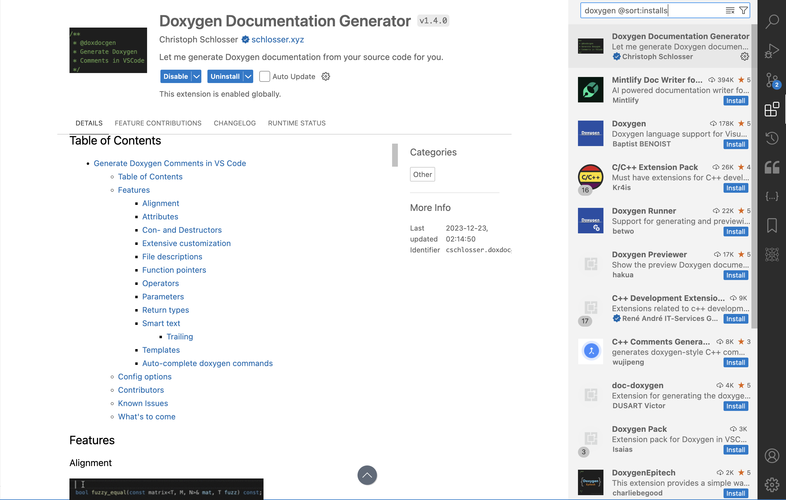
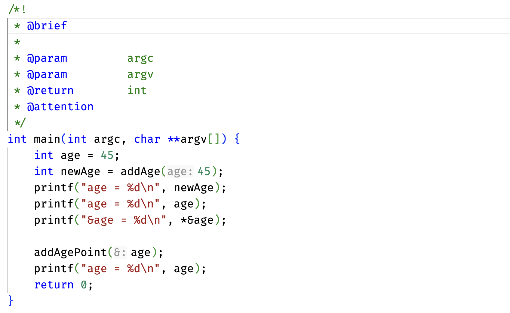
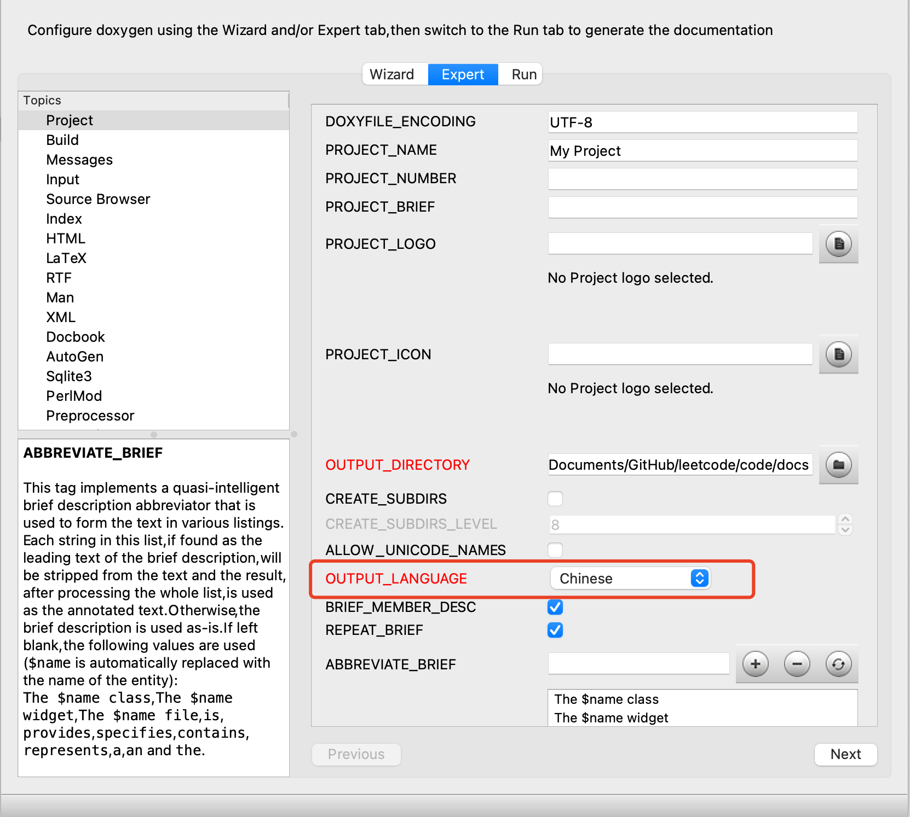
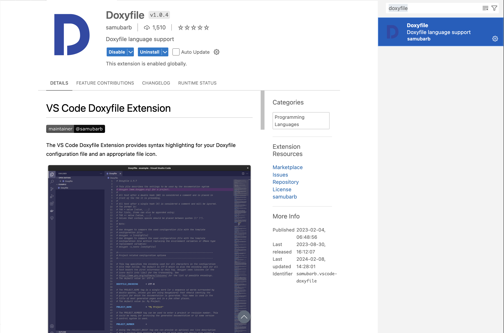
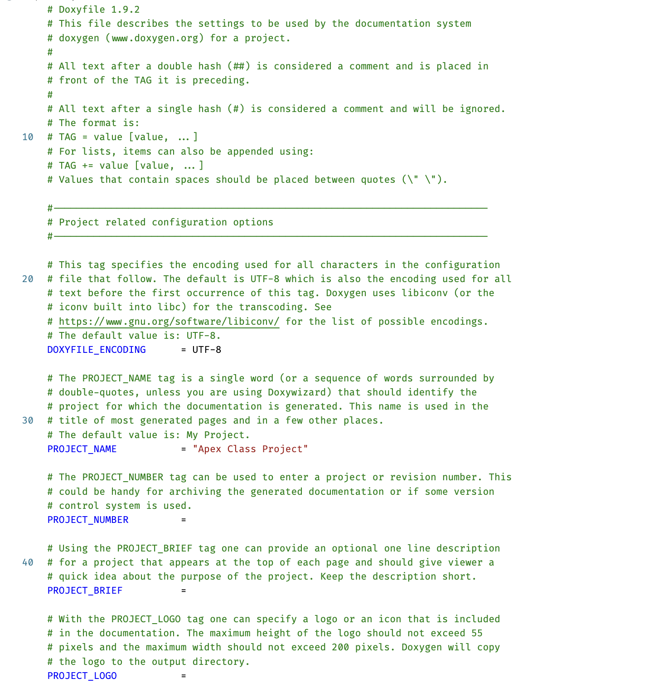

# 搭建 Doxygen 便捷编写环境（VSCode）

Doxygen 是一个由 C++ 编写的、开源的、跨平台的文档生成系统。最初主要用于生成 C++ 库的 API 文档，但目前又添加了对 C、C#、Java、Python、Fortran、PHP 等语言的支持。其从源代码中提取注释，生成文档，其导出格式包括 HTML、LaTeX、PDF、CHM 等。

Doxygen 简化了另行编写文档带来的重复性劳动，将代码和文档的工作合二为一。经过 10 年的迭代，Doxygen 成为了 C/C++ 项目首选的文档生成工具。

## 1. 需要安装的软件

### 1.1. Doxygen

macOS 及 Linux 用户使用

```sh
brew install doxygen
```

Windows 用户使用

```powershell
scoop install doxygen
```

### 1.2. Doxygen GUI

若不习惯命令行配置，可以使用 Doxygen 的官方 GUI

Debian/Ubuntu 用户使用

```sh
sudo apt-get install doxygen-gui
```

macOS 用户使用

```sh
brew install --cask doxygen
```

Windows 用户使用

```powershell
scoop install scoopforge/extras-cn/doxygen-gui
```

### 1.3. graphviz

graphviz 是一个由 AT&T 实验室启动的开源图形可视化软件，它能够从简单的文本文件描述中生成复杂的图形和网络。它使用一种名为 DOT 的描述语言来定义图形。

要使用 Doxygen 生成依赖图、继承图以及协作图，必须先安装 graphviz。

macOS 及 Linux 用户使用

```sh
brew install graphviz
```

Windows 用户使用

```powershell
scoop install graphviz
```

## 2. VSCode 扩展

在扩展商店里搜索并安装如下扩展

- Doxygen Documentation Generator



### 2.1. 触发

在 `settings.json` 设定触发快捷键

```json
{
  // 触发快捷键
  "doxdocgen.c.triggerSequence": "///"
}
```


- 在 `#include` 行前插入 `///`，触发文件头注释
- 在函数名前插入 `///`，触发函数注释

### 2.2. 自定义样式

当然，默认样式通常并不能满足我们的需求，所以我们可以进行如下自定义

```json
{
  // 起始行样式
  "doxdocgen.c.firstLine": "/*!",
  // 模版文件样式
  "doxdocgen.cpp.tparamTemplate": "@tparam{indent:15}{param}",
  // 文件头注释样式
  "doxdocgen.file.fileTemplate": "@file{indent:15}{name}",
  // 函数注释样式
  "doxdocgen.generic.useGitUserName": true,
  "doxdocgen.generic.authorTag": "@author{indent:15}{author}",
  "doxdocgen.generic.briefTemplate": "@brief{indent:15}{text}",
  "doxdocgen.generic.dateTemplate": "@date{indent:15}{date}",
  "doxdocgen.generic.paramTemplate": "@param{indent:15}{param}",
  "doxdocgen.generic.returnTemplate": "@return{indent:15}{type}",
  // 自定义标签、顺序
  "doxdocgen.file.fileOrder": ["file", "author", "date"],
  "doxdocgen.generic.customTags": ["@attention"]
}
```



> `{indent:15}` 决定对其他内容的缩进，用于对齐

## 3. 文档生成

### 3.1. 基本设置

打开 Doxygen GUI，填写对应路径，然后点击 Next


然后，在 `Wizard` 标签中进行选择

- Output：
  - HTML
    - 选择 `with navigation panel`
  - LaTeX
    - 不选择
- Diagrams：选择 `use dot tool from the Graphviz package`，后全部勾选


### 3.2. 高级设置

在 `Expert` 标签中进行精准控制，如

- Project
  - `OUTPUT_LANGUAGE`：选择 Chinese
- Build
- Dot
  - `HAVE_DOT`：勾选
  - `CALL_GRAPH`：勾选（生成调用关系图）



### 3.3. 最终生成

在 `Run` 标签中点击 `Run doxygen`。

### 3.4. 命令行操作

相比于 GUI，命令行操作要简单的多，`cd` 到项目路径下，然后执行命令

```sh
doxygen -g
```

此时会生成一个 `Doxyfile` 文件，打开后在其中修改对应项即可。这种配置方式比 GUI 更简洁、更灵活，更重要的是可以直接复制，减少了重复劳动。

Doxyfile 可以安装相应扩展，实现语法高亮



```ini
DOXYFILE_ENCODING      = UTF-8
PROJECT_NAME           = "My Project"
OUTPUT_DIRECTORY       = docs
CREATE_SUBDIRS         = NO
ALLOW_UNICODE_NAMES    = YES
OUTPUT_LANGUAGE        = Chinese
BRIEF_MEMBER_DESC      = YES
```

效果如图


