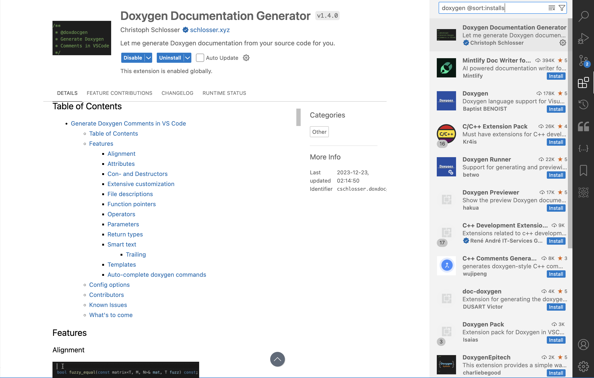

# 搭建 Doxygen 注释编写环境（VSCode）

## 1. 需要安装的软件

### 1.1. Doxygen GUI

macOS 用户使用

```bash
brew install --cask doxygen
```

Windows 用户使用

```powershell
scoop install ivaquero/scoopet/doxygen-gui
```

### 1.2. GraphViz

macOS 用户使用

```bash
brew install graphviz
```

Windows 用户使用

```powershell
scoop install graphviz
```

## 2. VSCode 扩展

在扩展商店里搜索并安装 `Doxygen Documentation Generator`



### 2.1. 触发

```json
{
  // 注释起始、触发
  "doxdocgen.c.firstLine": "/*!",
  "doxdocgen.c.triggerSequence": "///"
}
```

### 2.2. 自定义样式

```json
{
  // 模版文件样式
  "doxdocgen.cpp.tparamTemplate": "@tparam{indent:15}{param}",
  // 文件头自定义标签、顺序、样式
  "doxdocgen.file.customTag": ["@description"],
  "doxdocgen.file.fileOrder": ["file", "author", "date", "description"],
  "doxdocgen.file.fileTemplate": "@file{indent:15}{name}",
  // 函数自定义标签、样式
  "doxdocgen.generic.customTags": ["@attention"],
  "doxdocgen.generic.useGitUserName": true,
  "doxdocgen.generic.authorTag": "@author{indent:15}{author}",
  "doxdocgen.generic.briefTemplate": "@brief{indent:15}{text}",
  "doxdocgen.generic.dateTemplate": "@date{indent:15}{date}",
  "doxdocgen.generic.paramTemplate": "@param{indent:15}{param}",
  "doxdocgen.generic.returnTemplate": "@return{indent:15}{type}"
}
```

## 3. 工作流
