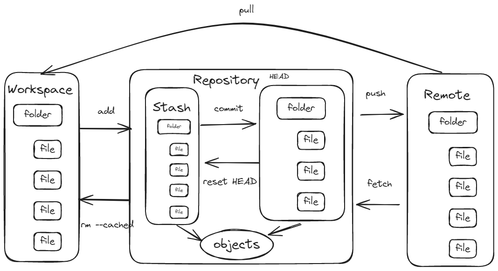
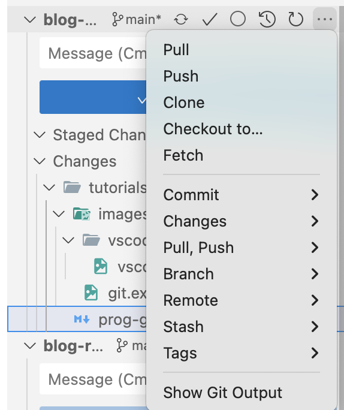
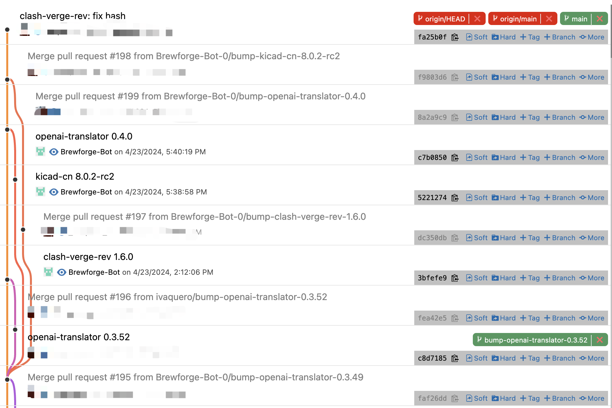

# 搭建便捷 Git 文件管理环境（VSCode）

## 1. Git 基础

### 1.1. 基础概念

- 工作区 → 本地仓库
  - init
  - add
- 本地仓库 ? 远程仓库
  - commit
  - push/publish
  - fetch/clone
- 远程仓库 → 工作区
  - pull

### 1.2. 分支、查看、比对

- 分支
  - checkout/switch
  - branch
    - create/remove
    - rename
    - merge
    - rebase
- 查看、比对
  - status
  - diff
  - blame
  - log
- 标记
  - tag

### 1.3. 总结

## 2. VSCode

VSCode 内置的 Git 工具已经足够好用，其涵盖了 Git 相关的绝大多数命令。

当然，一些扩展仍可令其如虎添翼。

安装扩展

- Git History
- Conventional Commits

