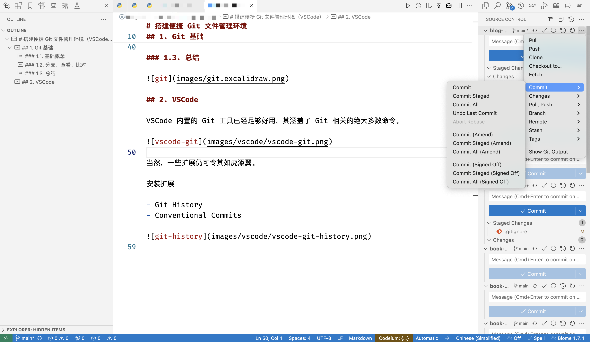

# 搭建便捷 Git 文件管理环境（VSCode）

## 1. Git 基础

### 1.1. 仓库操作

- 工作区 → 本地仓库
  - 建立仓库：`git init`
  - 添加文件：`git add`
- 本地仓库 -> 远程仓库
  - 提交文件：`git commit`
  - 推送文件：`git push`
  - 拉取文件：`git fetch`
- 远程仓库 → 工作区
  - 克隆仓库：`git clone`
  - 拉取文件：`git pull`


### 1.2. 分支操作

- 切换分支：
  - `git checkout <branch-name>`
  - `git switch <branch-name>`（Git 2.23+ 从 `checkout` 分离）
- 新建分支：`git branch <branch-name>`
- 删除分支：
  - `git branch -d <branch-name>`
  - `git branch -D <branch-name>`（强制删除，包括未合并分支）
- 合并分支：`git merge <branch-name>`
- 重命名分支：
  - `git branch -m <branch-name>`
  - `git branch -M <branch-name>`（强制重命名，覆盖重名分支）

### 1.3. 查看操作

- 查看状态：`git status`
- 查看提交记录：`git log`
- 查看差异：`git diff`
- 查看作者：`git blame`

## 2. Git 进阶

### 2.1. 提交

- 撤回上一个提交

```sh
git reset --soft HEAD^
```

- 压缩前 N 个提交

```sh
git reset --soft HEAD~N
git commit -m ${commit message}
git push
```

压缩某提交后的所有提交

```sh
git reset --soft [commit-hash]
git commit -m ${commit message}
git push
```

### 2.2. 仓库

- 发布分支

```sh
git push --set-upstream origin ${main-branch}
```

- 同步 fork 仓库与源仓库

```sh
git pull upstream ${main-branch}
git push origin ${main-branch}
```

### 2.3. 清理

- 批量删除分支

```sh
git branch -D $(git branch --list '${branch-pattern}')
```

## 3. VSCode

VSCode 内置的 Git 工具已经足够好用，其涵盖了 Git 相关的绝大多数命令。



当然，一些扩展也很有用，如 Conventional Commits 等。

> GitLens 很强大，但是给我感觉有点笨重，对精简度日的我来说，实在不愿意因其功能而损失编辑器的性能，所以不推荐。
