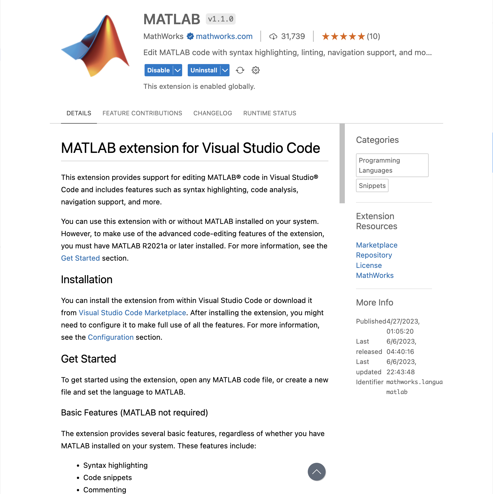
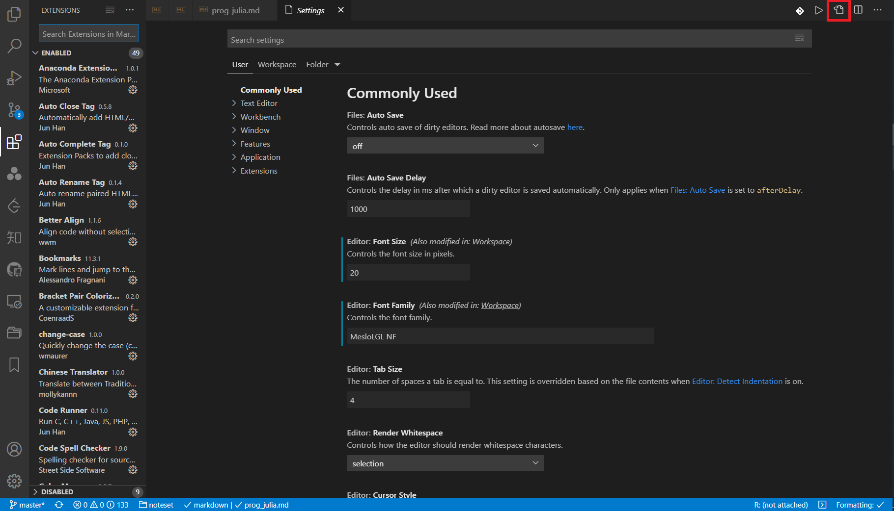
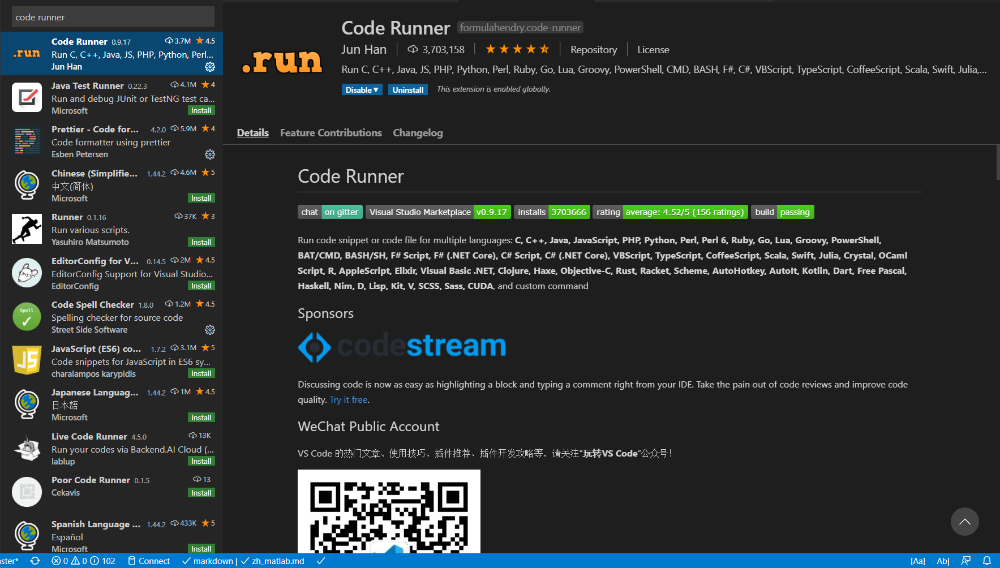
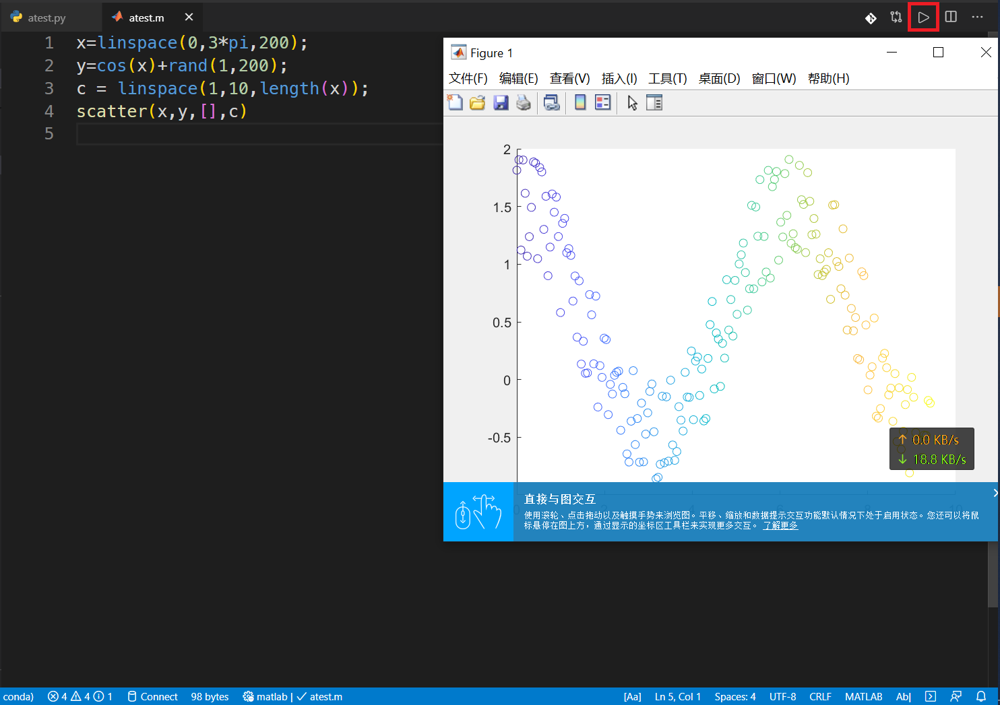
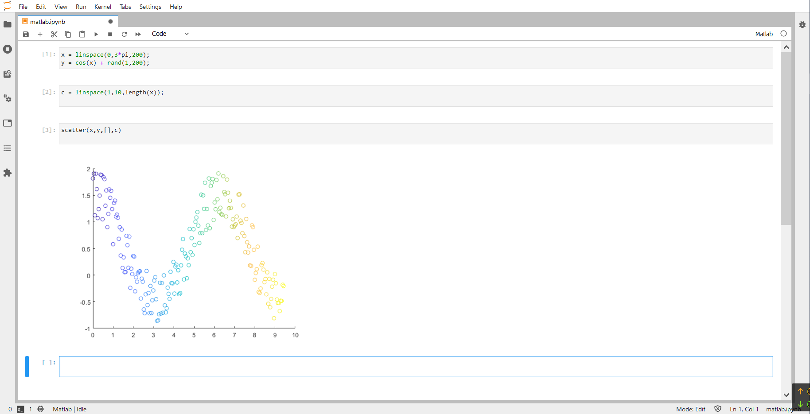

# 搭建 MATLAB 轻量级编写环境

作为 Python 用户，因为课业原因还要时常使用 MATLAB，而每次都要跳转到沉重的 MATLAB 官方界面真的是一件非常麻烦的事。而近两年来，VSCode 和 Jupyter 生态的快速发展，为此类需求提供了新的解决方案。

## VSCode 调用 MATLAB

### 安装扩展

在 VSCode 中的扩展商店里搜索并安装 MATLAB 官方扩展



安装完毕后，"ctrl"+", " 打开配置，并在搜索框中输入"json"，打开配置的 .json 文件。



对 macOS 加入如下配置：

```json
{
  "[matlab]": {
    "editor.defaultFormatter": "MathWorks.language-matlab"
  },
  "MATLAB.installPath": "/Applications/MATLAB_R2022b_Beta.app"
}
```

对于 Windows 加入如下配置：

```json
{
  "[matlab]": {
    "editor.defaultFormatter": "MathWorks.language-matlab"
  },
  "MATLAB.installPath": "c:\\program files\\polyspace\\r2019a\\bin\\matlab.exe"
}
```

### 脚本运行

在 VSCode 中的扩展商店里搜索并安装 Code Runner



同样，安装完毕后，打开配置的 .json 文件。

加入如下配置：

```json
"code-runner.executorMap": {
  "matlab": "cd $dir && matlab -nosplash -nodesktop -r $fileNameWithoutExt"
 },
// 或
"code-runner.executorMapByGlob": {
  "*.m": "cd $dir && MATLAB -nosplash -nodesktop -r $fileNameWithoutExt"
 },
```

对于脚本运行，点击右上角的右箭头。



## JupyterLab 调用 MATLAB

### 安装 Kernel

```sh
conda install matlab_kernel
```


