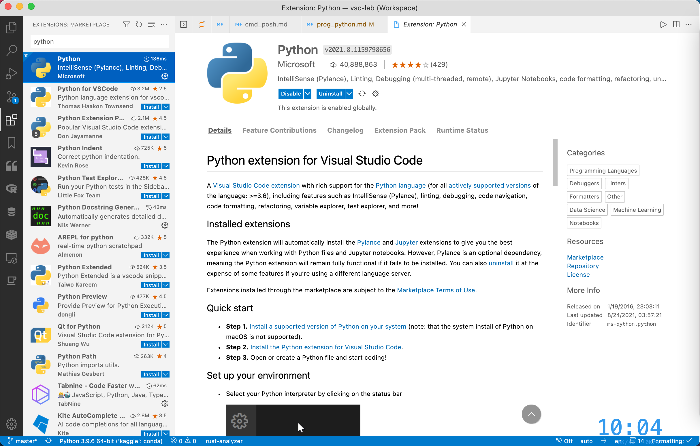
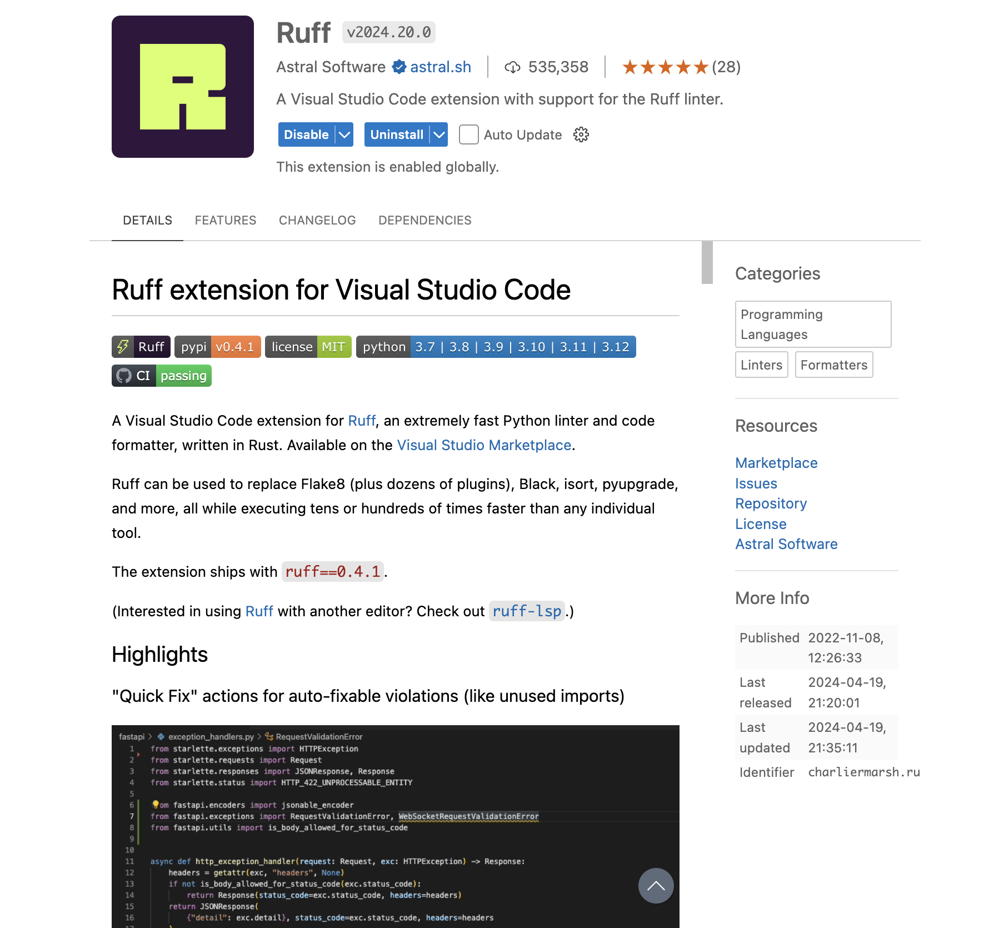

# 搭建 Python 轻量级编写环境

## 1. 安装运行时

### 1.1. Conda -> Mamba

Conda 是服务于 Python 和 R 的多语言包管理器，其解决了 Python 原生包管理器 Pip 的依赖冲突问题，极大地方便了 Python 环境的管理。Mamba 是 Conda 的 C++ 版本，默认并行下载，效率比 Conda 更上一个台阶。

这里推荐安装 Miniforge，基于 Mamba 的最小安装版本，只包含环境管理功能。前往[清华源](https://mirrors.tuna.tsinghua.edu.cn/)，进入[对应页面](https://mirrors.tuna.tsinghua.edu.cn/github-release/conda-forge/miniforge/LatestRelease/)，下载安装程序

### 1.2. 手动安装

- 对 Windows 用户

下载 [Windows 系统安装包](https://mirrors.tuna.tsinghua.edu.cn/github-release/conda-forge/miniforge/LatestRelease/Miniforge3-Windows-x86_64.exe)，安装一路向下，不要做任何改动，直至安装完成。

- 对 macOS 用户

下载 [MacOS 系统安装包](https://mirrors.tuna.tsinghua.edu.cn/github-release/conda-forge/miniforge/LatestRelease/Miniforge3-MacOSX-arm64.sh)，然后到对应路径，输入

```sh
sh Miniforge3-MacOSX-arm64.sh
```

### 1.3. 包管理器安装

对 Windows 用户，使用 Scoop

```powershell
scoop install miniforge
# 或国内镜像
scoop install scoopforge/extras-cn/miniforge-cn
```

对 macOS 用户，有 Homebrew

```sh
brew install miniforge
# 或国内镜像
brew install brewforge/chinese/miniforge-cn
```

## 2. 配置 conda 环境

打开对应终端环境

- Windows 用户：Miniforge Prompt
- MacOS 用户：终端（Terminal）

输入

```sh
code .condarc
```

在 `.condarc` 中写入

```yaml
channels:
  - conda-forge
custom_channels:
  conda-forge: https://mirrors.tuna.tsinghua.edu.cn/anaconda/cloud

envs_dirs:
  - ~/.conda/envs
pkgs_dirs:
  - ~/.conda/pkgs

add_pip_as_python_dependency: true
channel_priority: flexible
report_errors: false
ssl_verify: false
show_channel_urls: true
rollback_enabled: true
remote_max_retries: 3
```

## 3. 环境管理

### 3.1. 创建环境

接下来，需要创建虚拟环境，也就是自己的工作区，可简单理解为系统登录时的用户。基本命令需指定**环境名称**：

```sh
# 基本格式
mamba create -n [env_name]
# 例子
mamba create -n my_python
```

### 3.2. 激活环境

安装完毕后，进入环境：

```sh
# 进入
mamba activate [env_name]
# 退出
mamba deactivate
```

## 4. 包管理

### 4.1. 安装包

```sh
mamba install ipykernel
```

### 4.2. 升级包

```sh
mamba update --all
```

## 5. VSCode

### 5.1. 安装扩展

- Python
- Jupyter
- Ruff



扩展安装完毕，新建 `.ipynb` 文件，即可开启 Python 之旅。



### 5.2. 配置扩展

相关配置如下

```json
{
  "[python]": {
    "editor.defaultFormatter": "charliermarsh.ruff",
    "editor.codeActionsOnSave": {
      "source.fixAll": "explicit",
      "source.organizeImports": "explicit"
    }
  },
  "ruff.configuration": "pyproject.toml",
}
```
