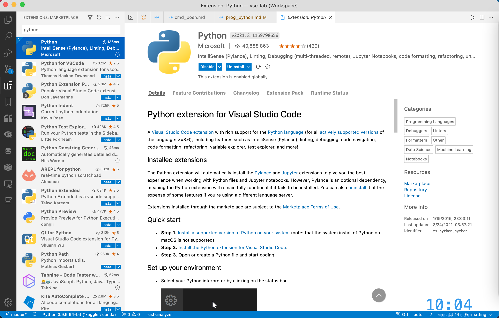

# 搭建 Python 轻量级编写环境

## 1. 安装运行时

### 1.1. Conda -> Mamba

Conda 是服务于 Python 和 R 的多语言包管理器，其解决了 Python 原生包管理器 Pip 的依赖冲突问题，极大地方便了 Python 环境的管理。Mamba 是 Conda 的 C++ 版本，默认并行下载，效率比 Conda 更上一个台阶。

这里推荐安装 Miniforge，基于 Mamba 的最小安装版本，只包含环境管理功能。前往[清华源](https://mirrors.tuna.tsinghua.edu.cn/)，进入[对应页面](https://mirrors.tuna.tsinghua.edu.cn/github-release/conda-forge/miniforge/LatestRelease/)，下载安装程序。

### 1.2. 手动安装

- 对 Windows 用户

下载 [Windows 系统安装包](https://mirrors.tuna.tsinghua.edu.cn/github-release/conda-forge/miniforge/LatestRelease/Miniforge3-Windows-x86_64.exe)，安装一路向下，不要做任何改动，直至安装完成。

- 对 macOS 用户

下载 [MacOS 系统安装包](https://mirrors.tuna.tsinghua.edu.cn/github-release/conda-forge/miniforge/LatestRelease/Miniforge3-MacOSX-arm64.sh)，然后到对应路径，输入

```sh
sh Miniforge3-MacOSX-arm64.sh
```

### 1.3. 包管理器安装

对 Windows 用户，使用 Scoop

```powershell
scoop install miniforge
# 或国内镜像
scoop install scoopforge/extras-cn/miniforge-cn
```

对 macOS 用户，有 Homebrew

```sh
brew install miniforge
# 或国内镜像
brew install brewforge/chinese/miniforge-cn
```

## 2. 管理环境

### 2.1. 配置文件

mamba 配置文件为 `.condarc`。其位置如下：

- Windows：`~\.condarc`
- macOS 和 Linux：`~/.condarc`

打开对应终端环境

- Windows 用户：Miniforge Prompt
- MacOS 用户：终端（Terminal）

输入

```sh
code .condarc
```

在 `.condarc` 中写入

```yaml
# 频道
channels:
  - conda-forge
# 使用镜像
custom_channels:
  conda-forge: https://mirrors.tuna.tsinghua.edu.cn/anaconda/cloud

# 地址
envs_dirs:
  - ~/.conda/envs
pkgs_dirs:
  - ~/.conda/pkgs

# 将 pip 作为 Python 的依赖
add_pip_as_python_dependency: true
# 安装按照频道的顺序
channel_priority: flexible
# 生成错误报告
report_errors: false
# ssl 验证
ssl_verify: false
# 显示频道具体链接
show_channel_urls: true
# 错误回滚
rollback_enabled: true
# 重试
remote_max_retries: 3
```

### 2.2. 常用环境操作

mamba 常用操作可使用命令 `mamba -h` 和 `mamba config -h` 查看，这里列出几个常用命令：

```sh
# 创建
mamba create -n [env_name]
# 删除
mamba env remove -n [env_name]
# 参照配置文件更新
mamba env update --file [file.yml]
# 环境列表
mamba env list
# mamba 信息
mamba info
```

### 2.3. 创建环境

接下来，需要创建虚拟环境，也就是自己的工作区，可简单理解为系统登录时的用户。基本命令需指定**环境名称**和**Python 版本**：

```sh
# 基本格式
mamba create -n [env_name] [python= version]
# 例子
mamba create -n my_python python=3.12
```

安装完毕后，进入环境：

```sh
# 进入
mamba active my_python
# 退出
mamba deactivate
```

## 3. 包管理

### 3.1. 常用包操作

```sh
# 安装
mamba install [package_name]
# 删除
mamba uninstall [package_name]
# 更新
mamba update [package_name]
# 更新所有包
mamba update --all
# 搜索
mamba search [package_name]
# 已安装列表
mamba list
```

### 3.2. 安装包

为使用 VSCode 的 Jupyter，还需要安装 `ipykernel`

```sh
mamba install ipykernel
```

## 4. VSCode

### 4.1. 安装扩展

- Python
- Jupyter
- Ruff



扩展安装完毕，新建 `.ipynb` 文件，即可开启 Python 之旅。

### 4.2. 配置扩展

相关配置如下

```json
{
  "[python]": {
    "editor.defaultFormatter": "charliermarsh.ruff",
    "editor.codeActionsOnSave": {
      "source.fixAll": "explicit",
      "source.organizeImports": "explicit"
    }
  },
  "ruff.configuration": "pyproject.toml",
}
```

## 5. 项目管理

项目根目录下的 `pyproject.toml` 可采用如下编写

```toml
[project]
    requires-python = ">=3.11"

[tool.ruff]
    fix = true
    fix-only = true
    target-version = "py311"
    line-length = 88

[tool.ruff.format]
    # Enable reformatting of code snippets in docstrings
    docstring-code-format = true
    # Format all docstring code snippets with a line length of 60
    docstring-code-line-length = 60
    # Use `\n` line endings for all files
    line-ending = "lf"
    # Prefer single quotes over double quotes
    quote-style = "double"
    skip-magic-trailing-comma = true

[tool.ruff.lint]
    extend-select = [
        "E",    # pycodestyle errors
        "W",    # pycodestyle warnings
        "F",    # pyflakes
        "B",    # flake8-bugbear
        "C4",   # flake8-comprehensions
        "EM",   # flake8-errmsg
        "FA",   # flake8-future-annotations
        "G",    # flake8-logging-format
        "INT",  # flake8-gettext
        "PIE",  # flake8-pie
        "PT",   # flake8-pytest-style
        "PYI",  # flake8-pyi
        "Q",    # flake8-quotes
        "RET",  # flake8-return
        "RSE",  # flake8-raise
        "SLOT", # flake8-slots
        "T10",  # flake8-debugger
        "YTT",  # flake8-2020
        "DTZ",  # naive datetime
        "I",    # import sorting
        "ISC",  # string concatenation
        "NPY",  # numpy specific rules
        "PERF", # perflint
        "RUF",  # ruff
        "S",    # security
        "SIM",  # simplify
        "T10",  # debugger
        "TID",  # tidy imports
        "UP",   # upgrade
    ]
    fixable = ["ALL"]
    ignore = [
        "B905",   # `zip()` without an explicit `strict=` parameter
        "EM101",  # exception must not use a string literal
        "EM102",  # exception must not use an f-string literal
        "ISC001", # conflicts with formatter
        "NPY002", # replace legacy `np.random.random`
        "E501",   # line too long
        "E741",
        "F403",
        "F405",
        "RUF001", # string contains ambiguous character (such as greek letters)
        "RUF002", # docstring contains ambiguous character (such as greek letters)
        "RUF003",
    ]
    unfixable = []

[tool.ruff.lint.pydocstyle]
    convention = "numpy"

[tool.ruff.lint.isort]
    case-sensitive = true
    combine-as-imports = true
    force-wrap-aliases = true
    order-by-type = true
```
