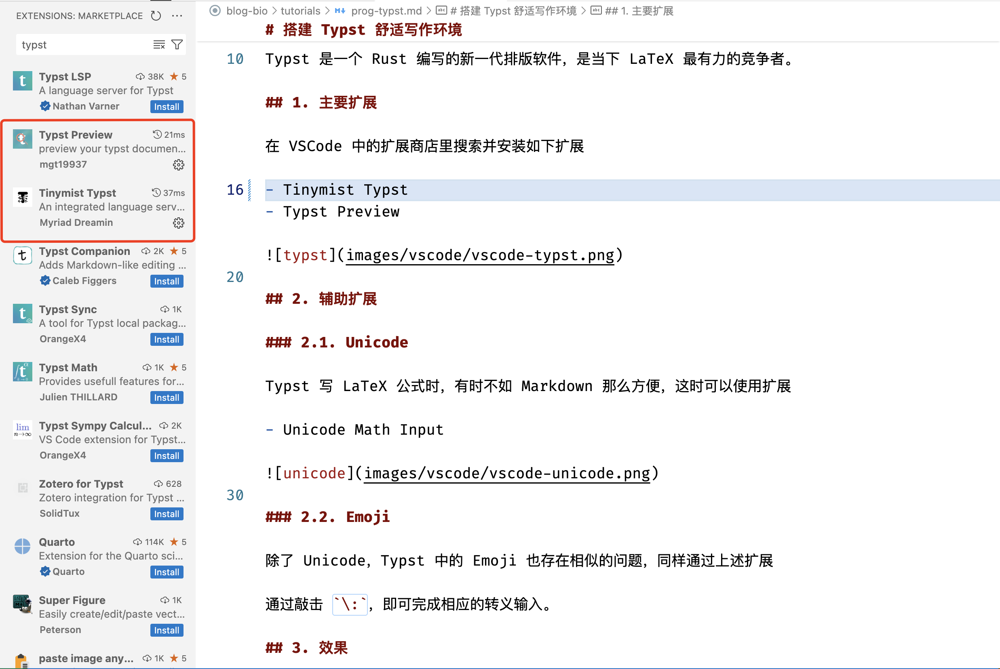
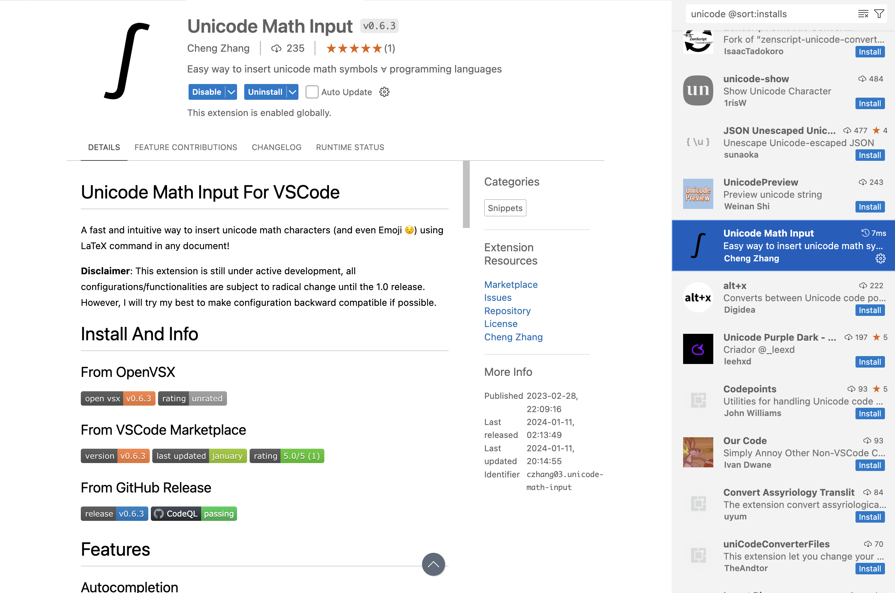
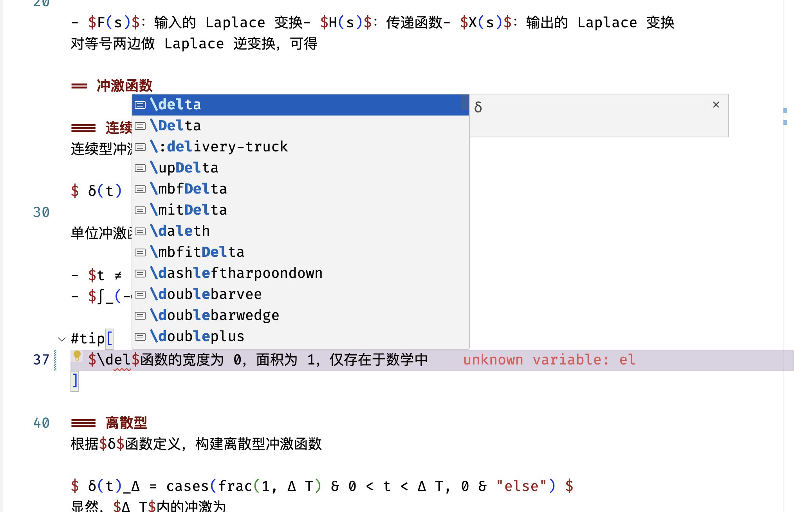

# 搭建 Typst 舒适写作环境

Typst 是一个 Rust 编写的新一代排版软件，是当下 LaTeX 最有力的竞争者。

## 1. 主要扩展

在 VSCode 中的扩展商店里搜索并安装如下扩展

- Typst LSP
- Typst Preview

## 2. 辅助扩展

### 2.1. Unicode

Typst 写 LaTeX 公式时，有时不如 Markdown 那么方便，这时可以使用扩展

- Unicode Math Input

### 2.2. Emoji

除了 Unicode，Typst 中的 Emoji 也存在相似的问题，同样通过上述扩展

通过敲击 `\:`，即可完成相应的转义输入。

## 3. 效果

