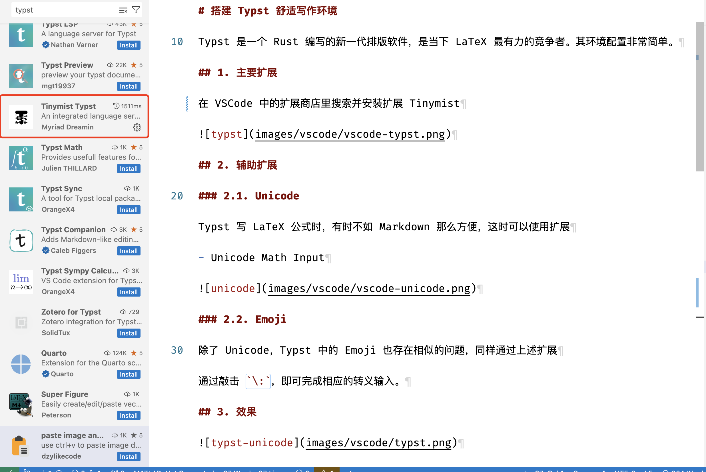

# 搭建 Typst 舒适写作环境

Typst 是一个 Rust 编写的新一代排版软件，是当下 LaTeX 最有力的竞争者。其环境配置非常简单。

## 1. 主要扩展

在 VSCode 中的扩展商店里搜索并安装扩展 Tinymist



## 2. 辅助扩展

### 2.1. Unicode

Typst 写 LaTeX 公式时，有时不如 Markdown 那么方便，这时可以使用扩展

- Unicode Math Input


### 2.2. Emoji

除了 Unicode，Typst 中的 Emoji 也存在相似的问题，同样通过上述扩展

通过敲击 `\:`，即可完成相应的转义输入。

## 3. 效果


## 4. 格式化

Typst Preview 的作者开发了一个 Typst 十分易用的格式化器，[typstyle](https://github.com/Enter-tainer/typstyle)，其在 Tinymist Typst 有集成接口。

对 macOS/Linux 用户，可以使用 Homebrew 安装

```bash
brew install typstyle
```

Windows 用户，可以使用 Scoop 安装

```bash
scoop bucket add main-plus https://github.com/Scoopforge/Main-Plus
scoop install typstyle
```

然后，在`settings.json`中，加入

```json
{
  "[typst]": {
    "editor.defaultFormatter": "myriad-dreamin.tinymist",
    "editor.wordSeparators": "`~!@#$%^&*()=+[{]}\\|;:'\",.<>/?"
  },
  "tinymist.completion.triggerOnSnippetPlaceholders": true,
  "tinymist.exportPdf": "onDocumentHasTitle",
  "tinymist.formatterMode": "typstyle",
  "tinymist.lint.enabled": true,
  "tinymist.outputPath": "$root/articles/$name",
  "tinymist.preview.cursorIndicator": true,
}
```
